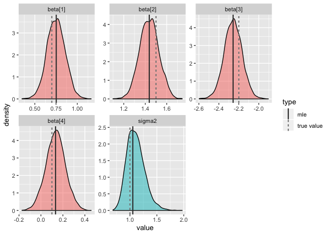
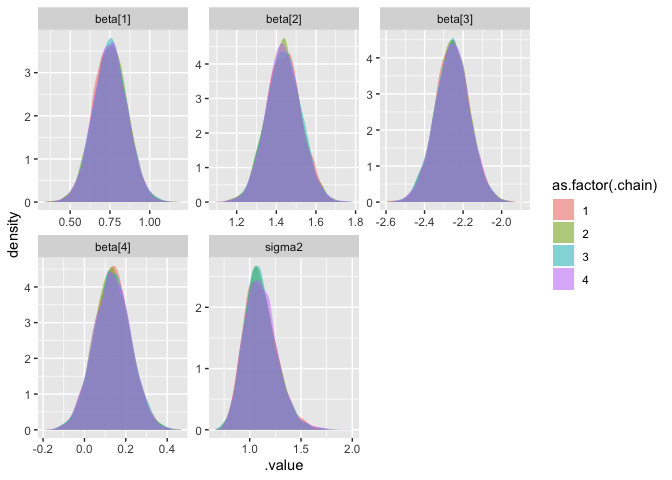
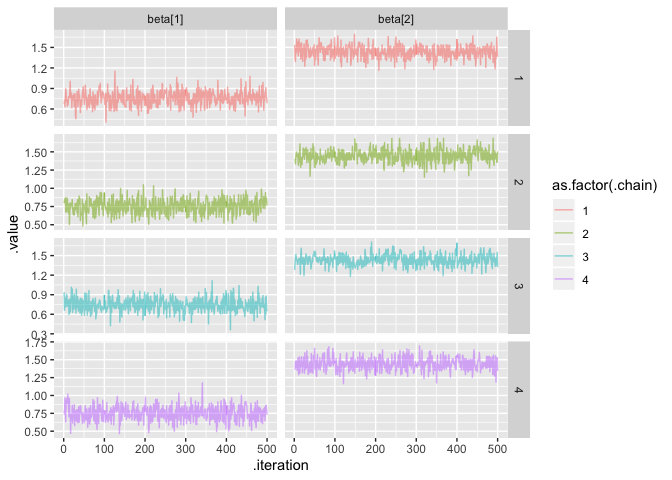
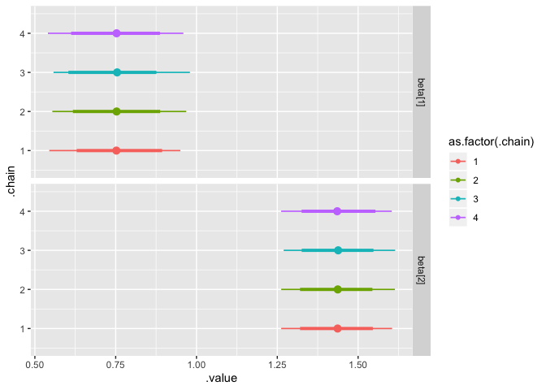
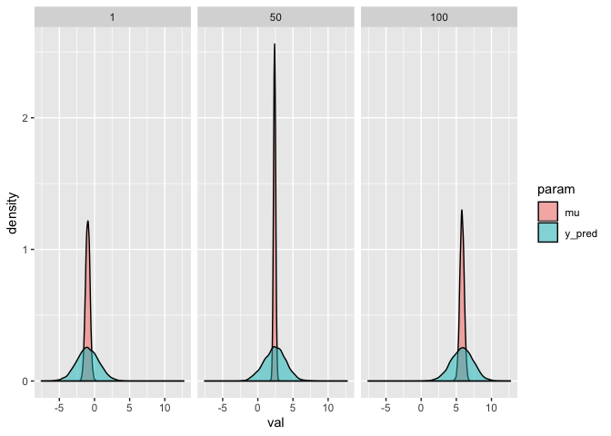
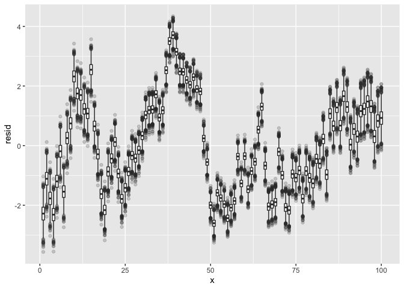
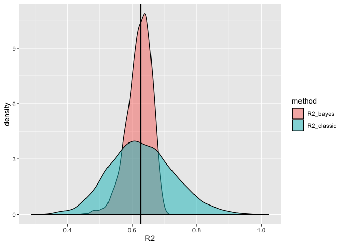

Exercises
================
Ethan Shen
5/13/2020

``` r
library(tidyverse)
```

    ## ── Attaching packages ─────────────────────────────────────────────────────────── tidyverse 1.3.0 ──

    ## ✓ ggplot2 3.2.1     ✓ purrr   0.3.3
    ## ✓ tibble  3.0.1     ✓ dplyr   0.8.5
    ## ✓ tidyr   1.0.0     ✓ stringr 1.4.0
    ## ✓ readr   1.3.1     ✓ forcats 0.4.0

    ## Warning: package 'tibble' was built under R version 3.6.2

    ## ── Conflicts ────────────────────────────────────────────────────────────── tidyverse_conflicts() ──
    ## x dplyr::filter() masks stats::filter()
    ## x dplyr::lag()    masks stats::lag()

# Lecture 1

## Bayesian Linear Models

``` r
set.seed(129047809)
n = 100
beta = c(0.7, 1.5, -2.2, 0.1)
eps = rnorm(n)
d = data.frame(
  X1 = rt(n, df=5), # t-distribution
  X2 = rt(n, df=5),
  X3 = rt(n, df=5)
) %>%
  mutate(Y = beta[1] + beta[2]*X1 + beta[3]*X2 + beta[4]*X3 + eps)
X = cbind(1, d$X1, d$X2, d$X3)

l = lm(Y~.-Y, data = d)
l$coefficients
```

    ## (Intercept)          X1          X2          X3 
    ##   0.7523352   1.4375794  -2.2571430   0.1329863

``` r
beta_hat = solve(t(X) %*% X, t(X) %*% d$Y)
beta_hat
```

    ##            [,1]
    ## [1,]  0.7523352
    ## [2,]  1.4375794
    ## [3,] -2.2571430
    ## [4,]  0.1329863

### JAGS

``` r
model = "model{
  # Likelihood
  for(i in 1:length(Y)){
    Y[i]   ~ dnorm(mu[i], tau) #normal distribution parametrized with precision, NOT variance 
    mu[i] = beta[1] + beta[2]*X1[i] + beta[3]*X2[i] + beta[4]*X3[i]
  }

  # Prior for beta
  for(j in 1:4){
    beta[j] ~ dnorm(0,1/100)
  }

  # Prior for sigma / tau2
  tau ~ dgamma(1, 1)
  sigma2 = 1/tau
}"

# Gibbs Sampler
m = rjags::jags.model(
  textConnection(model), 
  data = d,
  n.chains = 4
) 
```

    ## Compiling model graph
    ##    Resolving undeclared variables
    ##    Allocating nodes
    ## Graph information:
    ##    Observed stochastic nodes: 100
    ##    Unobserved stochastic nodes: 5
    ##    Total graph size: 810
    ## 
    ## Initializing model

``` r
update(m, n.iter=1000, progress.bar="none") # burn-in
samp = rjags::coda.samples(
  m, 
  variable.names=c("beta","sigma2"), 
  n.iter=5000, # actual samples
  progress.bar="none" 
)
```

``` r
other = 
  bind_rows(
    tibble(
      param = paste0("beta[",1:4,"]"),
      class = "beta",
      value = beta,
      type = "true value"
    ) %>%
      rbind(list("sigma2","sigma2",1, "true value")),
    tibble(
      param = paste0("beta[",1:4,"]"),
      class = "beta",
      value = l$coefficients,
      type = "mle"
    ) %>%
      rbind(list("sigma2", "sigma2", var(l$residuals), "mle"))
  )

# non-informative priors --> converging to MLE

samp %>% 
  purrr::pluck(1) %>%
  as.data.frame() %>%
  tidyr::gather(param, value) %>%
  mutate(class = stringr::str_replace(param, "\\[\\d+\\]","")) %>%
  ggplot(aes_string(x="value", fill="class")) +
  geom_density(alpha=0.5) +
  facet_wrap(~param, scales = "free") +
  geom_vline(data = other, aes_string(xintercept="value", color="type", linetype="type"), size=0.8) +
  scale_colour_manual(values=c("grey22","grey52")) +
  guides(fill=FALSE)
```

<!-- -->

``` r
df_mcmc <- tidybayes::gather_draws(samp, #CODA object
                                   beta[i], 
                                   sigma2) %>%
  mutate(param = paste0(.variable, ifelse(is.na(i), "", paste0("[", i, "]")))) %>%
  group_by(param, .chain) %>%
  arrange(.iteration, .draw)

head(df_mcmc, 10) 
```

    ## # A tibble: 10 x 7
    ## # Groups:   param, .chain [10]
    ##        i .chain .iteration .draw .variable   .value param  
    ##    <int>  <int>      <int> <int> <chr>        <dbl> <chr>  
    ##  1     1      1          1     1 beta       0.674   beta[1]
    ##  2     2      1          1     1 beta       1.54    beta[2]
    ##  3     3      1          1     1 beta      -2.21    beta[3]
    ##  4     4      1          1     1 beta       0.0607  beta[4]
    ##  5    NA      1          1     1 sigma2     1.04    sigma2 
    ##  6     1      2          1  5001 beta       0.794   beta[1]
    ##  7     2      2          1  5001 beta       1.40    beta[2]
    ##  8     3      2          1  5001 beta      -2.14    beta[3]
    ##  9     4      2          1  5001 beta      -0.00588 beta[4]
    ## 10    NA      2          1  5001 sigma2     0.916   sigma2

``` r
tail(df_mcmc, 10)
```

    ## # A tibble: 10 x 7
    ## # Groups:   param, .chain [10]
    ##        i .chain .iteration .draw .variable  .value param  
    ##    <int>  <int>      <int> <int> <chr>       <dbl> <chr>  
    ##  1     1      3       5000 15000 beta       0.778  beta[1]
    ##  2     2      3       5000 15000 beta       1.45   beta[2]
    ##  3     3      3       5000 15000 beta      -2.16   beta[3]
    ##  4     4      3       5000 15000 beta       0.208  beta[4]
    ##  5    NA      3       5000 15000 sigma2     1.30   sigma2 
    ##  6     1      4       5000 20000 beta       0.499  beta[1]
    ##  7     2      4       5000 20000 beta       1.48   beta[2]
    ##  8     3      4       5000 20000 beta      -2.33   beta[3]
    ##  9     4      4       5000 20000 beta       0.0246 beta[4]
    ## 10    NA      4       5000 20000 sigma2     1.00   sigma2

``` r
# Posterior Density Plots: between four chains, what are the posterior distributions for beta[1]? (all converge)
ggplot(df_mcmc,aes(fill=as.factor(.chain), group=.chain, x=.value)) +
  geom_density(alpha=0.5, color=NA) +
  facet_wrap(~ param, scales = "free")
```

<!-- -->

``` r
# Trace Plots: well-behaved chain explores entire space 
df_mcmc %>% 
  filter(.iteration <= 500,
         param == "beta[1]" | param =="beta[2]") %>%
  ggplot(aes(x=.iteration, y=.value, color=as.factor(.chain))) +
  geom_line(alpha=0.5) +
  facet_grid(.chain~ param, scale="free_y") 
```

<!-- -->

``` r
# Credible Interval of beta[i] and sigma2 (highest-density interval/hdi --> narrowest possible interval that still gives me 95% area, good for very skewed distributions, bad for bimodal distributions 
# vs. quantile interval/qi)
df_ci = tidybayes::mean_hdi(df_mcmc, 
                            .value, 
                            .width=c(0.8, 0.95) # 80% and 85% credible intervals
)

df_ci
```

    ## # A tibble: 40 x 8
    ## # Groups:   param [5]
    ##    param   .chain .value .lower .upper .width .point .interval
    ##    <chr>    <int>  <dbl>  <dbl>  <dbl>  <dbl> <chr>  <chr>    
    ##  1 beta[1]      1  0.752  0.629  0.894    0.8 mean   hdi      
    ##  2 beta[1]      2  0.753  0.618  0.888    0.8 mean   hdi      
    ##  3 beta[1]      3  0.754  0.604  0.876    0.8 mean   hdi      
    ##  4 beta[1]      4  0.753  0.612  0.887    0.8 mean   hdi      
    ##  5 beta[2]      1  1.44   1.32   1.55     0.8 mean   hdi      
    ##  6 beta[2]      2  1.44   1.32   1.54     0.8 mean   hdi      
    ##  7 beta[2]      3  1.44   1.33   1.55     0.8 mean   hdi      
    ##  8 beta[2]      4  1.44   1.33   1.55     0.8 mean   hdi      
    ##  9 beta[3]      1 -2.26  -2.37  -2.14     0.8 mean   hdi      
    ## 10 beta[3]      2 -2.26  -2.37  -2.14     0.8 mean   hdi      
    ## # … with 30 more rows

``` r
# Caterpillar Plots 
df_ci %>% 
  filter(param == "beta[1]" | param =="beta[2]") %>%
  ggplot(aes(x = .value, y = .chain, color = as.factor(.chain))) + 
  facet_grid(param~.) + 
  tidybayes::geom_pointintervalh() # thick line is 80%, thin line is 95%
```

<!-- -->

# Lecture 2

## Prediction

``` r
set.seed(01232018)
n = 100

d = data_frame(
  x = 1:n,
  y = arima.sim(n=100, list(ar=0.9,sq=1)) %>% as.numeric() + x * 0.07
)
```

    ## Warning: `data_frame()` is deprecated as of tibble 1.1.0.
    ## Please use `tibble()` instead.
    ## This warning is displayed once every 8 hours.
    ## Call `lifecycle::last_warnings()` to see where this warning was generated.

``` r
l = lm(y ~ x, data=d)


# could add mu_pred[i] = beta[1] + beta[2] * x_pred[i]
model_pred = 
"model{
  # Likelihood
  for(i in 1:length(y)){
    mu[i] = beta[1] + beta[2]*x[i]
    y[i] ~ dnorm(mu[i], tau)
    y_pred[i] ~ dnorm(mu[i], tau) # posterior predictive distribution for y
  }

  # Prior for beta
  for(j in 1:2){
    beta[j] ~ dnorm(0,1/100)
  }

  # Prior for sigma / tau2
  tau ~ dgamma(1, 1)
  sigma2 = 1/tau
}"

n_burn = 1000; n_iter = 5000


m_pred = rjags::jags.model(
  textConnection(model_pred), data=d, 
  quiet=TRUE, n.chains = 1
) 

update(m, n.iter=n_burn, progress.bar="none")

pred = rjags::coda.samples(
  m_pred, variable.names=c("beta","sigma2","mu","y_pred","y","x"), 
  n.iter=n_iter, progress.bar="none"
)

df_pred = tidybayes::spread_draws(pred, y_pred[i], y[i], x[i], mu[i]) %>%
  mutate(resid = y - mu)

df_pred
```

    ## # A tibble: 500,000 x 9
    ## # Groups:   i [100]
    ##        i  y_pred .chain .iteration .draw     y     x     mu resid
    ##    <int>   <dbl>  <int>      <int> <int> <dbl> <dbl>  <dbl> <dbl>
    ##  1     1 -0.0236      1          1     1 -3.24     1 -0.128 -3.11
    ##  2     1 -0.616       1          2     2 -3.24     1 -0.159 -3.08
    ##  3     1  0.257       1          3     3 -3.24     1 -0.551 -2.69
    ##  4     1 -1.97        1          4     4 -3.24     1 -0.537 -2.70
    ##  5     1  2.21        1          5     5 -3.24     1 -0.253 -2.99
    ##  6     1 -0.251       1          6     6 -3.24     1 -0.491 -2.75
    ##  7     1 -2.50        1          7     7 -3.24     1 -1.01  -2.23
    ##  8     1 -1.47        1          8     8 -3.24     1 -1.07  -2.17
    ##  9     1  0.661       1          9     9 -3.24     1 -1.07  -2.17
    ## 10     1 -1.42        1         10    10 -3.24     1 -0.805 -2.44
    ## # … with 499,990 more rows

``` r
# y_pred: full posterior predictive distribution (distribution of a new observation y_i), using uncertainty of beta1, beta2 and sigma2
# mu: where do we expect point to fall in on average, using uncertainty of beta1, beta2)
df_pred %>% 
  ungroup() %>% 
  filter(i %in% c(1,50,100)) %>% 
  select(i, mu, y_pred) %>% 
  tidyr::gather(param, val, -i) %>%
  ggplot(aes(x=val, fill=param)) + 
  geom_density(alpha=0.5) + 
  facet_wrap(~i)
```

<!-- -->

### Residuals

Important because with spatial-temporal data, we rarely have IID
assumption

``` r
# do not want to see this 
df_pred %>% 
  ungroup() %>%
  ggplot(aes(x=x, y=resid)) + 
  geom_boxplot(aes(group=x), outlier.alpha = 0.2)
```

<!-- -->

## Model Evaluation (Bayesian R^2)

``` r
df_R2 = df_pred %>%
  group_by(.iteration) %>%
  summarize(
    R2_classic = var(mu) / var(y),
    R2_bayes   = var(mu) / (var(mu) + var(resid))
  )

df_R2 %>% 
  tidyr::gather(method, R2, -.iteration) %>%
  ggplot(aes(x=R2, fill=method)) + 
    geom_density(alpha=0.5) +
    geom_vline(xintercept=summary(l)$r.squared, size=1)
```

<!-- -->

Issue…. Bayesian \(R^2 > 1\). Cannot use \(R^2\) in Bayesian context.
