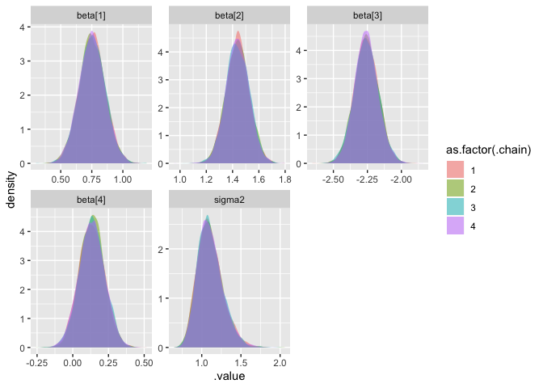

Lecture 1
================
Ethan Shen
5/13/2020

``` r
library(tidyverse)
```

    ## ── Attaching packages ─────────────────────────────────────────────────────────── tidyverse 1.3.0 ──

    ## ✓ ggplot2 3.2.1     ✓ purrr   0.3.3
    ## ✓ tibble  3.0.1     ✓ dplyr   0.8.5
    ## ✓ tidyr   1.0.0     ✓ stringr 1.4.0
    ## ✓ readr   1.3.1     ✓ forcats 0.4.0

    ## Warning: package 'tibble' was built under R version 3.6.2

    ## ── Conflicts ────────────────────────────────────────────────────────────── tidyverse_conflicts() ──
    ## x dplyr::filter() masks stats::filter()
    ## x dplyr::lag()    masks stats::lag()

# Lecture 1

## Bayesian Linear Models

``` r
set.seed(129047809)
n = 100
beta = c(0.7, 1.5, -2.2, 0.1)
eps = rnorm(n)
d = data.frame(
  X1 = rt(n, df=5), # t-distribution
  X2 = rt(n, df=5),
  X3 = rt(n, df=5)
) %>%
  mutate(Y = beta[1] + beta[2]*X1 + beta[3]*X2 + beta[4]*X3 + eps)
X = cbind(1, d$X1, d$X2, d$X3)

l = lm(Y~.-Y, data = d)
l$coefficients
```

    ## (Intercept)          X1          X2          X3 
    ##   0.7523352   1.4375794  -2.2571430   0.1329863

``` r
beta_hat = solve(t(X) %*% X, t(X) %*% d$Y)
beta_hat
```

    ##            [,1]
    ## [1,]  0.7523352
    ## [2,]  1.4375794
    ## [3,] -2.2571430
    ## [4,]  0.1329863

### JAGS

``` r
model = "model{
  # Likelihood
  for(i in 1:length(Y)){
    Y[i]   ~ dnorm(mu[i], tau) #normal distribution parametrized with precision, NOT variance 
    mu[i] = beta[1] + beta[2]*X1[i] + beta[3]*X2[i] + beta[4]*X3[i]
  }

  # Prior for beta
  for(j in 1:4){
    beta[j] ~ dnorm(0,1/100)
  }

  # Prior for sigma / tau2
  tau ~ dgamma(1, 1)
  sigma2 = 1/tau
}"

# Gibbs Sampler
m = rjags::jags.model(
  textConnection(model), 
  data = d,
  n.chains = 4
) 
```

    ## Compiling model graph
    ##    Resolving undeclared variables
    ##    Allocating nodes
    ## Graph information:
    ##    Observed stochastic nodes: 100
    ##    Unobserved stochastic nodes: 5
    ##    Total graph size: 810
    ## 
    ## Initializing model

``` r
update(m, n.iter=1000, progress.bar="none") # burn-in
samp = rjags::coda.samples(
  m, 
  variable.names=c("beta","sigma2"), 
  n.iter=5000, # actual samples
  progress.bar="none" 
)
```

``` r
other = 
  bind_rows(
    tibble(
      param = paste0("beta[",1:4,"]"),
      class = "beta",
      value = beta,
      type = "true value"
    ) %>%
      rbind(list("sigma2","sigma2",1, "true value")),
    tibble(
      param = paste0("beta[",1:4,"]"),
      class = "beta",
      value = l$coefficients,
      type = "mle"
    ) %>%
      rbind(list("sigma2", "sigma2", var(l$residuals), "mle"))
  )

# non-informative priors --> converging to MLE

samp %>% 
  purrr::pluck(1) %>%
  as.data.frame() %>%
  tidyr::gather(param, value) %>%
  mutate(class = stringr::str_replace(param, "\\[\\d+\\]","")) %>%
  ggplot(aes_string(x="value", fill="class")) +
  geom_density(alpha=0.5) +
  facet_wrap(~param, scales = "free") +
  geom_vline(data = other, aes_string(xintercept="value", color="type", linetype="type"), size=0.8) +
  scale_colour_manual(values=c("grey22","grey52")) +
  guides(fill=FALSE)
```

<!-- -->

``` r
df_mcmc <- tidybayes::gather_draws(samp, #CODA object
                                   beta[i], 
                                   sigma2) %>%
  mutate(param = paste0(.variable, ifelse(is.na(i), "", paste0("[", i, "]")))) %>%
  group_by(param, .chain) %>%
  arrange(.iteration, .draw)

head(df_mcmc, 10) 
```

    ## # A tibble: 10 x 7
    ## # Groups:   param, .chain [10]
    ##        i .chain .iteration .draw .variable  .value param  
    ##    <int>  <int>      <int> <int> <chr>       <dbl> <chr>  
    ##  1     1      1          1     1 beta       0.834  beta[1]
    ##  2     2      1          1     1 beta       1.49   beta[2]
    ##  3     3      1          1     1 beta      -2.27   beta[3]
    ##  4     4      1          1     1 beta       0.230  beta[4]
    ##  5    NA      1          1     1 sigma2     0.784  sigma2 
    ##  6     1      2          1  5001 beta       0.756  beta[1]
    ##  7     2      2          1  5001 beta       1.47   beta[2]
    ##  8     3      2          1  5001 beta      -2.40   beta[3]
    ##  9     4      2          1  5001 beta       0.0610 beta[4]
    ## 10    NA      2          1  5001 sigma2     1.06   sigma2

``` r
tail(df_mcmc, 10)
```

    ## # A tibble: 10 x 7
    ## # Groups:   param, .chain [10]
    ##        i .chain .iteration .draw .variable  .value param  
    ##    <int>  <int>      <int> <int> <chr>       <dbl> <chr>  
    ##  1     1      3       5000 15000 beta       0.628  beta[1]
    ##  2     2      3       5000 15000 beta       1.45   beta[2]
    ##  3     3      3       5000 15000 beta      -2.17   beta[3]
    ##  4     4      3       5000 15000 beta       0.119  beta[4]
    ##  5    NA      3       5000 15000 sigma2     1.11   sigma2 
    ##  6     1      4       5000 20000 beta       0.817  beta[1]
    ##  7     2      4       5000 20000 beta       1.37   beta[2]
    ##  8     3      4       5000 20000 beta      -2.35   beta[3]
    ##  9     4      4       5000 20000 beta      -0.0218 beta[4]
    ## 10    NA      4       5000 20000 sigma2     1.10   sigma2

``` r
# Posterior Density Plots: between four chains, what are the posterior distributions for beta[1]? (all converge)
ggplot(df_mcmc,aes(fill=as.factor(.chain), group=.chain, x=.value)) +
  geom_density(alpha=0.5, color=NA) +
  facet_wrap(~ param, scales = "free")
```

<!-- -->

``` r
# Trace Plots: well-behaved chain explores entire space 
df_mcmc %>% 
  filter(.iteration <= 500,
         param == "beta[1]" | param =="beta[2]") %>%
  ggplot(aes(x=.iteration, y=.value, color=as.factor(.chain))) +
  geom_line(alpha=0.5) +
  facet_grid(.chain~ param, scale="free_y") 
```

<!-- -->

``` r
# Credible Interval of beta[i] and sigma2 (highest-density interval/hdi --> narrowest possible interval that still gives me 95% area, good for very skewed distributions, bad for bimodal distributions 
# vs. quantile interval/qi)
df_ci = tidybayes::mean_hdi(df_mcmc, 
                            .value, 
                            .width=c(0.8, 0.95) # 80% and 85% credible intervals
)

df_ci
```

    ## # A tibble: 40 x 8
    ## # Groups:   param [5]
    ##    param   .chain .value .lower .upper .width .point .interval
    ##    <chr>    <int>  <dbl>  <dbl>  <dbl>  <dbl> <chr>  <chr>    
    ##  1 beta[1]      1  0.755  0.624  0.892    0.8 mean   hdi      
    ##  2 beta[1]      2  0.751  0.614  0.882    0.8 mean   hdi      
    ##  3 beta[1]      3  0.754  0.629  0.898    0.8 mean   hdi      
    ##  4 beta[1]      4  0.750  0.622  0.890    0.8 mean   hdi      
    ##  5 beta[2]      1  1.44   1.32   1.55     0.8 mean   hdi      
    ##  6 beta[2]      2  1.44   1.32   1.55     0.8 mean   hdi      
    ##  7 beta[2]      3  1.44   1.33   1.56     0.8 mean   hdi      
    ##  8 beta[2]      4  1.44   1.33   1.56     0.8 mean   hdi      
    ##  9 beta[3]      1 -2.26  -2.37  -2.15     0.8 mean   hdi      
    ## 10 beta[3]      2 -2.26  -2.36  -2.13     0.8 mean   hdi      
    ## # … with 30 more rows

``` r
# Caterpillar Plots 
df_ci %>% 
  filter(param == "beta[1]" | param =="beta[2]") %>%
  ggplot(aes(x = .value, y = .chain, color = as.factor(.chain))) + 
  facet_grid(param~.) + 
  tidybayes::geom_pointintervalh() # thick line is 80%, thin line is 95%
```

<!-- -->
