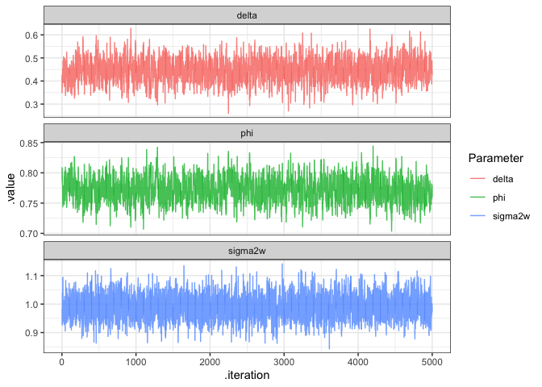

# AR(1) Example

$\phi = 0.75$, $\delta=0.5$, and $\sigma_w^2=1$,


```r
ar1 = arima.sim(n=1000, model = list(order=c(1,0,0), ar=0.75), mean=0.5)
forecast::ggtsdisplay(ar1)
```

```
## Registered S3 method overwritten by 'xts':
##   method     from
##   as.zoo.xts zoo
```

```
## Registered S3 method overwritten by 'quantmod':
##   method            from
##   as.zoo.data.frame zoo
```

<!-- -->

### Using ARIMA function


```r
ar1_arima = forecast::Arima(ar1, order = c(1,0,0)) 
summary(ar1_arima)
```

```
## Series: ar1 
## ARIMA(1,0,0) with non-zero mean 
## 
## Coefficients:
##          ar1    mean
##       0.7102  1.9712
## s.e.  0.0223  0.1046
## 
## sigma^2 estimated as 0.9244:  log likelihood=-1378.98
## AIC=2763.96   AICc=2763.99   BIC=2778.69
## 
## Training set error measures:
##                        ME      RMSE       MAE       MPE     MAPE      MASE
## Training set -0.001923661 0.9604944 0.7752178 -121.9282 223.4974 0.9324426
##                     ACF1
## Training set -0.03329246
```

The "mean" reported by the `ARIMA` model is $E(y_t) = \frac{\delta}{1-\phi}$.

### Using lm() function


```r
d = data_frame(y = ar1, t=seq_along(ar1))
```

```
## Warning: `data_frame()` is deprecated as of tibble 1.1.0.
## Please use `tibble()` instead.
## This warning is displayed once every 8 hours.
## Call `lifecycle::last_warnings()` to see where this warning was generated.
```

```r
ar1_lm = lm(y~lag(as.vector(y)), data=d)
summary(ar1_lm)
```

```
## 
## Call:
## lm(formula = y ~ lag(as.vector(y)), data = d)
## 
## Residuals:
##      Min       1Q   Median       3Q      Max 
## -2.69101 -0.65690  0.01003  0.67649  2.85271 
## 
## Coefficients:
##                   Estimate Std. Error t value Pr(>|t|)    
## (Intercept)        0.56960    0.05327   10.69   <2e-16 ***
## lag(as.vector(y))  0.70934    0.02231   31.80   <2e-16 ***
## ---
## Signif. codes:  0 '***' 0.001 '**' 0.01 '*' 0.05 '.' 0.1 ' ' 1
## 
## Residual standard error: 0.9609 on 997 degrees of freedom
##   (1 observation deleted due to missingness)
## Multiple R-squared:  0.5036,	Adjusted R-squared:  0.5031 
## F-statistic:  1011 on 1 and 997 DF,  p-value: < 2.2e-16
```

We see the coefficients for `ar1` and `lag(y)` are very very similar. 


# Bayesian AR(1) Model 

Model follows decomposition of multivariate normal density into product of conditional densities.


```r
ar1_model = "model{
# likelihood
  y[1] ~ dnorm(delta/(1-phi), (sigma2w/(1-phi^2))^-1)
  y_hat[1] ~ dnorm(delta/(1-phi), (sigma2w/(1-phi^2))^-1)

  for (t in 2:length(y)) {
    y[t] ~ dnorm(delta + phi*y[t-1], 1/sigma2w)
    y_hat[t] ~ dnorm(delta + phi*y[t-1], 1/sigma2w)
  }
  
  mu = delta/(1-phi)

# priors
  delta ~ dnorm(0,1/1000)
  phi ~ dnorm(0,1)
  tau ~ dgamma(0.001,0.001)
  sigma2w <- 1/tau
}"

ar_1_model_bayes = "model{
  #likelihood
  
  y[1] ~ dnorm(delta/(1-phi), (sigma2w/(1-phi^2))^-1) # taking inverse of variance bc JAGS takes precision, not variance
  
  # posterior predictive
  y_hat[1] ~ dnorm(delta/(1-phi), (sigma2w/( 1-phi^2))^-1)
  
  # conditional likelihoods
  for (t in 2:length(y)) {
    y[t] ~ dnorm(delta + phi*y[t-1], 1/sigma2w)
    y_hat[t] ~ dnorm(delta + phi*y[t-1], 1/sigma2w)
  }
  
  # expected value of y_t
  mu = delta/(1-phi)
  
  # priors
  delta ~ dnorm(0,1/1000)
  
  # could be problematic bc model might not be stationary (in this case, we know the model is stationary, so not an issue)
  # however, if we don't know whether or not model is stationary, the mean and variance of y_t is not what we coded, because those are derived after assuming process is stationary
  
  phi ~ dnorm(0,1) 
  tau ~ dgamma(0.001, 0.001)
  sigma2w = 1/tau
}"

m_ar1 = rjags::jags.model(textConnection(ar1_model),
                          data = list(y=ar1))
```

```
## Compiling model graph
##    Resolving undeclared variables
##    Allocating nodes
## Graph information:
##    Observed stochastic nodes: 1000
##    Unobserved stochastic nodes: 1003
##    Total graph size: 4016
## 
## Initializing model
```

```r
update(m_ar1, n.iter = 1000)

samp_ar1 = rjags::coda.samples(m_ar1, n.iter = 5000,
                               variable.names = c("delta", "phi", "sigma2w", "mu", "y_hat"))
```

### MCMC Diagnostics


```r
tidybayes::gather_draws(samp_ar1, delta, phi, sigma2w) %>%
  ggplot(aes(x = .iteration, y = .value, color = as.factor(.variable))) + 
  geom_line(alpha = 0.8) + 
  facet_wrap(~.variable, ncol=1, scales = "free_y") + 
  labs(color = "Parameter")
```

<!-- -->

## Posterior Density & Comparison to ARIMA fit and lm() fit


```r
ar1_res = bind_rows(
  data_frame(
    model = "truth",
    term = c("delta", "phi", "sigma2_w"), 
    .value = c(0.5, 0.75, 1)
  ),
  data_frame(
    model = "lm",
    term = c("delta", "phi", "sigma2_w"), 
    .value = c(coef(ar1_lm), var(ar1_lm$residuals))
  ),
  data_frame(
    model = "ARIMA",
    term = c("delta", "phi", "sigma2_w"), 
    .value = c(ar1_arima$model$phi, (1-ar1_arima$model$phi)*ar1_arima$coef[2], ar1_arima$sigma2)
  )
)

tidybayes::gather_draws(samp_ar1, delta, phi, sigma2w) %>%
  ggplot(aes(x=.value)) +
    geom_density(fill="lightgrey") +
    geom_vline(data=ar1_res, aes(xintercept = .value, linetype=model, color=model), size=1.5, alpha=0.75) +
    facet_wrap(~term, ncol=3, scales = "free_x")
```

<!-- -->


