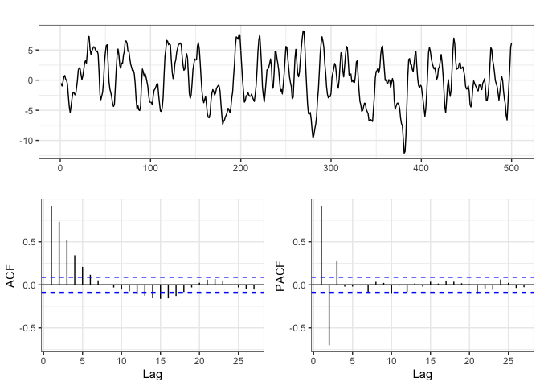

# AR(1) Example

$\phi = 0.75$, $\delta=0.5$, and $\sigma_w^2=1$,


```r
ar1 = arima.sim(n=1000, model = list(order=c(1,0,0), ar=0.75), mean=0.5)
forecast::ggtsdisplay(ar1)
```

<!-- -->

### Using ARIMA function


```r
ar1_arima = forecast::Arima(ar1, order = c(1,0,0)) 
summary(ar1_arima)
```

```
## Series: ar1 
## ARIMA(1,0,0) with non-zero mean 
## 
## Coefficients:
##          ar1    mean
##       0.7720  1.9580
## s.e.  0.0202  0.1372
## 
## sigma^2 estimated as 0.987:  log likelihood=-1411.85
## AIC=2829.69   AICc=2829.72   BIC=2844.42
## 
## Training set error measures:
##                        ME      RMSE       MAE      MPE     MAPE      MASE
## Training set -0.001335972 0.9924843 0.7977374 8.168087 126.4885 0.9438618
##                     ACF1
## Training set -0.04635963
```

The "mean" reported by the `ARIMA` model is $E(y_t) = \frac{\delta}{1-\phi}$.

### Using lm() function


```r
d = data_frame(y = ar1, t=seq_along(ar1))
ar1_lm = lm(y~lag(as.vector(y)), data=d)
summary(ar1_lm)
```

```
## 
## Call:
## lm(formula = y ~ lag(as.vector(y)), data = d)
## 
## Residuals:
##      Min       1Q   Median       3Q      Max 
## -3.06398 -0.70133 -0.02532  0.71898  3.07995 
## 
## Coefficients:
##                   Estimate Std. Error t value Pr(>|t|)    
## (Intercept)        0.44385    0.05028   8.828   <2e-16 ***
## lag(as.vector(y))  0.77224    0.02025  38.143   <2e-16 ***
## ---
## Signif. codes:  0 '***' 0.001 '**' 0.01 '*' 0.05 '.' 0.1 ' ' 1
## 
## Residual standard error: 0.9937 on 997 degrees of freedom
##   (1 observation deleted due to missingness)
## Multiple R-squared:  0.5934,	Adjusted R-squared:  0.593 
## F-statistic:  1455 on 1 and 997 DF,  p-value: < 2.2e-16
```

We see the coefficients for `ar1` and `lag(y)` are very very similar. 


# Bayesian AR(1) Model 

Model follows decomposition of multivariate normal density into product of conditional densities.


```r
ar1_model = "model{
# likelihood
  y[1] ~ dnorm(delta/(1-phi), (sigma2w/(1-phi^2))^-1) # taking inverse of variance bc JAGS takes precision, not variance
   
   # posterior predictive
  y_hat[1] ~ dnorm(delta/(1-phi), (sigma2w/(1-phi^2))^-1)

 # conditional likelihoods
  for (t in 2:length(y)) {
    y[t] ~ dnorm(delta + phi*y[t-1], 1/sigma2w)
    y_hat[t] ~ dnorm(delta + phi*y[t-1], 1/sigma2w)
  }
  
  # expected value of y_t
  mu = delta/(1-phi)

# priors
  delta ~ dnorm(0,1/1000)
   # could be problematic bc model might not be stationary (in this case, we know the model is stationary, so not an issue)
  # however, if we don't know whether or not model is stationary, the mean and variance of y_t is not what we coded, because those are derived after assuming process is stationary
  
  phi ~ dnorm(0,1)
  tau ~ dgamma(0.001,0.001)
  sigma2w <- 1/tau
}"

m_ar1 = rjags::jags.model(textConnection(ar1_model),
                          data = list(y=ar1))
```

```
## Compiling model graph
##    Resolving undeclared variables
##    Allocating nodes
## Graph information:
##    Observed stochastic nodes: 1000
##    Unobserved stochastic nodes: 1003
##    Total graph size: 4016
## 
## Initializing model
```

```r
update(m_ar1, n.iter = 1000)

samp_ar1 = rjags::coda.samples(m_ar1, n.iter = 5000,
                               variable.names = c("delta", "phi", "sigma2w", "mu", "y_hat"))
```

### MCMC Diagnostics


```r
tidybayes::gather_draws(samp_ar1, delta, phi, sigma2w) %>%
  ggplot(aes(x = .iteration, y = .value, color = as.factor(.variable))) + 
  geom_line(alpha = 0.8) + 
  facet_wrap(~.variable, ncol=1, scales = "free_y") + 
  labs(color = "Parameter")
```

<!-- -->

## Posterior Density & Comparison to ARIMA fit and lm() fit


```r
ar1_res = bind_rows(
  data_frame(
    model = "truth",
    term = c("delta", "phi", "sigma2_w"), 
    .value = c(0.5, 0.75, 1)
  ),
  data_frame(
    model = "lm",
    term = c("delta", "phi", "sigma2_w"), 
    .value = c(coef(ar1_lm), var(ar1_lm$residuals))
  ),
  data_frame(
    model = "ARIMA",
    term = c("delta", "phi", "sigma2_w"), 
    .value = c(ar1_arima$model$phi, (1-ar1_arima$model$phi)*ar1_arima$coef[2], ar1_arima$sigma2)
  )
)

tidybayes::gather_draws(samp_ar1, delta, phi, sigma2w) %>%
  ggplot(aes(x=.value)) +
  geom_density(fill="lightgrey") +
  geom_vline(data=ar1_res, aes(xintercept = .value, linetype=model, color=model), size=1.5, alpha=0.75) +
  facet_wrap(~term, ncol=3, scales = "free_x")
```

<!-- -->

We see that $\sigma^2$ is predicted pretty well, others not so much. 

## Predictions


```r
models = d %>% 
  modelr::add_predictions(ar1_lm,var = "lm") %>%
  mutate(
    ARIMA = ar1_arima %>% fitted(),
    bayes = tidybayes::gather_draws(samp_ar1, y_hat[i]) %>%  summarize(post_mean = mean(.value)) %>% pull(post_mean)
  ) %>%
  tidyr::gather(model, y, -t)

gridExtra::grid.arrange(
  models %>%
    filter(model=="y" | model=="lm") %>%
    ggplot(aes(x=t, y=y, color=forcats::as_factor(model))) +
    geom_line(alpha=0.75) +
    scale_color_manual(values=c("black", "red")) +
    labs(color="Model")
  ,
  models %>%
    filter(model=="y" | model=="bayes") %>%
    ggplot(aes(x=t, y=y, color=forcats::as_factor(model))) +
    geom_line(alpha=0.75) +
    scale_color_manual(values=c("black", "light blue")) +
    labs(color="Model")
  ,
  models %>%
    filter(model=="y" | model=="ARIMA") %>%
    ggplot(aes(x=t, y=y, color=forcats::as_factor(model))) +
    geom_line(alpha=0.75) +
    scale_color_manual(values=c("black", "light green")) +
    labs(color="Model")
)
```

<!-- -->

We see the predictions (ARIMA, lm, and Bayesian) are all very similar to the truth.

# ARMA(2,2)

$\phi = (1.3,-0.5)$, $\theta = (0.5,0.2)$, $\delta=0$, and $\sigma_w^2=1$ using the same models 


```r
y = arima.sim(n=500, model=list(ar=c(1.3,-0.5), ma=c(0.5,0.2))) 

forecast::ggtsdisplay(y, points = FALSE)
```

<!-- -->

PACF shows MA(2), ACF implies AR of some sort. 

## ARIMA


```r
forecast::Arima(y, order = c(2,0,2), include.mean = FALSE) %>% summary()
```

```
## Series: y 
## ARIMA(2,0,2) with zero mean 
## 
## Coefficients:
##          ar1      ar2     ma1     ma2
##       1.2683  -0.4431  0.5711  0.2015
## s.e.  0.0844   0.0778  0.0905  0.0711
## 
## sigma^2 estimated as 0.9282:  log likelihood=-690.7
## AIC=1391.41   AICc=1391.53   BIC=1412.48
## 
## Training set error measures:
##                      ME      RMSE       MAE      MPE     MAPE     MASE
## Training set 0.00995601 0.9595824 0.7739316 38.02223 97.34344 0.654686
##                     ACF1
## Training set 0.002333951
```

$\theta$ generally harder to estimate, but all estimates are relatively close to true values. 

## AR only lm


```r
lm(y ~ lag(as.vector(y),1) + lag(as.vector(y),2)) %>% summary()
```

```
## 
## Call:
## lm(formula = y ~ lag(as.vector(y), 1) + lag(as.vector(y), 2))
## 
## Residuals:
##      Min       1Q   Median       3Q      Max 
## -2.87686 -0.69232 -0.05779  0.70634  2.67021 
## 
## Coefficients:
##                      Estimate Std. Error t value Pr(>|t|)    
## (Intercept)           0.01413    0.04579   0.309    0.758    
## lag(as.vector(y), 1)  1.59112    0.03097  51.381   <2e-16 ***
## lag(as.vector(y), 2) -0.72685    0.03103 -23.423   <2e-16 ***
## ---
## Signif. codes:  0 '***' 0.001 '**' 0.01 '*' 0.05 '.' 0.1 ' ' 1
## 
## Residual standard error: 1.022 on 495 degrees of freedom
##   (2 observations deleted due to missingness)
## Multiple R-squared:  0.928,	Adjusted R-squared:  0.9277 
## F-statistic:  3191 on 2 and 495 DF,  p-value: < 2.2e-16
```

These are estimates of $\phi_1$ and $\phi_2$. However, we can't do `lag(w_t)` in a simple `lm` model. 

# Hannan-Rissanen Algorithm 

## Steps 1 and 2


```r
ar_yw=ar.yw(y, order.max=10)
ar_yw
```

```
## 
## Call:
## ar.yw.default(x = y, order.max = 10)
## 
## Coefficients:
##       1        2        3  
##  1.7623  -1.1452   0.2836  
## 
## Order selected 3  sigma^2 estimated as  1.055
```

```r
ar_mle=ar.mle(y, order.max=10)
ar_mle
```

```
## 
## Call:
## ar.mle(x = y, order.max = 10)
## 
## Coefficients:
##       1        2        3  
##  1.8248  -1.2436   0.3268  
## 
## Order selected 3  sigma^2 estimated as  0.9236
```

## Step 3


```r
d = data_frame(
  y = y, 
  # create column of residuals 
  w_hat1 = ar_mle$resid 
)

# then take the lag of residuals
(lm1 = lm(y ~ lag(as.vector(y),1) + lag(as.vector(y),2) + lag(as.vector(w_hat1),1) + lag(as.vector(w_hat1),2), data=d)) %>%
  summary()
```

```
## 
## Call:
## lm(formula = y ~ lag(as.vector(y), 1) + lag(as.vector(y), 2) + 
##     lag(as.vector(w_hat1), 1) + lag(as.vector(w_hat1), 2), data = d)
## 
## Residuals:
##      Min       1Q   Median       3Q      Max 
## -2.80953 -0.70658 -0.04443  0.68182  2.92435 
## 
## Coefficients:
##                           Estimate Std. Error t value Pr(>|t|)    
## (Intercept)                0.01791    0.04358   0.411   0.6813    
## lag(as.vector(y), 1)       1.27540    0.06525  19.545  < 2e-16 ***
## lag(as.vector(y), 2)      -0.44897    0.05725  -7.842 2.80e-14 ***
## lag(as.vector(w_hat1), 1)  0.56338    0.07880   7.150 3.18e-12 ***
## lag(as.vector(w_hat1), 2)  0.19565    0.07864   2.488   0.0132 *  
## ---
## Signif. codes:  0 '***' 0.001 '**' 0.01 '*' 0.05 '.' 0.1 ' ' 1
## 
## Residual standard error: 0.969 on 490 degrees of freedom
##   (5 observations deleted due to missingness)
## Multiple R-squared:  0.9359,	Adjusted R-squared:  0.9354 
## F-statistic:  1788 on 4 and 490 DF,  p-value: < 2.2e-16
```

There is uncertainty on the residuals, so we refit by taking residuals of `lm1` and using those instead. 

## Step 4.1


```r
d = modelr::add_residuals(d,lm1,"w_hat2")

(lm2 = lm(y ~ lag(as.vector(y),1) + lag(as.vector(y),2) + lag(as.vector(w_hat2),1) + lag(as.vector(w_hat2),2), data=d)) %>%
  summary()
```

```
## 
## Call:
## lm(formula = y ~ lag(as.vector(y), 1) + lag(as.vector(y), 2) + 
##     lag(as.vector(w_hat2), 1) + lag(as.vector(w_hat2), 2), data = d)
## 
## Residuals:
##      Min       1Q   Median       3Q      Max 
## -2.76151 -0.68521 -0.01931  0.68550  2.89842 
## 
## Coefficients:
##                           Estimate Std. Error t value Pr(>|t|)    
## (Intercept)                0.01709    0.04380   0.390   0.6966    
## lag(as.vector(y), 1)       1.28126    0.06617  19.362  < 2e-16 ***
## lag(as.vector(y), 2)      -0.45371    0.05807  -7.813 3.46e-14 ***
## lag(as.vector(w_hat2), 1)  0.55748    0.08029   6.944 1.23e-11 ***
## lag(as.vector(w_hat2), 2)  0.19235    0.08002   2.404   0.0166 *  
## ---
## Signif. codes:  0 '***' 0.001 '**' 0.01 '*' 0.05 '.' 0.1 ' ' 1
## 
## Residual standard error: 0.9722 on 488 degrees of freedom
##   (7 observations deleted due to missingness)
## Multiple R-squared:  0.9357,	Adjusted R-squared:  0.9352 
## F-statistic:  1776 on 4 and 488 DF,  p-value: < 2.2e-16
```

## Step 4.2


```r
d = modelr::add_residuals(d,lm2,"w_hat3")

(lm3 = lm(y ~ lag(as.vector(y),1) + lag(as.vector(y),2) + lag(as.vector(w_hat3),1) + lag(as.vector(w_hat3),2), data=d)) %>%
  summary()
```

```
## 
## Call:
## lm(formula = y ~ lag(as.vector(y), 1) + lag(as.vector(y), 2) + 
##     lag(as.vector(w_hat3), 1) + lag(as.vector(w_hat3), 2), data = d)
## 
## Residuals:
##      Min       1Q   Median       3Q      Max 
## -2.80936 -0.68324 -0.02478  0.68661  2.87612 
## 
## Coefficients:
##                           Estimate Std. Error t value Pr(>|t|)    
## (Intercept)                0.02184    0.04375   0.499  0.61784    
## lag(as.vector(y), 1)       1.26679    0.06631  19.105  < 2e-16 ***
## lag(as.vector(y), 2)      -0.44139    0.05817  -7.588 1.67e-13 ***
## lag(as.vector(w_hat3), 1)  0.57233    0.08008   7.147 3.26e-12 ***
## lag(as.vector(w_hat3), 2)  0.20757    0.07998   2.595  0.00973 ** 
## ---
## Signif. codes:  0 '***' 0.001 '**' 0.01 '*' 0.05 '.' 0.1 ' ' 1
## 
## Residual standard error: 0.9691 on 486 degrees of freedom
##   (9 observations deleted due to missingness)
## Multiple R-squared:  0.9363,	Adjusted R-squared:  0.9358 
## F-statistic:  1787 on 4 and 486 DF,  p-value: < 2.2e-16
```

## RMSEs


```r
modelr::rmse(lm1, data = d)
```

```
## [1] 0.9640676
```

```r
modelr::rmse(lm2, data = d)
```

```
## [1] 0.9672682
```

```r
modelr::rmse(lm3, data = d)
```

```
## [1] 0.9641422
```

Once coefficients get "close" to each other, we can say they've converged. We are done. 

# Bayesian ARMA(2,2)

This model looks like $y_t = \phi_1 y_{t-1} + \phi_2 y_{t-2} + w_t + \theta_1 w-{t-1} + \theta_2 w-{t-2} + e_t$, where $e_t \sim N(0, \sigma_e ^2)$. $e_t$ is NOT autoregressive, so this makes we are fitting a slightly different model compared to the `lm` model, but very similar to the Hannan Rissanen. The set of residuals that are left over (are not part of the $w_t$) are similar to the $e_t$. 


```r
arma22_model = "model{
# Likelihood
  for (t in 1:length(y)) {
    y[t] ~ dnorm(mu[t], 1/sigma2_e)
    y_hat[t] ~ dnorm(mu[t], 1/sigma2_e)
  }                    
  
  # estimating first two steps with latent errors 

  mu[1] = phi[1] * y_0  + phi[2] * y_n1 + w[1] + theta[1]*w_0  + theta[2]*w_n1
  mu[2] = phi[1] * y[1] + phi[2] * y_0  + w[2] + theta[1]*w[1] + theta[2]*w_0   
  for (t in 3:length(y)) { 
    mu[t] = phi[1] * y[t-1] + phi[2] * y[t-2] + w[t] + theta[1] * w[t-1] + theta[2] * w[t-2]
  }
  
# Priors

# similar to HR algorithm, we are estimating w_t
  for(t in 1:length(y)){
    w[t] ~ dnorm(0,1/sigma2_w)
  }

  sigma2_w = 1/tau_w; tau_w ~ dgamma(0.001, 0.001) 
  sigma2_e = 1/tau_e; tau_e ~ dgamma(0.001, 0.001) 
  for(i in 1:2) {
    phi[i] ~ dnorm(0,1)
    theta[i] ~ dnorm(0,1)
  }

# Latent errors and series values
  w_0  ~ dt(0,tau_w,2)
  w_n1 ~ dt(0,tau_w,2)
  y_0  ~ dnorm(0,1/1000)
  y_n1 ~ dnorm(0,1/1000)
}"
```

## Bayesian Fit


```r
if (!file.exists("arma22_coda.rds")) {
  m = rjags::jags.model(
    textConnection(arma22_model), 
    data = list(y = y), 
    quiet = TRUE
  ) 
  
  update(m, n.iter=50000, progress.bar="none")
  
  arma22_coda = rjags::coda.samples(
    m, variable.names=c("phi", "theta", "sigma2_w", 
                        "mu", "y", "y_hat"), 
    n.iter=50000, progress.bar="none", thin = 50
  )
  
  saveRDS(arma22_coda, "arma22_coda.rds")
} else {
  arma22_coda = readRDS("arma22_coda.rds")
}
```


```r
arma22_res = bind_rows(
  data_frame(
    model = "True",
    term = c("phi[1]", "phi[2]", "theta[1]", "theta[2]"), 
    estimate = c(1.3, -0.5, 0.5, 0.2)
  ),
  data_frame(
    model = "Arima",
    term = c("phi[1]", "phi[2]", "theta[1]", "theta[2]"), 
    estimate = c(1.2843,  -0.5182,  0.4965,  0.2204)
  ),
  data_frame(
    model = "HR w_hat3",
    term = c("phi[1]", "phi[2]", "theta[1]", "theta[2]"), 
    estimate = c(1.23758, -0.47868, 0.54084, 0.25991)
  )
)


arma22_params = tidybayes::gather_samples(arma22_coda, phi[i], theta[i]) %>%
  ungroup() %>%
  mutate(term = paste0(term,"[",i,"]"))
```


### MCMC Diagnostics 


```r
arma22_params %>%
  group_by(term) %>%
  slice(seq(1,n(),n()/200)) %>%
  ggplot(aes(x=.iteration, y=estimate, color=term)) +
  geom_line() +
  facet_grid(term~., scales = "free_y")
```

<!-- -->

These are pretty hard to sample with JAGS. 

### Posterior Densities


```r
arma22_params %>%
  ggplot(aes(x=estimate)) +
  geom_density(fill="lightgrey") +
  geom_vline(data=arma22_res, aes(xintercept = estimate, color=forcats::as_factor(model), 
                                  linetype=forcats::as_factor(model)), size=1, alpha=0.5) +
  labs(color="Model", linetype="Model") + 
  facet_wrap(~term, ncol=2, scales = "free")
```

<!-- -->

All these predictions (ARIMA vs. HR) are all pretty similar to each other. 

### Predictions 


```r
arma_models = data_frame(
  t = seq_along(y),
  ARIMA = forecast::Arima(y, order = c(2,0,2), include.mean = FALSE) %>% fitted(),
  bayes = tidybayes::gather_draws(arma22_coda, y_hat[i]) %>%
    ungroup() %>%
    mutate(.variable = paste0(.variable,"[",i,"]")) %>%
    group_by(.variable) %>%
    summarize(post_mean = mean(.value)) %>%
    pull(post_mean),
  y = y
) %>%
  tidyr::gather(model, y, -t)
gridExtra::grid.arrange(
  arma_models %>%
    filter(model=="y" | model=="bayes") %>%
    ggplot(aes(x=t, y=y, color=forcats::as_factor(model))) +
    geom_line(alpha=0.75) +
    scale_color_manual(values=c("light blue","black")) +
    labs(color="Model")
  ,
  arma_models %>%
    filter(model=="y" | model=="ARIMA") %>%
    ggplot(aes(x=t, y=y, color=forcats::as_factor(model))) +
    geom_line(alpha=0.75) +
    scale_color_manual(values=c("red", "black")) +
    labs(color="Model")
)
```

<!-- -->

We see that the Bayesian model is struggling. 

