# Seasonal ARIMA 

Generally want to deal with seasonal issue first before adding regular ARIMA components. 

## Australian Wine Example 


```r
data(wineind, package = "forecast")
forecast::ggtsdisplay(wineind, points = FALSE)
```

```
## Registered S3 method overwritten by 'xts':
##   method     from
##   as.zoo.xts zoo
```

```
## Registered S3 method overwritten by 'quantmod':
##   method            from
##   as.zoo.data.frame zoo
```

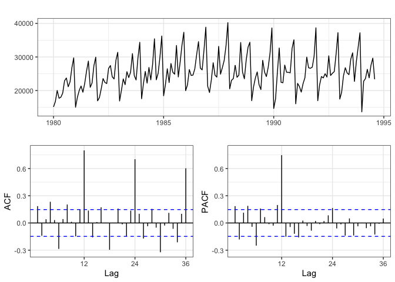<!-- -->

### Differencing


```r
forecast::ggtsdisplay(diff(wineind), points = FALSE)
```

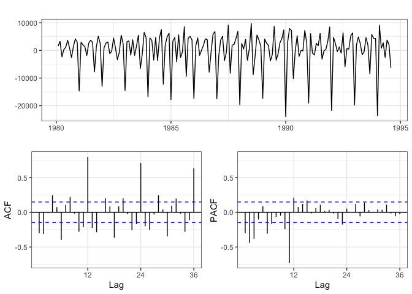<!-- -->

# Model 1.1 - Seasonal ARIMA with AR component

Lets consider an $\text{ARIMA}(0,0,0) \times (1,0,0)_{12}$:

$$
\begin{aligned}
(1-\Phi_1 L^{12}) \, y_t = \delta + w_t \\
y_t = \Phi_1 y_{t-12} + \delta + w_t
\end{aligned}
$$


```r
s1_arima = forecast::Arima(wineind, seasonal = list(order=c(1,0,0), 
                                                    # specify seasonal component
                                                    period=12)) 
summary(s1_arima)
```

```
## Series: wineind 
## ARIMA(0,0,0)(1,0,0)[12] with non-zero mean 
## 
## Coefficients:
##         sar1      mean
##       0.8780  24489.24
## s.e.  0.0314   1154.48
## 
## sigma^2 estimated as 6906536:  log likelihood=-1643.39
## AIC=3292.78   AICc=3292.92   BIC=3302.29
## 
## Training set error measures:
##                    ME     RMSE      MAE       MPE     MAPE      MASE      ACF1
## Training set 319.2553 2613.054 1955.066 0.1225996 7.931147 0.9937418 0.1096159
```

### Model Fit - Model 1.1


```r
cbPalette = c("#000000", "#ff3333", "#92c5de")

model = "Model 1.1 - Arima (0,0,0) x (1,0,0)[12]"
rmse = (wineind-s1_arima$fitted)^2 %>% mean() %>% sqrt() %>% round(2) %>% paste0("[RMSE: ", . ,"]")

data_frame(
  time = time(wineind),
  wineind = wineind,
  model = s1_arima %>% fitted()
) %>%
  tidyr::gather(type, sales, -time) %>%
  ggplot(aes(x = time, y = sales, color=as_factor(type))) + 
  geom_line(alpha=0.75, size=0.8) +
  scale_colour_manual(values=cbPalette, name="") +
  labs(title=paste(model, rmse))
```

```
## Warning: `data_frame()` is deprecated as of tibble 1.1.0.
## Please use `tibble()` instead.
## This warning is displayed once every 8 hours.
## Call `lifecycle::last_warnings()` to see where this warning was generated.
```

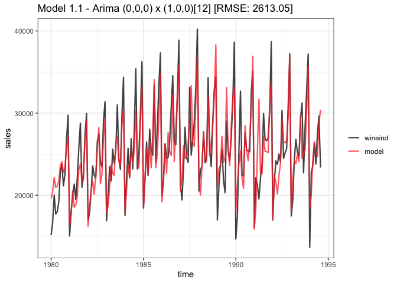<!-- -->

The fit doesn't really catch the high highs and low lows, seems like model fit is affected by non-stationarity of data. 

# Model 1.2 - Seasonal ARIMA with Differenced component

Lets consider an $\text{ARIMA}(0,0,0) \times (0,1,0)_{12}$:


```r
s2_arima = forecast::Arima(wineind, seasonal = list(order=c(0,1,0), period=12))

summary(s2_arima)
```

```
## Series: wineind 
## ARIMA(0,0,0)(0,1,0)[12] 
## 
## sigma^2 estimated as 7259076:  log likelihood=-1528.12
## AIC=3058.24   AICc=3058.27   BIC=3061.34
## 
## Training set error measures:
##                    ME     RMSE     MAE       MPE     MAPE      MASE       ACF1
## Training set 332.2484 2600.796 1834.68 0.8160334 7.356768 0.9325509 0.08393057
```

### Model Fit - Model 1.2


```r
model2 = "Model 1.2 - Arima (0,0,0) x (0,1,0)[12]"
rmse2 = (wineind-s2_arima$fitted)^2 %>% mean() %>% sqrt() %>% round(2) %>% paste0("[RMSE: ", . ,"]")

data_frame(
  time = time(wineind),
  wineind = wineind,
  model = s2_arima %>% fitted()
) %>%
  tidyr::gather(type, sales, -time) %>%
  ggplot(aes(x = time, y = sales, color=as_factor(type))) + 
  geom_line(alpha=0.75, size=0.8) +
  scale_colour_manual(values=cbPalette, name="") +
  labs(title=paste(model2, rmse2))
```

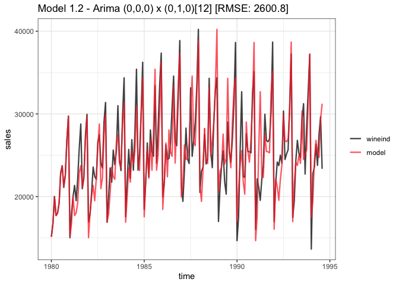<!-- -->

When comparing models with different differencing levels (i.e. model 1.1 vs. model 1.2), do NOT use AIC or BIC; use prediction instead. 

### Residuals - Model 1.2


```r
forecast::ggtsdisplay(s2_arima$residuals)
```

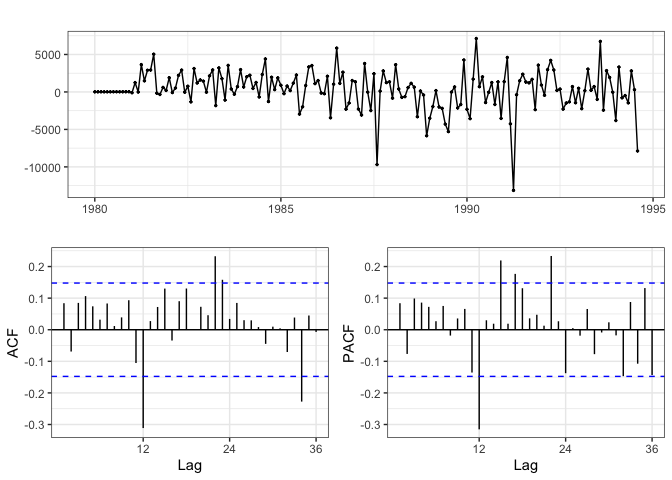<!-- -->

In the differenced seasonal model, we still see big spike at 12 in ACF, and another big spike at 12 and slightly big spike at 24 and 36 in the PACF. Because we continue to see spikes in the PACF, we should lean towards a MA process over an AR process. 

# Model 1.3 - Seasonal ARIMA with Differenced and MA components


```r
s3_arima = forecast::Arima(wineind, seasonal = list(order=c(0,1,1), period=12))

summary(s3_arima)
```

```
## Series: wineind 
## ARIMA(0,0,0)(0,1,1)[12] 
## 
## Coefficients:
##          sma1
##       -0.3246
## s.e.   0.0807
## 
## sigma^2 estimated as 6588531:  log likelihood=-1520.34
## AIC=3044.68   AICc=3044.76   BIC=3050.88
## 
## Training set error measures:
##                    ME     RMSE      MAE      MPE     MAPE      MASE       ACF1
## Training set 489.2564 2470.198 1798.944 1.383065 7.195087 0.9143864 0.09580954
```

### Model Fit - Model 1.3


```r
model3 = "Model 1.3 - Arima (0,0,0) x (0,1,1)[12]"
rmse3 = (wineind-s3_arima$fitted)^2 %>% mean() %>% sqrt() %>% round(2) %>% paste0("[RMSE: ", . ,"]")

data_frame(
  time = time(wineind),
  wineind = wineind,
  model = s3_arima %>% fitted()
) %>%
  tidyr::gather(type, sales, -time) %>%
  ggplot(aes(x = time, y = sales, color=as_factor(type))) + 
  geom_line(alpha=0.75, size=0.8) +
  scale_colour_manual(values=cbPalette, name="") +
  labs(title=paste(model3, rmse3))
```

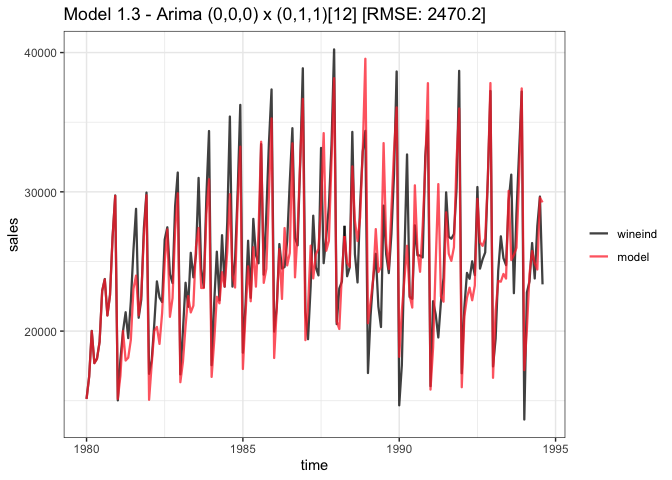<!-- -->

### Residuals - Model 1.3


```r
forecast::ggtsdisplay(s3_arima$residuals)
```

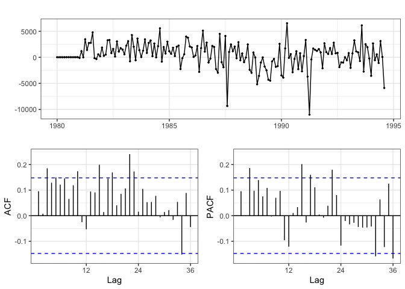<!-- -->

We should be done with the seasonal component. There are no longer noticeable spikes at 12, 24, or 36 in the ACF or PACF (blue dotted lines give a good indication of "significance"). If there is a seasonal issue (bigger spikes at 36) but not before (smaller spikes at 12, 24), do not add more seasonal AR/MA components. 

There does not seem like an obvious thing to add in the normal ARIMA. Really unsure if it's AR/MA, but we can try adding AR(3).

# Model 1.4 - AR + Seasonal ARIMA with Differenced and MA components


```r
s4_arima = forecast::Arima(wineind, order = c(3,0,0),seasonal = list(order=c(0,1,1), period=12))

summary(s4_arima)
```

```
## Series: wineind 
## ARIMA(3,0,0)(0,1,1)[12] 
## 
## Coefficients:
##          ar1     ar2     ar3     sma1
##       0.1402  0.0806  0.3040  -0.5790
## s.e.  0.0755  0.0813  0.0823   0.1023
## 
## sigma^2 estimated as 5948935:  log likelihood=-1512.38
## AIC=3034.77   AICc=3035.15   BIC=3050.27
## 
## Training set error measures:
##                    ME     RMSE      MAE      MPE     MAPE      MASE        ACF1
## Training set 340.1313 2325.537 1702.738 0.676801 6.767514 0.8654861 -0.06378129
```


### Model Fit - Model 1.4


```r
model4 = "Model 1.4 - Arima (3,0,0) x (0,1,1)[12]"
rmse4 = (wineind-s4_arima$fitted)^2 %>% mean() %>% sqrt() %>% round(2) %>% paste0("[RMSE: ", . ,"]")

data_frame(
  time = time(wineind),
  wineind = wineind,
  model = s4_arima %>% fitted()
) %>%
  tidyr::gather(type, sales, -time) %>%
  ggplot(aes(x = time, y = sales, color=as_factor(type))) + 
  geom_line(alpha=0.75, size=0.8) +
  scale_colour_manual(values=cbPalette, name="") +
  labs(title=paste(model4, rmse4))
```

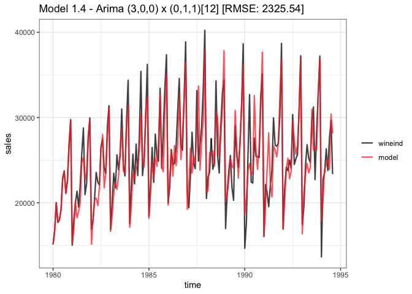<!-- -->

There isn't a very noticeable difference between the predictions of model 1.3 and model 1.4. 

### Residuals - Model 1.4


```r
forecast::ggtsdisplay(s4_arima$residuals)
```

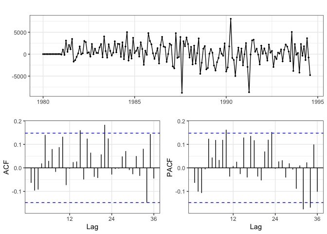<!-- -->

Residuals are still not much better than model 1.3. Ultimately, we should stick with the simpler model (1.3) that still has relatively strong predictive power. 

# Forecasting with Model 1.3 


```r
forecast::Arima(wineind, seasonal = list(order=c(0,1,1), period=12)) %>% 
  forecast::forecast() %>%
  autoplot() + 
  xlim(1992,1996)
```

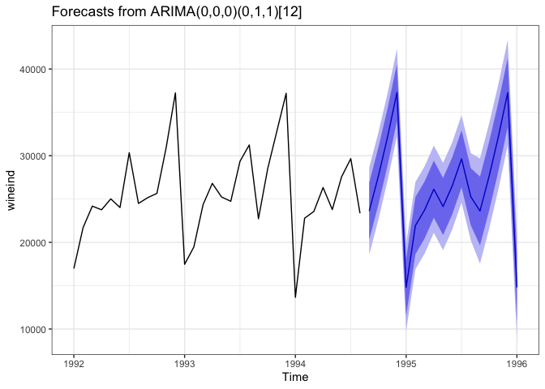<!-- -->

# Example: Monthly Federal Reserve Board Production (1948-1978)


```r
data(prodn, package="astsa"); forecast::ggtsdisplay(prodn, points = FALSE)
```

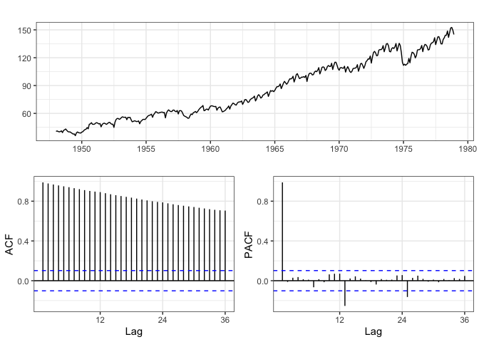<!-- -->

## Differencing

Based on the ACF it seems like standard differencing may be required. The ACF has a decaying pattern (compare this to the original ACF of `auswine`)


```r
forecast::ggtsdisplay(diff(prodn))
```

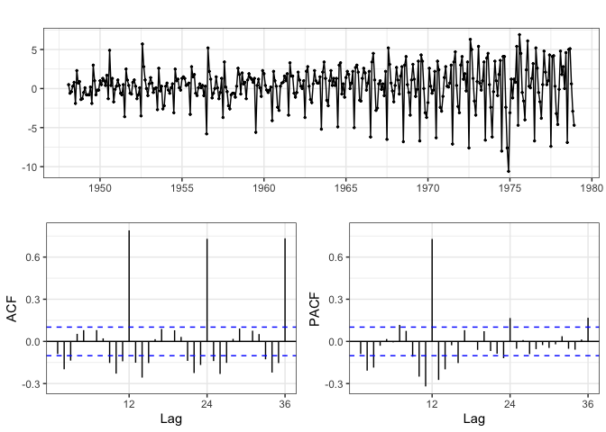<!-- -->

Looks better, but seems like variance gets bigger and bigger as time goes on (heteroscedasticity)

## Differencing vs Seasonal Differencing


```r
fr_m1 = forecast::Arima(prodn, order = c(0,1,0), 
                        seasonal = list(order=c(0,0,0), period=12))

forecast::ggtsdisplay(fr_m1$residuals)
```

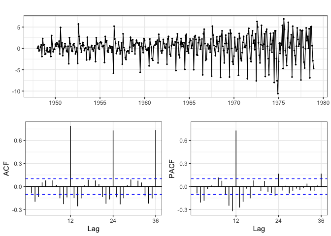<!-- -->


```r
fr_m2 = forecast::Arima(prodn, order = c(0,1,0), 
                        seasonal = list(order=c(0,1,0), period=12))

forecast::ggtsdisplay(fr_m2$residuals)
```

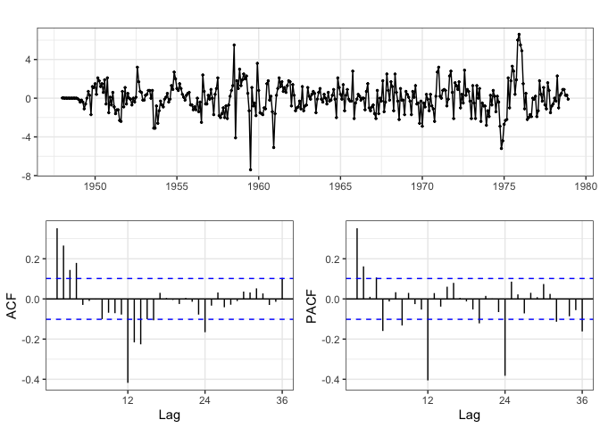<!-- -->

Seasonal differencing removed the huge lags in the ACF at 24 and 36. However, we still have spikes at 12, 24, 36 in PACF --> suggests we should first try MA over AR. 

## Adding Seasonal MA 


```r
fr_m3.1 = forecast::Arima(prodn, order = c(0,1,0), 
                          seasonal = list(order=c(0,1,1), period=12))
forecast::ggtsdisplay(fr_m3.1$residuals)
```

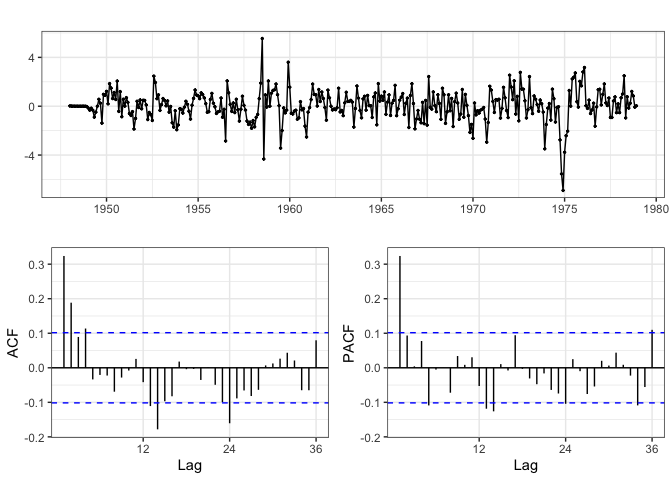<!-- -->


```r
fr_m3.2 = forecast::Arima(prodn, order = c(0,1,0), 
                          seasonal = list(order=c(0,1,2), period=12))
forecast::ggtsdisplay(fr_m3.2$residuals)
```

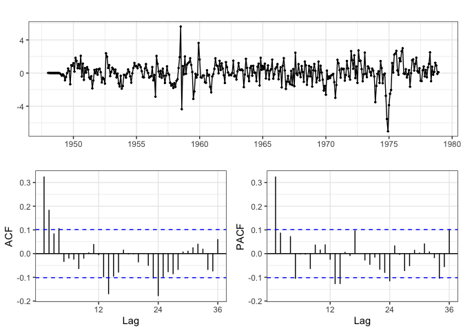<!-- -->

Adding seasonal MA(2) isn't much better than only adding seasonal MA(1). However, still issues with autocorrelation in ACF. We should consider adding AR(2). 

## Adding AR 


```r
fr_m4.1 = forecast::Arima(prodn, order = c(1,1,0), 
                          seasonal = list(order=c(0,1,3), period=12))

forecast::ggtsdisplay(fr_m4.1$residuals, points=FALSE, lag.max = 36)
```

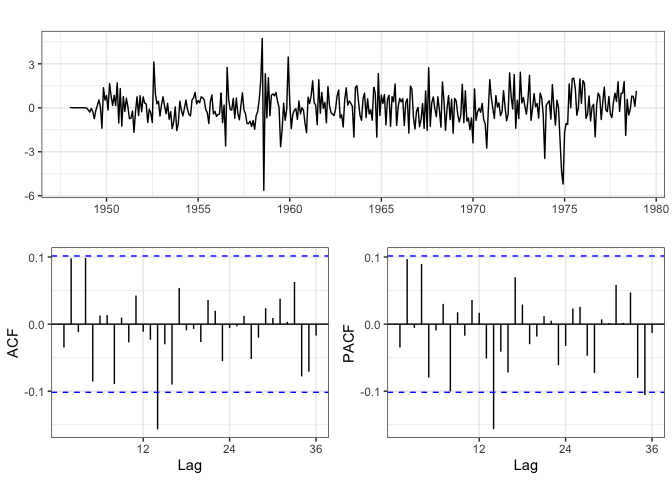<!-- -->


```r
fr_m4.2 = forecast::Arima(prodn, order = c(2,1,0), 
                          seasonal = list(order=c(0,1,3), period=12))

forecast::ggtsdisplay(fr_m4.2$residuals, points=FALSE, lag.max = 36)
```

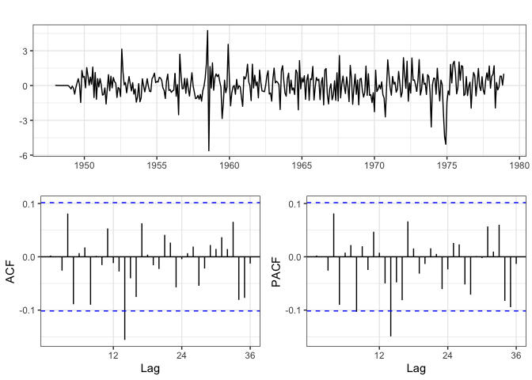<!-- -->

Either AR(1) or AR(2) is fine, we should just stick with AR(1) as it's the more parsimonious model. Issue of heteroscedasticity is resolved too. 

## Model Fit - AR(1), Diff(1), Seasonal Diff(1), Seasonal MA(3)


```r
model_4.1 = "Model 4.1 - forecast::Arima (1,1,0) x (0,1,3)[12]"
rmse_4.1 = (prodn-fr_m4.1$fitted)^2 %>% mean() %>% sqrt() %>% round(3) %>% paste0("      [RMSE: ", . ,"]")

fr_m4.1 %>%
  {data_frame(
    prodn = prodn,
    model = .$fitted,
    time  = time(.$fitted)
  )} %>% 
  tidyr::gather(var, sales, -time) %>%
  mutate(var = forcats::as_factor(var)) %>%
  ggplot(aes(x=time, y=sales, color=var)) + 
  geom_line(alpha=0.75, size=0.8) +
  scale_colour_manual(values=cbPalette, name="") +
  labs(title=paste(model_4.1, rmse_4.1))
```

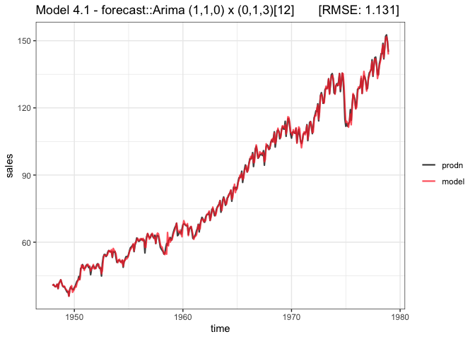<!-- -->

## Forecasting


```r
fr_m4.1 %>%
  forecast::forecast() %>%
  autoplot()
```

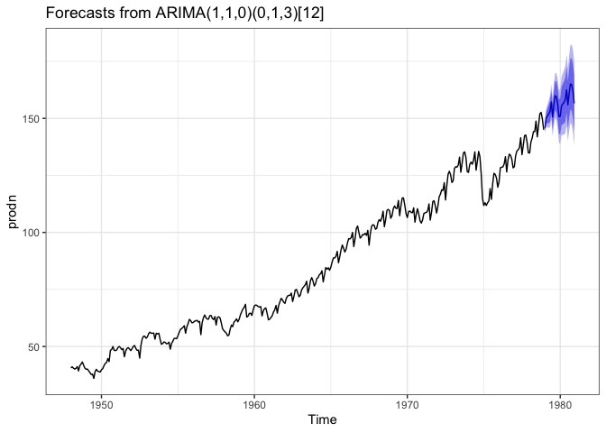<!-- -->

```r
fr_m4.1 %>%
  forecast::forecast() %>%
  autoplot(xlim=c(1976, 1981)) 
```

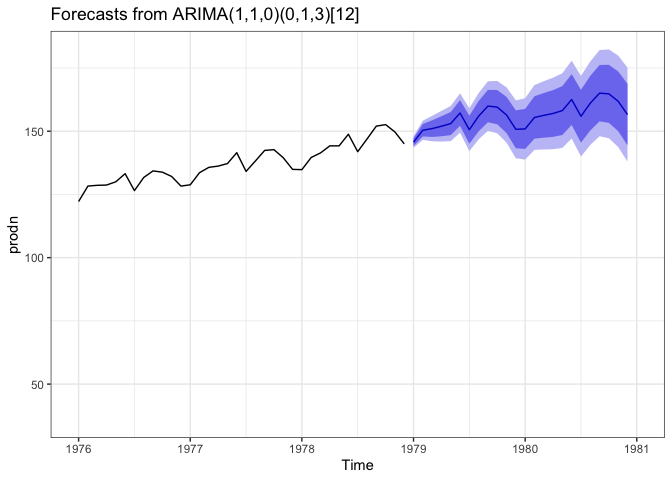<!-- -->

We're getting much more zig-zag in the forecast, because we have a longer lag (i.e. we depend on data for a longer time).


```r
forecast::forecast(fr_m4.1, 120) %>%
  autoplot(xlim=c(1976, 1990)) 
```

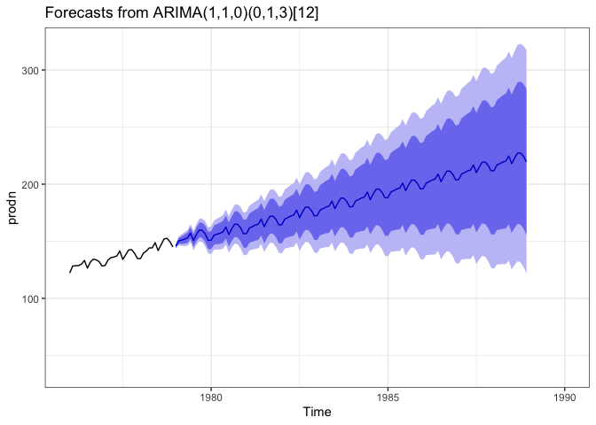<!-- -->

It will eventually "dampen" out (become flat), but will take longer because we depend on larger lags. The uncertainty obviously gets bigger and bigger. 


