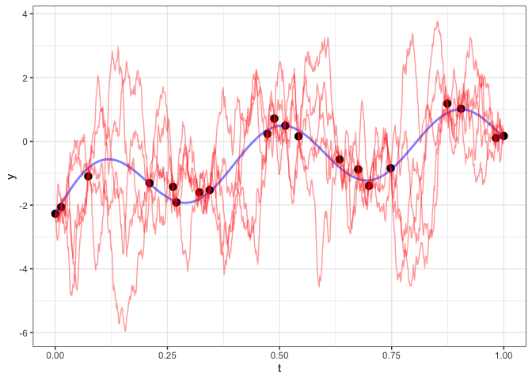
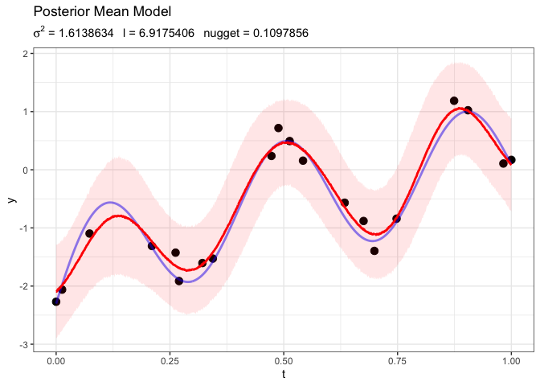

We are shifting to continuous time series, where `t` can take the value of any real-number. 

## Covariance Functions 


```r
exp_cov = function(d, sigma2=1, l=1) sigma2 * exp(-abs(d)*l) 
sq_exp_cov = function(d, sigma2, l=1) sigma2 * exp(-(abs(d)*l)^2)
pow_exp_cov = function(d, sigma2=1, l=1, p) sigma2 * exp(-(abs(d)*l)^p)
```

## Correlation Decay 


```r
source("../util.R")

vals = expand.grid(
  d = seq(0, 1, length.out = 100),
  l = seq(1, 10, length.out = 10)
) %>%
  as.data.frame() %>%
  tbl_df()

covs = rbind(
  mutate(vals, func="exp cov", corr = exp_cov(d,l=l)/exp_cov(0,l=l)),
  mutate(vals, func="sq exp cov", corr = sq_exp_cov(d,l=l)/sq_exp_cov(0,l=l))
)

ggplot(covs, aes(x=d, y=corr, color=as.factor(round(l,1)))) +
  geom_line() +
  facet_wrap(~func, ncol=2) +
  labs(color="range param (l)")
```

<!-- -->


# Gaussian Process Prediction

We have 20 points, each with a time `t` between 0 and 1. We want to predict values for any value of `t` between 0 and 1. If we are only given the black dots, can we fit a line that gives me something that tries to recapture the blue line? 


```r
y_f = function(x) log(x + 0.1) + sin(5*pi*x)

# blue line: true values
d_true = d = data_frame(
  t = seq(0,1,length.out = 1000)
) %>%
  mutate(y = y_f(t) )

# black dots
n = 20
d = data_frame(
  t = seq(0,1,length.out = n) + rnorm(n, sd=0.04)
) %>%
  mutate(t = t - min(t)) %>%
  mutate(t = t / max(t)) %>%
  mutate(y = y_f(t) + rnorm(n,sd=0.2))
```


```r
base = ggplot(d, aes(x=t, y=y)) +
  geom_point(size=3) +
  geom_line(data=d_true, color="blue", alpha=0.5, size=1)
base
```

<!-- -->

```r
save(d, d_true, y_f, base, file="lec12_ex.Rdata")
```

## Prediction - Squared Exponential Covariance 

We want to sample from a multivariate normal: $Y_{pred} \ | \ Y_{obs} \sim N(\mu_{cond}, \Sigma_{cond})$. Use a squared exponential covariance for now. 


```r
sq_exp_cov = function(d, sigma2=1, l=1) sigma2 * exp(-(abs(d)*l)^2)

cond_pred = function(d_pred, d, cov, ..., reps=1000)
{
  # distances for the covariance matrix of multivariate normal density
  
  # observed: value of t for eeach of the black points
  # predicted: any t between 0 and 1
  dist_o  = fields::rdist(d$t)
  dist_p  = fields::rdist(d_pred$t)
  dist_op = fields::rdist(d$t, d_pred$t)
  dist_po = fields::rdist(d_pred$t, d$t)
  
  # points that are close should be correlated, points that are far apart are not correlated 
  cov_o  = cov(dist_o, ...)
  cov_p  = cov(dist_p, ...)
  cov_op = cov(dist_op, ...)
  cov_po = cov(dist_po, ...)
  
  # Quick fix for singularity issues
  diag(cov_o) = diag(cov_o) + 0.000001 
  diag(cov_p) = diag(cov_p) + 0.000001 
  
  # mu for y_pred | y_obs
  cond_mu  = cov_po %*% solve(cov_o) %*% (d$y)
  
  # covariance matrix for y_pred | y_obs
  cond_cov = cov_p - cov_po %*% solve(cov_o) %*% cov_op
  
  # sampling from MVN: Y = mu + Az
  cond_mu %*% matrix(1, ncol=reps) + t(chol(cond_cov)) %*% matrix(rnorm(nrow(d_pred)*reps), ncol=reps)
}

d_pred = data_frame(t = seq(0,1,length.out = 1000))

# stores values drawn from MVN density specified above, draws 1000 times (reps=1000)
y_post = cond_pred(d_pred, d, cov=sq_exp_cov, sigma2 = 10, l = 15, reps=1000)

d_pred = cbind(
  d_pred,
  y_post[,1:5] %>% as.data.frame() %>% setNames(paste0("y",1:5)),
  # summarizing posterior draws 
  MCMCvis::MCMCsummary(t(y_post))
)
```

### Sample 1's Prediction


```r
base + 
  geom_line(data=d_pred, color='red', aes(y=y1), size=1)
```

<!-- -->

The red line is too wiggly, means we probably chose a bad `l` (range parameter). It is also too smooth (bc we chose squared exponential covariance). 

The draws/red lines also HAVE to go through the black points, because these samples are conditioned on the observed values (the black points).

### Sample 2-5 Predictions


```r
base + 
  geom_line(data=d_pred, color='red', aes(y=y1), alpha=0.4, size=0.5) +
  geom_line(data=d_pred, color='red', aes(y=y2), alpha=0.4, size=0.5) +
  geom_line(data=d_pred, color='red', aes(y=y3), alpha=0.4, size=0.5) +
  geom_line(data=d_pred, color='red', aes(y=y4), alpha=0.4, size=0.5) +
  geom_line(data=d_pred, color='red', aes(y=y5), alpha=1.0, size=1)
```

<!-- -->

We get a bunch of smooth curves that pass through the points. Beyond that, there is a LOT of variability. 

### Examining all Posterior Draws w/ 95% Confidence Interval


```r
base + 
  geom_line(data=d_pred, color='red', aes(y=y1), alpha=0.4, size=0.5) +
  geom_line(data=d_pred, color='red', aes(y=y2), alpha=0.4, size=0.5) +
  geom_line(data=d_pred, color='red', aes(y=y3), alpha=0.4, size=0.5) +
  geom_line(data=d_pred, color='red', aes(y=y4), alpha=0.4, size=0.5) +
  geom_line(data=d_pred, color='red', aes(y=y5), alpha=0.4, size=0.5) +
  geom_line(data=d_pred, color='red', aes(y=mean), size=1) +
  geom_ribbon(data=d_pred, fill='red', alpha=0.1, aes(ymin=`2.5%`, ymax=`97.5%`, y=`50%`)) 
```

<!-- -->

We're doing a really bad job and overfitting + underfitting the data. 

## Prediction - Exponential Covariance 


```r
d_pred = data_frame(t = seq(0,1,length.out = 100))
y_post = cond_pred(d_pred, d, cov = exp_cov, sigma2 = 10, l = 10, reps=1000)

d_pred = cbind(
  d_pred,
  y_post[,1:5] %>% as.data.frame() %>% setNames(paste0("y",1:5)),
  MCMCvis::MCMCsummary(t(y_post))
)

base + 
  geom_line(data=d_pred, color='red', aes(y=y1), alpha=0.4, size=0.5) +
  geom_line(data=d_pred, color='red', aes(y=y2), alpha=0.4, size=0.5) +
  geom_line(data=d_pred, color='red', aes(y=y3), alpha=0.4, size=0.5) +
  geom_line(data=d_pred, color='red', aes(y=y4), alpha=0.4, size=0.5) +
  geom_line(data=d_pred, color='red', aes(y=y5), size=1)
```

<!-- -->

These predictions are super jaggy. 

### Posterior Summary 


```r
base + 
  geom_line(data=d_pred, color='red', aes(y=mean), size=1) +
  geom_ribbon(data=d_pred, fill='red', alpha=0.1, aes(ymin=`2.5%`, ymax=`97.5%`, y=`50%`)) 
```

<!-- -->

However, the overall mean of the process looks much better. As we get to a point, variability shrinks. As soon as we leave, the variability skyrockets. 

## Prediction - Powered Exponential Covariance, $p=1.5$


```r
d_pred = data_frame(t = seq(0,1,length.out = 1000))

cov_15 = function(d, sigma2, l) pow_exp_cov(d,sigma2,l, p=1.5)

y_post = cond_pred(d_pred, d, cov = cov_15, sigma2 = 10, l = 15, reps=1000)

d_pred = cbind(
  d_pred,
  y_post[,1:5] %>% as.data.frame() %>% setNames(paste0("y",1:5)),
  MCMCvis::MCMCsummary(t(y_post))
)

base + 
  geom_line(data=d_pred, color='red', aes(y=y1), alpha=0.4, size=0.5) +
  geom_line(data=d_pred, color='red', aes(y=y2), alpha=0.4, size=0.5) +
  geom_line(data=d_pred, color='red', aes(y=y3), alpha=0.4, size=0.5) +
  geom_line(data=d_pred, color='red', aes(y=y4), alpha=0.4, size=0.5) +
  geom_line(data=d_pred, color='red', aes(y=y5), alpha=0.4, size=0.5)
```

<!-- -->

### Posterior Summary


```r
base +   
  geom_line(data=d_pred, color='red', aes(y=mean), size=1) +
  geom_ribbon(data=d_pred, fill='red', alpha=0.1,aes(ymin=`2.5%`, ymax=`97.5%`, y=`50%`)) 
```

<!-- -->

`p` becomes "smoothness" parameter. Larger `p`, more smooth. 

# Tuning Parameters

## Changing the Range (l)


```r
d_pred = data_frame(t = seq(0,1,length.out = 100))

d_pred_l = rbind(
  cbind(
    data_frame(cov="Sq Exp Cov - sigma2=10, l=5"),
    d_pred,
    cond_pred(d_pred, d, cov = sq_exp_cov, sigma2 = 10, l = 5, reps=1000) %>% t() %>% MCMCvis::MCMCsummary()
  ),
  cbind(
    data_frame(cov="Sq Exp Cov - sigma2=10, l=10"),
    d_pred,
    cond_pred(d_pred, d, cov = sq_exp_cov, sigma2 = 10, l = 10, reps=1000) %>% t() %>% MCMCvis::MCMCsummary()
  ),
  cbind(
    data_frame(cov="Sq Exp Cov - sigma2=10, l=15"),
    d_pred,
    cond_pred(d_pred, d, cov = sq_exp_cov, sigma2 = 10, l = 15, reps=1000) %>% t() %>% MCMCvis::MCMCsummary()
  ),
  cbind(
    data_frame(cov="Sq Exp Cov - sigma2=10, l=20"),
    d_pred,
    cond_pred(d_pred, d, cov = sq_exp_cov, sigma2 = 10, l = 20, reps=1000) %>% t() %>% MCMCvis::MCMCsummary()
  )
) %>%
  mutate(cov = forcats::as_factor(cov))

base + 
  geom_line(data=d_pred_l, color='red', aes(y=mean), size=1) +
  geom_ribbon(data=d_pred_l, fill='red', alpha=0.1,aes(ymin=`2.5%`, ymax=`97.5%`, y=`50%`))  +
  facet_wrap(~cov)
```

<!-- -->

`l` tells how quickly correlation decays over distance. 

# Fitting GP Model 

Picking random values of covariance function parameters is pretty bad. 


```r
gp_sq_exp_model = "model{

# multivariate normal, parametrized by precision matrix, NOT covariance matrix
  y ~ dmnorm(mu, inverse(Sigma))

  for (i in 1:N) {
    mu[i] <- 0
  }

# iterating over lower diagonal of covariance matrix 
  for (i in 1:(N-1)) {
    for (j in (i+1):N) {
    # this is covariance function
      Sigma[i,j] <- sigma2 * exp(- pow(l*d[i,j],2))
    # symmetric matrix
      Sigma[j,i] <- Sigma[i,j]
    }
  }

# diagonal values of covariance matrix, to ensure no 0 eigenvalues
  for (k in 1:N) {
    Sigma[k,k] <- sigma2 + 0.00001
  }

# parameters of covariance function, weakly informative priors
  sigma2 ~ dlnorm(0, 1.5) # log normal distribution, need sigma2 to be positive
  l ~ dt(0, 2.5, 1) T(0,) # Half-cauchy(0,2.5), strictly positive
}"
```


```r
m = rjags::jags.model(
  textConnection(gp_sq_exp_model), 
  data = list(
    y = (d$y),
    d = dist(d$t) %>% as.matrix(),
    N = length(d$y)
  )
)
```

```
## Compiling model graph
##    Resolving undeclared variables
##    Allocating nodes
## Graph information:
##    Observed stochastic nodes: 1
##    Unobserved stochastic nodes: 2
##    Total graph size: 1364
## 
## Initializing model
```

```r
update(m, n.iter=5000)

sq_exp_cov_coda = rjags::coda.samples(
  m, variable.names=c("sigma2", "l"),
  n.iter=10000, thin=10
)
```

### Trace Plots 


```r
d_gp = tidybayes::gather_draws(sq_exp_cov_coda, sigma2, l)

d_gp %>%
  ggplot(aes(x=.iteration, y=.value, color=.variable)) + 
  geom_line() + 
  facet_grid(.variable~., scales="free_y")
```

<!-- -->

```r
sq_exp_cov_coda %>% MCMCvis::MCMCsummary() 
```

```
##            mean       sd       2.5%       50%     97.5% Rhat n.eff
## l      24.97439 4.443210 19.1147190 24.060670 35.813822   NA  1000
## sigma2  1.32180 0.471982  0.7101063  1.238074  2.557961   NA  1000
```

### Fitted Model 

Using mean values of `l` and `sigma2` to sample from posterior predictive distribution. 


```r
d_pred = data_frame(t = seq(0,1,length.out = 1000))

d_pred_s = cbind(
    d_pred,
    cond_pred(d_pred, d, cov = sq_exp_cov, l = 24.628061, sigma2 = 1.327826, reps=1000) %>% t() %>% MCMCvis::MCMCsummary() 
  )
  
base + 
  geom_line(data=d_pred_s, color='red', aes(y=mean), size=1) +
  geom_ribbon(data=d_pred_s, fill='red', alpha=0.1, aes(ymin=`2.5%`, ymax=`97.5%`, y=`50%`)) +
  labs(title = "Posterior Mean Model",
       subtitle = expression(paste(sigma^2, " = 1.327826", "\n", "l = 24.628061")))
```

<!-- -->

We're doing a pretty bad job of prediction because we're forcing our fit to go through the points. We want a model that allows for some measurement error. 

# Improving GP Model 


```r
gp_sq_exp_model2 = "model{
  y ~ dmnorm(mu, inverse(Sigma))

  for (i in 1:N) {
    mu[i] <- 0
  }

  for (i in 1:(N-1)) {
    for (j in (i+1):N) {
      Sigma[i,j] <- sigma2 * exp(- pow(l*d[i,j],2))
      Sigma[j,i] <- Sigma[i,j]
    }
  }

  for (k in 1:N) {
    Sigma[k,k] <- sigma2 + nugget # additional source of variability along the diagonal
  }
  
  sigma2 ~ dlnorm(0, 1.5)
  l ~ dt(0, 2.5, 1) T(0,) # Half-cauchy(0,2.5)
  
  nugget ~ dlnorm(0, 1) # should be positive value
}"
```


```r
m2 = rjags::jags.model(
  textConnection(gp_sq_exp_model2), 
  data = list(
    y = (d$y),
    d = dist(d$t) %>% as.matrix(),
    N = length(d$y)
  )
)
```

```
## Compiling model graph
##    Resolving undeclared variables
##    Allocating nodes
## Graph information:
##    Observed stochastic nodes: 1
##    Unobserved stochastic nodes: 3
##    Total graph size: 1364
## 
## Initializing model
```

```r
update(m2, n.iter=5000)

sq_exp_cov_coda2 = rjags::coda.samples(
  m2, variable.names=c("sigma2", "l", "nugget"),
  n.iter=10000, thin=10
)
```


```r
tidybayes::gather_draws(sq_exp_cov_coda2, sigma2, l, nugget) %>%
  ggplot(aes(x = .iteration, y=.value, color=.variable)) + 
  geom_line() + 
  facet_grid(.variable~., scales = "free_y")
```

<!-- -->

```r
sq_exp_cov_coda2 %>% MCMCvis::MCMCsummary() 
```

```
##             mean         sd       2.5%        50%      97.5% Rhat n.eff
## l      6.9278084 1.70999573 4.61512947 6.65911791 11.4502382   NA  1139
## nugget 0.1113265 0.08039757 0.03455459 0.08918655  0.3005313   NA   619
## sigma2 1.5692470 0.80167851 0.58992901 1.39161704  3.5571204   NA  1000
```

Our parameters are often correlated. For example, dips in `l` may lead to spikes in `nugget`. 

### Fitted Model 


```r
cond_pred_fix = function(d_pred, d, cov, ..., nugget, reps=1000)
{
  dist_o  = fields::rdist(d$t)
  dist_p  = fields::rdist(d_pred$t)
  dist_op = fields::rdist(d$t, d_pred$t)
  dist_po = fields::rdist(d_pred$t, d$t)
  
  cov_o  = cov(dist_o, ...)
  cov_p  = cov(dist_p, ...)
  cov_op = cov(dist_op, ...)
  cov_po = cov(dist_po, ...)
  
  # Adding nugget to diagonal
  diag(cov_o) = diag(cov_o) + nugget
  diag(cov_p) = diag(cov_p) + nugget 
  
  cond_mu  = cov_po %*% solve(cov_o) %*% (d$y)
  
  cond_cov = cov_p - cov_po %*% solve(cov_o) %*% cov_op
  
  cond_mu %*% matrix(1, ncol=reps) + t(chol(cond_cov)) %*% matrix(rnorm(nrow(d_pred)*reps), ncol=reps)
}
```


```r
d_pred = data_frame(t = seq(0,1,length.out = 1000))

d_pred_s = cbind(
    data_frame(cov="Post Mean Model"),
    d_pred,
    cond_pred_fix(d_pred, d, cov = sq_exp_cov, l = 6.9175406, sigma2 = 1.6138634, nugget = 0.1097856, reps=5000) %>% 
      t() %>% 
      MCMCvis::MCMCsummary()
  )

base + 
  geom_line(data=d_pred_s, color='red', aes(y=mean), size=1) +
  geom_ribbon(data=d_pred_s, fill='red', alpha=0.1, aes(ymin=`2.5%`, ymax=`97.5%`, y=`50%`)) +
  labs(title = "Posterior Mean Model",
       subtitle = expression(paste(sigma^2, " = 1.6138634", "\n", "l = 6.9175406", "\n", "nugget = 0.1097856")))
```

<!-- -->

The `nugget` makes the fitted model so much better! The model fit no longer has to go through the original data points. The ends have a harder time of predicting because they have less neighbors to rely on for information. 

A GP is a prior on the space of all continuous functions. 
