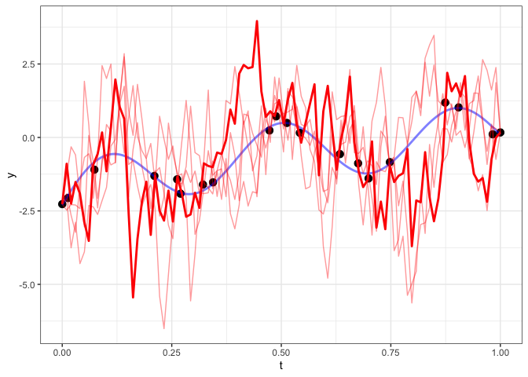

We are shifting to continuous time series, where `t` can take the value of any real-number. 

# Gaussian Process Prediction

We have 20 points, each with a time `t` between 0 and 1. We want to predict values for any value of `t` between 0 and 1. If we are only given the black dots, can we fit a line that gives me something that tries to recapture the blue line? 


```r
y_f = function(x) log(x + 0.1) + sin(5*pi*x)

# blue line: true values
d_true = d = data_frame(
  t = seq(0,1,length.out = 1000)
) %>%
  mutate(y = y_f(t) )

# black dots
n = 20
d = data_frame(
  t = seq(0,1,length.out = n) + rnorm(n, sd=0.04)
) %>%
  mutate(t = t - min(t)) %>%
  mutate(t = t / max(t)) %>%
  mutate(y = y_f(t) + rnorm(n,sd=0.2))
```

## Covariance Functions 


```r
exp_cov = function(d, sigma2=1, l=1) sigma2 * exp(-abs(d)*l) 
sq_exp_cov = function(d, sigma2=1, l=1) sigma2 * exp(-(abs(d)*l)^2)
pow_exp_cov = function(d, sigma2=1, l=1, p=2) sigma2 * exp(-(abs(d)*l)^p)
```


```r
base = ggplot(d, aes(x=t, y=y)) +
  geom_point(size=3) +
  geom_line(data=d_true, color="blue", alpha=0.5, size=1)
base
```

<!-- -->

```r
save(d, d_true, y_f, base, file="lec12_ex.Rdata")
```

## Prediction - Squared Exponential Covariance 

We want to sample from a multivariate normal: $Y_{pred} \ | \ Y_{obs} \sim N(\mu_{cond}, \Sigma_{cond})$. Use a squared exponential covariance for now. 


```r
sq_exp_cov = function(d, sigma2=1, l=1) sigma2 * exp(-(abs(d)*l)^2)

cond_pred = function(d_pred, d, cov, ..., reps=1000)
{
  # distances for the covariance matrix of multivariate normal density
  
  # observed: value of t for eeach of the black points
  # predicted: any t between 0 and 1
  dist_o  = fields::rdist(d$t)
  dist_p  = fields::rdist(d_pred$t)
  dist_op = fields::rdist(d$t, d_pred$t)
  dist_po = fields::rdist(d_pred$t, d$t)
  
  # points that are close should be correlated, points that are far apart are not correlated 
  cov_o  = cov(dist_o, ...)
  cov_p  = cov(dist_p, ...)
  cov_op = cov(dist_op, ...)
  cov_po = cov(dist_po, ...)
  
  # Quick fix for singularity issues
  diag(cov_o) = diag(cov_o) + 0.000001 
  diag(cov_p) = diag(cov_p) + 0.000001 
  
  # mu for y_pred | y_obs
  cond_mu  = cov_po %*% solve(cov_o) %*% (d$y)
  
  # covariance matrix for y_pred | y_obs
  cond_cov = cov_p - cov_po %*% solve(cov_o) %*% cov_op
  
  # sampling from MVN: Y = mu + Az
  cond_mu %*% matrix(1, ncol=reps) + t(chol(cond_cov)) %*% matrix(rnorm(nrow(d_pred)*reps), ncol=reps)
}

d_pred = data_frame(t = seq(0,1,length.out = 1000))

# stores values drawn from MVN density specified above, draws 1000 times (reps=1000)
y_post = cond_pred(d_pred, d, cov=sq_exp_cov, sigma2 = 10, l = 15, reps=1000)

d_pred = cbind(
  d_pred,
  y_post[,1:5] %>% as.data.frame() %>% setNames(paste0("y",1:5)),
  # summarizing posterior draws 
  MCMCvis::MCMCsummary(t(y_post))
)
```

## Sample 1's Prediction


```r
base + 
  geom_line(data=d_pred, color='red', aes(y=y1), size=1)
```

<!-- -->

The red line is too wiggly, means we probably chose a bad `l` (range parameter). It is also too smooth (bc we chose squared exponential covariance). 

The draws/red lines also HAVE to go through the black points, because these samples are conditioned on the observed values (the black points).

## Sample 2-5 Predictions


```r
base + 
  geom_line(data=d_pred, color='red', aes(y=y1), alpha=0.4, size=0.5) +
  geom_line(data=d_pred, color='red', aes(y=y2), alpha=0.4, size=0.5) +
  geom_line(data=d_pred, color='red', aes(y=y3), alpha=0.4, size=0.5) +
  geom_line(data=d_pred, color='red', aes(y=y4), alpha=0.4, size=0.5) +
  geom_line(data=d_pred, color='red', aes(y=y5), alpha=1.0, size=1)
```

<!-- -->

We get a bunch of smooth curves that pass through the points. Beyond that, there is a LOT of variability. 

## Examining all Posterior Draws w/ 95% Confidence Interval


```r
base + 
  geom_line(data=d_pred, color='red', aes(y=y1), alpha=0.4, size=0.5) +
  geom_line(data=d_pred, color='red', aes(y=y2), alpha=0.4, size=0.5) +
  geom_line(data=d_pred, color='red', aes(y=y3), alpha=0.4, size=0.5) +
  geom_line(data=d_pred, color='red', aes(y=y4), alpha=0.4, size=0.5) +
  geom_line(data=d_pred, color='red', aes(y=y5), alpha=0.4, size=0.5) +
  geom_line(data=d_pred, color='red', aes(y=mean), size=1) +
  geom_ribbon(data=d_pred, fill='red', alpha=0.1, aes(ymin=`2.5%`, ymax=`97.5%`, y=`50%`)) 
```

<!-- -->

We're doing a really bad job and overfitting + underfitting the data. 

## Prediction - Exponential Covariance 


```r
d_pred = data_frame(t = seq(0,1,length.out = 100))
y_post = cond_pred(d_pred, d, cov = exp_cov, sigma2 = 10, l = 10, reps=1000)

d_pred = cbind(
  d_pred,
  y_post[,1:5] %>% as.data.frame() %>% setNames(paste0("y",1:5)),
  MCMCvis::MCMCsummary(t(y_post))
)

base + 
  geom_line(data=d_pred, color='red', aes(y=y1), alpha=0.4, size=0.5) +
  geom_line(data=d_pred, color='red', aes(y=y2), alpha=0.4, size=0.5) +
  geom_line(data=d_pred, color='red', aes(y=y3), alpha=0.4, size=0.5) +
  geom_line(data=d_pred, color='red', aes(y=y4), alpha=0.4, size=0.5) +
  geom_line(data=d_pred, color='red', aes(y=y5), size=1)
```

<!-- -->

These predictions are super jaggy. 


```r
base + 
  geom_line(data=d_pred, color='red', aes(y=mean), size=1) +
  geom_ribbon(data=d_pred, fill='red', alpha=0.1, aes(ymin=`2.5%`, ymax=`97.5%`, y=`50%`)) 
```

<!-- -->

However, the overall mean of the process looks much better. As we get to a point, variability shrinks. As soon as we leave, the variability skyrockets. 

## Prediction - Powered Exponential Covariance, $p=1.5$


