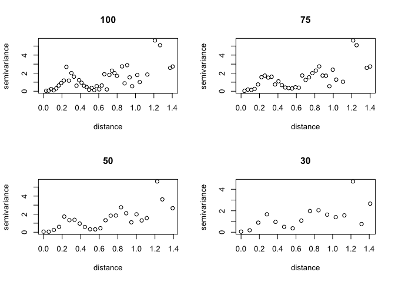

## Covariance Functions 


```r
nugget_cov = function(d, sigma2=1) { ifelse(d==0, sigma2, 0) }
exp_cov = function(d, sigma2=1, l=1, sigma2_w=0) { sigma2 * exp(-abs(d)*l) + nugget_cov(d,sigma2_w) }
sq_exp_cov = function(d, sigma2=1, l=1, sigma2_w=0) { sigma2 * exp(-(abs(d)*l)^2) + nugget_cov(d,sigma2_w) }
pow_exp_cov = function(d, sigma2=1, l=1, p=2) { sigma2 * exp(-(abs(d)*l)^p) }
rquad_cov = function(d, sigma2=1, l=1, a=1) { sigma2 * (1+d^2*l^2/a)^(-a) }
periodic_cov = function(d, sigma2=1, l=1, p=1) { sigma2 * exp(-2*l^2*sin(pi*d/p)^2) }
matern_cov = function(d, sigma2=1, l=1, nu=1/2) { fields::Matern(d, alpha=l, nu=nu, phi=sigma2) }
sphere_cov = function(d, sigma2=1, l=1) { ifelse(d > 1/l, 0, sigma2*(1 - 1.5*d*l + 0.5*(d*l)^3)) }
```

## Semivariogram Functions


```r
exp_sv = function(d, sigma2=1, l=1, sigma2_w=0) { 
  sigma2 + sigma2_w - exp_cov(d,sigma2,l) - nugget_cov(d,sigma2_w) 
}

sq_exp_sv = function(d, sigma2=1, l=1, sigma2_w=0) { 
  sigma2 + sigma2_w - sq_exp_cov(d,sigma2,l) - nugget_cov(d,sigma2_w) 
}

pow_exp_sv = function(d, sigma2=1, l=1, p=2, sigma2_w=0) { 
  sigma2 + sigma2_w - pow_exp_cov(d,sigma2,l,p) - nugget_cov(d,sigma2_w)
}
```


```r
vals = expand.grid(
  d = seq(0, 2, length.out = 100),
  l = seq(1, 7, length.out = 10)
) %>%
  as.data.frame() %>%
  tbl_df()
```

## Covariance vs Semivariogram - Exponential and Squared Exponential Covariance Functions


```r
exp = rbind(
  mutate(vals, func="exp cov", y = exp_cov(d, l=l)),
  mutate(vals, func="exp semivar", y = exp_sv(d, l=l))
) 

sq_exp = rbind(
  mutate(vals, func="sq exp cov", y = sq_exp_cov(d, l=l)),
  mutate(vals, func="sq exp semivar", y = sq_exp_sv(d, l=l))
) 

rbind(exp, sq_exp) %>%
  mutate(l = as.factor(round(l,1))) %>%
  ggplot(aes(x=d, y=y, color=l)) +
  geom_line() +
  facet_wrap(~func, ncol=2) + 
  labs(title=expression(paste(sigma[w]^2, " = 0")))
```

<!-- -->

We are interested in asymptotic properties of these functions. 

# Example from Last Time 


```r
load(file="lec12_ex.Rdata")
base
```

<!-- -->

