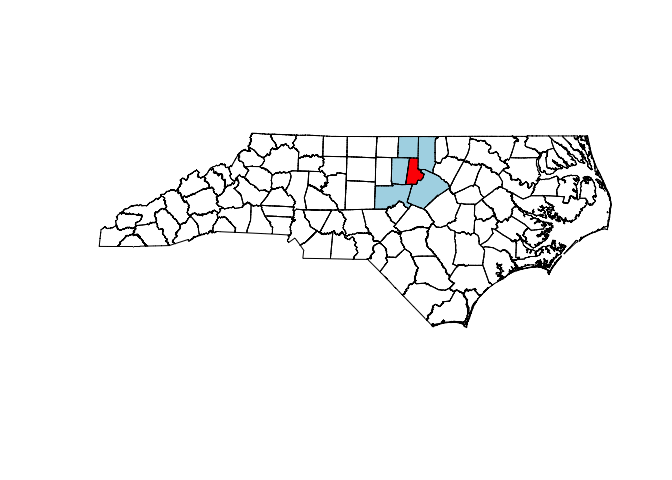

# Logistic Model Example 


```r
set.seed(20180308)
n=200

eta = function(x) 2.5*sin(2.1*pi*(x-0.25)) 

d = data_frame(x=runif(n)) %>%
  mutate(
    eta = eta(x),
    prob = inv_logit(eta(x)),
    y = rbinom(length(x), size=1, prob = inv_logit(eta(x)))
  )

(ggplot(d, aes(x=x, y=eta)) + geom_line() + labs(title="Untransformed") + 
    ggplot(d, aes(x=x, y=prob)) + geom_line() + labs(title="Transformed"))  / 
  (ggplot(d, aes(x=x, y=y)) + geom_jitter(height = 0.05))
```

<!-- -->

### JAGS


```r
logistic_model = "model{
  for(i in 1:length(y)) {
    y[i] ~ dbern(p[i])
    logit(p[i]) = beta0 + w[i]
  }

  w ~ dmnorm(rep(0,length(y)), inverse(Sigma)) # GP, mean 0 multivariate procses

  for (i in 1:(length(y)-1)) {
    for (j in (i+1):length(y)) {
    
    # exponential covariance
    
      Sigma[i,j] = sigma2 * exp(- l * d[i,j]) 
      Sigma[j,i] = Sigma[i,j]
    }
  }

  for (i in 1:length(y)) {
    Sigma[i,i] = sigma2
  }  
  
  beta0 ~ dnorm(0, 1)
  sigma2 = 1/tau
  tau ~ dgamma(1, 2)
  l ~ dunif(3/0.5, 3/0.01)
}"

if (!file.exists("jags_logistic_model.rds")) {
  m_JAGS = rjags::jags.model(
    textConnection(logistic_model),
    data = list(
      y = (d$y),
      d = dist(d$eta) %>% as.matrix()
    )
  )
  
  update(m_JAGS, n.iter=5000)
  
  JAGS_samps = rjags::coda.samples(
    m_JAGS, variable.names=c("beta0", "l", "sigma2"),
    n.iter=10000
  )
  saveRDS(JAGS_samps, file="jags_logistic_model.rds")
} else {
  JAGS_samps = readRDS("jags_logistic_model.rds")
}
```

This takes too long to sample with JAGS. 

### JAGS Model Diagnostics 


```r
tidybayes::gather_draws(JAGS_samps, beta0, l, sigma2) %>%
  filter(row_number() %% 10 == 1) %>%
  mutate(.iteration = floor(.iteration / 10) + 1) %>%
  ggplot(aes(x = .iteration, y = .value, color = .variable)) + 
  geom_line() + 
  facet_grid(.variable~., scales='free_y') +
  guides(color=FALSE)
```

<!-- -->

### spBayes


```r
y = d$y
x = d$x

coords = cbind(x, 0)
n = nrow(coords)

n.batch = 200
batch.length = 100

n.samples = n.batch * batch.length
burnin = n.samples*0.5 + 1
thin = 10

if (!file.exists("logistic_model.rds")) {
  m_spBayes = spBayes::spGLM(
    y~1, family="binomial", coords=coords,
    starting=list("beta"=0, "phi"=3/0.053,"sigma.sq"=1, "w"=0),
    tuning=list("beta"=0.5, "phi"=0.5, "sigma.sq"=0.5, "w"=0.5),
    priors=list("beta.Normal"=list(0,1), "phi.Unif"=c(3/0.5, 3/0.01), "sigma.sq.IG"=c(2, 1)),
    amcmc=list("n.batch"=n.batch, "batch.length"=batch.length, "accept.rate"=0.43),
    cov.model="exponential", verbose=TRUE, n.report=10)
  
  saveRDS(m_spBayes, file="logistic_model.rds")
} else {
  m_spBayes = readRDS("logistic_model.rds")
}
```

### spBayes Model Diagnostics 


```r
mcmc = m_spBayes$p.beta.theta.samples %>% 
  window(start = burnin, thin = thin) %>%
  tidybayes::gather_draws(`(Intercept)`, phi, sigma.sq)

ggplot(mcmc, aes(x=.iteration, y=.value, color=.variable)) +
  geom_line() +
  facet_grid(.variable~., scales = "free_y") +
  guides(color=FALSE)
```

<!-- -->

phi is range parameter 

### spBayes Model Fit 


```r
pred = spBayes::spPredict(m_spBayes, pred.coords = coords, pred.covars = matrix(rep(1,n)), start = burnin, thin=thin, verbose = FALSE)

pred = cbind(
  t(pred$p.w.predictive.samples),
  t(pred$p.y.predictive.samples)
) 
colnames(pred) = c(paste0("eta[",1:n,"]"), paste0("p[",1:n,"]"))

tidybayes::gather_draws(pred, eta[i],p[i]) %>%
  full_join(
    select(d, x) %>% mutate(i = 1:n()),
    by = "i"
  ) %>%
  ungroup() %>%
  mutate(.variable = case_when(
    .variable=="p" ~ "prob",
    TRUE~as.character(.variable))
  ) %>%
  ggplot(aes(x=x, y=.value)) +
  tidybayes::stat_lineribbon(alpha=0.5, color="red") +
  geom_line(data=tidyr::gather(d, .variable, .value, -x, -y), size=2, linetype=2) +
  facet_wrap(~.variable, scales = "free_y")
```

<!-- -->

In the original data, there are a couple of points that are near 0 for `x` = 0.5. This is why the red line dips in the `prob` plot, which drags down the plot. Also, exp covariance function doesn't have to be smooth.

## Model vs GLM


```r
g = glm(y~poly(x,2), data=d, family="binomial")
```

<!-- -->

This GLM has to be smooth because we are fitting a quadratic GLM. However, it can't flatten out at the tails. 

# Spatial Data 


```r
library(sf)
nc  = st_read("data/nc_counties.gpkg", quiet=TRUE, stringsAsFactors=FALSE)
air = st_read("data/airports.gpkg", quiet=TRUE, stringsAsFactors=FALSE)
hwy = st_read("data/us_interstates.gpkg", quiet=TRUE, stringsAsFactors=FALSE)
```


```r
# for each county, there is a multipolygon that contains the boundaries
# geometry: multipolygon
head(tbl_df(nc))
```

```
## # A tibble: 6 x 9
##     AREA PERIMETER COUNTYP010 STATE COUNTY FIPS  STATE_FIPS SQUARE_MIL
##    <dbl>     <dbl>      <dbl> <chr> <chr>  <chr> <chr>           <dbl>
## 1 0.112       1.61       1994 NC    Ashe … 37009 37               429.
## 2 0.0616      1.35       1996 NC    Alleg… 37005 37               236.
## 3 0.140       1.77       1998 NC    Surry… 37171 37               539.
## 4 0.0891      1.43       1999 NC    Gates… 37073 37               342.
## 5 0.0687      4.43       2000 NC    Curri… 37053 37               264.
## 6 0.119       1.40       2001 NC    Stoke… 37169 37               456.
## # … with 1 more variable: geom <MULTIPOLYGON [°]>
```

```r
# geometry: point
head(tbl_df(air))
```

```
## # A tibble: 6 x 17
##   AIRPRTX010 FEATURE ICAO  IATA  AIRPT_NAME CITY  STATE STATE_FIPS COUNTY FIPS 
##        <dbl> <chr>   <chr> <chr> <chr>      <chr> <chr> <chr>      <chr>  <chr>
## 1          0 AIRPORT KGON  GON   GROTON-NE… GROT… CT    09         NEW L… 09011
## 2          3 AIRPORT K6S5  6S5   RAVALLI C… HAMI… MT    30         RAVAL… 30081
## 3          4 AIRPORT KMHV  MHV   MOJAVE AI… MOJA… CA    06         KERN   06029
## 4          6 AIRPORT KSEE  SEE   GILLESPIE… SAN … CA    06         SAN D… 06073
## 5          7 AIRPORT KFPR  FPR   ST LUCIE … FORT… FL    12         ST LU… 12111
## 6          8 AIRPORT KRYY  RYY   COBB COUN… ATLA… GA    13         COBB   13067
## # … with 7 more variables: TOT_ENP <dbl>, LATITUDE <dbl>, LONGITUDE <dbl>,
## #   ELEV <dbl>, ACT_DATE <chr>, CNTL_TWR <chr>, geom <POINT [°]>
```

```r
# geometry: multilinestring
head(tbl_df(hwy))
```

```
## # A tibble: 6 x 4
##   ROUTE_NUM DIST_MILES DIST_KM                                              geom
##   <chr>          <dbl>   <dbl>                             <MULTILINESTRING [m]>
## 1 I10          2449.   3941.   ((-1881200 4072307, -1879922 4072943, -1877750 4…
## 2 I105           20.8    33.4  ((-1910156 5339585, -1910139 5339705, -1909706 5…
## 3 I110           41.4    66.6  ((1054139 3388879, 1054287 3385988, 1054967 3383…
## 4 I115            1.58    2.55 ((-1013796 5284243, -1013138 5283839, -1012546 5…
## 5 I12            85.3   137.   ((680741.7 3366581, 682709.8 3366521, 683440.5 3…
## 6 I124            1.73    2.79 ((1201467 3906285, 1201643 3905927, 1201658 3905…
```

## sf Classes


```r
str(nc)
```

```
## Classes 'sf' and 'data.frame':	100 obs. of  9 variables:
##  $ AREA      : num  0.1118 0.0616 0.1402 0.0891 0.0687 ...
##  $ PERIMETER : num  1.61 1.35 1.77 1.43 4.43 ...
##  $ COUNTYP010: num  1994 1996 1998 1999 2000 ...
##  $ STATE     : chr  "NC" "NC" "NC" "NC" ...
##  $ COUNTY    : chr  "Ashe County" "Alleghany County" "Surry County" "Gates County" ...
##  $ FIPS      : chr  "37009" "37005" "37171" "37073" ...
##  $ STATE_FIPS: chr  "37" "37" "37" "37" ...
##  $ SQUARE_MIL: num  429 236 539 342 264 ...
##  $ geom      :sfc_MULTIPOLYGON of length 100; first list element: List of 1
##   ..$ :List of 1
##   .. ..$ : num [1:1030, 1:2] -81.7 -81.7 -81.7 -81.6 -81.6 ...
##   ..- attr(*, "class")= chr  "XY" "MULTIPOLYGON" "sfg"
##  - attr(*, "sf_column")= chr "geom"
##  - attr(*, "agr")= Factor w/ 3 levels "constant","aggregate",..: NA NA NA NA NA NA NA NA
##   ..- attr(*, "names")= chr  "AREA" "PERIMETER" "COUNTYP010" "STATE" ...
```

`sf` are also data frames. The geometry column is of type `sfc`, list of items. `sfg` are the actual entries, that contain the geometries. 

## Projections


```r
st_crs(hwy) ; st_crs(air)
```

```
## Coordinate Reference System:
##   No user input
##   wkt:
## PROJCS["UTM Zone 15, Northern Hemisphere",
##     GEOGCS["GRS 1980(IUGG, 1980)",
##         DATUM["unknown",
##             SPHEROID["GRS80",6378137,298.257222101],
##             TOWGS84[0,0,0,0,0,0,0]],
##         PRIMEM["Greenwich",0],
##         UNIT["degree",0.0174532925199433]],
##     PROJECTION["Transverse_Mercator"],
##     PARAMETER["latitude_of_origin",0],
##     PARAMETER["central_meridian",-93],
##     PARAMETER["scale_factor",0.9996],
##     PARAMETER["false_easting",500000],
##     PARAMETER["false_northing",0],
##     UNIT["Meter",1]]
```

```
## Coordinate Reference System:
##   No user input
##   wkt:
## GEOGCS["GRS 1980(IUGG, 1980)",
##     DATUM["unknown",
##         SPHEROID["GRS80",6378137,298.257222101],
##         TOWGS84[0,0,0,0,0,0,0]],
##     PRIMEM["Greenwich",0],
##     UNIT["degree",0.0174532925199433]]
```

```r
par(mar=c(3,3,3,0.1), mfrow=c(1,3))
plot(st_geometry(nc),  axes=TRUE, main="nc")
plot(st_geometry(air), axes=TRUE, pch=16, col="blue", main="air")
plot(st_geometry(hwy), axes=TRUE, col="red", main="hwy")
```

<!-- -->


## Example 1 - What counties are adjacent to Durham County? 


```r
# one result for every entry/county in NC
st_touches(
  nc,
  filter(nc, COUNTY == "Durham County")
) %>% str()
```

```
## List of 100
##  $ : int(0) 
##  $ : int(0) 
##  $ : int(0) 
##  $ : int(0) 
##  $ : int(0) 
##  $ : int(0) 
##  $ : int(0) 
##  $ : int(0) 
##  $ : int(0) 
##  $ : int(0) 
##  $ : int 1
##  $ : int(0) 
##  $ : int 1
##  $ : int(0) 
##  $ : int(0) 
##  $ : int(0) 
##  $ : int(0) 
##  $ : int(0) 
##  $ : int(0) 
##  $ : int(0) 
##  $ : int(0) 
##  $ : int(0) 
##  $ : int(0) 
##  $ : int(0) 
##  $ : int(0) 
##  $ : int(0) 
##  $ : int(0) 
##  $ : int(0) 
##  $ : int 1
##  $ : int(0) 
##  $ : int(0) 
##  $ : int(0) 
##  $ : int(0) 
##  $ : int(0) 
##  $ : int(0) 
##  $ : int(0) 
##  $ : int 1
##  $ : int(0) 
##  $ : int(0) 
##  $ : int(0) 
##  $ : int(0) 
##  $ : int(0) 
##  $ : int(0) 
##  $ : int(0) 
##  $ : int(0) 
##  $ : int(0) 
##  $ : int(0) 
##  $ : int(0) 
##  $ : int 1
##  $ : int(0) 
##  $ : int(0) 
##  $ : int(0) 
##  $ : int(0) 
##  $ : int(0) 
##  $ : int(0) 
##  $ : int(0) 
##  $ : int(0) 
##  $ : int(0) 
##  $ : int(0) 
##  $ : int(0) 
##  $ : int(0) 
##  $ : int(0) 
##  $ : int(0) 
##  $ : int(0) 
##  $ : int(0) 
##  $ : int(0) 
##  $ : int(0) 
##  $ : int(0) 
##  $ : int(0) 
##  $ : int(0) 
##  $ : int(0) 
##  $ : int(0) 
##  $ : int(0) 
##  $ : int(0) 
##  $ : int(0) 
##  $ : int(0) 
##  $ : int(0) 
##  $ : int(0) 
##  $ : int(0) 
##  $ : int(0) 
##  $ : int(0) 
##  $ : int(0) 
##  $ : int(0) 
##  $ : int(0) 
##  $ : int(0) 
##  $ : int(0) 
##  $ : int(0) 
##  $ : int(0) 
##  $ : int(0) 
##  $ : int(0) 
##  $ : int(0) 
##  $ : int(0) 
##  $ : int(0) 
##  $ : int(0) 
##  $ : int(0) 
##  $ : int(0) 
##  $ : int(0) 
##  $ : int(0) 
##  $ : int(0) 
##   [list output truncated]
##  - attr(*, "predicate")= chr "touches"
##  - attr(*, "region.id")= chr [1:100] "1" "2" "3" "4" ...
##  - attr(*, "ncol")= int 1
##  - attr(*, "class")= chr "sgbp"
```

```r
# one result 
neighbors = st_touches(
  filter(nc, COUNTY == "Durham County"),
  nc
) %>%
  unlist() %>%
  slice(nc, .)
```

### Base R Plots


```r
plot(st_geometry(nc))
plot(st_geometry(neighbors), add=TRUE, col="lightblue")
plot(st_geometry(nc[nc$COUNTY == "Durham County",]), add=TRUE, col="red")
```

<!-- -->

### ggplot 


```r
ggplot() + 
  geom_sf(data=nc, fill="white") + 
  geom_sf(data=nc %>% filter(COUNTY=="Durham County"), fill="red") + 
  geom_sf(data=neighbors, fill = "lightblue")
```

<!-- -->

## Example 2 - Which counties have more than 4 neighbors? 


```r
lengths = st_touches(nc) %>% # for each county, tells you which counties it neighbors 
  map_int(length)   # calculates how many neighbors for each county

many_neighbors = which(lengths > 4) # gives us indices of counties with more than 4 neighbors

ggplot() + 
  geom_sf(data=nc, fill="white") + 
  geom_sf(data=nc[many_neighbors, ], fill = "lightblue")
```

<!-- -->

## Example 3 - Which counties have an airport? 


```r
# most of these will be 0, but we want to find ones where length > 0
airport_counties = st_intersects(nc, air) %>% map_int(length) %>% {which(. > 0)}

ggplot() + 
  geom_sf(data=nc, alpha = 0) + 
  geom_sf(data=nc[airport_counties, ], fill = "lightblue") + 
  geom_sf(data=air %>% filter(STATE=="NC"), color = "red") 
```

<!-- -->

### Base R plot 


```r
plot(st_geometry(nc))
plot(st_geometry(nc[airport_counties,]), add=TRUE, col="lightblue")
plot(st_geometry(air), add=TRUE, col="red", pch=16)
```

<!-- -->

Issue is that it is giving us airports that are outside NC. 


```r
# giving ONLY airports inside NC 
nc_airports = st_intersection(nc, air)

airport_counties = st_intersects(nc, nc_airports) %>% map_int(length) %>% {which(. > 0)}

plot(st_geometry(nc))
plot(st_geometry(nc[airport_counties,]), add=TRUE, col="lightblue")
plot(st_geometry(nc_airports), add=TRUE, col="red", pch=16)
```

<!-- -->


