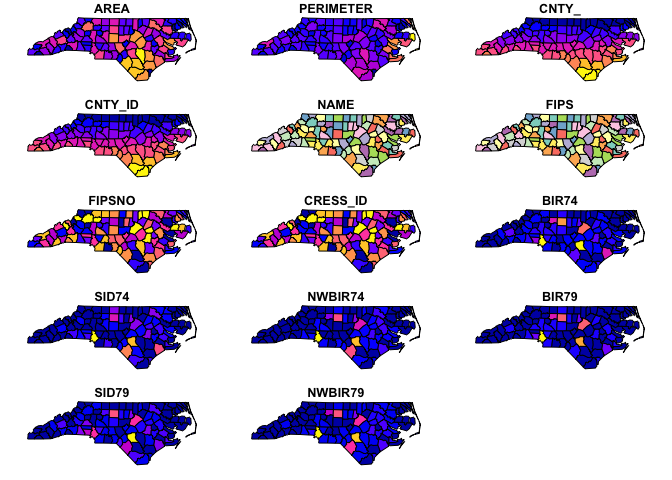

# Plotting 


```r
nc = st_read(system.file('shape/nc.shp', package="sf"))
```

```
## Reading layer `nc' from data source `/Library/Frameworks/R.framework/Versions/3.6/Resources/library/sf/shape/nc.shp' using driver `ESRI Shapefile'
## Simple feature collection with 100 features and 14 fields
## geometry type:  MULTIPOLYGON
## dimension:      XY
## bbox:           xmin: -84.32385 ymin: 33.88199 xmax: -75.45698 ymax: 36.58965
## CRS:            4267
```

Discrete variable = discrete color palette 


```r
plot(nc, max.plot=14)
```

<!-- -->

