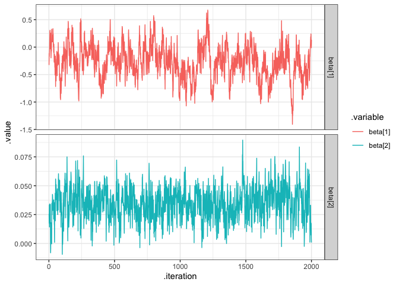
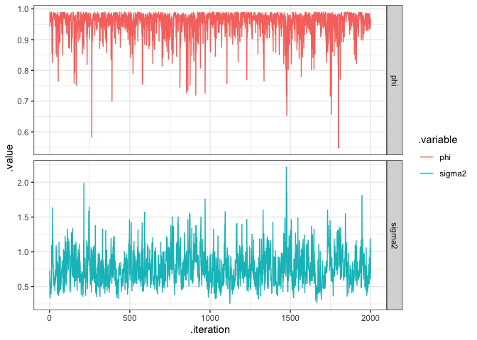
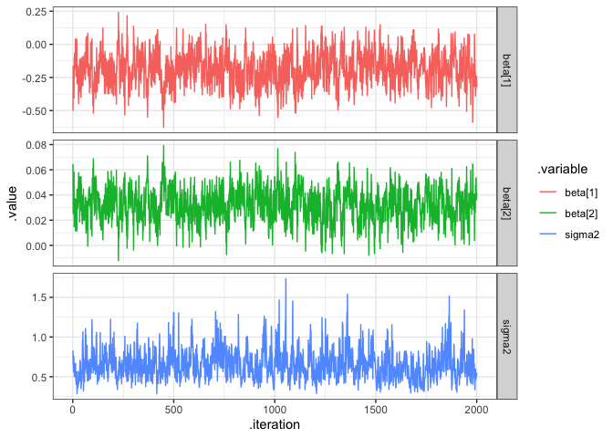

# Spatial GLM - Scottish Lip Cancer Example 

Predicting number of `observed`, which is count data. 

## EDA 


```r
load("data/scottish_lip_cancer.Rdata")

lip_cancer %>%
  tidyr::gather(type, value, Observed,Expected) %>%
  ggplot() + 
  geom_sf(aes(fill = value)) + 
  facet_wrap(~type)
```

<!-- -->

```r
( ggplot(lip_cancer) +
    geom_sf(aes(fill=Observed/Expected), color=NA) + 
    labs(title="Obs/Exp",fill="")
) +
  ( ggplot(lip_cancer) +
      geom_sf(aes(fill=pcaff), color=NA) +
      labs(title="% Agg Fish Forest",fill="")
  )
```

<!-- -->

## Neighborhood / Proximity Matrix 

We want to use the **distance** between regions as our proximity matrix (up to now we've been using `st_touches`).


```r
W = st_distance(lip_cancer)  %>% 
  strip_class() < 1e-6 # makes matrix into T/F
listW = mat2listw(W)

plot(st_geometry(lip_cancer))
plot(listW, st_geometry(st_centroid(lip_cancer)), pch=16, col="blue", add=TRUE)
```

<!-- -->

## Moran's I 


```r
moran.test(lip_cancer$Observed, listW)
```

```
## 
## 	Moran I test under randomisation
## 
## data:  lip_cancer$Observed  
## weights: listW    
## 
## Moran I statistic standard deviate = 4.5416, p-value = 2.792e-06
## alternative hypothesis: greater
## sample estimates:
## Moran I statistic       Expectation          Variance 
##       0.311975396      -0.018181818       0.005284831
```

```r
moran.test(lip_cancer$Observed / lip_cancer$Expected, listW)
```

```
## 
## 	Moran I test under randomisation
## 
## data:  lip_cancer$Observed/lip_cancer$Expected  
## weights: listW    
## 
## Moran I statistic standard deviate = 8.2916, p-value < 2.2e-16
## alternative hypothesis: greater
## sample estimates:
## Moran I statistic       Expectation          Variance 
##       0.589795225      -0.018181818       0.005376506
```

Both of the Moran's I have values above 0, with small p-values, indicating **positive** spatial autocorrelation. 

# GLM 


```r
par(mfrow=c(2,2))
hist((lip_cancer$Expected))
hist((lip_cancer$Observed))
hist(log(lip_cancer$Expected))
hist(log(lip_cancer$Observed))
```

<!-- -->

Both seem to benefit from a log transformation.


```r
glm = glm(Observed ~ offset(log(Expected)) + pcaff,
          data = lip_cancer,
          family = "poisson")
summary(glm)
```

```
## 
## Call:
## glm(formula = Observed ~ offset(log(Expected)) + pcaff, family = "poisson", 
##     data = lip_cancer)
## 
## Deviance Residuals: 
##     Min       1Q   Median       3Q      Max  
## -4.7632  -1.2156   0.0967   1.3362   4.7130  
## 
## Coefficients:
##              Estimate Std. Error z value Pr(>|z|)    
## (Intercept) -0.542268   0.069525   -7.80 6.21e-15 ***
## pcaff        0.073732   0.005956   12.38  < 2e-16 ***
## ---
## Signif. codes:  0 '***' 0.001 '**' 0.01 '*' 0.05 '.' 0.1 ' ' 1
## 
## (Dispersion parameter for poisson family taken to be 1)
## 
##     Null deviance: 380.73  on 55  degrees of freedom
## Residual deviance: 238.62  on 54  degrees of freedom
## AIC: 450.6
## 
## Number of Fisher Scoring iterations: 5
```

## GLM Fit 


```r
lip_cancer = lip_cancer %>%
  mutate(glm_pred = glm$fitted.values,
         glm_resid = Observed - glm_pred)

( ggplot(lip_cancer) +
    geom_sf(aes(fill=Observed), color=NA) + 
    labs(title="Observed Cases",fill="")) +
  ( ggplot(lip_cancer) +
      geom_sf(aes(fill=glm_pred), color=NA) + 
      labs(title="GLM Predicted Cases",fill=""))
```

<!-- -->

It's not doing a great job of predicting the higher regions, and looks  smooth. 

## Residuals 


```r
ggplot(lip_cancer) +
  geom_sf(aes(fill=glm_resid), color=NA) + 
  labs(title="GLM Residuals",
       subtitle = paste0("Moran's I: ", 
                         round(
                           moran.test(lip_cancer$glm_resid, listW)$estimate[1] %>% strip_attrs(), 3),
                         " & RMSE: ",
                         round(lip_cancer$glm_resid %>% .^2 %>% mean() %>% sqrt(), 3)
       )
  )
```

<!-- -->

The residuals look smooth, which is very bad. The Moran's I value also indicates there is still spatial autocorrelation, which is bad. 

# Bayesian Hierarchical Model w/ CAR 

$$\begin{aligned}
y_i &\sim \text{Poisson}(\lambda_i) \\
\\
\log(\lambda_i) &= \log(E_i) + x_i \beta + \omega_i \\
\\
\bf{\omega} &\sim \mathcal{N}(\bf{0},~\sigma^2(\bf{D}-\phi\,\bf{W})^{-1})
\end{aligned}$$


```r
hierarchical_car_model = 
"model{
  for(i in 1:length(y)) {
    y[i] ~ dpois(lambda[i])
    y_pred[i] ~ dpois(lambda[i])
    log(lambda[i]) = log_offset[i] + X[i,] %*% beta + omega[i]
  }

  for(i in 1:2) {
    beta[i] ~ dnorm(0,1)
  }

  omega ~ dmnorm(rep(0,length(y)), tau * (D - phi*W))
  sigma2 = 1/tau
  tau ~ dgamma(2, 2)
  phi ~ dunif(0,0.99)
}"
```


```r
if (!file.exists("hierarchical_car_model.Rdata")) {
  m = rjags::jags.model(
    textConnection(hierarchical_car_model), 
    data = list(
      D = diag(rowSums(W)),
      y = lip_cancer$Observed,
      X = model.matrix(~(lip_cancer$pcaff)),
      W = W,
      log_offset = log(lip_cancer$Expected)
    )
  )
  update(m, n.iter=25000)
  
  hierarchical_car_coda = rjags::coda.samples(
    m, variable.names=c("sigma2","tau", "beta", "omega", "phi", "y_pred"),
    n.iter=50000, thin=25
  )
  save(hierarchical_car_coda, m, file="hierarchical_car_model.Rdata")
} else {
  load("hierarchical_car_model.Rdata")
}
```

## MCMC Diagnostics - Betas


```r
tidybayes::gather_draws(hierarchical_car_coda, beta[i]) %>%
  ungroup() %>%
  mutate(.variable = paste0(.variable, "[", i, "]")) %>%
  ggplot() + 
  geom_line(aes(x = .iteration, y=.value, color = .variable)) + 
  facet_grid(.variable~., scales="free_y")
```

<!-- -->

## MCMC Diagnostics - Phi & Sigma2


```r
tidybayes::gather_draws(hierarchical_car_coda, phi, sigma2) %>%
  ggplot() + 
  geom_line(aes(x = .iteration, y=.value, color = .variable)) + 
  facet_grid(.variable~., scales="free_y")
```

<!-- -->

`phi` is hitting 1 very often, which is indicative of high spatial autocorrelation.

## Prediction - CAR


```r
y_pred = tidybayes::gather_draws(hierarchical_car_coda,y_pred[i])

lip_cancer = lip_cancer %>%
  mutate(
    car_pred = y_pred %>% summarise(mean = mean(.value)) %>% pull(mean),
    car_resid = Observed - car_pred
  )

( ggplot(lip_cancer) +
    geom_sf(aes(fill=Observed), color=NA) + 
    labs(title="Observed Cases",fill="")) +
( ggplot(lip_cancer) +
    geom_sf(aes(fill=car_pred), color=NA) + 
    labs(title="Predicted Cases",fill=""))
```

<!-- -->

The predictions are looking better! (at least the scale looks right)

## Residuals - CAR


```r
ggplot(lip_cancer) +
  geom_sf(aes(fill=car_resid), color=NA) + 
    labs(title="CAR Residuals", 
         subtitle = paste0("Moran's I: ", 
                         round(
                           moran.test(lip_cancer$car_resid, listW)$estimate[1] %>% strip_attrs(), 3),
                         " & RMSE: ",
                         round(lip_cancer$car_resid %>% .^2 %>% mean() %>% sqrt(), 3)
       ))
```

<!-- -->

We're doing much better than the GLM. The Moran's I statistic still indicates barely any spatial autocorrelation. 

# Bayesian Hierarchical Model - Intrinsic Autoregressive Model 

Only difference betwee IAR and CAR is `phi` = 1.


```r
hierarchical_iar_model = 
"model{
  for(i in 1:length(y)) {
    y[i] ~ dpois(lambda[i])
    y_pred[i] ~ dpois(lambda[i])
    log(lambda[i]) = log_offset[i] + X[i,] %*% beta + omega[i]
  }

  for(i in 1:2) {
    beta[i] ~ dnorm(0,1)
  }

  omega_free ~ dmnorm(rep(0,length(y)), tau * (D - W))
  omega = omega_free - mean(omega_free)
  sigma2 = 1/tau
  tau ~ dgamma(2, 2)
}"
```


```r
if (!file.exists("hierarchical_iar_model.Rdata")) {
  m = rjags::jags.model(
    textConnection(hierarchical_iar_model), 
    data = list(
      D = diag(rowSums(W)),
      y = lip_cancer$Observed,
      X = model.matrix(~(lip_cancer$pcaff)),
      W = W,
      log_offset = log(lip_cancer$Expected)
    )
  )
  update(m, n.iter=25000)
  
  hierarchical_iar_coda = rjags::coda.samples(
    m, variable.names=c("sigma2","tau", "beta", "omega", "y_pred"),
    n.iter=50000, thin=25
  )
  save(hierarchical_iar_coda, m, file="hierarchical_iar_model.Rdata")
} else {
  load("hierarchical_iar_model.Rdata")
}
```

## MCMC Diagnostics - IAR


```r
tidybayes::gather_draws(hierarchical_iar_coda, beta[i], sigma2) %>%
  ungroup() %>%
  mutate(.variable = ifelse(is.na(i), .variable, paste0(.variable, "[", i, "]"))) %>%
  ggplot() + 
  geom_line(aes(x = .iteration, y=.value, color = .variable)) + 
  facet_grid(.variable~., scales="free_y")
```

<!-- -->

The chains don't look great. 

## Prediction - IAR


```r
y_pred_iar = tidybayes::gather_draws(hierarchical_iar_coda,y_pred[i])

lip_cancer = lip_cancer %>%
  mutate(
    iar_pred = y_pred_iar %>% summarise(mean = mean(.value)) %>% pull(mean),
    iar_resid = Observed - iar_pred
  )

( ggplot(lip_cancer) +
    geom_sf(aes(fill=Observed), color=NA) + 
    labs(title="Observed Cases",fill="")) +
( ggplot(lip_cancer) +
    geom_sf(aes(fill=iar_pred), color=NA) + 
    labs(title="Predicted Cases",fill=""))
```

<!-- -->

Can't tell if it's better than the CAR

## Residuals - IAR


```r
ggplot(lip_cancer) +
    geom_sf(aes(fill=iar_resid), color=NA) + 
    labs(title="Residuals",
         subtitle = paste0("Moran's I: ", 
                         round(
                           moran.test(lip_cancer$iar_resid, listW)$estimate[1] %>% strip_attrs(), 3),
                         " & RMSE: ",
                         round(lip_cancer$iar_resid %>% .^2 %>% mean() %>% sqrt(), 3)
       )
    )
```

<!-- -->

# Bayesian Hierarchical Model - Intrinsic Autoregressive Model 2


```r
hierarchical_iar_model2 = 
"model{
  for(i in 1:length(y)) {
    y[i] ~ dpois(lambda[i])
    y_pred[i] ~ dpois(lambda[i])
    log(lambda[i]) = log_offset[i] + X[i,] %*% beta + sigma * omega[i]
  }

  for(i in 1:2) {
    beta[i] ~ dnorm(0,1)
  }

  omega_free ~ dmnorm(rep(0,length(y)), (D - W))
  omega = omega_free - mean(omega_free)
  sigma2 = 1/tau
  sigma = sqrt(sigma2)
  tau ~ dgamma(2, 2)
}"
```


```r
if (!file.exists("hierarchical_iar_model2.Rdata")) {
  m = rjags::jags.model(
    textConnection(hierarchical_iar_model2), 
    data = list(
      D = diag(rowSums(W)),
      y = lip_cancer$Observed,
      X = model.matrix(~(lip_cancer$pcaff)),
      W = W,
      log_offset = log(lip_cancer$Expected)
    )
  )
  update(m, n.iter=25000)
  
  hierarchical_iar_coda2 = rjags::coda.samples(
    m, variable.names=c("sigma2","tau", "beta", "omega", "y_pred"),
    n.iter=50000, thin=25
  )
  save(hierarchical_iar_coda2, m, file="hierarchical_iar_model2.Rdata")
} else {
  load("hierarchical_iar_model2.Rdata")
}
```

## MCMC Diagnostics - IAR 2


```r
tidybayes::gather_draws(hierarchical_iar_coda2, beta[i], sigma2) %>%
  ungroup() %>%
  mutate(.variable = ifelse(is.na(i), .variable, paste0(.variable, "[", i, "]"))) %>%
  ggplot() + 
  geom_line(aes(x = .iteration, y=.value, color = .variable)) + 
  facet_grid(.variable~., scales="free_y")
```

<!-- -->

These chains look much much better. 

## Prediction - IAR 2


```r
y_pred_iar2 = tidybayes::gather_draws(hierarchical_iar_coda2,y_pred[i])

lip_cancer = lip_cancer %>%
  mutate(
    iar_pred2 = y_pred_iar2 %>% summarise(mean = mean(.value)) %>% pull(mean),
    iar2_resid = Observed - iar_pred2
  )

( ggplot(lip_cancer) +
    geom_sf(aes(fill=Observed), color=NA) + 
    labs(title="Observed Cases",fill="")) +
( ggplot(lip_cancer) +
    geom_sf(aes(fill=iar_pred2), color=NA) + 
    labs(title="Predicted Cases",fill=""))
```

<!-- -->

## Residuals - IAR 2


```r
ggplot(lip_cancer) +
    geom_sf(aes(fill=iar2_resid), color=NA) + 
    labs(title="Residuals",
         subtitle = paste0("Moran's I: ", 
                         round(
                           moran.test(lip_cancer$iar2_resid, listW)$estimate[1] %>% strip_attrs(), 3),
                         " & RMSE: ",
                         round(lip_cancer$iar2_resid %>% .^2 %>% mean() %>% sqrt(), 3)
       )
    )
```

<!-- -->


```r
lip_cancer %>%
  as_data_frame() %>%
  select(ends_with("resid")) %>% 
  tidyr::gather(model, resid) %>%
  mutate(model = stringr::str_replace(model, "_resid","") %>% 
           forcats::as_factor()) %>%
  group_by(model) %>%
  summarize(
    rmse = resid^2 %>% mean() %>% sqrt(),
    moran = spdep::moran.test(resid, listW)$estimate[1]
  ) 
```

```
## # A tibble: 4 x 3
##   model  rmse   moran
##   <fct> <dbl>   <dbl>
## 1 glm    7.48 0.333  
## 2 car    1.50 0.0371 
## 3 iar    3.20 0.107  
## 4 iar2   1.63 0.00888
```

The CAR model has the lowest RMSE, but the reparametrized IAR has the lowest Moran's I. The best model should be the IAR2. 


