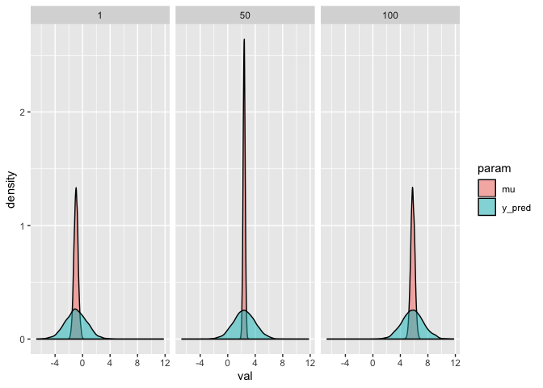
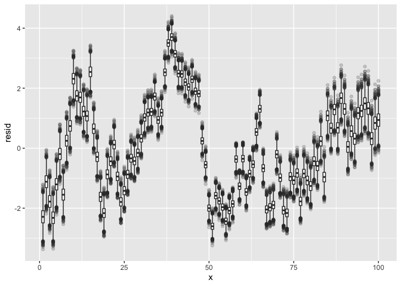
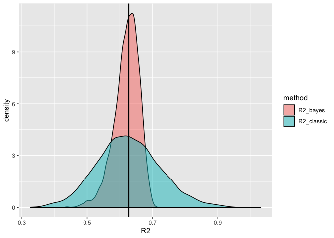

Lecture 2
================
Ethan Shen
5/14/2020

``` r
library(tidyverse)
```

    ## ── Attaching packages ─────────────────────────────────────────────────────────── tidyverse 1.3.0 ──

    ## ✓ ggplot2 3.2.1     ✓ purrr   0.3.3
    ## ✓ tibble  3.0.1     ✓ dplyr   0.8.5
    ## ✓ tidyr   1.0.0     ✓ stringr 1.4.0
    ## ✓ readr   1.3.1     ✓ forcats 0.4.0

    ## Warning: package 'tibble' was built under R version 3.6.2

    ## ── Conflicts ────────────────────────────────────────────────────────────── tidyverse_conflicts() ──
    ## x dplyr::filter() masks stats::filter()
    ## x dplyr::lag()    masks stats::lag()

## Prediction

``` r
set.seed(01232018)
n = 100

d = data_frame(
  x = 1:n,
  y = arima.sim(n=100, list(ar=0.9,sq=1)) %>% as.numeric() + x * 0.07
)
```

    ## Warning: `data_frame()` is deprecated as of tibble 1.1.0.
    ## Please use `tibble()` instead.
    ## This warning is displayed once every 8 hours.
    ## Call `lifecycle::last_warnings()` to see where this warning was generated.

``` r
l = lm(y ~ x, data=d)


# could add mu_pred[i] = beta[1] + beta[2] * x_pred[i]
model_pred = 
"model{
  # Likelihood
  for(i in 1:length(y)){
    mu[i] = beta[1] + beta[2]*x[i]
    y[i] ~ dnorm(mu[i], tau)
    y_pred[i] ~ dnorm(mu[i], tau) # posterior predictive distribution for y
  }

  # Prior for beta
  for(j in 1:2){
    beta[j] ~ dnorm(0,1/100)
  }

  # Prior for sigma / tau2
  tau ~ dgamma(1, 1)
  sigma2 = 1/tau
}"

n_burn = 1000; n_iter = 5000


m_pred = rjags::jags.model(
  textConnection(model_pred), data=d, 
  quiet=TRUE, n.chains = 1
) 

update(m_pred, n.iter=n_burn, progress.bar="none")

pred = rjags::coda.samples(
  m_pred, variable.names=c("beta","sigma2","mu","y_pred","y","x"), 
  n.iter=n_iter, progress.bar="none"
)

df_pred = tidybayes::spread_draws(pred, y_pred[i], y[i], x[i], mu[i]) %>%
  mutate(resid = y - mu)

df_pred
```

    ## # A tibble: 500,000 x 9
    ## # Groups:   i [100]
    ##        i y_pred .chain .iteration .draw     y     x     mu resid
    ##    <int>  <dbl>  <int>      <int> <int> <dbl> <dbl>  <dbl> <dbl>
    ##  1     1 -5.43       1          1     1 -3.24     1 -0.916 -2.32
    ##  2     1 -1.48       1          2     2 -3.24     1 -0.551 -2.69
    ##  3     1 -4.83       1          3     3 -3.24     1 -1.16  -2.08
    ##  4     1 -0.174      1          4     4 -3.24     1 -1.18  -2.06
    ##  5     1 -2.45       1          5     5 -3.24     1 -1.13  -2.11
    ##  6     1 -0.807      1          6     6 -3.24     1 -1.26  -1.98
    ##  7     1 -3.31       1          7     7 -3.24     1 -1.10  -2.14
    ##  8     1  0.165      1          8     8 -3.24     1 -1.17  -2.07
    ##  9     1  1.39       1          9     9 -3.24     1 -0.734 -2.51
    ## 10     1 -1.42       1         10    10 -3.24     1 -0.650 -2.59
    ## # … with 499,990 more rows

``` r
# y_pred: full posterior predictive distribution (distribution of a new observation y_i), using uncertainty of beta1, beta2 and sigma2
# mu: where do we expect point to fall in on average, using uncertainty of beta1, beta2)
df_pred %>% 
  ungroup() %>% 
  filter(i %in% c(1,50,100)) %>% 
  select(i, mu, y_pred) %>% 
  tidyr::gather(param, val, -i) %>%
  ggplot(aes(x=val, fill=param)) + 
  geom_density(alpha=0.5) + 
  facet_wrap(~i)
```

<!-- -->

### Residuals

Important because with spatial-temporal data, we rarely have IID
assumption

``` r
# do not want to see this 
df_pred %>% 
  ungroup() %>%
  ggplot(aes(x=x, y=resid)) + 
  geom_boxplot(aes(group=x), outlier.alpha = 0.2)
```

<!-- -->

## Model Evaluation (Bayesian R^2)

``` r
df_R2 = df_pred %>%
  group_by(.iteration) %>%
  summarize(
    R2_classic = var(mu) / var(y),
    R2_bayes   = var(mu) / (var(mu) + var(resid))
  )

df_R2 %>% 
  tidyr::gather(method, R2, -.iteration) %>%
  ggplot(aes(x=R2, fill=method)) + 
    geom_density(alpha=0.5) +
    geom_vline(xintercept=summary(l)$r.squared, size=1)
```

<!-- -->

Issue…. Bayesian \(R^2 > 1\). Cannot use \(R^2\) in Bayesian context.
