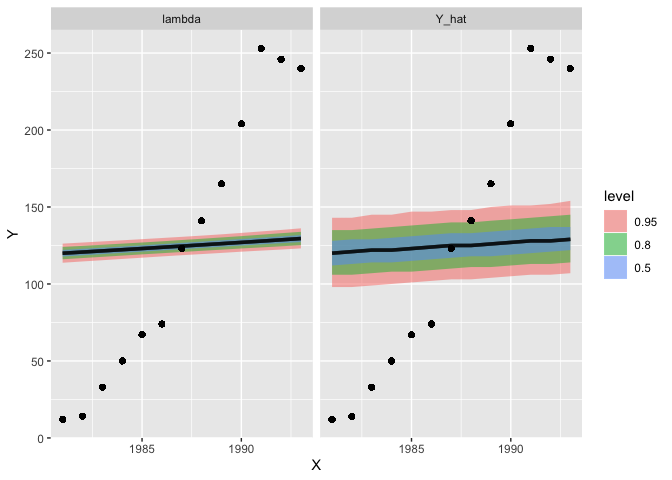
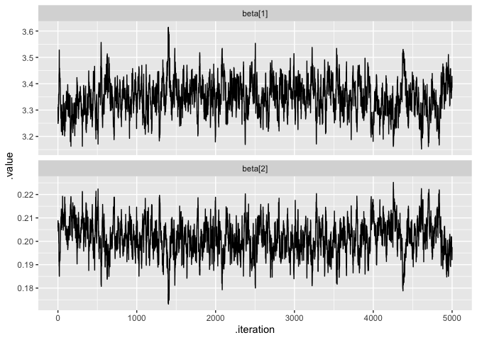

Lec3
================
Ethan Shen
5/14/2020

``` r
library(tidyverse)
```

    ## ── Attaching packages ─────────────────────────────────────────────────────────────────────────────────────────────────────────────────────────── tidyverse 1.3.0 ──

    ## ✓ ggplot2 3.2.1     ✓ purrr   0.3.3
    ## ✓ tibble  3.0.1     ✓ dplyr   0.8.5
    ## ✓ tidyr   1.0.0     ✓ stringr 1.4.0
    ## ✓ readr   1.3.1     ✓ forcats 0.4.0

    ## Warning: package 'tibble' was built under R version 3.6.2

    ## ── Conflicts ────────────────────────────────────────────────────────────────────────────────────────────────────────────────────────────── tidyverse_conflicts() ──
    ## x dplyr::filter() masks stats::filter()
    ## x dplyr::lag()    masks stats::lag()

# GLMs

## Poisson Regression

Biggest issue: mean = variance

``` r
aids = data_frame(
  year = 1981:1993,
  cases = c(12, 14, 33, 50, 67, 74, 123, 141, 165, 204, 253, 246, 240) %>% as.integer()
)
```

    ## Warning: `data_frame()` is deprecated as of tibble 1.1.0.
    ## Please use `tibble()` instead.
    ## This warning is displayed once every 8 hours.
    ## Call `lifecycle::last_warnings()` to see where this warning was generated.

``` r
g = glm(cases~year, data=aids, family=poisson)


dev_resid = function(obs,pred) {
  sign(obs-pred) * sqrt(2*(obs*log(obs/pred)-(obs-pred)))
}

aids = aids %>% 
  mutate(pred = predict(g, newdata=., type = "response")) %>%
  mutate(standard = cases - pred, # standard residual 
         pearson = (cases - pred)/sqrt(pred), # Pearson residual 
         deviance = dev_resid(cases, pred)) # dviance 

aids %>%
  tidyr::gather(type, residual, -year, -cases, -pred) %>%
  mutate(type = forcats::as_factor(type)) %>%
  ggplot(aes(x=year, y=residual, color=type)) +
    geom_point() + geom_segment(aes(xend=year, yend=0)) +
    facet_wrap(~type, scale="free_y") + 
    guides(color=FALSE)
```

<!-- -->

## Updating the Model

``` r
g2 = glm(cases~poly(year, 2), data=aids, family=poisson)

aids = aids %>%
  mutate(pred2 = predict(g2, newdata=., type = "response")) %>%
  mutate(
    standard2 = cases - pred2,
    pearson2  = (cases - pred2)/sqrt(cases),
    deviance2 = dev_resid(cases, pred2)
  )

# in quadratic model, residuals are smaller, less structure in residuals 
aids %>%
  tidyr::gather(type, residual, -year, -cases, -pred, -pred2) %>%
  mutate(type = forcats::as_factor(type)) %>%
  ggplot(aes(x=year, y=residual, color=type)) +
    geom_point() + geom_segment(aes(xend=year, yend=0)) +
    facet_wrap(~type, scale="free_y") + 
    guides(color=FALSE)
```

<!-- -->

## Bayesian Model

``` r
poisson_model = 
"model{
  # Likelihood
  for (i in 1:length(Y)) {
    Y[i] ~ dpois(lambda[i]) # Poisson
    log(lambda[i]) <- beta[1] + beta[2]*X[i] # log link
    
    # In-sample prediction
    Y_hat[i] ~ dpois(lambda[i])
  }
  
  # prior for beta
  for (j in 1:2) {
    beta[j] ~ dnorm(0, 1/100)
  }
}"

n_burn=1000; n_iter=5000

m = rjags::jags.model(
  textConnection(poisson_model), quiet = TRUE,
  data = list(Y=aids$cases, X=aids$year)
)

update(m, n.iter=1000, progress.bar="none")

samp = rjags::coda.samples(
  m, variable.names=c("beta","lambda","Y_hat","Y","X"), 
  n.iter=5000, progress.bar="none"
)
```

### Model Fit

``` r
# terrible 
tidybayes::spread_draws(samp, Y_hat[i], lambda[i], X[i],Y[i]) %>%
  ungroup() %>%
  tidyr::gather(param, value, Y_hat, lambda) %>%
  ggplot(aes(x=X,y=Y)) +
    tidybayes::stat_lineribbon(aes(y=value), alpha=0.5) +
    geom_point() + 
  facet_wrap(~param)
```

<!-- -->

### MCMC Diagnostics

``` r
# neither one is converging, seems like they are dependent
tidybayes::gather_draws(samp, beta[i]) %>%
  mutate(param = paste0(.variable,"[",i,"]")) %>%
  ggplot(aes(x=.iteration, y=.value)) + 
    geom_line() + 
    facet_wrap(~param, ncol=1, scale="free_y")
```

<!-- -->

Model fit is bad, MCMC chain is not well-behaving.

This is bcause the prior is uninformative. In the model, the intercept
is -397 but the coefficient for `year` is 0.2021.

Our prior is \(N(0,10)\), which means values of \(\beta\) will be
between -30 and 30. This works for the `year` coefficient but NOT the
intercept. Will take chain forever to explore the space for the
intercept.

## Fixing Model

``` r
# scaling data
summary(glm(cases~I(year-1981), data=aids, family=poisson))$coefficients
```

    ##                 Estimate  Std. Error  z value      Pr(>|z|)
    ## (Intercept)    3.3427107 0.070920013 47.13353  0.000000e+00
    ## I(year - 1981) 0.2021212 0.007771489 26.00804 4.016408e-149

### Revising JAGS

``` r
poisson_model_revised = 
"model{
  # Likelihood
  for (i in 1:length(Y)) {
    Y[i] ~ dpois(lambda[i]) # Poisson
    log(lambda[i]) <- beta[1] + beta[2]*(X[i] - 1981) # mean-centering data
    
    # In-sample prediction
    Y_hat[i] ~ dpois(lambda[i])
  }
  
  # prior for beta
  for (j in 1:2) {
    beta[j] ~ dnorm(0, 1/100)
  }
}"

m = rjags::jags.model(
  textConnection(poisson_model_revised), quiet = TRUE,
  data = list(Y=aids$cases, X=aids$year)
)

update(m, n.iter=1000, progress.bar="none")

samp2 = rjags::coda.samples(
  m, variable.names=c("beta","lambda","Y_hat","Y","X"), 
  n.iter=5000, progress.bar="none"
)
```

``` r
#y_hat is posterior predictive
tidybayes::spread_draws(samp2, Y_hat[i], lambda[i], X[i],Y[i]) %>%
  ungroup() %>%
  tidyr::gather(param, value, Y_hat, lambda) %>%
  ggplot(aes(x=X,y=Y)) +
    tidybayes::stat_lineribbon(aes(y=value), alpha=0.5) +
    geom_point() + 
  facet_wrap(~param)
```

<!-- -->

``` r
tidybayes::gather_draws(samp2, beta[i]) %>%
  mutate(param = paste0(.variable,"[",i,"]")) %>%
  ggplot(aes(x=.iteration, y=.value)) + 
    geom_line() + 
    facet_wrap(~param, ncol=1, scale="free_y")
```

<!-- -->

Model fit is better & MCMC chain is well-behaving.

However, there are almost 50% of points outside my 95% credible
interval. Empirical coverage for 95% intereval is way off. Example of
over-dispersion: more variability in the model than a Poisson model can
handle.

Quadratic model could fix this.

``` r
tmp = aids %>% select(X=year, standard:deviance) %>%
  tidyr::gather(resid, value, standard:deviance) %>%
  mutate(resid = forcats::as_factor(resid))


tidybayes::spread_samples(samp2, lambda[i], X[i], Y[i]) %>%
  ungroup() %>%
  mutate(
    standard = (Y-lambda),
    pearson  = (Y-lambda) / sqrt(lambda),
    deviance = dev_resid(Y, lambda)
  ) %>%
  tidyr::gather(resid, value, standard:deviance) %>%
  mutate(resid = forcats::as_factor(resid)) %>%
  ggplot(aes(x=as.factor(X),y=value,color=resid)) +
    geom_boxplot(outlier.alpha = 0.1) +
    geom_point(data=tmp, color="black") +
    facet_wrap(~resid, scale="free_y")
```

    ## Warning: 'tidybayes::spread_samples' is deprecated.
    ## Use 'spread_draws' instead.
    ## See help("Deprecated") and help("tidybayes-deprecated").

<!-- -->
