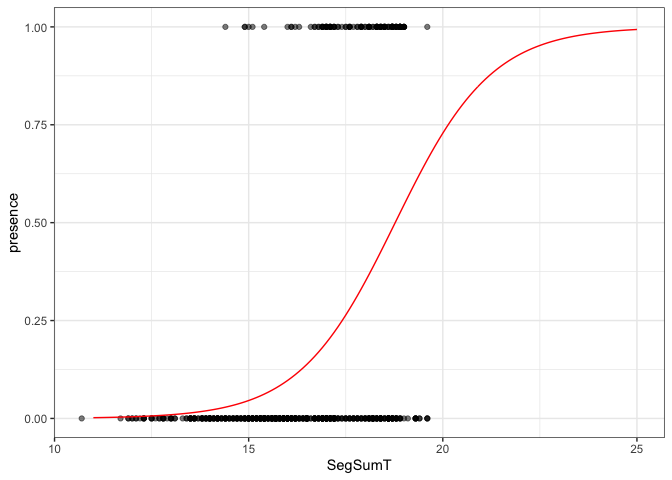
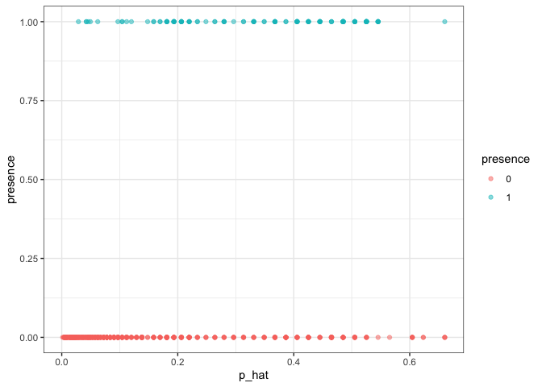
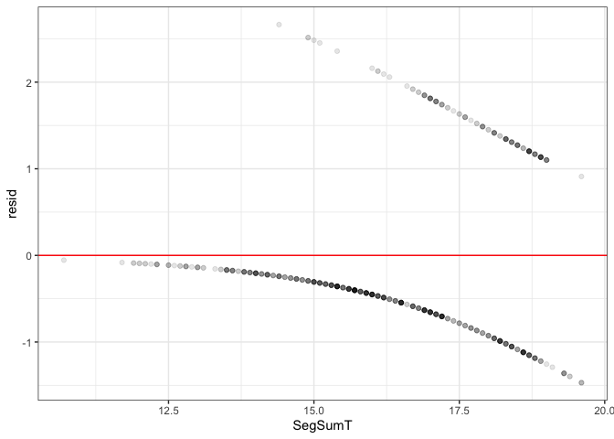
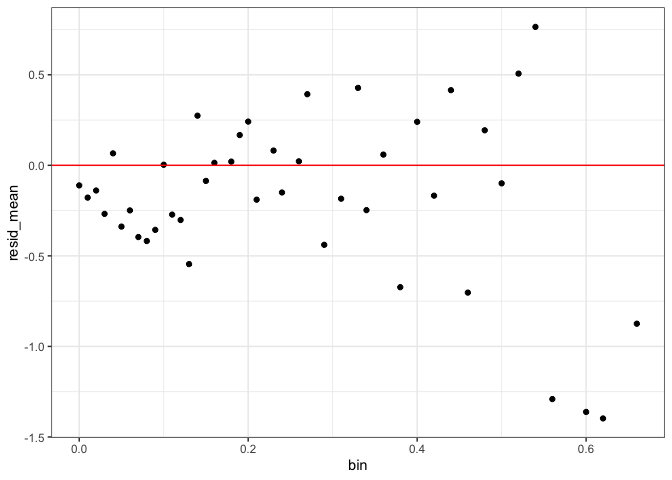

```r
library(tidyverse)
```

```
## ── Attaching packages ───────────────────────────────────────────────────────────────────── tidyverse 1.3.0 ──
```

```
## ✓ ggplot2 3.2.1     ✓ purrr   0.3.3
## ✓ tibble  3.0.1     ✓ dplyr   0.8.5
## ✓ tidyr   1.0.0     ✓ stringr 1.4.0
## ✓ readr   1.3.1     ✓ forcats 0.4.0
```

```
## Warning: package 'tibble' was built under R version 3.6.2
```

```
## ── Conflicts ──────────────────────────────────────────────────────────────────────── tidyverse_conflicts() ──
## x dplyr::filter() masks stats::filter()
## x dplyr::lag()    masks stats::lag()
```

```r
ggplot2::theme_set(ggplot2::theme_bw())
```


```r
load("data/anguilla.Rdata")
set.seed(20180130)

part = modelr::resample_partition(anguilla, c(train=0.75, test=0.25))

anguilla = as.data.frame(part$train) %>% as_tibble()
anguilla_test = as.data.frame(part$test) %>% as_tibble()
```

# GLMs

### Simple Model 


```r
g = glm(presence ~ SegSumT, family=binomial, data=anguilla)
summary(g)
```

```
## 
## Call:
## glm(formula = presence ~ SegSumT, family = binomial, data = anguilla)
## 
## Deviance Residuals: 
##     Min       1Q   Median       3Q      Max  
## -1.4697  -0.6557  -0.3868  -0.1437   2.6647  
## 
## Coefficients:
##              Estimate Std. Error z value Pr(>|z|)    
## (Intercept) -15.11368    1.57498  -9.596   <2e-16 ***
## SegSumT       0.80504    0.08947   8.998   <2e-16 ***
## ---
## Signif. codes:  0 '***' 0.001 '**' 0.01 '*' 0.05 '.' 0.1 ' ' 1
## 
## (Dispersion parameter for binomial family taken to be 1)
## 
##     Null deviance: 621.91  on 616  degrees of freedom
## Residual deviance: 501.14  on 615  degrees of freedom
## AIC: 505.14
## 
## Number of Fisher Scoring iterations: 5
```

### Model Fit 


```r
inv_logit = function(x) 1/(1+exp(-x))

d_g = anguilla %>%
  mutate(p_hat = predict(g, anguilla, type="response"))

d_g_pred = data.frame(SegSumT = seq(11,25,by=0.1)) %>% 
  modelr::add_predictions(g,"p_hat") %>%
  mutate(p_hat = inv_logit(p_hat))
```


```r
ggplot(anguilla, aes(x=SegSumT, y=presence)) +
  geom_point(alpha=0.5) +
  geom_line(data=d_g_pred, aes(y=p_hat), color="red")
```

<!-- -->

Not doing great. 

### Separation


```r
ggplot(d_g, aes(x=p_hat, y=presence, color=as.factor(presence))) +
  geom_point(alpha=0.5) +
  labs(color="presence")
```

<!-- -->

### Residuals 


```r
d_g = d_g %>%
  mutate(resid = resid(g))

ggplot(d_g, aes(x = SegSumT, y=resid)) + 
  geom_point(alpha=0.1) + 
  geom_hline(yintercept = 0, color="red")
```

<!-- -->

A normal residual plot isn't super informative for GLMs. 

### Binned Residuals 


```r
d_g %>%
  mutate(bin = p_hat - (p_hat %% 0.01)) %>%
  group_by(bin) %>%
  summarize(resid_mean = mean(resid)) %>%
  ggplot(aes(y=resid_mean, x=bin)) +
  geom_point() + 
  geom_hline(yintercept = 0, color="red")
```

<!-- -->

