Lecture 4
================
Ethan Shen
5/15/2020

# Random Effects Models

``` r
library(tidyverse)
```

    ## Warning: package 'tibble' was built under R version 3.6.2

``` r
sleep = lme4::sleepstudy %>% tbl_df()

sleep
```

    ## # A tibble: 180 x 3
    ##    Reaction  Days Subject
    ##       <dbl> <dbl> <fct>  
    ##  1     250.     0 308    
    ##  2     259.     1 308    
    ##  3     251.     2 308    
    ##  4     321.     3 308    
    ##  5     357.     4 308    
    ##  6     415.     5 308    
    ##  7     382.     6 308    
    ##  8     290.     7 308    
    ##  9     431.     8 308    
    ## 10     466.     9 308    
    ## # … with 170 more rows

### EDA

``` r
ggplot(sleep, aes(x = Days, y = Reaction)) + 
  geom_point() + 
  facet_wrap(~Subject)
```

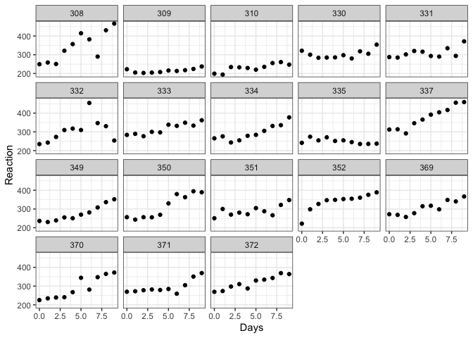<!-- -->

Seems there are a couple outliers (308, 332).

## Bayesian Linear Model

``` r
sleep_lm = "model{
  # likelihood
  for (i in 1:length(y)) {
    y[i] ~ dnorm(mu[i], tau)
    mu[i] = beta[1] + beta[2] * x[i]
    
    y_pred[i] ~ dnorm(mu[i], tau)
  }
  
  # prior on beta
  for (j in 1:2) {
    beta[j] ~ dnorm(0, 1/10000)
  }
  
  # prior on sigma
  sigma ~ dunif(0,100)
  tau = 1/(sigma*sigma)
}"

sleep_m = rjags::jags.model(textConnection(sleep_lm),
                            data = list(x = sleep$Days, y = sleep$Reaction),
                            n.chains = 2)
```

    ## Compiling model graph
    ##    Resolving undeclared variables
    ##    Allocating nodes
    ## Graph information:
    ##    Observed stochastic nodes: 180
    ##    Unobserved stochastic nodes: 183
    ##    Total graph size: 570
    ## 
    ## Initializing model

``` r
update(sleep_m, n.iter = 1000)

sleep_samp = rjags::coda.samples(sleep_m,
                                 variable.names = c("beta", "sigma", "y", "y_pred", "mu"),
                                 n.iter = 5000)
```

#### MCMC Diagnostic

``` r
tidybayes::gather_draws(sleep_samp, beta[i], sigma) %>%
  ungroup() %>%
  mutate(param = ifelse(is.na(i), .variable, paste0(.variable,"[", i, "]"))) %>%
  ggplot(aes(x = .iteration, y = .value, color = as.factor(.chain))) + 
  geom_line(alpha = 0.6) + 
  facet_grid(param~., scales = "free_y")
```

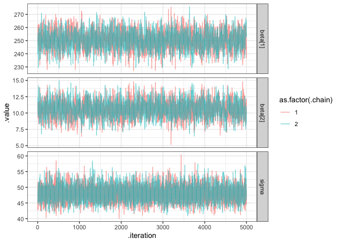<!-- -->

Diagnostic plots look good.

#### Model Fit

``` r
sleep_lm_pred = sleep_samp %>%
  tidybayes::spread_draws(mu[i], y_pred[i]) %>%
  ungroup() %>%
  left_join(
    mutate(sleep, i = 1:n())
  ) %>%
  mutate(resid = Reaction - mu)
```

    ## Joining, by = "i"

``` r
ggplot(sleep, aes(x=Days, y=Reaction)) +
  geom_point() +
  tidybayes::stat_lineribbon(data=sleep_lm_pred, aes(y=y_pred), alpha=0.5) +
  facet_wrap(~Subject)
```

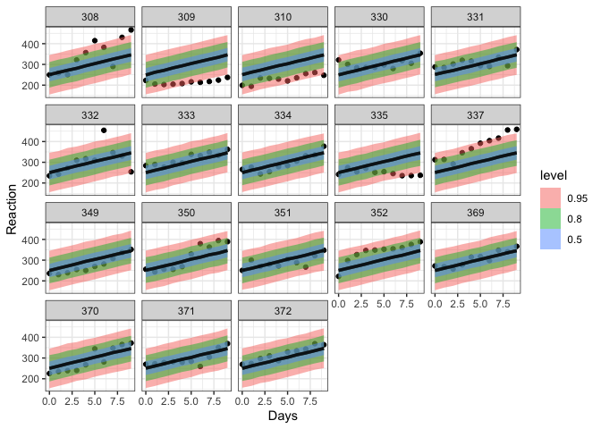<!-- -->

Using `y_pred` (where we expect points to fall, prediction interval
equivalent), not `y_hat` (where we expect line to fall, confidence
interval equivalent).

#### Residuals

``` r
sleep_lm_pred %>%
  group_by(Days, Subject) %>%
  tidybayes::mean_hdi(resid) %>%
  ggplot(aes(x=Days, y=resid, color=Subject)) +
  geom_hline(yintercept=0, color="grey") + 
  geom_point() +
  facet_wrap(~Subject) +
  guides(color=FALSE)
```

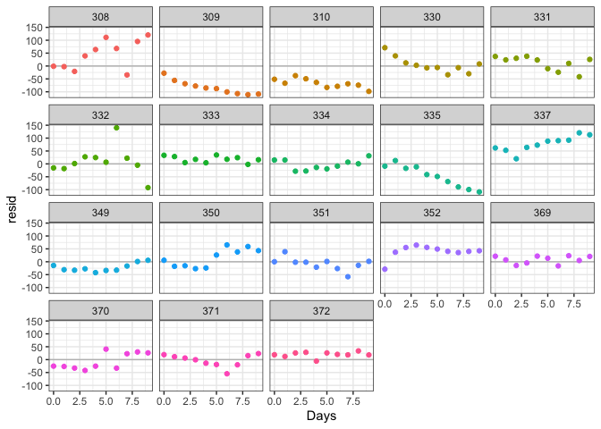<!-- -->

Not great

We want to consider a model that adds in `Subject`

# Fixed Effect Model

``` r
l = lm(Reaction ~ Days + Subject - 1, data=sleep)
summary(l)
```

    ## 
    ## Call:
    ## lm(formula = Reaction ~ Days + Subject - 1, data = sleep)
    ## 
    ## Residuals:
    ##      Min       1Q   Median       3Q      Max 
    ## -100.540  -16.389   -0.341   15.215  131.159 
    ## 
    ## Coefficients:
    ##            Estimate Std. Error t value Pr(>|t|)    
    ## Days        10.4673     0.8042   13.02   <2e-16 ***
    ## Subject308 295.0310    10.4471   28.24   <2e-16 ***
    ## Subject309 168.1302    10.4471   16.09   <2e-16 ***
    ## Subject310 183.8985    10.4471   17.60   <2e-16 ***
    ## Subject330 256.1186    10.4471   24.52   <2e-16 ***
    ## Subject331 262.3333    10.4471   25.11   <2e-16 ***
    ## Subject332 260.1993    10.4471   24.91   <2e-16 ***
    ## Subject333 269.0555    10.4471   25.75   <2e-16 ***
    ## Subject334 248.1993    10.4471   23.76   <2e-16 ***
    ## Subject335 202.9673    10.4471   19.43   <2e-16 ***
    ## Subject337 328.6182    10.4471   31.45   <2e-16 ***
    ## Subject349 228.7317    10.4471   21.89   <2e-16 ***
    ## Subject350 266.4999    10.4471   25.51   <2e-16 ***
    ## Subject351 242.9950    10.4471   23.26   <2e-16 ***
    ## Subject352 290.3188    10.4471   27.79   <2e-16 ***
    ## Subject369 258.9319    10.4471   24.79   <2e-16 ***
    ## Subject370 244.5990    10.4471   23.41   <2e-16 ***
    ## Subject371 247.8813    10.4471   23.73   <2e-16 ***
    ## Subject372 270.7833    10.4471   25.92   <2e-16 ***
    ## ---
    ## Signif. codes:  0 '***' 0.001 '**' 0.01 '*' 0.05 '.' 0.1 ' ' 1
    ## 
    ## Residual standard error: 30.99 on 161 degrees of freedom
    ## Multiple R-squared:  0.9907, Adjusted R-squared:  0.9896 
    ## F-statistic: 901.6 on 19 and 161 DF,  p-value: < 2.2e-16

# Bayesian Random Intercept Model

Different intercept for each `Subject`, so we put some prior
distribution on the intercept.

``` r
# so JAGS knows how to deal with our random-intercept model 
sleep <- sleep %>%
  mutate(Subject_index = as.integer(Subject))
```

\[ y_i = \alpha_{j(i)}+ \beta \times \text{Days} + \epsilon_i \]

\[
\begin{aligned}
\alpha_j &\sim \mathcal{N}(\theta_\alpha,~\nu^2_\alpha)  \\
\\
\theta_{\alpha} &\sim \mathcal{N}(0, 10^4)\\
\nu_\alpha &\sim \text{Unif}(0,10^2)\\
\\
\beta &\sim \mathcal{N}(0, 10^4)\\
\sigma &\sim \text{Unif}(0,10^2)\\
\\
\epsilon_i &\sim \mathcal{N}(0,~\sigma^2) 
\end{aligned}
\]

``` r
sleep_ri = "model{
  for(i in 1:length(Reaction)) {
  
  # Likelihood: same as before 
  
    Reaction[i] ~ dnorm(mu[i],tau)
    mu[i] = alpha[Subject_index[i]] + beta*Days[i]

    y_pred[i] ~ dnorm(mu[i],tau)
  }

# Likelihood for alpha_j's
  for(j in 1:18) {
    alpha[j] ~ dnorm(theta_alpha, nu_alpha)
  }
  
  # Priors for random effects (alpha/intercept)
  
  theta_alpha ~ dnorm(0,1/10000)
  sigma_alpha ~ dunif(0, 100) 
  nu_alpha = 1/(sigma_alpha*sigma_alpha)

  # Priors for fixed effects (slope)
  
  beta ~ dnorm(0,1/10000)
  sigma ~ dunif(0, 100) 
  tau = 1/(sigma*sigma)
}"
```

``` r
m_ri = rjags::jags.model(textConnection(sleep_ri),
                         data = sleep %>% select(-Subject),
                         n.chains = 2)
```

    ## Compiling model graph
    ##    Resolving undeclared variables
    ##    Allocating nodes
    ## Graph information:
    ##    Observed stochastic nodes: 180
    ##    Unobserved stochastic nodes: 202
    ##    Total graph size: 941
    ## 
    ## Initializing model

``` r
update(m_ri, n.iter = 1000)

samps_ri = rjags::coda.samples(m_ri,
                               variable.names = c("y_pred", "mu", 
                                                  "beta", "sigma",
                                                  "alpha", "theta_alpha", "sigma_alpha"),
                               n.iter = 5000)
```

#### MCMC Diagnostics

``` r
tidybayes::gather_draws(samps_ri, beta, sigma, theta_alpha, sigma_alpha) %>%
  ungroup() %>%
  ggplot(aes(x = .iteration, y = .value, color = as.factor(.chain))) + 
  geom_line(alpha = 0.6) +
  labs(title = "Priors") + 
  facet_grid(.variable~., scale = "free_y")
```

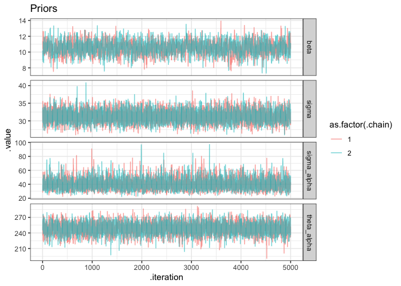<!-- -->

``` r
tidybayes::gather_draws(samps_ri, alpha[j]) %>%
  ungroup() %>%
  mutate(param = paste0(.variable, "[", j, "]")) %>%
  ggplot(aes(x = .iteration, y = .value, color = as.factor(.chain))) + 
  geom_line(alpha = 0.6) + 
  labs(title = "Priors on alpha_j") + 
  facet_wrap(param~., scales = "free_y")
```

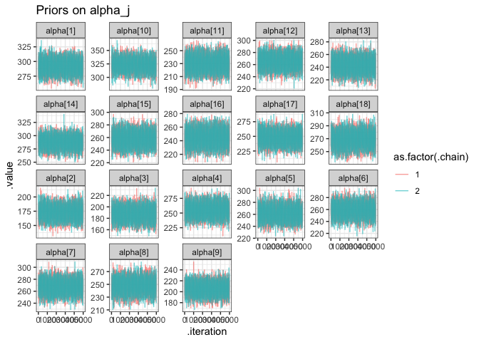<!-- -->

``` r
tidybayes::gather_draws(samps_ri, alpha[j]) %>%
  ungroup() %>%
  ggplot(aes(x = j, y = .value, group = j)) + 
  geom_boxplot() + 
  labs(title = "Distibution of Random Effects")
```

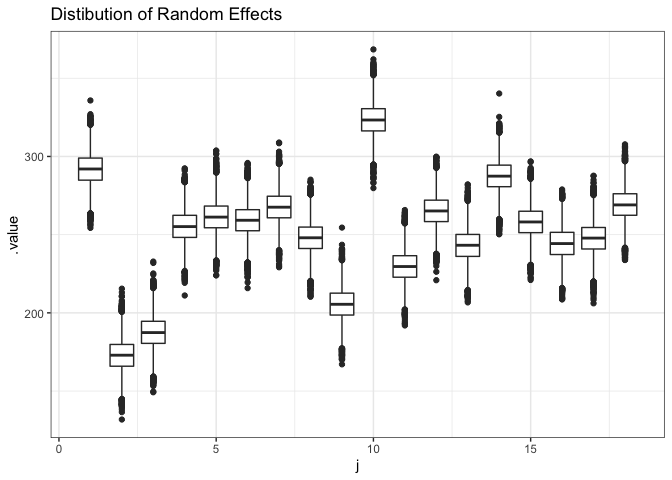<!-- -->

#### Model Fit

``` r
sleep_ri_pred = tidybayes::spread_draws(samps_ri, y_pred[i], mu[i]) %>%
  ungroup() %>%
  left_join(
    mutate(sleep, i = 1:n())
  ) %>%
  mutate(resid = Reaction - mu)
```

    ## Joining, by = "i"

``` r
ggplot(sleep, aes(x = Days, y = Reaction)) + 
  tidybayes::stat_lineribbon(data=sleep_ri_pred, aes(y=y_pred), alpha = 0.6) + 
  geom_point(data=sleep) + 
  facet_wrap(~Subject)
```

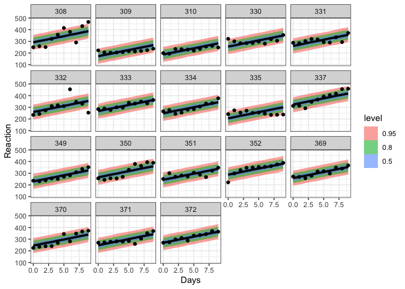<!-- -->

Model fit looks much better (compare 309)

#### Residuals

``` r
sleep_ri_pred %>%
  group_by(Days, Subject) %>%
  tidybayes::mean_hdi(resid) %>%
  ggplot(aes(x=Days, y=resid, color=Subject)) +
  geom_hline(yintercept=0, color="grey") + 
  geom_point() +
  facet_wrap(~Subject) +
  guides(color=FALSE)
```

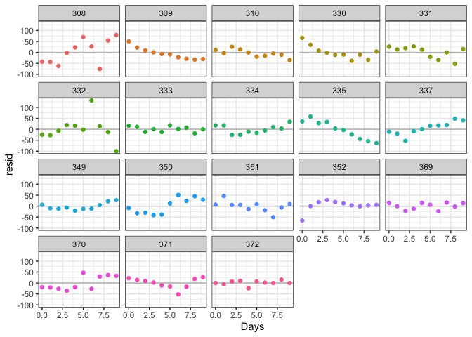<!-- -->

Residuals looks better (compare 309)

# Bayesian Random Intercept Model pt 2

``` r
#strong prior on nu_alpha

sleep_ri2 = "model{
  for(i in 1:length(Reaction)) {
  
  # Likelihood: same as before 
  
    Reaction[i] ~ dnorm(mu[i],tau)
    mu[i] = alpha[Subject_index[i]] + beta*Days[i]

    y_pred[i] ~ dnorm(mu[i],tau)
  }

# Likelihood for alpha_j's
  for(j in 1:18) {
    alpha[j] ~ dnorm(theta_alpha, nu_alpha)
  }
  
  # Priors for random effects (alpha/intercept)
  
  theta_alpha ~ dnorm(0,1/10000)
  sigma_alpha ~ dunif(0, 10) 
  nu_alpha = 1/(sigma_alpha*sigma_alpha)

  # Priors for fixed effects (slope)
  
  beta ~ dnorm(0,1/10000)
  sigma ~ dunif(0, 100) 
  tau = 1/(sigma*sigma)
}"
```

``` r
m_ri2 = rjags::jags.model(textConnection(sleep_ri2),
                         data = sleep %>% select(-Subject),
                         n.chains = 2)
```

    ## Compiling model graph
    ##    Resolving undeclared variables
    ##    Allocating nodes
    ## Graph information:
    ##    Observed stochastic nodes: 180
    ##    Unobserved stochastic nodes: 202
    ##    Total graph size: 942
    ## 
    ## Initializing model

``` r
update(m_ri2, n.iter = 1000)

samps_ri2 = rjags::coda.samples(m_ri2,
                               variable.names = c("y_pred", "mu", 
                                                  "beta", "sigma",
                                                  "alpha", "theta_alpha", "sigma_alpha"),
                               n.iter = 5000)
```

``` r
sleep_ri2_pred = samps_ri2[1] %>%
  tidybayes::spread_draws(y_pred[i], mu[i]) %>%
  ungroup() %>%
  left_join(
    mutate(sleep, i = 1:n())
  ) %>%
  mutate(resid = Reaction - mu)
```

    ## Joining, by = "i"

## Comparing Three Models

``` r
bind_rows(
  sleep_ri_pred %>%
    group_by(Days, Subject) %>%
    tidybayes::mean_hdi(mu) %>%
    ungroup() %>% 
    select(Days, Subject, pred = mu) %>%
    mutate(model="Random Intercept (weak)"),
  sleep %>%
    modelr::add_predictions(l) %>%
    select(-Subject_index, Reaction) %>%
    mutate(model="Fixed Effect"),
  sleep_ri2_pred %>%
    group_by(Days, Subject) %>%
    tidybayes::mean_hdi(mu) %>%
    ungroup() %>% 
    select(Days, Subject, pred = mu) %>%
    mutate(model="Random Intercept (strong)")
) %>%
  ggplot(aes(x=Days, y=pred, color=model)) +
  geom_point(data=sleep, aes(y=Reaction), color="black") +  
  geom_line() +
    facet_wrap(~Subject) + 
      labs(y="Reaction")
```

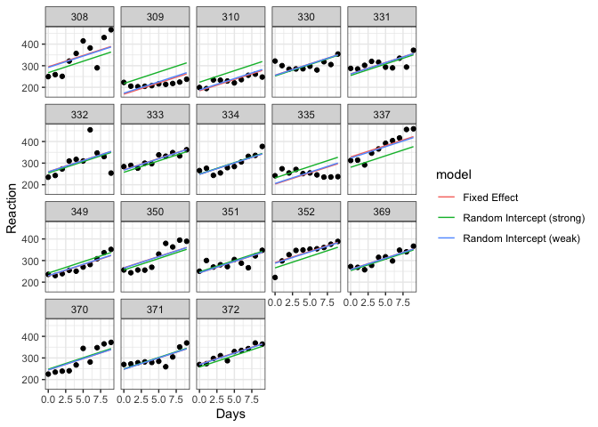<!-- -->

``` r
bind_rows(
  data_frame(
    .variable = paste0("alpha[",1:18,"]") %>%
      forcats::as_factor(),
     .value = coefficients(l)[-1],
    model = "Fixed Effect"
  ),

  samps_ri[1] %>%
    tidybayes::gather_draws(alpha[i]) %>%
    ungroup() %>%
    mutate(.variable = paste0(.variable,"[",i,"]") %>% forcats::as_factor()) %>%
    select(.variable, .value) %>%
    mutate(model = "Random Effect (weak)"),

  samps_ri2[1] %>%
    tidybayes::gather_draws(alpha[i]) %>%
    ungroup() %>%
    mutate(.variable = paste0(.variable,"[",i,"]") %>% forcats::as_factor()) %>%
    select(.variable, .value) %>%
    mutate(model = "Random Effect (strong)")
) %>% 
  mutate(model = forcats::as_factor(model)) %>%
  ggplot(aes(x=.variable, y=.value, color=model)) +
  geom_hline(yintercept = mean(samps_ri[[1]][,"theta_alpha"]), color="#00BA38") + 
    geom_hline(yintercept = mean(samps_ri2[[1]][,"theta_alpha"]), color="#619CFF") + 
    geom_boxplot()
```

    ## Warning: `data_frame()` is deprecated as of tibble 1.1.0.
    ## Please use `tibble()` instead.
    ## This warning is displayed once every 8 hours.
    ## Call `lifecycle::last_warnings()` to see where this warning was generated.

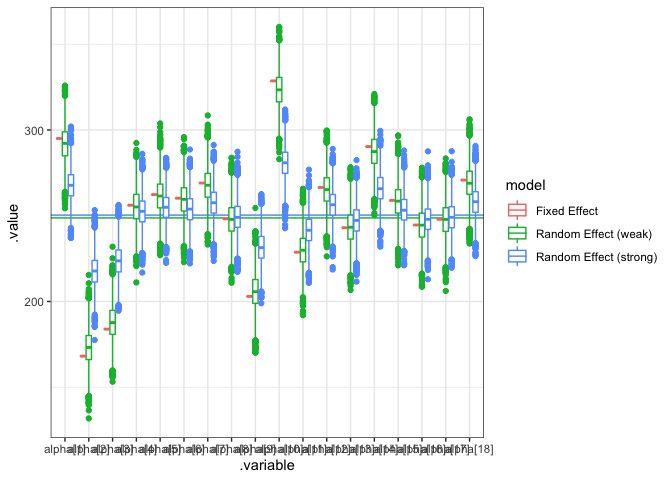<!-- -->
