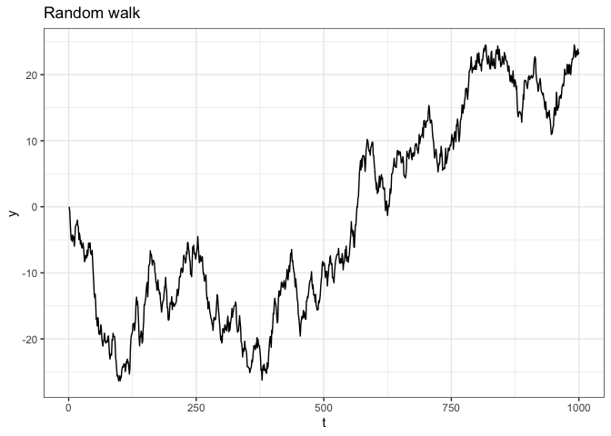
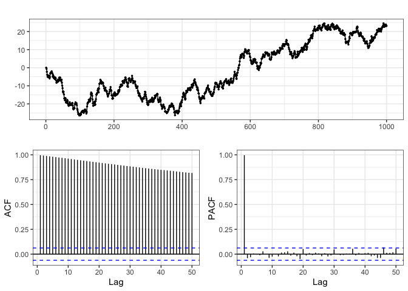
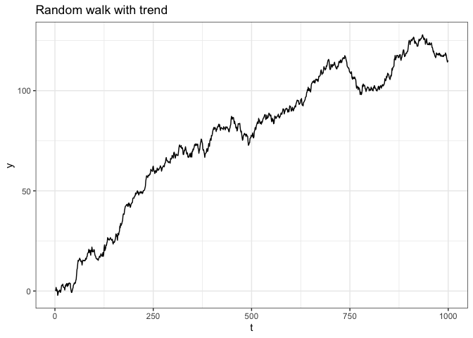
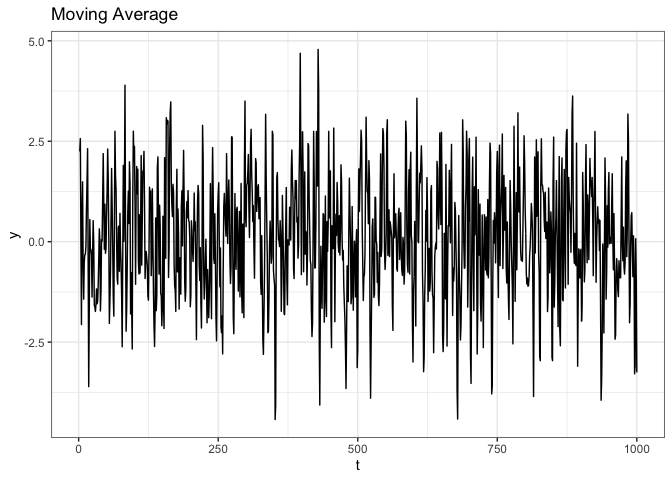
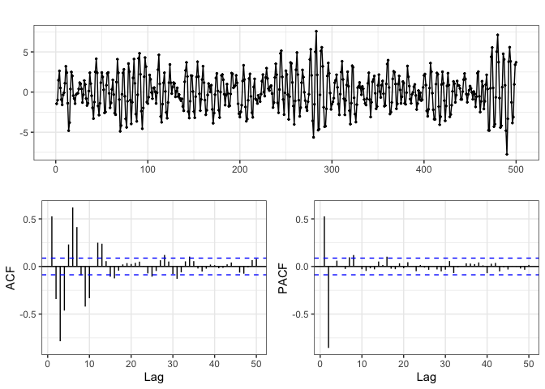
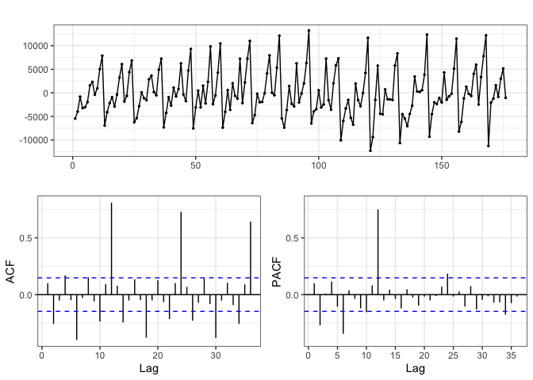

```r
library(tidyverse)
```

## Stationarity 

Strict Stationarity: Joint distributions are identical at different points in time, unnecessarily strong and hard to achieve. 

Weak Stationarity: 

* process has finite variance
* mean of process is constant (mean doesn't depend on time t)
* second moment only depends on lag (covariance cannot depend on time t, can depened on lag )

## Random Walk 

Let $y_t = y_{t-1} + w_t$ with $y_0=0$ and $w_t \sim \mathcal{N}(0,1)$.


```r
rw = data_frame(
  t = 1:1000,
  y = cumsum(c(0, rnorm(999)))
)

ggplot(rw, aes(x=t, y=y)) + geom_line() + labs(title="Random walk")
```

<!-- -->

```r
forecast::ggtsdisplay(rw$y, lag.max = 50)
```

<!-- -->

ACF: Big autocorrelation at first step, but gets smaller and smaller. 

PACF: when i'm looking at correlation between $y_t$ and $y_{t-2}$, we are conditioning on $y_{t-1}$, but we already know $y_{t-1}$

### Check for Stationarity 

Is $y_t$ stationary? 

$y_0 = 0$, $y_1 = w_1$, $y_t = \sum w_i$. We see that $y_i$ are dependent, but $w_i$ are independent. 

Check for stationarity

1. $E(y_i) = E(\sum w_i) = \sum E(w_i) = \sum 0 = 0$, expected value is constant. 
2. $Cov(y_t, y_{t+k}) = \frac{E((y_t -0) (y_{t+k}-0))}{\sigma^2} = E((y_t) (y_{t+k}) = E((w_1 + \dots+w_t)(w_1 + \dots+w_t + \dots + w_{t+k})) = E((\sum_{i=1}^t w_i)(\sum_{j=1}^{t+k} w_j))$

If $i=j$: $E(w_i w_j) = E(w_i ^ 2) = E(w_i)^2 + Var(w_i) = 1 + 0 = 1$

If $i \neq j$: $E(w_i w_j) = E(w_i) E(w_j) = 0 * 0 = 0$

There are $t$ times that $i=j$, so $Cov(y_t, y_{t+k}) = 1 + \dots + 1 = t$. Uncertainty increases with time, so $y_t$ is **NOT stationary**.

## Random Walk with Drift 

Let $y_t = \delta + y_{t-1} + w_t$ with $y_0=0$ and $w_t \sim \mathcal{N}(0,1)$.


```r
rwt = data_frame(
  t = 1:1000,
  y = cumsum(c(0, 0.1+rnorm(999)))
) 

ggplot(rwt, aes(x=t, y=y)) + geom_line() + labs(title="Random walk with trend")
```

<!-- -->

```r
forecast::ggtsdisplay(rwt$y, lag.max = 50)
```

<!-- -->

This random walk increases, but the ACF and PACF are similar (correlation resistant to constant shift)


### Check for Stationarity 

Is $y_t$ stationary? No.

## Moving Average

Let $w_t \sim \mathcal{N}(0,1)$ and $y_t = w_{t-1}+w_t$.

Makes our walk not likely to move (next step could cancel out first step).


```r
ma = data_frame(
  t = 1:1000,
  w = rnorm(1000)
) %>%
  mutate(
    y = (c(NA,w[-1000]) + w)
  )

ggplot(ma, aes(x=t, y=y)) + geom_line() + labs(title="Moving Average")
```

<!-- -->

```r
forecast::ggtsdisplay(ma$y, lag.max = 50, na.action = na.omit)
```

<!-- -->

ACF and PACF look very different from before. in ACF, still see strong correlation at `lag1`, but it disappears quickly. In PACF, pattern is oscillating high, low pattern --> implies moving average. 

### Check for Stationarity 

Is $y_t$ stationary?

1. $E(y_t) = E(w_{t-1}+w_t) = E(w_{t-1}) + E(w_t) = 0 + 0 = 0$.
2. $Cov(y_t, y_{t+k}) = \frac{E((y_t -0) (y_{t+k}-0))}{\sigma^2} = E((y_t) (y_{t+k}) = E((w_{t-1}+w_t)(w_{t+k-1}+w_{t+k}))$.

Consider following cases (FOIL cases)

* If $k=0$, $Cov(y_t, y_{t+k})=2$
* If $k =\pm1$, $Cov(y_t, y_{t+k})=1$
* If $|k| > 1$,  $Cov(y_t, y_{t+k})=0$

Covariance doesn't depend on time $t$, but is not constant. However, it only depends on $k$, so it is weakly stationary. 

## Autoregressive

Let $w_t \sim \mathcal{N}(0,1)$ and $y_t = y_{t-1} - 0.9 y_{t-2} + w_t$ with $y_t = 0$ for $t < 1$.


```r
ar = data_frame(
  t = 1:500,
  w = rnorm(500),
  y = NA
)

for(i in seq_along(ar$w))
{
  if (i == 1)
    ar$y[i] = ar$w[i]
  else if (i==2)
    ar$y[i] = ar$y[i-1] + ar$w[i]
  else
    ar$y[i] = ar$y[i-1] -0.9*ar$y[i-2] + ar$w[i]
}

ggplot(ar, aes(x=t, y=y)) + geom_line() + labs(title="Autoregressive")
```

<!-- -->

```r
forecast::ggtsdisplay(ar$y, lag.max = 50, na.action = na.omit)
```

<!-- -->

Oscillating pattern driven by the -0.9 in formula for $y_t$. 

# Time Series - Australian Wine Sales

Wine sales per month for 15 years. 


```r
aus_wine = forecast::wineind

aus_wine=data.frame(date=time(aus_wine), sales=as.matrix(aus_wine)) 

aus_wine %>%
  ggplot(aes(x = date, y = sales)) + 
  geom_line() + 
  geom_point()
```

<!-- -->


```r
l  = lm(sales ~ date, data=aus_wine)
l2 = lm(sales ~ date + I(date^2), data=aus_wine)

d = aus_wine %>%
  modelr::add_predictions(l, var="linear") %>%
  modelr::add_predictions(l2, var="quadratic")

d %>%
  select(-sales) %>%
  tidyr::gather(model, sales, -date) %>%
  ggplot(aes(x=date, y=sales, color=model)) + 
  geom_line(data=d, color="black") + 
  geom_point(data=d, color="black") +
  geom_line(size=1.5, alpha=0.75) + 
  labs(title = "Model Fit")
```

<!-- -->


```r
d = aus_wine %>%
  modelr::add_residuals(l, var="lin_resid") %>%
  modelr::add_residuals(l2, var="quad_resid")

d %>%
tidyr::gather(type, residual, -(date:sales)) %>%
ggplot(aes(x=date, y=residual, color=type)) + 
  geom_point() +
  geom_line() +
  facet_wrap(~type, nrow=2) +
  labs(title = "Residuals")
```

<!-- -->

There is definitely structure, very similar to the one we see in the EDA (yearly patterns).


```r
forecast::ggtsdisplay(d$quad_resid, lag.max = 36)
```

<!-- -->

We see that there are high correlations at lag 12, 24, 36, etc. --> corresponding to every 12 months 


```r
d_lags = bind_cols(
  d,
  purrr::map_dfc(0:12, ~ list(lag = lag(d$quad_resid, n=.x))) %>% select(-lag)
) %>% 
  tidyr::gather(lag, lag_value, -(date:quad_resid)) %>%
  mutate(lag = forcats::as_factor(lag))

ggplot(d_lags, aes(x=lag_value, y=quad_resid)) +
  geom_point(alpha=0.6) +
  facet_wrap(~lag, ncol=4) +
  geom_smooth(method="lm", color='red', se = FALSE, alpha=0.1) + 
  labs(title = "Original sales vs. sales at lag i")
```

<!-- -->

Very linear trend at lag 12, but not much of a trend at lags 1-11. 

## Autoregressive Errors


```r
# fitting model where lag12 is a predictor
d_ar = mutate(d, lag_12 = lag(quad_resid, 12))
l_ar = lm(quad_resid ~ lag_12, data=d_ar)
summary(l_ar)
```

```
## 
## Call:
## lm(formula = quad_resid ~ lag_12, data = d_ar)
## 
## Residuals:
##      Min       1Q   Median       3Q      Max 
## -12286.5  -1380.5     73.4   1505.2   7188.1 
## 
## Coefficients:
##              Estimate Std. Error t value Pr(>|t|)    
## (Intercept)  83.65080  201.58416   0.415    0.679    
## lag_12        0.89024    0.04045  22.006   <2e-16 ***
## ---
## Signif. codes:  0 '***' 0.001 '**' 0.01 '*' 0.05 '.' 0.1 ' ' 1
## 
## Residual standard error: 2581 on 162 degrees of freedom
##   (12 observations deleted due to missingness)
## Multiple R-squared:  0.7493,	Adjusted R-squared:  0.7478 
## F-statistic: 484.3 on 1 and 162 DF,  p-value: < 2.2e-16
```


```r
d_ar = d_ar %>%
  modelr::add_residuals(l_ar)

d_ar %>%
  ggplot(aes(x=date, y=resid)) +
  geom_point() + 
  geom_line() + 
  labs(title = "Residuals of lag-12 Residuals")
```

<!-- -->

```r
forecast::ggtsdisplay(l_ar$residuals, lag.max = 36)
```

<!-- -->

Still autocorrelation in the residuals (big peaks at 12 months, but still smaller than before), but no addition pattern (nothing at 24 or 36)


```r
bind_cols(
  d_ar %>%
    modelr::add_residuals(l_ar) %>%
    select(-lag_12, -lin_resid, -quad_resid),
  purrr::map_dfc(0:12, ~ list(lag = lag(d_ar$resid, n=.x))) %>% select(-lag)
) %>%
  tidyr::gather(lag, lag_value, -(date:resid)) %>%
  mutate(lag = forcats::as_factor(lag)) %>%
  ggplot(aes(x=lag_value, y=resid)) +
    geom_point() +
    facet_wrap(~lag, ncol=4) +
    geom_smooth(method="lm", color='red', se = FALSE, alpha=0.1)
```

<!-- -->

The lag-12 structure is not there as much anymore (except for the one influential point).
