```r
library(dplyr)
library(ggplot2)
library(forecast)
```

# Lagged Predictors and CCFs

SOI is indicator of development and intensity of El Niño (negative SOI) or La Niña (positive SOI).


```r
library(astsa)
fish = data_frame(
  date = time(astsa::soi),
  soi = astsa::soi,
  recruitment = astsa::rec
)
fish
```

```
## # A tibble: 453 x 3
##    date     soi    recruitment
##    <ts>     <ts>   <ts>       
##  1 1950.000  0.377 68.63      
##  2 1950.083  0.246 68.63      
##  3 1950.167  0.311 68.63      
##  4 1950.250  0.104 68.63      
##  5 1950.333 -0.016 68.63      
##  6 1950.417  0.235 68.63      
##  7 1950.500  0.137 59.16      
##  8 1950.583  0.191 48.70      
##  9 1950.667 -0.016 47.54      
## 10 1950.750  0.290 50.91      
## # … with 443 more rows
```


```r
fish %>%
  tidyr::gather(Variables, value, -date) %>%
  ggplot(aes(x=date, y=value, color=Variables)) +
  geom_line() +
  facet_wrap(~Variables, nrow=2, scale="free_y") +
  ylab("")
```

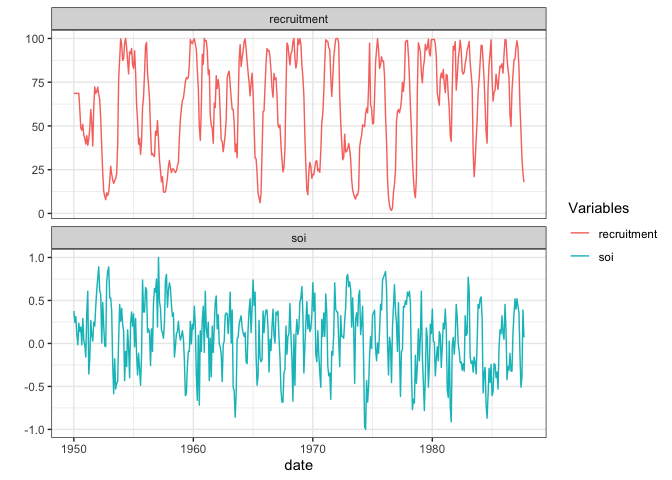<!-- -->

No super obvious cyclical pattern, longer periods of time (not necessarily by year)


```r
fish %>%
  ggplot(aes(x=soi, y=recruitment)) +
  geom_point() + 
  geom_smooth(color="red", alpha=0.5, se=FALSE) + 
  labs(title = "Recruitment vs SOI")
```

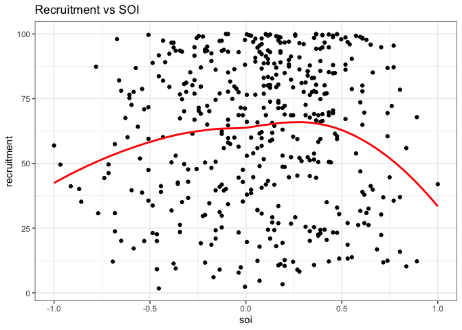<!-- -->


```r
forecast::ggtsdisplay(fish$soi, lag.max = 36)
```

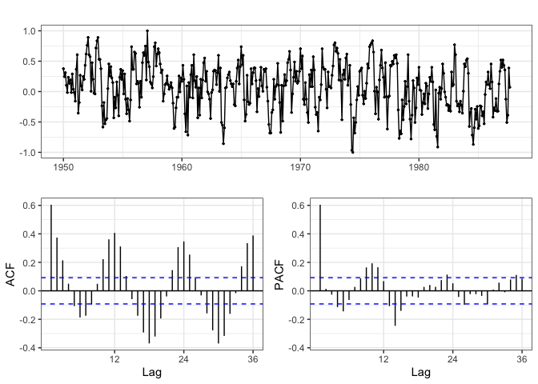<!-- -->

Pretty obvious patterns in the ACF, but unsure what is causing these patterns. 


```r
forecast::ggtsdisplay(fish$recruitment, lag.max = 36)
```

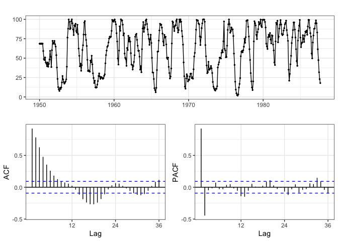<!-- -->

Very strong autocorrelation at one month, pretty strong anti-autocorrelation at two months. 

## Cross Correlation Function

The correlation between two time series. 


```r
with(fish, forecast::ggCcf(soi, recruitment))
```

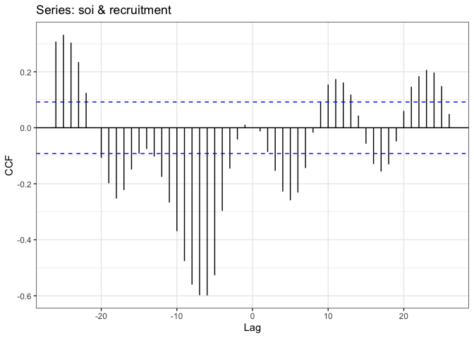<!-- -->


```r
fish_lags = fish %>%
  mutate(
    "lag 0" = lag(as.vector(soi),0),
    "lag 1" = lag(as.vector(soi),1),
    "lag 2" = lag(as.vector(soi),2),
    "lag 3" = lag(as.vector(soi),3),
    "lag 4" = lag(as.vector(soi),4),
    "lag 5" = lag(as.vector(soi),5),
    "lag 6" = lag(as.vector(soi),6),
    "lag 7" = lag(as.vector(soi),7),
    "lag 8" = lag(as.vector(soi),8),
    "lag 9" = lag(as.vector(soi),9),
    "lag 10" = lag(as.vector(soi),10),
    "lag 11" = lag(as.vector(soi),11)
  ) 

corrs = fish_lags %>%
  select(-soi, -date) %>%
  tidyr::gather(lag, soi, -recruitment) %>%
  group_by(lag) %>%
  summarize(corr = cor(soi, recruitment, use="complete.obs"))

fish_lags %>%
  select(-soi, -date) %>%
  tidyr::gather(lag, soi, -recruitment) %>%
  ggplot(aes(x=soi, y=recruitment)) +
  geom_point(alpha=0.3) +
  facet_wrap(~forcats::as_factor(lag)) +
  #geom_line(stat="smooth", method="loess", color='red',  size=1.2, alpha=0.75) +
  geom_line(stat="smooth", method="lm",    color="blue", size=1.2, alpha=0.75) +
  geom_text(data=corrs, aes(x=-0.85, y=5, label=round(corr,3)), size=3)
```

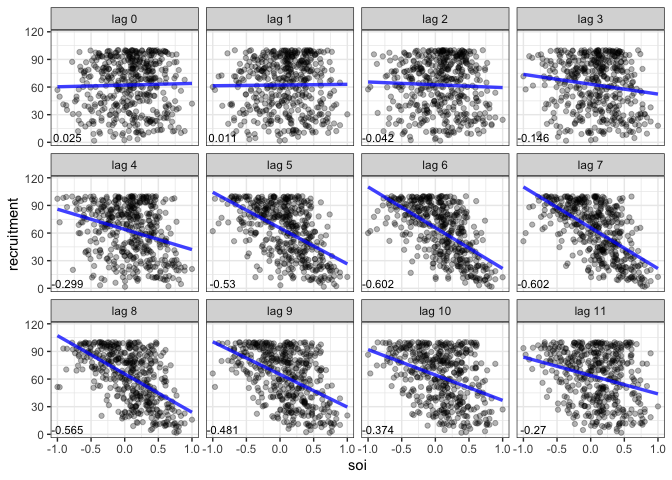<!-- -->

Strong autocorrelations in lag 6 and 7 correspond with CCF plot from above (at -6 and -7).

## Models with Lag 


```r
model1 = lm(recruitment~lag(as.vector(soi),6), data=fish)
model2 = lm(recruitment~lag(as.vector(soi),6)+lag(as.vector(soi),7), data=fish)
model3 = lm(recruitment~lag(as.vector(soi),5)+lag(as.vector(soi),6)+lag(as.vector(soi),7)+lag(as.vector(soi),8), data=fish)

summary(model3)
```

```
## 
## Call:
## lm(formula = recruitment ~ lag(as.vector(soi), 5) + lag(as.vector(soi), 
##     6) + lag(as.vector(soi), 7) + lag(as.vector(soi), 8), data = fish)
## 
## Residuals:
##     Min      1Q  Median      3Q     Max 
## -72.409 -13.527   0.191  12.851  46.040 
## 
## Coefficients:
##                        Estimate Std. Error t value Pr(>|t|)    
## (Intercept)             67.9438     0.9306  73.007  < 2e-16 ***
## lag(as.vector(soi), 5) -19.1502     2.9508  -6.490 2.32e-10 ***
## lag(as.vector(soi), 6) -15.6894     3.4334  -4.570 6.36e-06 ***
## lag(as.vector(soi), 7) -13.4041     3.4332  -3.904 0.000109 ***
## lag(as.vector(soi), 8) -23.1480     2.9530  -7.839 3.46e-14 ***
## ---
## Signif. codes:  0 '***' 0.001 '**' 0.01 '*' 0.05 '.' 0.1 ' ' 1
## 
## Residual standard error: 18.93 on 440 degrees of freedom
##   (8 observations deleted due to missingness)
## Multiple R-squared:  0.5539,	Adjusted R-squared:  0.5498 
## F-statistic: 136.6 on 4 and 440 DF,  p-value: < 2.2e-16
```

## Prediction


```r
fish %>%
  modelr::add_predictions(., model1, var = paste0("Model 1 - soi lag 6 (RMSE: ",        round(modelr::rmse(model1,.),1),")")) %>%
  modelr::add_predictions(., model2, var = paste0("Model 2 - soi lags 6,7 (RMSE: ",     round(modelr::rmse(model2,.),1),")")) %>%
  modelr::add_predictions(., model3, var = paste0("Model 3 - soi lags 5,6,7,8 (RMSE: ", round(modelr::rmse(model3,.),1),")")) %>%
  tidyr::gather(model, pred, -(date:recruitment)) %>%
  ggplot(aes(x=date,y=recruitment)) +
  geom_line() +
  geom_line(aes(y=pred), col="red") +
  facet_wrap(~model,nrow=3)
```

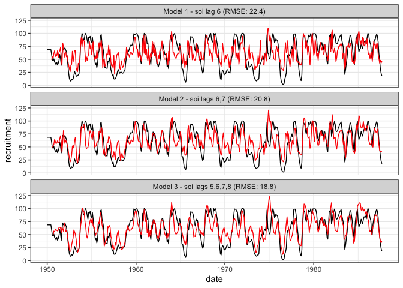<!-- -->

More predictors: we are doing better in terms of RMSE (only marginally better than the original RMSE of 22.4)

## Residual ACF - Model 3


```r
forecast::ggtsdisplay(residuals(model3))
```

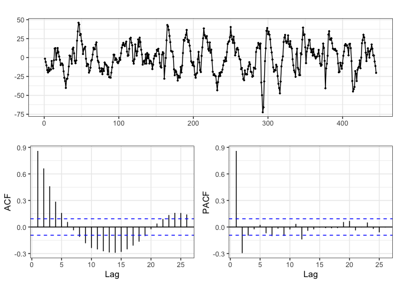<!-- -->

Residual pattern is still structured. Looking at PACF, we see autocorrelation at lag 1, anti-correlation at lag 2. Might be good to add more levels of autocorrelation (at t1 and t2) 

## Autoregressive Model 1


```r
model4 = lm(recruitment~lag(as.vector(recruitment), 1) + lag(as.vector(recruitment), 2) + lag(as.vector(soi),5)+lag(as.vector(soi),6)+lag(as.vector(soi),7)+lag(as.vector(soi),8), data=fish)
summary(model4)
```

```
## 
## Call:
## lm(formula = recruitment ~ lag(as.vector(recruitment), 1) + lag(as.vector(recruitment), 
##     2) + lag(as.vector(soi), 5) + lag(as.vector(soi), 6) + lag(as.vector(soi), 
##     7) + lag(as.vector(soi), 8), data = fish)
## 
## Residuals:
##     Min      1Q  Median      3Q     Max 
## -51.996  -2.892   0.103   3.117  28.579 
## 
## Coefficients:
##                                 Estimate Std. Error t value Pr(>|t|)    
## (Intercept)                     10.25007    1.17081   8.755  < 2e-16 ***
## lag(as.vector(recruitment), 1)   1.25301    0.04312  29.061  < 2e-16 ***
## lag(as.vector(recruitment), 2)  -0.39961    0.03998  -9.995  < 2e-16 ***
## lag(as.vector(soi), 5)         -20.76309    1.09906 -18.892  < 2e-16 ***
## lag(as.vector(soi), 6)           9.71918    1.56265   6.220 1.16e-09 ***
## lag(as.vector(soi), 7)          -1.01131    1.31912  -0.767   0.4437    
## lag(as.vector(soi), 8)          -2.29814    1.20730  -1.904   0.0576 .  
## ---
## Signif. codes:  0 '***' 0.001 '**' 0.01 '*' 0.05 '.' 0.1 ' ' 1
## 
## Residual standard error: 7.042 on 438 degrees of freedom
##   (8 observations deleted due to missingness)
## Multiple R-squared:  0.9385,	Adjusted R-squared:  0.9377 
## F-statistic:  1115 on 6 and 438 DF,  p-value: < 2.2e-16
```

Lags 7 and 8 for SOI don't seem important, so we can drop them. 

## Autoregressive Model 2


```r
model5 = lm(recruitment~lag(as.vector(recruitment), 1) + lag(as.vector(recruitment), 2) + lag(as.vector(soi),5)+lag(as.vector(soi),6), data=fish)
summary(model5)
```

```
## 
## Call:
## lm(formula = recruitment ~ lag(as.vector(recruitment), 1) + lag(as.vector(recruitment), 
##     2) + lag(as.vector(soi), 5) + lag(as.vector(soi), 6), data = fish)
## 
## Residuals:
##     Min      1Q  Median      3Q     Max 
## -53.786  -2.999  -0.035   3.031  27.669 
## 
## Coefficients:
##                                 Estimate Std. Error t value Pr(>|t|)    
## (Intercept)                      8.78498    1.00171   8.770  < 2e-16 ***
## lag(as.vector(recruitment), 1)   1.24575    0.04314  28.879  < 2e-16 ***
## lag(as.vector(recruitment), 2)  -0.37193    0.03846  -9.670  < 2e-16 ***
## lag(as.vector(soi), 5)         -20.83776    1.10208 -18.908  < 2e-16 ***
## lag(as.vector(soi), 6)           8.55600    1.43146   5.977 4.68e-09 ***
## ---
## Signif. codes:  0 '***' 0.001 '**' 0.01 '*' 0.05 '.' 0.1 ' ' 1
## 
## Residual standard error: 7.069 on 442 degrees of freedom
##   (6 observations deleted due to missingness)
## Multiple R-squared:  0.9375,	Adjusted R-squared:  0.937 
## F-statistic:  1658 on 4 and 442 DF,  p-value: < 2.2e-16
```

## Prediction of New Models


```r
fish %>%
  modelr::add_predictions(., model3, var = paste0("Model 3 - soi lags 5,6,7,8 (RMSE: ",        round(modelr::rmse(model3,.),2),")")) %>%
  modelr::add_predictions(., model4, var = paste0("Model 4 - AR(2); soi lags 5,6,7,8 (RMSE: ", round(modelr::rmse(model4,.),2),")")) %>%
  modelr::add_predictions(., model5, var = paste0("Model 5 - AR(2); soi lags 5,6 (RMSE: ",     round(modelr::rmse(model5,.),2),")")) %>%
  tidyr::gather(model, pred, -(date:recruitment)) %>%
  ggplot(aes(x=date,y=recruitment)) +
  geom_line() +
  geom_line(aes(y=pred), col="red") +
  facet_wrap(~model,nrow=3)
```

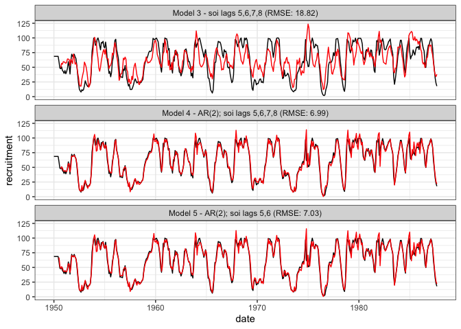<!-- -->

AR models fall down in prediction. As soon as we predict past our data, AR models struggle. 

## Residual ACF - Model 5


```r
forecast::ggtsdisplay(residuals(model5))
```

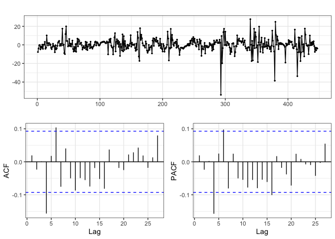<!-- -->

ACF and PACF looks much better. 

# AR(1) Models

$$Random \, Walk: y_t = \delta + y_{t-1} + w_t$$ 

$$AR(1):  y_t = \delta + \phi \, y_{t-1} + w_t $$

What does the choice of $\phi$ do for our random walk? 


```r
delta = 0.1
phi1 = 0.9
phi2 = 1.01

ar1 = data_frame(
  t = 1:500,
  y1 = 0,
  y2 = 0,
  y3 = 0
)

for(t in 2:nrow(ar1))
{
  ar1$y1[t] = delta + phi1 * ar1$y1[t-1] + rnorm(1)
  ar1$y2[t] = delta + ar1$y2[t-1] + rnorm(1)
  ar1$y3[t] = delta + phi2 * ar1$y3[t-1] + rnorm(1)
}

ar1 %>%
  rename(
    "AR(1) w/ phi = 0.9" = y1,
    "AR(1) w/ phi = 1" = y2,
    "AR(1) w/ phi = 1.01" = y3
  ) %>%
  tidyr::gather(model, y, -t) %>%
  ggplot(aes(x=t,y=y)) +
  geom_line() +
  labs(title = expression(paste("Positive ", phi))) + 
  facet_grid(model~., scale="free_y") 
```

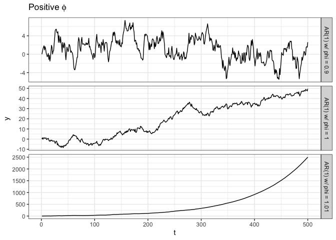<!-- -->


```r
delta = 0.1
phi1 = 0.9
phi2 = 1.01

ar1 = data_frame(
  t = 1:500,
  y1 = 0,
  y2 = 0,
  y3 = 0
)

for(t in 2:nrow(ar1))
{
  ar1$y1[t] = delta - phi1 * ar1$y1[t-1] + rnorm(1)
  ar1$y2[t] = delta - ar1$y2[t-1] + rnorm(1)
  ar1$y3[t] = delta - phi2 * ar1$y3[t-1] + rnorm(1)
}

ar1 %>%
  rename(
    "AR(1) w/ phi = 0.9" = y1,
    "AR(1) w/ phi = -1" = y2,
    "AR(1) w/ phi = -1.01" = y3
  ) %>%
  tidyr::gather(model, y, -t) %>%
  ggplot(aes(x=t,y=y)) +
  geom_line() +
  labs(title = expression(paste("Negative ", phi))) + 
  facet_grid(forcats::as_factor(model)~., scale="free_y") 
```

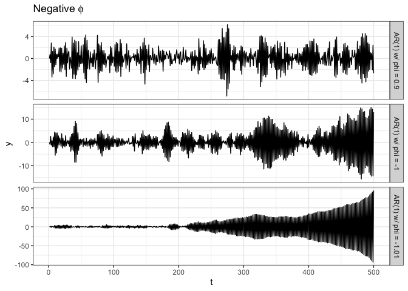<!-- -->

Seems that $|\phi| > 1$ causes big issues. $\phi = 1$ is not stationary, $\phi = -1$ maybe?

## Example of AR(1) Processes 


```r
sims = data_frame(
  t = 1:100,
  "phi = -0.9" = arima.sim(n = 100, list(ar = -0.9)),
  "phi = -0.5" = arima.sim(n = 100, list(ar = -0.5)), 
  "phi = 0.5" = arima.sim(n = 100, list(ar =  0.5)), 
  "phi = 0.9" = arima.sim(n = 100, list(ar =  0.9))
)

sims %>%
  tidyr::gather(model, vals, -t) %>%
  ggplot(aes(x=t, y=vals)) +
    geom_line() +
    facet_wrap(~model)
```

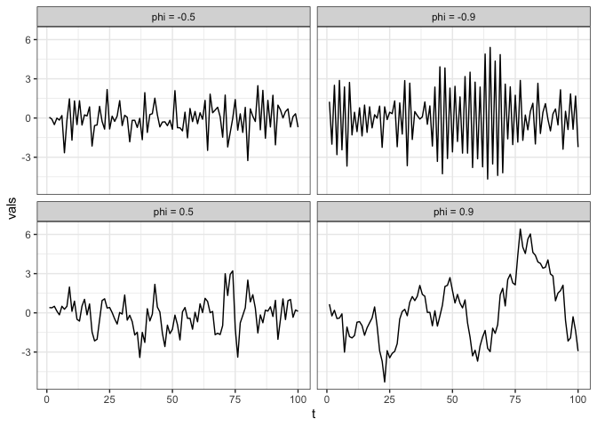<!-- -->

## Identifying AR(1) Processes - ACFs


```r
par(mfrow=c(2,4))
forecast::Acf(sims$`phi = -0.5`)
forecast::Acf(sims$`phi = -0.9`)
forecast::Acf(sims$`phi = 0.5`)
forecast::Acf(sims$`phi = 0.9`)
forecast::Pacf(sims$`phi = -0.5`)
forecast::Pacf(sims$`phi = -0.9`)
forecast::Pacf(sims$`phi = 0.5`)
forecast::Pacf(sims$`phi = 0.9`)
```

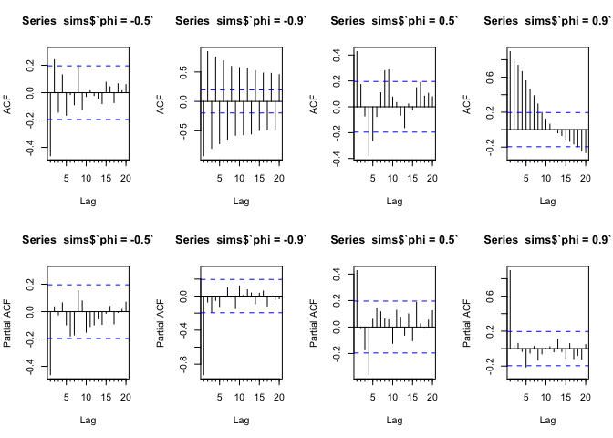<!-- -->
