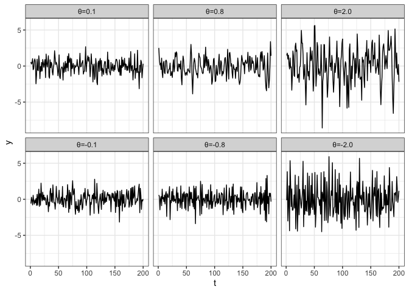
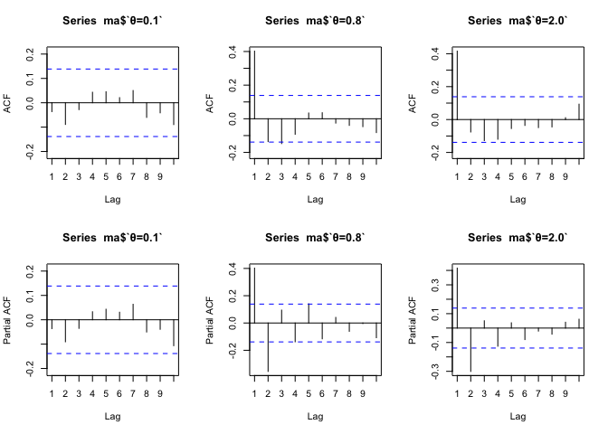
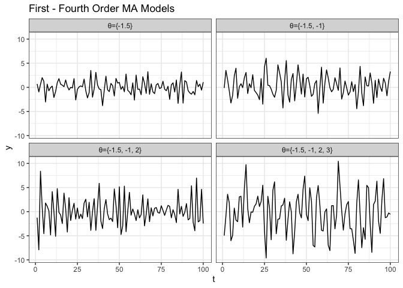
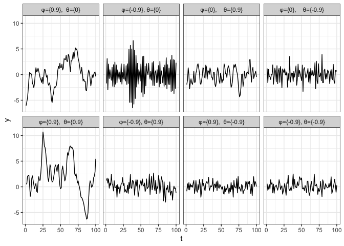
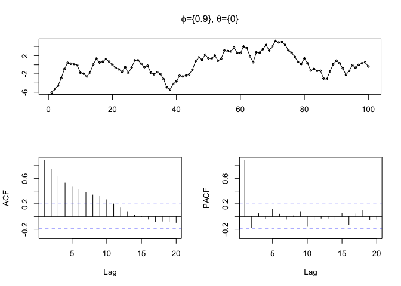
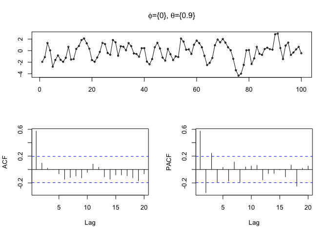
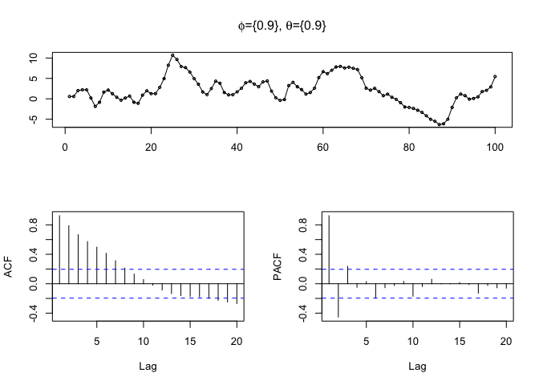

```r
ggplot2::theme_set(ggplot2::theme_bw())

library(tidyverse)
```

# MA(1) Models 


```r
ma = data_frame(
  t = 1:200,
  "θ=0.1" = arima.sim(n=200, list(ma=c(0.1))),
  "θ=0.8" = arima.sim(n=200, list(ma=c(0.8))),
  "θ=2.0" = arima.sim(n=200, list(ma=c(2.0))),
  "θ=-0.1" = arima.sim(n=200, list(ma=c(-0.1))),
  "θ=-0.8" = arima.sim(n=200, list(ma=c(-0.8))),
  "θ=-2.0" = arima.sim(n=200, list(ma=c(-2.0)))
) 
```

```
## Warning: `data_frame()` is deprecated as of tibble 1.1.0.
## Please use `tibble()` instead.
## This warning is displayed once every 8 hours.
## Call `lifecycle::last_warnings()` to see where this warning was generated.
```

```r
ma %>%
  tidyr::gather(model, y, -t) %>%
  mutate(model = forcats::as_factor(model)) %>%
  ggplot(aes(x=t,y=y)) +
  geom_line() +
  facet_wrap(~model)
```

<!-- -->

## ACF


```r
par(mfrow=c(2,3))
forecast::Acf(ma$`θ=0.1`, lag.max = 10)
```

```
## Registered S3 method overwritten by 'xts':
##   method     from
##   as.zoo.xts zoo
```

```
## Registered S3 method overwritten by 'quantmod':
##   method            from
##   as.zoo.data.frame zoo
```

```r
forecast::Acf(ma$`θ=0.8`, lag.max = 10)
forecast::Acf(ma$`θ=2.0`, lag.max = 10)
forecast::Pacf(ma$`θ=0.1`, lag.max = 10)
forecast::Pacf(ma$`θ=0.8`, lag.max = 10)
forecast::Pacf(ma$`θ=2.0`, lag.max = 10)
```

<!-- -->

MA(1): spike in ACF and oscillating pattern in PACF. Quite different from AR(1). MA tends to show opposite pattern.

# MA(q) Models


```r
ma_q = data_frame(
  t = 1:100,
  "θ={-1.5}"           = arima.sim(n=100, list(ma=c(-1.5)))           ,
  "θ={-1.5, -1}"       = arima.sim(n=100, list(ma=c(-1.5, -1)))       ,
  "θ={-1.5, -1, 2}"    = arima.sim(n=100, list(ma=c(-1.5, -1, 2)))    ,
  "θ={-1.5, -1, 2, 3}" = arima.sim(n=100, list(ma=c(-1.5, -1, 2, 3))) 
) 

ma_q %>%
  tidyr::gather(model, y, -t) %>%
  mutate(model = forcats::as_factor(model)) %>%
  ggplot(aes(x=t,y=y)) +
  geom_line() +
  labs(title = "First - Fourth Order MA Models") +
  facet_wrap(~model)
```

<!-- -->

# ARMA

composite of AR and MA models, only have to check AR component for stationarity of ARMA model 


```r
arma = data_frame(
  t = 1:100,
  "φ={0.9},  θ={0}"    = arima.sim(n=100, list(ar=c( 0.9), ma=c()   )) ,
  "φ={-0.9}, θ={0}"    = arima.sim(n=100, list(ar=c(-0.9), ma=c()   )) ,
  "φ={0},    θ={0.9}"  = arima.sim(n=100, list(ar=c(),     ma=c(0.9))) ,
  "φ={0},    θ={-0.9}" = arima.sim(n=100, list(ar=c(),     ma=c(-0.9))) ,
  "φ={0.9},  θ={0.9}"  = arima.sim(n=100, list(ar=c( 0.9), ma=c(0.9))) ,
  "φ={-0.9}, θ={0.9}"  = arima.sim(n=100, list(ar=c(-0.9), ma=c(0.9))) ,
  "φ={0.9},  θ={-0.9}" = arima.sim(n=100, list(ar=c( 0.9), ma=c(-0.9))) ,
  "φ={-0.9}, θ={-0.9}" = arima.sim(n=100, list(ar=c(-0.9), ma=c(0.9))) 
) 
  
arma %>%
  tidyr::gather(model, y, -t) %>%
  mutate(model = forcats::as_factor(model)) %>%
  ggplot(aes(x=t,y=y)) +
    geom_line() +
    facet_wrap(~model, ncol=4)
```

<!-- -->


### $\phi=0.9$, $\theta=0$: AR(1), MA(0)


```r
forecast::tsdisplay(arma[[2]], main=expression(paste(phi,"={0.9}, ",theta,"={0}")))
```

<!-- -->

Spike in PACF at lag 1, and echoing pattern in ACF. Dead giveaway for AR model

### $\phi=0$, $\theta=0.9$: AR(0), MA(1)


```r
forecast::tsdisplay(arma[[4]], main=expression(paste(phi,"={0}, ",theta,"={0.9}")))
```

<!-- -->

Spike in both at lag 1, echoing pattern in PACF without huge spike at lag 1

### $\phi=0.9$, $\theta=0.9$: AR(1), MA(1)


```r
forecast::tsdisplay(arma[[6]], main=expression(paste(phi,"={0.9}, ",theta,"={0.9}")))
```

<!-- -->

Generally, AR dominates, so this looks more like AR
