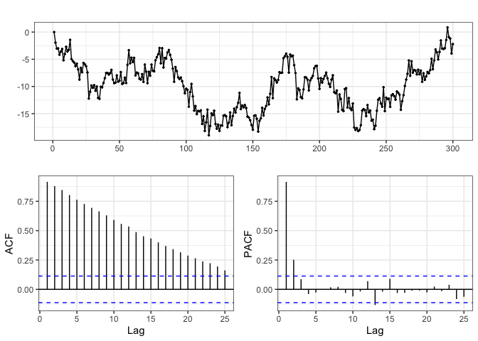
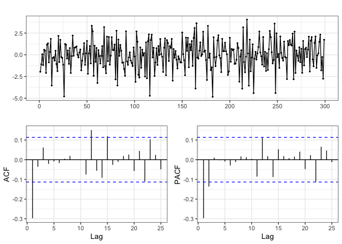
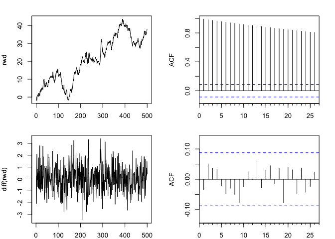
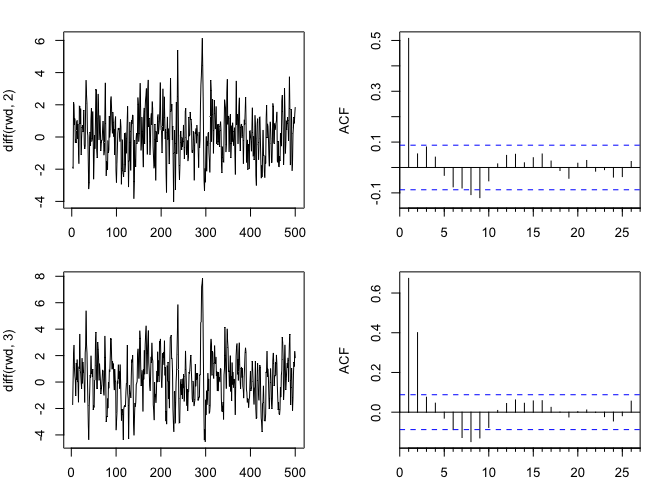
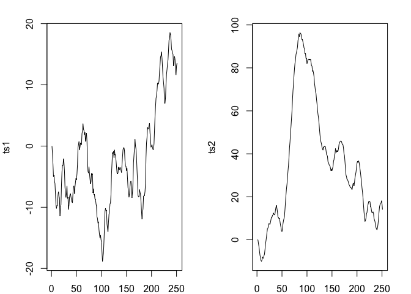
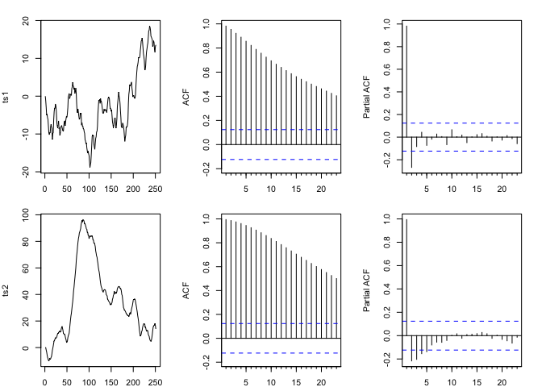
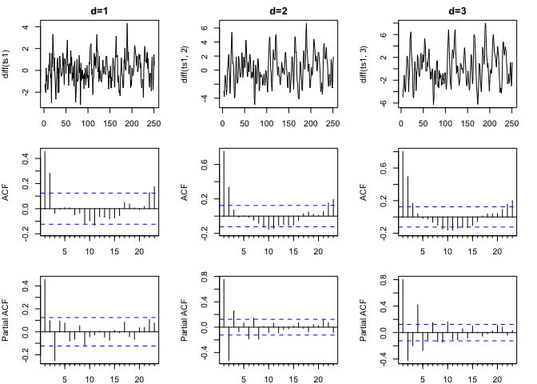
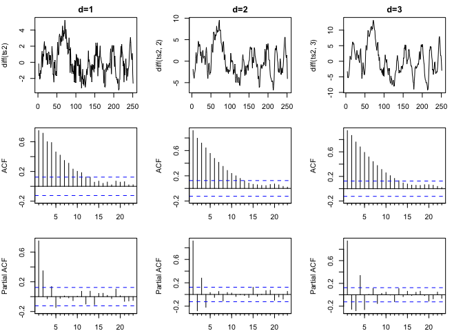

```r
library(tidyverse)
ggplot2::theme_set(ggplot2::theme_bw())
```

# Differencing 

### Stochastic Trend

Let $y_t = \mu_t + w_t$ where $w_t$ is white noise and $\mu_t = \mu_{t-1} + v_t$ with $v_t$ stationary as well. 


```r
d = data_frame(
  w=rnorm(300,0,1),
  v=rnorm(300,0,1),
  mu = 0,
  y = 0
)

for(t in 2:300) {
  d$mu[t] = d$mu[t-1] + d$v[t]
  d$y[t] = d$mu[t] + d$w[t]
}

forecast::ggtsdisplay(d$y)
```

<!-- -->

$y_t$ is non-stationary, not as obvious a pattern as the random walk. Seeing some type of "AR" pattern in the lag. 

### Differenced Stochastic Trend


```r
forecast::ggtsdisplay(diff(d$y))
```

<!-- -->

Seeing some type of "MA" structure in ACF and PACF. Calculated that differenced stochastic trend is **stationary**. 

# ARIMA 

## Random Walk with Drift 


```r
rwd = arima.sim(n=500, model=list(order=c(0,1,0)), mean=0.1) 

# differenced once 
forecast::Arima(rwd, order = c(0,1,0), include.constant = TRUE)
```

```
## Series: rwd 
## ARIMA(0,1,0) with drift 
## 
## Coefficients:
##       drift
##       0.076
## s.e.  0.049
## 
## sigma^2 estimated as 1.204:  log likelihood=-755.38
## AIC=1514.75   AICc=1514.77   BIC=1523.18
```

#### EDA 


```r
par(mfrow=c(2,2), mar=c(2,4,2,2))
plot(rwd)
forecast::Acf(rwd, main="")

plot(diff(rwd))
forecast::Acf(diff(rwd), main="")
```

<!-- -->

Second row of plots are the differenced plots, stationary. 

#### Over differencing


```r
par(mfrow=c(2,2), mar=c(2,4,2,2))
plot(diff(rwd,2))
forecast::Acf(diff(rwd,2), main="")
plot(diff(rwd,3))
forecast::Acf(diff(rwd,3), main="")
```

<!-- -->

Once something is stationary, differencing it again does not make something non-stationary. There's no point in going past the first time, and may induce structure that wasn't originally there. 

# AR or MA?


```r
ts1 = arima.sim(n=250, model=list(order=c(0,1,2), ma=c(0.4,0.5))) 
ts2 = arima.sim(n=250, model=list(order=c(2,1,0), ar=c(0.4,0.5))) 

par(mfrow=c(1,2), mar=c(2,4,2,2))
plot(ts1)
plot(ts2)
```

<!-- -->

### EDA


```r
par(mfrow=c(2,3), mar=c(2,4,2,2))
plot(ts1)
forecast::Acf(ts1,main="")
forecast::Pacf(ts1,main="")

plot(ts2)
forecast::Acf(ts2,main="")
forecast::Pacf(ts2,main="")
```

<!-- -->

Neither one is stationary. Seems like both have AR, but since neither time series is stationary, we can't use ACF or PACF to tell us much. 

## `ts1` - Finding $d$


```r
par(mfrow=c(3,3), mar=c(2,4,2,2))

plot(diff(ts1), main="d=1")
plot(diff(ts1,2), main="d=2")
plot(diff(ts1,3), main="d=3")
forecast::Acf(diff(ts1), main="")
forecast::Acf(diff(ts1,2), main="")
forecast::Acf(diff(ts1,3), main="")
forecast::Pacf(diff(ts1), main="")
forecast::Pacf(diff(ts1,2), main="")
forecast::Pacf(diff(ts1,3), main="")
```

<!-- -->

Seems like first order difference is good enough. 

For the first order difference, two peaks in ACF is indicates MA(2), three peaks in PACF is maybe AR(3)?

## `ts2` - Finding $d$


```r
par(mfrow=c(3,3), mar=c(2,4,2,2))
plot(diff(ts2), main="d=1")
plot(diff(ts2,2), main="d=2")
plot(diff(ts2,3), main="d=3")
forecast::Acf(diff(ts2), main="")
forecast::Acf(diff(ts2,2), main="")
forecast::Acf(diff(ts2,3), main="")
forecast::Pacf(diff(ts2), main="")
forecast::Pacf(diff(ts2,2), main="")
forecast::Pacf(diff(ts2,3), main="")
```

<!-- -->

The structure doesn't go away. Additional levels of differencing won't do much, so we can just go with the first order difference. 

For the first order difference, two big peaks in the PACF is indicative of AR(2) structure. 


Generally, AR processes are easier to identify than MA processes. First tweak difference, then AR, lastly MA. 

### Automatic Model Selection 

`ts1`:

```r
forecast::auto.arima(ts1)
```

```
## Series: ts1 
## ARIMA(0,1,2) 
## 
## Coefficients:
##          ma1     ma2
##       0.4726  0.4694
## s.e.  0.0553  0.0606
## 
## sigma^2 estimated as 1.088:  log likelihood=-364.58
## AIC=735.17   AICc=735.26   BIC=745.73
```

`ts2`:

```r
forecast::auto.arima(ts2)
```

```
## Series: ts2 
## ARIMA(1,2,3) 
## 
## Coefficients:
##           ar1     ma1      ma2      ma3
##       -0.7852  0.3713  -0.2282  -0.1102
## s.e.   0.1003  0.1150   0.0770   0.0707
## 
## sigma^2 estimated as 1.185:  log likelihood=-372.55
## AIC=755.11   AICc=755.36   BIC=772.7
```
