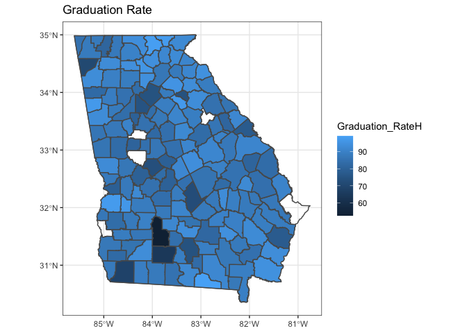
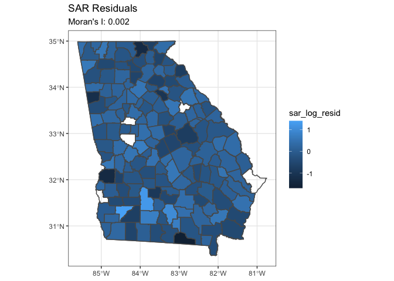
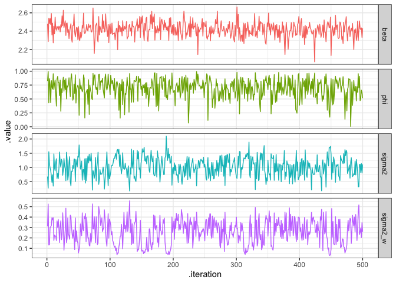

# Introduction

This project seeks to predict the average graduation rate of high schools in each county in GA. I present 5 models, four of which are SAR and CAR models that take into account the spatial autocorrelation of each county. Then, I perform diagnostics on each of the models to see which one is the best at predicting the average graduation rate of each county, while taking into account the spatial autocorrelation that is present. 

# Data


```r
init_schools = st_read("data/schools_2009/DOE Schools 2009.shp", quiet=T)
init_counties = st_read("data/Counties_Georgia-shp/Counties_Georgia.shp", quiet=T)
school_names = read_csv("data/school-19.csv")

par(mfrow = c(1,2))
plot(st_geometry(init_schools), main="Schools")
plot(st_geometry(init_counties), main="Counties")
```

<!-- -->

The `schools` dataset has some schools which are not in GA. We fix that issue first. 


```r
schools = st_intersection(init_schools %>% 
                            st_transform(st_crs(init_counties)), 
                          init_counties
) %>% 
  filter(GRADES == "09,10,11,12")
plot(st_geometry(schools), pch=16, main="Schools")
```

<!-- -->

This looks like the shape of GA.


```r
schools_data = inner_join(init_schools, school_names, by = c("SCHOOLNAME" = "SchoolName"))

counties_data = inner_join(init_counties, school_names, by = c("NAMELSAD10" = "SystemName"))
```


```r
ggplot() + 
  geom_sf(data = schools, alpha=0.6) +
  geom_sf(data = init_counties, fill=NA, col="black") + 
  geom_sf(data = init_counties %>% filter(NAME10 == "Forsyth"), fill = "lightblue", col="black") +
  geom_sf(data = schools %>% filter(SCHOOLNAME == "South Forsyth High School"), color = "blue") + 
  labs(title = "High Schools in GA",
       subtitle = "Forsyth County & SFHS")
```

<!-- -->

## Wrangling Data 

I am only select data that is pertinent to a school's demographic and other variables that are relevant to a high school's performance. Then, I am calculating the average graduation rate for each county. 


```r
grad_rate = counties_data %>% 
  # filter(Grades %in% 
  #          counties_data$Grades[str_detect(counties_data$Grades, "12")]) %>%
  # filter(Grades=="9-12") %>%
  select(NAME10, total_enroll, SingleScore:pct_lep, Graduation_RateH,  English_BegH:Four_Year_Graduation_Rate, FinancialEfficiency:geometry) %>% 
  #select(NAME10, Graduation_RateH, Accelerated_Course_Taking, geometry) %>% 
  mutate_if(is.character, as.numeric) %>%  
  group_by(NAME10) %>%
  summarise_if(is.numeric, mean, na.rm=TRUE) %>% 
  filter(!is.na(Graduation_RateH))
```

# EDA 


```r
par(mfrow=c(2,2))
hist(grad_rate$Graduation_RateH, main="", xlab="")
hist(max(grad_rate$Graduation_RateH) + 1 - grad_rate$Graduation_RateH, main="", xlab="")
hist(log(max(grad_rate$Graduation_RateH) + 1 - grad_rate$Graduation_RateH), main="", xlab="")
```

<!-- -->

It seems like the last transformation looks the most "normal". I will use the transformed version, `Graduation_RateH_transformed`, in my analysis. This transformation is achieved by the following formula: `x_transformed = log(max(x) + 1 - x)`.


```r
grad_rate = grad_rate %>% 
  mutate(Graduation_RateH_transformed = log(max(grad_rate$Graduation_RateH) + 1 - grad_rate$Graduation_RateH))
```


```r
ggplot() + 
  geom_sf(data=init_counties, fill=NA) + 
  geom_sf(data = grad_rate, aes(fill=Graduation_RateH)) +
  scale_fill_continuous(na.value="white") + 
  labs(title = "Graduation Rate")
```

<!-- -->

```r
ggplot() + 
  geom_sf(data=init_counties, fill=NA) +  
  geom_sf(data = grad_rate, aes(fill=Graduation_RateH_transformed)) +
  scale_fill_continuous(na.value="white") + 
  labs(title = "Transformed Graduation Rate")
```

<!-- -->

## Creating Weight Matrix 


```r
W = st_touches(grad_rate, sparse = FALSE)
listW = mat2listw(W)

plot(st_geometry(grad_rate))
plot(listW, st_geometry(st_centroid(grad_rate)), pch=16, col="blue", add=TRUE)
```

<!-- -->

There are 154 counties in this dataset, which means we are missing information from 5 counties. We can see some of the missing counties in this plot. 

## Moran's and Geary's 


```r
moran.test(grad_rate$Graduation_RateH_transformed, listW)
```

```
## 
## 	Moran I test under randomisation
## 
## data:  grad_rate$Graduation_RateH_transformed  
## weights: listW    
## 
## Moran I statistic standard deviate = 3.2462, p-value = 0.0005848
## alternative hypothesis: greater
## sample estimates:
## Moran I statistic       Expectation          Variance 
##       0.150152726      -0.006535948       0.002329828
```

```r
geary.test(grad_rate$Graduation_RateH_transformed, listW)
```

```
## 
## 	Geary C test under randomisation
## 
## data:  grad_rate$Graduation_RateH_transformed 
## weights: listW 
## 
## Geary C statistic standard deviate = 3.1407, p-value = 0.0008426
## alternative hypothesis: Expectation greater than statistic
## sample estimates:
## Geary C statistic       Expectation          Variance 
##       0.773298395       1.000000000       0.005210132
```

From both the Moran's I and Geary's C statistics, it shows that there is slight **positive** autocorrelation with `Graduation_RateH_transformed`.

# Frequentist Linear Model 

In the eventual CAR model(s), I want use other variables to help predict `Graduation_RateH_transformed`. Thus, I am performing backwards selection with a BIC criterion to pick variables that are important. These variables will be included in the last Bayesian CAR model. 


```r
library(leaps)
model_data = grad_rate %>% 
  tbl_df() %>%
  select(-geometry) 

model_select <- regsubsets(Graduation_RateH_transformed ~. -NAME10 - Graduation_RateH - Four_Year_Graduation_Rate, data = model_data, na.action=na.exclude, method = "backward")

coef(model_select, which.min(summary(model_select)$bic))
```

```
##       (Intercept)      pct_hispanic         pct_white           pct_lep 
##      4.7164765459     -0.0514615100     -0.0048703224      0.0700944279 
##      English_BegH College_Readiness               PPE 
##      0.0099904305     -0.0095733704     -0.0001555627
```


```r
model_data = model_data %>% 
  select(Graduation_RateH_transformed, pct_hispanic, pct_white, 
         pct_lep, English_BegH, College_Readiness, PPE) 

model_data[is.nan(model_data$English_BegH),]$English_BegH = median(model_data$English_BegH, na.rm=TRUE)

model = lm(Graduation_RateH_transformed ~ pct_hispanic + pct_white + pct_lep + English_BegH + College_Readiness + PPE, data = model_data)
summary(model)
```

```
## 
## Call:
## lm(formula = Graduation_RateH_transformed ~ pct_hispanic + pct_white + 
##     pct_lep + English_BegH + College_Readiness + PPE, data = model_data)
## 
## Residuals:
##      Min       1Q   Median       3Q      Max 
## -1.67393 -0.23790  0.04095  0.27334  1.41400 
## 
## Coefficients:
##                     Estimate Std. Error t value Pr(>|t|)    
## (Intercept)        4.232e+00  4.315e-01   9.807  < 2e-16 ***
## pct_hispanic      -3.976e-02  1.277e-02  -3.114  0.00222 ** 
## pct_white         -5.203e-03  2.005e-03  -2.595  0.01042 *  
## pct_lep            5.303e-02  1.854e-02   2.861  0.00484 ** 
## English_BegH       9.401e-03  3.990e-03   2.356  0.01978 *  
## College_Readiness -8.803e-03  3.528e-03  -2.495  0.01369 *  
## PPE               -1.113e-04  2.642e-05  -4.211 4.41e-05 ***
## ---
## Signif. codes:  0 '***' 0.001 '**' 0.01 '*' 0.05 '.' 0.1 ' ' 1
## 
## Residual standard error: 0.4731 on 147 degrees of freedom
## Multiple R-squared:  0.3339,	Adjusted R-squared:  0.3067 
## F-statistic: 12.28 on 6 and 147 DF,  p-value: 3.557e-11
```

## Prediction


```r
grad_rate_modeling = grad_rate %>%
  select(NAME10, Graduation_RateH_transformed, Graduation_RateH, pct_hispanic, pct_white, pct_lep, English_BegH,College_Readiness, PPE)

grad_rate_modeling[is.nan(grad_rate_modeling$English_BegH),]$English_BegH = median(grad_rate_modeling$English_BegH, na.rm=TRUE)
```


```r
grad_rate_modeling$lm_log_pred = model %>% fitted()
grad_rate_modeling$lm_log_resid = model %>% residuals()
grad_rate_modeling$lm_pred = max(grad_rate_modeling$Graduation_RateH) + 1 - exp(grad_rate_modeling$lm_log_pred) 

ggplot() + 
  geom_sf(data=grad_rate_modeling, aes(fill=lm_log_pred)) + 
  labs(title = "Log LM Predictions") + 
  geom_sf(data=init_counties, fill=NA)+
  scale_fill_continuous(na.value="white")
```

<!-- -->

```r
ggplot() + 
  geom_sf(data=grad_rate_modeling, aes(fill=lm_pred)) + 
  labs(title = "LM Predictions") + 
  geom_sf(data=init_counties, fill=NA)+
  scale_fill_continuous(na.value="white")
```

<!-- -->

These prediction seems okay, but there seem to be some issues predicting counties with lower graduation rates. 

# Frequentist SAR & CAR Model 


```r
listW_neigh = nb2listw(listW$neighbours, style = "B")
#eigs = eigenw(listW_neigh)

grad_rate_sar = spautolm(formula = Graduation_RateH_transformed ~ pct_hispanic + pct_white + pct_lep + English_BegH + College_Readiness + PPE,
                         data=grad_rate_modeling,
                         listw = listW_neigh,
                         family = "SAR")
summary(grad_rate_sar)
```

```
## 
## Call: spautolm(formula = Graduation_RateH_transformed ~ pct_hispanic + 
##     pct_white + pct_lep + English_BegH + College_Readiness + 
##     PPE, data = grad_rate_modeling, listw = listW_neigh, family = "SAR")
## 
## Residuals:
##       Min        1Q    Median        3Q       Max 
## -1.685640 -0.243097  0.044488  0.260555  1.406662 
## 
## Coefficients: 
##                      Estimate  Std. Error z value  Pr(>|z|)
## (Intercept)        4.1336e+00  4.2534e-01  9.7183 < 2.2e-16
## pct_hispanic      -3.9805e-02  1.2587e-02 -3.1625  0.001564
## pct_white         -4.8056e-03  2.0149e-03 -2.3850  0.017080
## pct_lep            5.3667e-02  1.8334e-02  2.9271  0.003421
## English_BegH       9.8358e-03  3.9150e-03  2.5123  0.011994
## College_Readiness -8.4964e-03  3.4680e-03 -2.4500  0.014287
## PPE               -1.0697e-04  2.6083e-05 -4.1013 4.109e-05
## 
## Lambda: 0.012694 LR test value: 0.18411 p-value: 0.66786 
## Numerical Hessian standard error of lambda: 0.029267 
## 
## Log likelihood: -99.58169 
## ML residual variance (sigma squared): 0.21321, (sigma: 0.46175)
## Number of observations: 154 
## Number of parameters estimated: 9 
## AIC: 217.16
```

```r
grad_rate_car = spautolm(formula = Graduation_RateH_transformed ~ pct_hispanic + pct_white + pct_lep + English_BegH + College_Readiness + PPE,
                         data=grad_rate_modeling,
                         listw = listW_neigh,
                         family = "CAR")
summary(grad_rate_car)
```

```
## 
## Call: spautolm(formula = Graduation_RateH_transformed ~ pct_hispanic + 
##     pct_white + pct_lep + English_BegH + College_Readiness + 
##     PPE, data = grad_rate_modeling, listw = listW_neigh, family = "CAR")
## 
## Residuals:
##       Min        1Q    Median        3Q       Max 
## -1.687924 -0.241902  0.054925  0.269958  1.417499 
## 
## Coefficients: 
##                      Estimate  Std. Error z value  Pr(>|z|)
## (Intercept)        4.14232367  0.42502389  9.7461 < 2.2e-16
## pct_hispanic      -0.03982126  0.01257775 -3.1660  0.001545
## pct_white         -0.00484116  0.00201022 -2.4083  0.016028
## pct_lep            0.05364300  0.01831708  2.9286  0.003405
## English_BegH       0.00979224  0.00391393  2.5019  0.012353
## College_Readiness -0.00852540  0.00346619 -2.4596  0.013910
## PPE               -0.00010733  0.00002606 -4.1185 3.813e-05
## 
## Lambda: 0.022783 LR test value: 0.16693 p-value: 0.68286 
## Numerical Hessian standard error of lambda: 0.054337 
## 
## Log likelihood: -99.59028 
## ML residual variance (sigma squared): 0.21312, (sigma: 0.46165)
## Number of observations: 154 
## Number of parameters estimated: 9 
## AIC: 217.18
```

## Prediction 


```r
grad_rate_modeling$sar_pred_log = grad_rate_sar$fit$fitted.values
grad_rate_modeling$car_pred_log = grad_rate_car$fit$fitted.values

grad_rate_modeling$sar_pred = max(grad_rate_modeling$Graduation_RateH) + 1 - exp(grad_rate_modeling$sar_pred_log) 

grad_rate_modeling$car_pred = max(grad_rate_modeling$Graduation_RateH) + 1 - exp(grad_rate_modeling$car_pred_log)
```


```r
ggplot() + 
  geom_sf(data=init_counties, fill=NA) + 
  geom_sf(data=grad_rate_modeling, aes(fill=sar_pred_log)) +
  scale_fill_continuous(na.value="white") + 
  labs(title = "Log SAR Predictions")
```

<!-- -->

```r
ggplot() + 
  geom_sf(data=init_counties, fill=NA) + 
  geom_sf(data=grad_rate_modeling, aes(fill=sar_pred)) +
  scale_fill_continuous(na.value="white") + 
  labs(title = "SAR Predictions")
```

<!-- -->

```r
ggplot() + 
  geom_sf(data=init_counties, fill=NA) + 
  geom_sf(data=grad_rate_modeling, aes(fill=car_pred_log)) +
  scale_fill_continuous(na.value="white") + 
  labs(title = "Log CAR Predictions")
```

<!-- -->

```r
ggplot() + 
  geom_sf(data=init_counties, fill=NA) + 
  geom_sf(data=grad_rate_modeling, aes(fill=car_pred)) +
  scale_fill_continuous(na.value="white") + 
  labs(title = "CAR Predictions")
```

<!-- -->

Once again, the models are struggling with the counties with lower graduation rates. The prediction for the Northeastern region of GA looks the best. 

## Residuals


```r
grad_rate_modeling$sar_log_resid = grad_rate_sar$fit$residuals
grad_rate_modeling$car_log_resid = grad_rate_car$fit$residuals


ggplot() + 
  geom_sf(data=init_counties, fill=NA) + 
  geom_sf(data=grad_rate_modeling, aes(fill=sar_log_resid)) +
  scale_fill_continuous(na.value="white") + 
  labs(title = "SAR Residuals",
       subtitle = paste0("Moran's I: ", 
                         round(moran.test(grad_rate_modeling$sar_log_resid, 
                                          listW_neigh, 
                                          na.action = na.exclude)$estimate[1],3)))
```

<!-- -->

```r
ggplot() + 
  geom_sf(data=init_counties, fill=NA) + 
  geom_sf(data=grad_rate_modeling, aes(fill=car_log_resid)) +
  scale_fill_continuous(na.value="white") + 
  labs(title = "CAR Residuals",
       subtitle = paste0("Moran's I: ", 
                         round(moran.test(grad_rate_modeling$car_log_resid, 
                                          listW_neigh, 
                                          na.action = na.exclude)$estimate[1],3)))
```

<!-- -->

There is very little spatial autocorrelation in the residuals, which means the SAR and CAR models have taken into account most of the spatial autocorrelation. 


# Bayesian CAR Model - Transformed


```r
car_model = "
data {
  int<lower=0> N;
  vector[N] y;
  matrix[N,N] W;
  matrix[N,N] D;
}
parameters {
  vector[N] w_s;
  real beta;
  real<lower=0> sigma2; // variance in CAR part of model 
  real<lower=0> sigma2_w; // additional source of error so we get normal model
  real<lower=0,upper=1> phi;
}
transformed parameters {
  vector[N] y_pred = beta + w_s;
}
model {
  matrix[N,N] Sigma_inv = (D - phi * W) / sigma2; 
  w_s ~ multi_normal_prec(rep_vector(0,N), Sigma_inv); 

  beta ~ normal(0,10);
  sigma2 ~ cauchy(0,5);
  sigma2_w ~ cauchy(0,5);
  
  y ~ normal(beta+w_s, sigma2_w);
}
"
```


```r
if (!file.exists("stan_car2.rds")) {
  car_fit2 = rstan::stan(
    model_code = car_model, 
    data = list(
      N = nrow(grad_rate),
      y = grad_rate$Graduation_RateH_transformed,
      W = W * 1,
      D = diag(rowSums(W))
    ),
    iter = 50000, 
    chains = 1, 
    thin=50
  )
  saveRDS(car_fit2, "stan_car2.rds")
} else {
  car_fit2 = readRDS("stan_car2.rds")
}
```

## MCMC Diagnostics 


```r
tidybayes::gather_draws(car_fit2, beta, phi, sigma2, sigma2_w) %>% 
  ggplot() +
  geom_line(aes(x=.iteration, y=.value, color=.variable)) +
  facet_grid(.variable~., scales = "free_y") +
  guides(color=FALSE)
```

<!-- -->

The chains generally look fine, though `sigma2` and `sigma2_w` are fairly correlated. 

## Prediction & Residuals


```r
grad_rate_modeling$bayes_car_log_pred = tidybayes::gather_draws(car_fit2, y_pred[i]) %>%
  ungroup() %>%
  group_by(i) %>% 
  summarize(
    bayes_car_log_pred = mean(.value)
  ) %>% 
  pull(bayes_car_log_pred)

grad_rate_modeling$bayes_car_log_resid = grad_rate_modeling$Graduation_RateH_transformed - grad_rate_modeling$bayes_car_log_pred

ggplot() +  
  geom_sf(data=init_counties, fill=NA) + 
  geom_sf(data=grad_rate_modeling, aes(fill=bayes_car_log_pred)) +
  scale_fill_continuous(na.value="white") + 
  labs(title = "Bayesian Log CAR Predictions", 
       subtitle = paste0("RMSE: ",
                         grad_rate_modeling$bayes_car_log_resid %>% 
                           .^2 %>% 
                           mean() %>% 
                           sqrt() %>% 
                           round(3)
       ))
```

<!-- -->

```r
grad_rate_modeling$bayes_car_log_pred_transformed = max(grad_rate_modeling$Graduation_RateH) + 1 - exp(grad_rate_modeling$bayes_car_log_pred)

ggplot() +  
  geom_sf(data=init_counties, fill=NA) + 
  geom_sf(data=grad_rate_modeling, aes(fill=bayes_car_log_pred_transformed)) +
  scale_fill_continuous(na.value="white") + 
  labs(title = "Bayesian CAR Predictions", 
       subtitle = paste0("RMSE: ",
                         grad_rate_modeling$bayes_car_log_resid %>% 
                           .^2 %>% 
                           mean() %>% 
                           sqrt() %>% 
                           round(3)
       ))
```

<!-- -->

The predictions look better and the model has a lower RMSE than the frequentist SAR and CAR models, mainly due to the model's ability to better predict lower graduation rates. 


```r
ggplot() +  
  geom_sf(data=init_counties, fill=NA) + 
  geom_sf(data=grad_rate_modeling, aes(fill=bayes_car_log_resid)) +
  scale_fill_continuous(na.value="white") + 
  labs(title = "Bayesian CAR Residuals",
       subtitle = paste0("Moran's I: ", 
                         round(moran.test(grad_rate_modeling$bayes_car_log_resid, 
                                          listW_neigh, 
                                          na.action = na.exclude)$estimate[1],3)
       ))
```

<!-- -->

The residuals are fine, but they have slightly more spatial autocorrelation than the frequentist SAR and CAR models. 

# Bayesian CAR Model - Transformed & with Betas


```r
car_model_betas = "model{
  for(i in 1:length(y)) {
    y[i] ~ dnorm(mu[i], sigma2_w)
    y_pred[i] ~ dnorm(mu[i], sigma2_w)
    mu[i] = X[i,] %*% beta + omega[i]
  }
  
  beta[1] ~ dnorm(4,100)

  for(i in 2:7) {
    beta[i] ~ dnorm(0,0.01)
  }

  omega ~ dmnorm(rep(0,length(y)), tau * (D - phi*W))
  sigma2 = 1/tau
  tau ~ dgamma(2, 2)
  sigma2_w ~ dgamma(2, 2)
  phi ~ dunif(0,0.99)
}"
X = matrix(nrow = nrow(grad_rate), ncol = 6)
X[,1] = grad_rate_modeling$pct_hispanic
X[,2] = grad_rate_modeling$pct_white
X[,3] = grad_rate_modeling$pct_lep
X[,4] = grad_rate_modeling$English_BegH
X[,5] = grad_rate_modeling$College_Readiness
X[,6] = grad_rate_modeling$PPE
X = model.matrix(~X)

if (!file.exists("jags_car_betas.rds")) {
  m = rjags::jags.model(
    textConnection(car_model_betas),
    data = list(
      y = grad_rate_modeling$Graduation_RateH_transformed,
      X = X,
      W = W * 1,
      D = diag(rowSums(W))
    )
  )
  
  update(m, n.iter=25000)
  
  car_fit_betas = rjags::coda.samples(
    m, variable.names = c("beta", "sigma2", "sigma2_w", "omega", "tau", "phi", "y_pred"),
    n.iter=50000, thin=50
  )
  saveRDS(car_fit_betas, "jags_car_betas.rds")
} else {
  car_fit_betas = readRDS("jags_car_betas.rds")
}
```

## MCMC Diagnostics 


```r
tidybayes::gather_draws(car_fit_betas, beta[i]) %>% 
  ungroup() %>%
  filter(i <= 4) %>% 
  mutate(.variable = paste0(.variable, "[", i, "]")) %>%
  ggplot(aes(x = .iteration, y = .value, color = .variable)) + 
  geom_line() + 
  facet_grid(.variable~., scales= "free_y") +
  guides(color=FALSE)
```

<!-- -->

```r
tidybayes::gather_draws(car_fit_betas, beta[i]) %>% 
  ungroup() %>%
  filter(i > 4) %>% 
  mutate(.variable = paste0(.variable, "[", i, "]")) %>%
  ggplot(aes(x = .iteration, y = .value, color = .variable)) + 
  geom_line() + 
  facet_grid(.variable~., scales= "free_y") +
  guides(color=FALSE)
```

<!-- -->

```r
tidybayes::gather_draws(car_fit_betas, sigma2, sigma2_w, phi) %>% 
  ungroup() %>%
  ggplot(aes(x = .iteration, y = .value, color = .variable)) + 
  geom_line() + 
  facet_grid(.variable~., scales= "free_y") +
  guides(color=FALSE)
```

<!-- -->

The chains look better than the chains from the previous model. `sigma2` and `sigma2_w` are no longer obviously correlated. 

## Prediction & Residuals


```r
grad_rate_modeling$bayes_car_betas_log_pred = tidybayes::gather_draws(car_fit_betas, y_pred[i]) %>%
  ungroup() %>%
  group_by(i) %>%
  summarise(
    bayes_betas_car_pred = mean(.value)
  ) %>% 
  pull(bayes_betas_car_pred)

grad_rate_modeling$bayes_car_betas_log_resid = grad_rate_modeling$Graduation_RateH_transformed - grad_rate_modeling$bayes_car_betas_log_pred

ggplot() +  
  geom_sf(data=init_counties, fill=NA) + 
  geom_sf(data=grad_rate_modeling, aes(fill=bayes_car_betas_log_pred)) +
  scale_fill_continuous(na.value="white") + 
  labs(title = "Bayesian CAR (with Betas) Predictions", 
       subtitle = paste0("RMSE: ",
                         grad_rate_modeling$bayes_car_betas_log_resid %>% 
                           .^2 %>% 
                           mean() %>% 
                           sqrt() %>% 
                           round(3)
       ))
```

<!-- -->

```r
grad_rate_modeling$bayes_car_betas_log_pred_transformed = max(grad_rate_modeling$Graduation_RateH) + 1 - exp(grad_rate_modeling$bayes_car_betas_log_pred)

ggplot() +  
  geom_sf(data=init_counties, fill=NA) + 
  geom_sf(data=grad_rate_modeling, aes(fill=bayes_car_betas_log_pred_transformed)) +
  scale_fill_continuous(na.value="white") + 
  labs(title = "Bayesian CAR (with Betas) Predictions", 
       subtitle = paste0("RMSE: ",
                         grad_rate_modeling$bayes_car_betas_log_resid %>% 
                           .^2 %>% 
                           mean() %>% 
                           sqrt() %>% 
                           round(3)
       ))
```

<!-- -->

The model has a lower RMSE than the frequentist SAR and CAR models but higher than the previous Bayesian CAR model.


```r
ggplot() +  
  geom_sf(data=init_counties, fill=NA) + 
  geom_sf(data=grad_rate_modeling, aes(fill=bayes_car_betas_log_resid)) +
  scale_fill_continuous(na.value="white") + 
  labs(title = "Bayesian CAR (with Betas) Residuals",
       subtitle = paste0("Moran's I: ", 
                         round(moran.test(grad_rate_modeling$bayes_car_betas_log_resid, 
                                          listW_neigh, 
                                          na.action = na.exclude)$estimate[1],3)
       ))
```

<!-- -->

This model has the lowest Moran's I statistic, meaning the residuals for this model are the least spatially autocorrelated. 

# Summary of Models & Conclusion


```r
grad_rate_modeling %>%
  as_tibble() %>%
  select(ends_with("log_resid")) %>%
  tidyr::gather(model, resid) %>% 
  mutate(model = stringr::str_replace(model, "_resid","") %>% 
           forcats::as_factor()) %>% 
  group_by(model) %>%
  summarize(
    rmse = resid^2 %>% mean(na.rm=TRUE) %>% sqrt(),
    moran = moran.test(resid, listW_neigh)$estimate[1],
    geary = geary.test(resid, listW_neigh)$estimate[1]
  ) %>%
  arrange(rmse)
```

```
## # A tibble: 5 x 4
##   model                rmse    moran geary
##   <fct>               <dbl>    <dbl> <dbl>
## 1 bayes_car_log       0.145 -0.0742  1.11 
## 2 bayes_car_betas_log 0.324 -0.00843 1.03 
## 3 car_log             0.462 -0.0165  0.985
## 4 sar_log             0.462  0.00173 0.967
## 5 lm_log              0.462  0.0178  0.950
```

It seems that the simple Bayesian CAR Model has the best predictive power (lowest RMSE), and the Bayesian CAR model with the `betas` has the lowest spatial autocorrelation (lowest Moran's I). However, for all the models, the Moran's I statistic is close to 0 and the Geary's C statistic is close to 1, the best model is the Bayesian CAR model. 

# Limitations

The biggest issue with the data is the skewness of `Graduation_RateH`. Without a transformation, the distribution is extremely left skewed. Even after the transformation, the data is still left skewed. Because of this, it is not hard to predict which counties have a lower average graduation rate, but rather hard to predict the **value** of that average graduation rate. 


