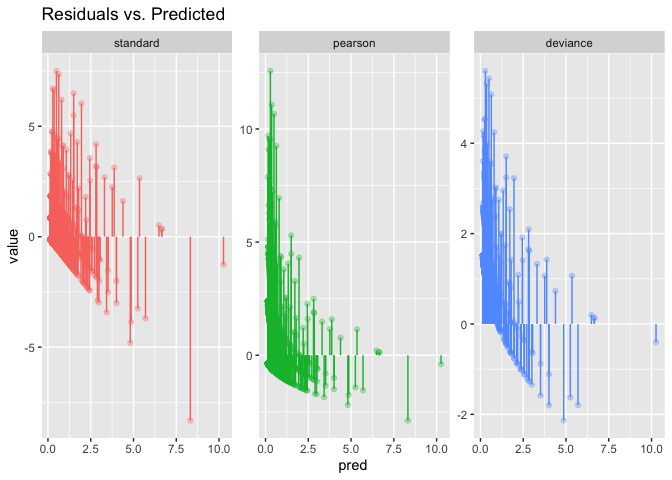

Homework 1
================
Your Name Here
Due 2/5/2018 by midnight

## Data

<i>This repository contains several files that start with `dvisits`,
these files contains / describe data from the Australian Health Survey
of 1977-78 for 5190 single adults. The Rdata file contains two data
frames: `train` and `test` and the results of a `modelr`
resample\_partition called `dvisits` (these two different data formats
are equivalent, the modelr object was included in case you wanted to try
out that approach). There is also `dvisits.html` which includes the
codebook for the data
    set.</i>

``` r
library(tidyverse)
```

    ## ── Attaching packages ─────────────────────────────────────────────────────────────────────────────────────────────────────────────────────────── tidyverse 1.3.0 ──

    ## ✓ ggplot2 3.2.1     ✓ purrr   0.3.3
    ## ✓ tibble  3.0.1     ✓ dplyr   0.8.5
    ## ✓ tidyr   1.0.0     ✓ stringr 1.4.0
    ## ✓ readr   1.3.1     ✓ forcats 0.4.0

    ## Warning: package 'tibble' was built under R version 3.6.2

    ## ── Conflicts ────────────────────────────────────────────────────────────────────────────────────────────────────────────────────────────── tidyverse_conflicts() ──
    ## x dplyr::filter() masks stats::filter()
    ## x dplyr::lag()    masks stats::lag()

``` r
load("~/Documents/Projects for Fun /Spatio-Temporal/Spatio-Temporal Modeling/HW/hw1/dvisits.Rdata")
```

-----

### Question 1

<i>Assume that you have observed data \(y_1,\, \ldots, \, y_n\). Show
that the multivariate normal likelihood for these data, when
\(\mathbf{\mu} = \underset{n \times 1}{\mathbf{0}}\) and
\(\mathbf{\Sigma} = \sigma^2 \underset{n \times n}{\mathbf{I}_n}\) is
the same as the likelihood a treating these data as arising from \(n\)
iid normals with mean 0 and variance \(\sigma^2\).</i>

Normal Distribution

\[
y_1,\, \ldots, \, y_n \sim_{iid} N(0,\sigma^2) \longrightarrow p(y | \mu, \sigma^2) = \prod_{i=1}^{n} \frac{1}{\sqrt{2\pi\sigma^2}}e^{-\frac{y_i^2}{2\sigma^2}} = {(\frac{1}{\sqrt{2\pi\sigma^2}})}^n e^{-\frac{\sum_{i=1}^n y_i^2}{\sigma^2}}
\]

Multivariate Normal Distribution

\[
y_1,\, \ldots, \, y_n \sim_{iid} N(\underset{n \times 1}{\mathbf{0}},\sigma^2 \underset{n \times n}{\mathbf{I}_n})
\longrightarrow
p(y | \mu, \sigma^2) = (2\pi)^{-\frac{n}{2}}|\Sigma|^{-\frac{1}{2}}e^{-\frac{y^T\Sigma^{-1}y}{2}}
\]

Now,

\[ 
|\Sigma|^{-\frac{1}{2}} = {\sigma^{2}}^{-\frac{n}{2}} \longrightarrow (2\pi)^{-\frac{n}{2}}|\Sigma|^{-\frac{1}{2}} = (2\pi\sigma^2)^{-\frac{n}{2}} = {(\frac{1}{\sqrt{2\pi\sigma^2}})}^n
\]

and \[
y^T\Sigma^{-1}y = \frac{\sum_{i=1}^n y_i^2}{\sigma^2}
\]

Putting it all together,

\[
(2\pi)^{-\frac{n}{2}}|\Sigma|^{-\frac{1}{2}}e^{-\frac{y^T\Sigma^{-1}y}{2}} = {(\frac{1}{\sqrt{2\pi\sigma^2}})}^n e^{-\frac{\sum_{i=1}^n y_i^2}{\sigma^2}}
\]

\[ \]

-----

### Question 2

<i> The Bayesian lasso is a linear modeling approach where instead of a
normal prior being placed on the \(\beta\)s we instead use a double
exponential (Laplace) prior. If we were to use this prior generally
describe what the Gibbs update step for \(\beta_1\) would look like if
we assume \(\mu_\beta\)=0 and \(\lambda_\beta\) is fixed. You answer
should include the formula for the conditional posterior up to a
normalizing constant.</i>

-----

### Question 3

The deviance for a logistic regression model (bernoulli distribution,
logit link) is given by the following formula,

\[
D =  2 \sum_{i=1}^n \left(Y_i \log \frac{Y_i}{\hat{p}_i}+(1-Y_i)\log \frac{1-Y_i}{1 - \hat{p}_i}\right) = \sum_{i=1}^n d_i^2 \\
\] with a single deviance residual therefore given by \[
d_i = \text{sign}(Y_i-\hat{p_i}) ~ \sqrt{ 2 \left(Y_i \log \frac{Y_i}{\hat{p}_i}+(1-Y_i)\log \frac{1-Y_i}{1 - \hat{p}_i}\right) }
\] using the definition of deviance from class, derive these formula
starting from the Bernoulli likelihood.

-----

### Question 4

<i>Using the training data start with some exploratory data analysis of
the data - our outcome variable of interest is `doctorco`. You should
examine the distribution of `doctorco` and any apparent relationship it
has with the remaining variables.

Based on what you find, describe what type of model do you think would
be appropriate here and if you were only able to select at most *5*
predictor variables to include in your model what would they be and
why?</i> <br> We should use a Poisson model because the histogram of
`doctorco` is skewed right.

``` r
g = glm(doctorco ~ ., data = train, family = "poisson")
summary(g)
```

    ## 
    ## Call:
    ## glm(formula = doctorco ~ ., family = "poisson", data = train)
    ## 
    ## Deviance Residuals: 
    ##     Min       1Q   Median       3Q      Max  
    ## -3.7725  -0.6591  -0.5724  -0.5040   5.4185  
    ## 
    ## Coefficients: (1 not defined because of singularities)
    ##              Estimate Std. Error z value Pr(>|z|)    
    ## (Intercept) -2.088407   0.214759  -9.724  < 2e-16 ***
    ## sex          0.166720   0.063725   2.616 0.008891 ** 
    ## age          1.385713   1.137743   1.218 0.223243    
    ## agesq       -1.753341   1.228359  -1.427 0.153469    
    ## income      -0.175095   0.099798  -1.755 0.079344 .  
    ## levyplus     0.027409   0.080686   0.340 0.734080    
    ## freepoor    -0.585684   0.211403  -2.770 0.005598 ** 
    ## freerepa     0.010031   0.104212   0.096 0.923316    
    ## illness      0.113207   0.022271   5.083 3.71e-07 ***
    ## actdays      0.112329   0.006154  18.254  < 2e-16 ***
    ## hscore       0.026800   0.011456   2.339 0.019319 *  
    ## chcond1      0.017009   0.075798   0.224 0.822446    
    ## chcond2     -0.161121   0.097411  -1.654 0.098120 .  
    ## nondocco     0.033039   0.016661   1.983 0.047369 *  
    ## hospadmi     0.130682   0.034422   3.796 0.000147 ***
    ## hospdays     0.003918   0.003195   1.226 0.220119    
    ## medicine    -0.080588   0.040341  -1.998 0.045751 *  
    ## prescrib     0.246609   0.042057   5.864 4.53e-09 ***
    ## nonpresc           NA         NA      NA       NA    
    ## ---
    ## Signif. codes:  0 '***' 0.001 '**' 0.01 '*' 0.05 '.' 0.1 ' ' 1
    ## 
    ## (Dispersion parameter for poisson family taken to be 1)
    ## 
    ##     Null deviance: 4512.9  on 4150  degrees of freedom
    ## Residual deviance: 3362.7  on 4133  degrees of freedom
    ## AIC: 5266.1
    ## 
    ## Number of Fisher Scoring iterations: 6

-----

### Question 5

<i>Fit your model of choice to the data (either frequentist or Bayesian
methods are fine here) and create an *appropriate* residuals plot
(\(\hat{Y}\) vs residuals) and comment on any structure or lack of
structure you
see.</i>

#### Frequentist Model

``` r
g2 = glm(doctorco ~ illness + actdays + hospadmi + prescrib + sex, data = train, family = poisson(link = "log"))
summary(g2)
```

    ## 
    ## Call:
    ## glm(formula = doctorco ~ illness + actdays + hospadmi + prescrib + 
    ##     sex, family = poisson(link = "log"), data = train)
    ## 
    ## Deviance Residuals: 
    ##     Min       1Q   Median       3Q      Max  
    ## -4.0801  -0.6547  -0.5671  -0.5152   5.5996  
    ## 
    ## Coefficients:
    ##              Estimate Std. Error z value Pr(>|z|)    
    ## (Intercept) -2.019679   0.057460 -35.149  < 2e-16 ***
    ## illness      0.117596   0.020830   5.645 1.65e-08 ***
    ## actdays      0.115903   0.005563  20.834  < 2e-16 ***
    ## hospadmi     0.155972   0.029759   5.241 1.60e-07 ***
    ## prescrib     0.169708   0.016587  10.231  < 2e-16 ***
    ## sex          0.192126   0.060390   3.181  0.00147 ** 
    ## ---
    ## Signif. codes:  0 '***' 0.001 '**' 0.01 '*' 0.05 '.' 0.1 ' ' 1
    ## 
    ## (Dispersion parameter for poisson family taken to be 1)
    ## 
    ##     Null deviance: 4512.9  on 4150  degrees of freedom
    ## Residual deviance: 3394.2  on 4145  degrees of freedom
    ## AIC: 5273.6
    ## 
    ## Number of Fisher Scoring iterations: 6

``` r
dev_resid = function(obs,pred) 
  sign(obs-pred) * sqrt(2*(obs*log(obs/pred)-(obs-pred)))

freqs_resid <- train %>%
  mutate(pred = predict(g2, newdata=., type = "response")) %>%
  mutate(standard = doctorco - pred ,
         pearson = (doctorco - pred)/sqrt(pred),
         deviance = dev_resid(doctorco, pred))
```

``` r
freqs_resid %>%
  gather(resid, value, standard:deviance) %>%
  mutate(resid = forcats::as_factor(resid)) %>%
  ggplot(aes(x=pred, y=value, color=resid)) +
  geom_point(alpha = 0.3) + 
  geom_segment(aes(xend=pred, yend=0)) +
  labs(title = "Residuals vs. Predicted") + 
  facet_wrap(~resid, scale="free_y") + 
  guides(color=FALSE)
```

<!-- -->

``` r
freqs_resid %>%
  gather(resid, value, standard:deviance) %>%
  mutate(resid = forcats::as_factor(resid)) %>%
  ggplot(aes(x=prescrib, y=value, color=resid)) +
  geom_point(alpha = 0.3) + 
  geom_segment(aes(xend=prescrib, yend=0)) +
  labs(title = "Residuals vs. Prescrib") + 
  facet_wrap(~resid, scale="free_y") + 
  guides(color=FALSE)
```

<!-- -->

#### Bayesian Model

``` r
model_data <- train %>%
  select(doctorco, illness, actdays, hospadmi, prescrib, sex) %>%
  rename(Y=doctorco)

jags_data <- as.list(model_data)
```

``` r
pois_model1 = 
  "model{
  # Likelihood
  for (i in 1:length(Y)) {
    Y[i] ~ dpois(lambda[i]) # Poisson
    log(lambda[i]) <- beta[1] + beta[2]*illness[i] + beta[3]*actdays[i] + beta[4]*hospadmi[i] + beta[5]*prescrib[i] + beta[6]*sex[i]
    
    # In-sample prediction
    Y_hat[i] ~ dpois(lambda[i])
  }
  
  # prior for beta
  for (j in 1:6) {
    beta[j] ~ dnorm(0, 1/100)
  }
}"

m = rjags::jags.model(textConnection(pois_model1),
                      data = jags_data)
```

    ## Compiling model graph
    ##    Resolving undeclared variables
    ##    Allocating nodes
    ## Graph information:
    ##    Observed stochastic nodes: 4151
    ##    Unobserved stochastic nodes: 4157
    ##    Total graph size: 30187
    ## 
    ## Initializing model

``` r
update(m, n.iter=100, progress.bar="none") # burn-in
samp = rjags::coda.samples(
  m, 
  variable.names=c("beta","lambda", "Y_hat", "Y", "illness", "actdays", "hospadmi", "prescrib", "sex"), 
  n.iter=1000 # actual samples
)
```

``` r
tidybayes::gather_draws(samp, beta[i]) %>%
  mutate(param = paste0(.variable,"[",i,"]")) %>%
  ggplot(aes(x = .iteration, y = .value)) + 
  geom_line() + 
  facet_wrap(~param, ncol=2, scale="free_y")
```

<!-- -->

``` r
resids_tbl <- tidybayes::spread_draws(samp, lambda[i], Y[i], Y_hat[i])
```

``` r
tmp_data = model_data %>% 
  mutate(pred = predict(g2, newdata=., type = "response")) %>%
  mutate(standard = Y - pred ,
         pearson = (Y - pred)/sqrt(pred)) %>%
  mutate(deviance = dev_resid(Y, pred)) %>%
  select(Y_hat=Y, standard:deviance) %>%
  tidyr::gather(resid, value, standard:deviance) %>%
  mutate(resid = forcats::as_factor(resid))
```

``` r
resids_df <- resids_tbl %>%
  ungroup() %>%
  mutate(
    standard = (Y-lambda),
    pearson  = (Y-lambda) / sqrt(lambda),
    deviance = dev_resid(Y, lambda)
  ) %>%
  tidyr::gather(resid, value, standard:deviance) %>%
  mutate(resid = forcats::as_factor(resid))
```

``` r
resids_df %>%
  ggplot(aes(x = as.factor(Y_hat), y = value, color = resid)) +
  geom_boxplot(outlier.alpha = 0.1) + 
  labs(title = "Predicted vs. Residual") +
  geom_point(data = tmp_data, color = "black", alpha = 0.7) +
  facet_wrap(~resid, scale= "free_x") + 
  coord_flip()
```

<!-- -->

-----

### Question 6

<i>Pick two submodels from your original model: one with only 3
predictors and the other with only 1 predictor. Now for all three models
calculate the following goodness of fit statistics:

  - \(R^2\) (sum of squared residuals)
  - Deviance (sum of squared deviance residuals)
  - Pearson’s statistic (sum of squared Pearson residuals)

Present your results in a table and comment on any obvious patterns.</i>

-----

### Question 7

<i>Using both the `train` and `test` data, calculate an RMSE for all
three models from Question 5. Do your results agree with the goodness
fit results from question 5?</i>

``` r
resids_tbl %>%
  ungroup() %>%
  summarise(rmse_bayesian_train = (Y-Y_hat)^2 %>% mean() %>% sqrt() %>% round(3))
```

    ## # A tibble: 1 x 1
    ##   rmse_bayesian_train
    ##                 <dbl>
    ## 1               0.901

``` r
model_data_full <- rbind(train,test) %>%
  select(doctorco, illness, actdays, hospadmi, prescrib, sex) %>%
  rename(Y=doctorco)

jags_data_full <- as.list(model_data_full)

pois_model_full = 
  "model{
  # Likelihood
  for (i in 1:length(Y)) {
    Y[i] ~ dpois(lambda[i]) # Poisson
    log(lambda[i]) <- beta[1] + beta[2]*illness[i] + beta[3]*actdays[i] + beta[4]*hospadmi[i] + beta[5]*prescrib[i] + beta[6]*sex[i]
    
    # In-sample prediction
    Y_hat[i] ~ dpois(lambda[i])
  }
  
  # prior for beta
  for (j in 1:6) {
    beta[j] ~ dnorm(0, 1/100)
  }
}"

m_full = rjags::jags.model(textConnection(pois_model_full),
                      data = jags_data_full)
```

    ## Compiling model graph
    ##    Resolving undeclared variables
    ##    Allocating nodes
    ## Graph information:
    ##    Observed stochastic nodes: 5190
    ##    Unobserved stochastic nodes: 5196
    ##    Total graph size: 37624
    ## 
    ## Initializing model

``` r
update(m_full, n.iter=1000) # burn-in
samp_full = rjags::coda.samples(
  m_full, 
  variable.names=c("beta","lambda", "Y_hat", "Y", "illness", "actdays", "hospadmi", "prescrib", "sex"), 
  n.iter=5000 # actual samples
)
```

``` r
tidybayes::spread_draws(samp_full, Y[i], Y_hat[i]) %>%
  ungroup() %>%
  summarise(rmse_bayesian_full = (Y-Y_hat)^2 %>% mean() %>% sqrt() %>% round(3))
```

    ## # A tibble: 1 x 1
    ##   rmse_bayesian_full
    ##                <dbl>
    ## 1              0.907

``` r
tidybayes::gather_draws(samp_full, beta[i]) %>%
  mutate(param = paste0(.variable,"[",i,"]")) %>%
  ggplot(aes(x = .iteration, y = .value)) + 
  geom_line() + 
  facet_wrap(~param, ncol=2, scale="free_y")
```

<!-- -->
