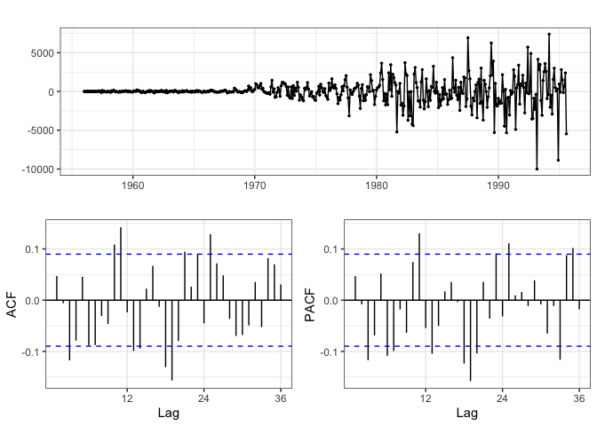

# Question 1

<i>The `forecast` package contains a dataset called `gas` which contains monthly gas production in Australia between 1956 and 1995. Fit an appropriate seasonal ARIMA model to these data, choose and justify your choice of $p$, $d$, and $q$ for the local and seasonal components. Be sure to include any EDA and residual analyses you perform.</i>


```
## Series: gas 
## ARIMA(2,1,1)(0,1,1)[12] 
## 
## Coefficients:
##          ar1     ar2      ma1     sma1
##       0.3756  0.1457  -0.8620  -0.6216
## s.e.  0.0780  0.0621   0.0571   0.0376
## 
## sigma^2 estimated as 2587081:  log likelihood=-4076.58
## AIC=8163.16   AICc=8163.29   BIC=8183.85
```

## EDA

<!-- --><!-- -->

## Seasonal ARIMA 

First, I want to difference and then exam the seasonal pattern. There is an obvious pattern at 12 months.


```
## Series: gas 
## ARIMA(0,0,0)(0,1,0)[12] 
## 
## sigma^2 estimated as 7746643:  log likelihood=-4338.55
## AIC=8679.1   AICc=8679.11   BIC=8683.24
## 
## Training set error measures:
##                    ME     RMSE     MAE      MPE     MAPE      MASE      ACF1
## Training set 1257.762 2747.972 1818.53 7.118896 8.766263 0.9748175 0.6403252
```

<!-- -->

After differencing the seasonal component, I see big spikes at 12, 24, and 36 in the PACF and constant decay in the ACF. I will first try fitting a seasonal MA component. 


```
## Series: gas 
## ARIMA(0,0,0)(0,1,1)[12] 
## 
## Coefficients:
##         sma1
##       0.0771
## s.e.  0.0383
## 
## sigma^2 estimated as 7693792:  log likelihood=-4336.5
## AIC=8676.99   AICc=8677.02   BIC=8685.27
## 
## Training set error measures:
##                    ME     RMSE      MAE     MPE     MAPE     MASE      ACF1
## Training set 1170.348 2735.629 1792.086 6.67555 8.531484 0.960642 0.6270023
```

<!-- -->

The pattern in the ACF and PACF is still there, so now we move to regular ARIMA. 

## Regular ARIMA 


```
## Series: gas 
## ARIMA(0,1,0)(0,1,1)[12] 
## 
## Coefficients:
##          sma1
##       -0.6990
## s.e.   0.0354
## 
## sigma^2 estimated as 3155705:  log likelihood=-4124.82
## AIC=8253.65   AICc=8253.68   BIC=8261.92
## 
## Training set error measures:
##                    ME     RMSE      MAE        MPE   MAPE      MASE       ACF1
## Training set 3.912033 1750.111 967.7101 0.03830377 4.0542 0.5187379 -0.3397075
```

<!-- -->

Definitely want to add an MA(1) after differencing. The ACF definitely does not show obvious signs of AR. 


```
## Series: gas 
## ARIMA(0,1,1)(0,1,1)[12] 
## 
## Coefficients:
##           ma1     sma1
##       -0.5256  -0.5862
## s.e.   0.0499   0.0373
## 
## sigma^2 estimated as 2651982:  log likelihood=-4082.73
## AIC=8171.46   AICc=8171.51   BIC=8183.87
## 
## Training set error measures:
##                    ME     RMSE      MAE        MPE     MAPE      MASE      ACF1
## Training set 14.93769 1602.626 907.0786 0.06078409 3.936888 0.4862366 0.0471891
```

<!-- -->

Most of the structure is gone, but we can add another AR(1) term. 


```
## Series: gas 
## ARIMA(1,1,1)(0,1,1)[12] 
## 
## Coefficients:
##          ar1      ma1     sma1
##       0.2802  -0.7458  -0.6090
## s.e.  0.0969   0.0697   0.0387
## 
## sigma^2 estimated as 2614267:  log likelihood=-4079.23
## AIC=8166.47   AICc=8166.56   BIC=8183.02
## 
## Training set error measures:
##                    ME     RMSE      MAE      MPE     MAPE      MASE        ACF1
## Training set 21.93557 1589.463 904.7391 0.155913 3.950867 0.4849825 -0.02261516
```

<!-- -->

The additional AR(1) term didn't help much. Now let's try fitting these models: `s4`, `s5`, and `auto.arima`.

## Model Fit 

<!-- -->

There is barely any differencing in the predictions of these three models, so the best would be pick the simplest model, `ARIMA(0,1,1)(0,1,1)[12]`.

-----

# Question 2

<i>The `forecast` package also contains a dataset called `taylor` which contains Half-hourly electricity demand in England and Wales from Monday 5 June 2000 to Sunday 27 August 2000. Fit an appropriate seasonal ARIMA model to these data, choose and justify your choice of $p$, $d$, and $q$ for the local an seasonal components. Be sure to include any EDA and residual analyses you perform.</i>

## EDA 

<!-- -->

## Seasonal ARIMA 

ACF shows patterns at 336 This means the period should be 336. I will first see if differencing helps. 


```
## Series: taylor 
## ARIMA(0,0,0)(0,1,0)[336] 
## 
## sigma^2 estimated as 544831:  log likelihood=-29652.92
## AIC=59307.84   AICc=59307.84   BIC=59314.05
## 
## Training set error measures:
##                     ME     RMSE      MAE         MPE     MAPE      MASE
## Training set -12.36458 706.7025 522.3636 -0.06920955 1.768558 0.9210898
##                   ACF1
## Training set 0.9671997
```

<!-- -->

Differencing seems to help by removing some of the cyclical pattern. but now I want to try adding a seasonal MA(1) term. There are peaks at 336 and 672 in the PACF. 


There doesn't seem to be much change. I want to also try a seasonal AR(1) term, because the ACF decays to 0 at 336. 


Clearly, adding a seasonal AR(1) or MA(1) doesn't help.

## Regular ARIMA 

We can see if regular differencing helps. 


```
## Series: taylor 
## ARIMA(0,1,0)(0,1,0)[336] 
## 
## sigma^2 estimated as 35684:  log likelihood=-24612.66
## AIC=49227.32   AICc=49227.32   BIC=49233.54
## 
## Training set error measures:
##                      ME     RMSE      MAE          MPE      MAPE     MASE
## Training set -0.3811251 180.8353 121.2418 -0.003034272 0.4166816 0.213787
##                   ACF1
## Training set 0.1180797
```

<!-- -->

Differencing definitely helps. We can also do an MA(1) term because there is a big peak in the PACF. 


```
## Series: taylor 
## ARIMA(0,1,1)(0,1,0)[336] 
## 
## Coefficients:
##          ma1
##       0.1241
## s.e.  0.0165
## 
## sigma^2 estimated as 35169:  log likelihood=-24585.33
## AIC=49174.67   AICc=49174.67   BIC=49187.1
## 
## Training set error measures:
##                      ME     RMSE      MAE          MPE      MAPE      MASE
## Training set -0.3577354 179.5023 120.7958 -0.002776326 0.4155676 0.2130007
##                      ACF1
## Training set -0.001233345
```

<!-- -->

<!-- -->

-----

## Question 3

<i>Derive the **7** step ahead prediction, $E(y_{n+7}|y_n,\ldots,y_1,\ldots)$,</i>

a. <i>for an ARIMA(1,1,0)$\times$(1,1,0)_6 seasonal model</i>

$$ \begin{aligned}
~
\end{aligned} $$


b. <i>for an ARIMA(1,1,0)$\times$(0,1,1)_6 seasonal model</i>

$$ \begin{aligned}
~
\end{aligned} $$


-----

# Question 4

<i> Assume you are given a bivariate normal distribution, $Y = (y_1, y_2)^t$, with $\mu = (\mu_1, \mu_2)^t$ and $\Sigma = \begin{pmatrix}\sigma^2 & \rho \, \sigma^2 \\ \rho \, \sigma^2 & \sigma^2\end{pmatrix}$ where $\sigma > 0$ and $0 \leq \rho \leq 1$. </i>'

<br/>

a. <i> Show that the marginal distribution of $y_1$ is given by $y_1 \sim \mathcal{N}(\mu_1, \sigma^2)$.</i>

$$\begin{aligned}
~
\end{aligned}$$

b. <i> Show that the conditional distribution of $y_1|y_2 = a$ is given by $y_1|y_2 = a \sim \mathcal{N}(\mu_1 + \rho(a-\mu_2),\sigma^2-\rho^2\sigma^2).$</i>

$$\begin{aligned}
~
\end{aligned}$$

-----

# Question 5

a. <i> Construct a Gibbs sampler for generating 1000 samples from a multivariate normal distribution where </i>
$$
\mu = (1,2,3)^t \\
\\
\Sigma = \begin{pmatrix} 
3   & 0.5 & 1   \\
0.5 & 2   & 1.5 \\
1   & 1.5 & 3.5
\end{pmatrix}
$$


b. <i> Using the matrix "square root" method described in class, generate another 1000 samples from the multivariate normal described above. </i>


c. <i> For both sampling method create 3 bivariate density plots showing the relationship between each pair of dimensions (e.g. 1 vs. 2, 2 vs. 3, 1 vs 3). Compare these plots between the sampling methods and note any similarity or discrepancies. </i>


-----

# Question 6

<i>This repository includes two rds files called `gp.rds` and `gp_truth.rds` that contains observed data as well as sample from the underlying true process respectively.</i> 

a. <i>Fit a Gaussian process model by first fitting a linear model to the data and then examining any remaining dependence using a variogram. Based on the variogram (roughly) estimate $\sigma^2$, $l$, and $\sigma^2_w$. Using this estimates along with the $\beta$s from the lm construct an appropriate multivariate normal distribution for these data and construct the appropriate predictive distribution at the `x` locations given in `gp_truth`. Generate at least 1000 samples from this distribution, using these draws create a best fit line and prediction interval for your model.</i>


```
## 
## Call:
## lm(formula = y ~ x + I(x^2) + I(x^3) + I(x^4), data = data)
## 
## Residuals:
##      Min       1Q   Median       3Q      Max 
## -1.13775 -0.34248 -0.01096  0.40837  0.97612 
## 
## Coefficients:
##             Estimate Std. Error t value Pr(>|t|)    
## (Intercept)   5.1047     0.2872  17.771   <2e-16 ***
## x            -0.3686     1.3615  -0.271   0.7876    
## I(x^2)        1.7171     1.9258   0.892   0.3765    
## I(x^3)       -1.5959     0.9844  -1.621   0.1107    
## I(x^4)        0.3297     0.1632   2.020   0.0483 *  
## ---
## Signif. codes:  0 '***' 0.001 '**' 0.01 '*' 0.05 '.' 0.1 ' ' 1
## 
## Residual standard error: 0.5666 on 55 degrees of freedom
## Multiple R-squared:  0.762,	Adjusted R-squared:  0.7446 
## F-statistic: 44.01 on 4 and 55 DF,  p-value: < 2.2e-16
```

<!-- -->

## Semivariogram - Squared Exponential Covariance

<!-- -->

The semivariograms all show the same pattern, which is a good indication. 


```
## # A tibble: 1 x 2
##    min_h min_g
##    <dbl> <dbl>
## 1 0.0261 0.121
```

From the semivariogram, assume $\sigma_w^2$ = 0.1212883. Say the semivariogram starts to asymptote at gamma = 2.5, so $\sigma^2$ = 2.5 - 0.1212883 = 2.378712. I want to first try using a squared exponential covariance function with the correlation < 0.05. Thus, let $d = \sqrt3 / l$. Say the semivariogram starts to asymptote at h = 1.6. Then, $l$ = 1.082532. I want to plot these values just to see if they make sense. 

<!-- -->

They look pretty good. 

## Sampling - Betas & Squared Exponential Covariance


## Prediction - Betas & Squared Exponential Covariance

<!-- -->

Compared to the linear model, the Gaussian Process (with $\beta$s and squared exponential covariance) seems to be an improvement. However, I want to try fitting the GP with a exponential covariance function too. 

## Prediction - Betas & Exponential Covariance

Only difference here is that $l = 3/h = 3/1.6$. 

<!-- -->

This looks better: it's catching more of the oscillation for `x` < 1, but struggling for 1 < `x` < 2. I want to try a powered exponential covariance, with `p` = 1.5. 

## Prediction - Betas & Powered Exponential Covariance (p=1.5)

Only difference here is that $l = 3 ^{(2/3)}/h = 1.300052$. 

<!-- -->

It seems like the powered exponential covariance, with p = 1.5 is the best at capturing the pattern in the data. 
b. <i>Fit a full Bayesian Gaussian process model using JAGs or similar software. Make sure to think about what covariance function seems appropriate and include any relevant mean structure. Generate draws from the full posterior predictive distribution at the `x` locations given in `gp_truth`, use draw a best fit line and posterior predictive credible intervalfor your model.</i>

Based on the previous GP, I will first use a powered exponential covariance to fit the Bayesian models. 

# Bayesian GP Model - Mean 0, Powered Exponential Covariance (p=1.5)


## Trace Plots / MCMC Diagnostics 

<!-- -->

## Prediction - Bayesian 

<!-- -->

This seems pretty good! However, it seems that the initial GP model with a powered exponential covariance is slightly better. 

# Bayesian GP Model with Betas, Powered Exponential Covariance (p=1.5)


## Trace Plots - Betas

<!-- -->

Definitely correlated (beta4 and beta5 peak and dip at same time)

## Trace Plots - Covariance Parameters

<!-- -->

These are also okay, but they are also slightly correlated (l peaks when sigma2 dips)

## Prediction 


<!-- -->

c. <i>Compare the predictive performance of both approaches, using the `y` values in `gp_truth`. Which method appeared to perform better? Why?</i>

<!-- -->
