### Question 1

4.6.2 from Banerjee, Carlin, Gelfand (2nd ed.) - Suppose $Y_1$ and $Y_2$ are both binary variables, and their joint distribution is defined through conditional logit models. That is,

$$ \log \frac{P(Y_1=1|Y_2)}{P(Y_1=0|Y_2)} = \alpha_0 + \alpha_1 \, Y_2 
\text{ and } 
\log \frac{P(Y_2=1|Y_1)}{P(Y_2=0|Y_1)} = \beta_0 + \beta_1 \, Y_1 $$

Obtain the joint distribution of $Y_1$ and $Y_2$. Describe any necessary constraints on the values of $\alpha_0$, $\alpha_1$, $\beta_0$, and $\beta_1$.


$$ ~ $$

-----

### Question 2

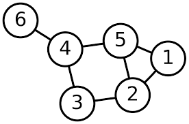

a. Derive a weight matrix using the network diagram above. Connected nodes should be indicated with a `1` all other entries should be 0.


$$
W = \begin{pmatrix}\end{pmatrix}
$$

b. Given that $\boldsymbol\sigma^2 = (\sigma_1^2, \sigma_2^2,\ldots,\sigma_6^2)$ and $\boldsymbol\epsilon \sim \mathcal{N}(\boldsymbol{0},\, \boldsymbol{I}\,\boldsymbol\sigma^2)$ derive the values of $\boldsymbol\Sigma$ and $\boldsymbol\Sigma^{-1}$ for a CAR model.

$$ \boldsymbol\Sigma^{-1} = \begin{pmatrix}\end{pmatrix}$$

c. Repeat b. using an SAR model.

$$ \boldsymbol\Sigma^{-1} = \begin{pmatrix}\end{pmatrix}$$

-----

### Question 3

The data folder in this repository contains two shapefiles describing congressional district boundaries for the 112th (2011-2013) and 114th (2015-2017) congress.


```r
nc112 = st_read('data/nc_districts112.shp', quiet=TRUE, stringsAsFactors=TRUE)
nc114 = st_read('data/nc_districts114.shp', quiet=TRUE, stringsAsFactors=TRUE)
nc=st_read("nc_counties.gpkg", quiet=TRUE)


plot(nc112[,"DISTRICT"])
```

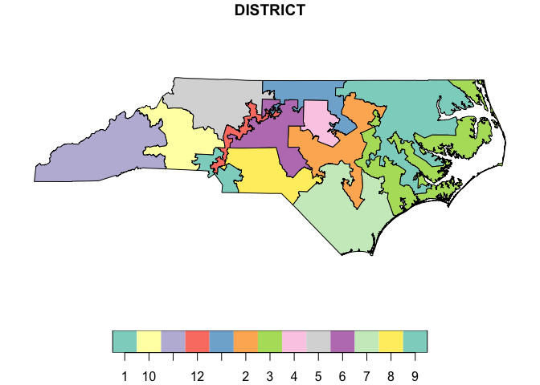<!-- -->

```r
plot(nc114[,"DISTRICT"])
```

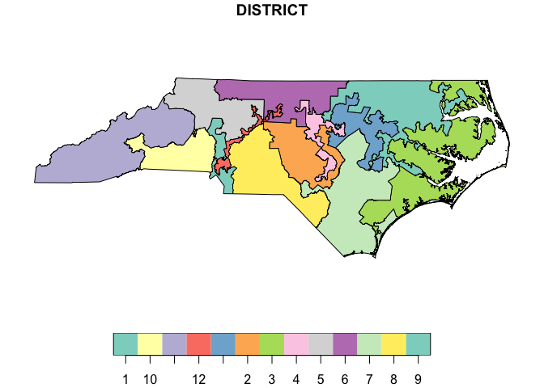<!-- -->


a. A simplistic metric of distrinct compactness is the isoperimetric quotient, which is defined as the ratio of a shape's area to the area of a circle that has the same perimeter. Calculate and report this metric for all districts in both data sets. Also assesses if average compactness has changed between the 112th and 114th congress and if so in what direction?


```r
nc112_perim = st_length(st_cast(nc112, "MULTILINESTRING"))
nc114_perim = st_length(st_cast(nc114, "MULTILINESTRING"))
nc112_circle_area = (nc112_perim^2) / (4*pi)
nc114_circle_area = (nc114_perim^2) / (4*pi)
nc112$isoperimetric_quotient = as.double(st_area(nc112) / nc112_circle_area)
nc114$isoperimetric_quotient = as.double(st_area(nc114) / nc114_circle_area)

gridExtra::grid.arrange(
  ggplot(nc112) + 
    geom_sf(aes(fill=isoperimetric_quotient)) + 
    labs(title = "NC112") + 
    scale_fill_gradient(low="blue", high="yellow"),
  ggplot(nc114) + 
    geom_sf(aes(fill=isoperimetric_quotient)) + 
    labs(title = "NC114") + 
    scale_fill_gradient(low="blue", high="yellow")
)
```

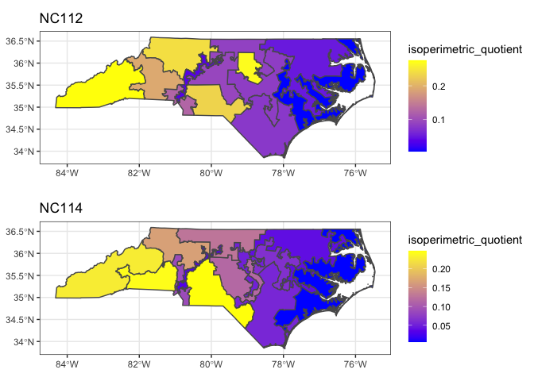<!-- -->

In general, the average compactness has not changed. The Western and Southwestern regions of NC have the highest isoperimetric quotient, but it decreases as we move East. The one outlier in the 112th Congress is the small yellow region in the middle of NC, but the average compactness in that region **decreases** in the 114th Congress.

b. Using NC county boundaries, generate a data set containing the congression boundaries of only Durham, Orange and Wake Counties. Plot these boundaries.


```r
congress_boundaries112 = st_intersection(filter(nc, COUNTY == "Durham County" | 
                                                  COUNTY == "Wake County" | 
                                                  COUNTY == "Orange County") %>% 
                                           st_transform(st_crs(nc112)), 
                                         nc112) 


gridExtra::grid.arrange(
  ggplot(congress_boundaries112) + 
    geom_sf(aes(fill=DISTRICT)) + 
    theme(legend.position="bottom") 
  ,
  ggplot(congress_boundaries112) + 
    geom_sf(aes(fill=COUNTY)) + 
    theme(legend.position="bottom", legend.direction = "vertical") 
  ,
  ncol=2, top = "NC112"
)
```

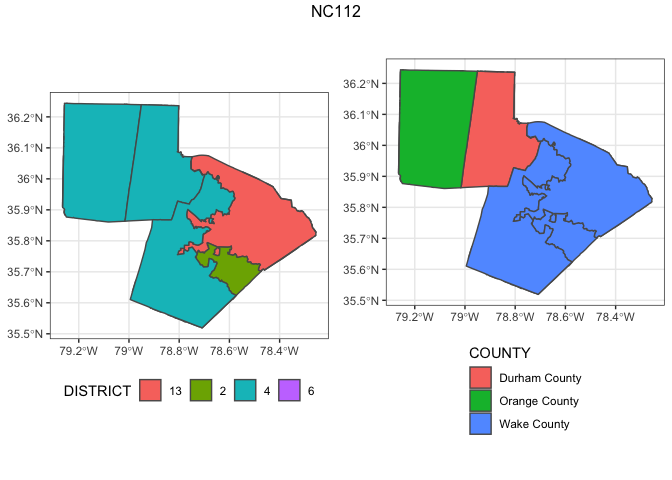<!-- -->

```r
congress_boundaries114 = st_intersection(filter(nc, COUNTY == "Durham County" | 
                                                  COUNTY == "Wake County" | 
                                                  COUNTY == "Orange County") %>% 
                                           st_transform(st_crs(nc114)), 
                                         nc114) 

gridExtra::grid.arrange(
  ggplot(congress_boundaries114) + 
    geom_sf(aes(fill=DISTRICT)) + 
    theme(legend.position="bottom") 
  ,
  ggplot(congress_boundaries114) + 
    geom_sf(aes(fill=COUNTY)) + 
    theme(legend.position="bottom", legend.direction = "vertical") 
  ,
  ncol=2, top = "NC114"
)
```

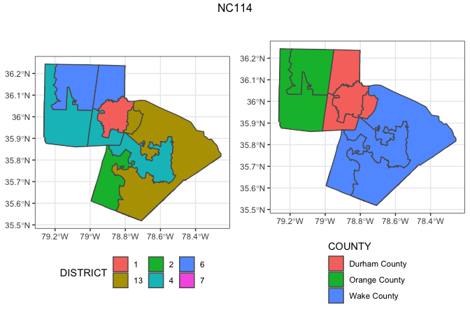<!-- -->

c. Create a map showing which regions of NC had their congressional district change between the 112th and 114th congress.


```r
g = ggplot()
for (one in nc114$DISTRICT) {
  data = st_sym_difference(nc114 %>% filter(DISTRICT==one),
                           nc112 %>% filter(DISTRICT==one))
  
  g = g + 
    geom_sf(data = data, col="NA", fill="lightblue") + 
    geom_sf(data=nc, fill=NA)
}

g
```

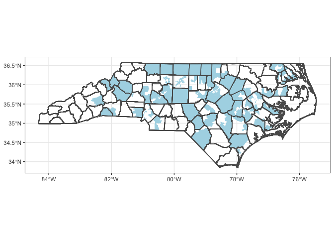<!-- -->

-----

### Question 4

The data directory also contains data on Medicaid program quality scores for the lower 48 U.S. contiguous states in 1986. The data can be loaded as follows.


```r
mc = st_read('data/medicaid1986.shp', quiet=TRUE, stringsAsFactors=TRUE)

par(mfrow=c(1,2))
hist(mc$PQS)
qqnorm(mc$PQS)
qqline(mc$PQS)
```

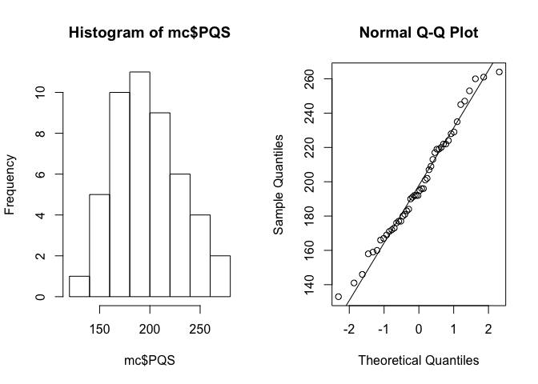<!-- -->

```r
plot(mc[,"PQS"])
```

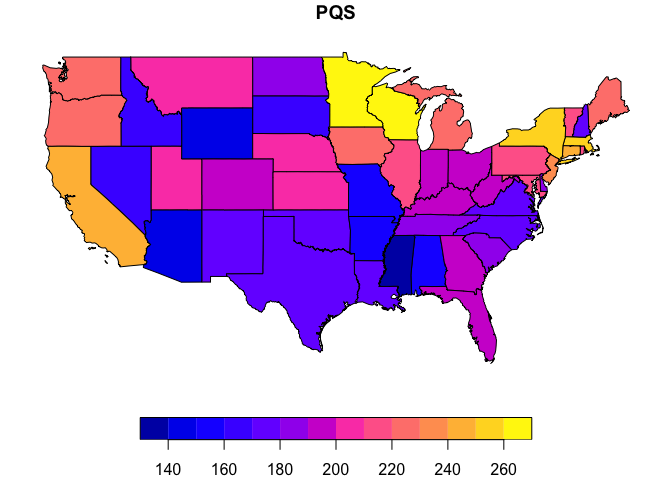<!-- -->

a. Construct a weight matrix using adjacency as determined by intersecting boundaries between the states (i.e. touching).


```r
listW = mat2listw(st_touches(mc, sparse=FALSE))
```

b. Using this weight matrix calculate Moran's I or Geary's C using the `PQS` column in the data. Do your results suggest autocorrelation? If so what kind?


```r
spdep::moran.test(mc$PQS, listw = listW)
```

```
## 
## 	Moran I test under randomisation
## 
## data:  mc$PQS  
## weights: listW    
## 
## Moran I statistic standard deviate = 4.1465, p-value = 1.688e-05
## alternative hypothesis: greater
## sample estimates:
## Moran I statistic       Expectation          Variance 
##       0.357181730      -0.021276596       0.008330514
```

```r
spdep::geary.test(mc$PQS, listw = listW)
```

```
## 
## 	Geary C test under randomisation
## 
## data:  mc$PQS 
## weights: listW 
## 
## Geary C statistic standard deviate = 3.3876, p-value = 0.0003525
## alternative hypothesis: Expectation greater than statistic
## sample estimates:
## Geary C statistic       Expectation          Variance 
##        0.62996661        1.00000000        0.01193165
```

Both Moran's I and Geary's C show p-values close to 0, indicating there is spatial autocorrelation. A Moran's I > 0 and a Geary's C < 1 indicates there is weak **positive** spatial autocorrelation.

c. Fit a CAR model for `PQS` using the weight matrix from a. Does your fitted value of $\phi$ agree with your conclusion in b.?


```r
mc_car = spatialreg::spautolm(formula = PQS ~ 1,
                              data=mc,
                              listw = listW,
                              family = "CAR")

summary(mc_car)
```

```
## 
## Call: spatialreg::spautolm(formula = PQS ~ 1, data = mc, listw = listW, 
##     family = "CAR")
## 
## Residuals:
##      Min       1Q   Median       3Q      Max 
## -53.0006 -20.2010  -2.5412  21.5905  53.7468 
## 
## Coefficients: 
##             Estimate Std. Error z value  Pr(>|z|)
## (Intercept) 211.4794     8.3384  25.362 < 2.2e-16
## 
## Lambda: 0.17726 LR test value: 11.965 p-value: 0.00054213 
## Numerical Hessian standard error of lambda: 0.011993 
## 
## Log likelihood: -228.5424 
## ML residual variance (sigma squared): 699.87, (sigma: 26.455)
## Number of observations: 48 
## Number of parameters estimated: 3 
## AIC: 463.08
```

A small value of phi indicates that there is weak spatial autocorrelation. Phi is positive --> positive spatial autocorrelation


```r
mc$fitted = mc_car$fit$fitted.values

mc %>% 
  select(PQS, fitted, geometry) %>%
  tidyr::gather(type, value, -geometry) %>%
  ggplot() + 
  geom_sf(aes(fill=value)) + 
  facet_grid(type~.)
```

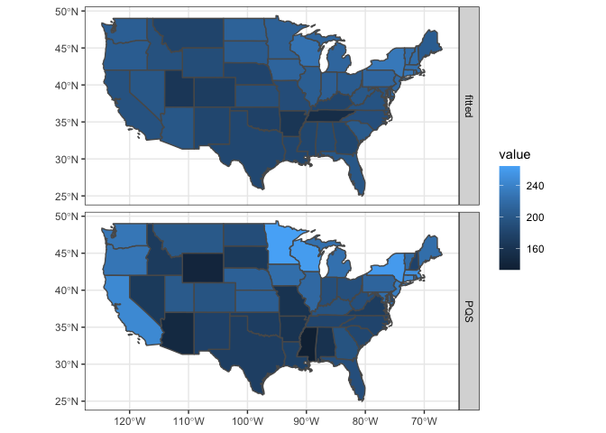<!-- -->

The predicted and observed values aren't actually that close. The fitted values are much smoother. 

d. Calculate residuals for each state, comment on where the model fits well and where it does not. Does it appear that there still may be unaccounted for spatial structure?


```r
mc$resids <- mc_car$fit$residuals

plot(mc[,"resids"])
```

<!-- -->

Looking at the residuals, it seems the model generally fits well in the Midwest, Southeast, and the East Coast

There still seems to be some spatial structure. Looking at NM, Texas, Oklahoma, Arkansas, and Lousiana, they all have the "same" residual. Nearby states also still have similar residuals (NC & SC), (Indiana & Ohio), etc. 

-----

### Question 5

In this question you will repeat the analysis in Question 4 after aggregating the medicaid data to a regional level. You will have to merge the geometries using their `SUB_REGION` value (e.g. California, Oregon, and Washington should be a single unioned multipolygon for the Pacific region) as well as aggregate `PQS` values (using the mean of the included states).

a. Create an updated sf objected containing the joined regional data.


```r
mc_regional = mc %>%
  group_by(SUB_REGION) %>%
  summarise(PQS = sum(PQS))
```

b. Use a cholropleth plot to display the regional values of `PQS`.


```r
ggplot(data=mc_regional) + 
  geom_sf(aes(fill=PQS)) + 
   geom_sf_label(aes(label = PQS))
```

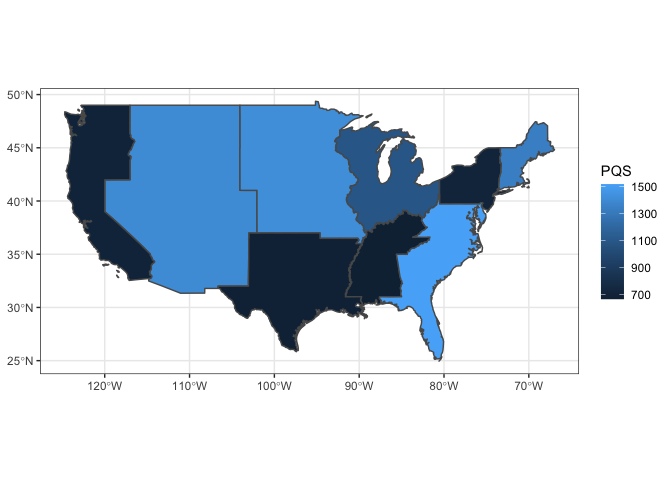<!-- -->


c. Construct a weight matrix using adjacency as determined by intersecting boundaries between the regions (i.e. touching).


```r
listW_regional = mat2listw(st_touches(mc_regional, sparse=F))
```

d. Using this weight matrix calculate Moran's I or Geary's C using the `PQS` column in the data. Do your results suggest autocorrelation? If so what kind?


```r
moran.test(mc_regional$PQS, listW_regional)
```

```
## 
## 	Moran I test under randomisation
## 
## data:  mc_regional$PQS  
## weights: listW_regional    
## 
## Moran I statistic standard deviate = -1.4108, p-value = 0.9208
## alternative hypothesis: greater
## sample estimates:
## Moran I statistic       Expectation          Variance 
##       -0.44363112       -0.12500000        0.05100913
```

```r
geary.test(mc_regional$PQS, listW_regional)
```

```
## 
## 	Geary C test under randomisation
## 
## data:  mc_regional$PQS 
## weights: listW_regional 
## 
## Geary C statistic standard deviate = -1.3281, p-value = 0.9079
## alternative hypothesis: Expectation greater than statistic
## sample estimates:
## Geary C statistic       Expectation          Variance 
##        1.28109820        1.00000000        0.04479494
```

Both Moran's I and Geary's C have high p-values, indicating there is spatial autocorrelation. The negative Moran's I value and Geary's C > 1 indicate **negative** spatial autocorrelation. 

e. Fit a CAR model for `PQS` using the weight matrix from a. Does your fitted value of $\phi$ agree with your conclusion in b.?

## Frequentist CAR Model 


```r
mc_log_car = spatialreg::spautolm(PQS ~ 1,
                                  data = mc_regional, 
                                  listw = listW_regional,
                                  family="CAR")

summary(mc_log_car)
```

```
## 
## Call: 
## spatialreg::spautolm(formula = PQS ~ 1, data = mc_regional, listw = listW_regional, 
##     family = "CAR")
## 
## Residuals:
##      Min       1Q   Median       3Q      Max 
## -247.396 -192.617   55.144  142.632  179.332 
## 
## Coefficients: 
##             Estimate Std. Error z value  Pr(>|z|)
## (Intercept) 1060.327     51.008  20.788 < 2.2e-16
## 
## Lambda: -0.43539 LR test value: 4.1345 p-value: 0.042018 
## Numerical Hessian standard error of lambda: 0.087882 
## 
## Log likelihood: -63.31933 
## ML residual variance (sigma squared): 52870, (sigma: 229.93)
## Number of observations: 9 
## Number of parameters estimated: 3 
## AIC: 132.64
```

Phi is negative --> negative spatial autocorrelation

### Prediction


```r
mc_regional$fitted = mc_log_car$fit$fitted.values

mc_regional %>% 
  select(PQS, fitted, geometry) %>%
  tidyr::gather(type, value, -geometry) %>%
  ggplot() + 
  geom_sf(aes(fill=value)) + 
  facet_grid(type~.)
```

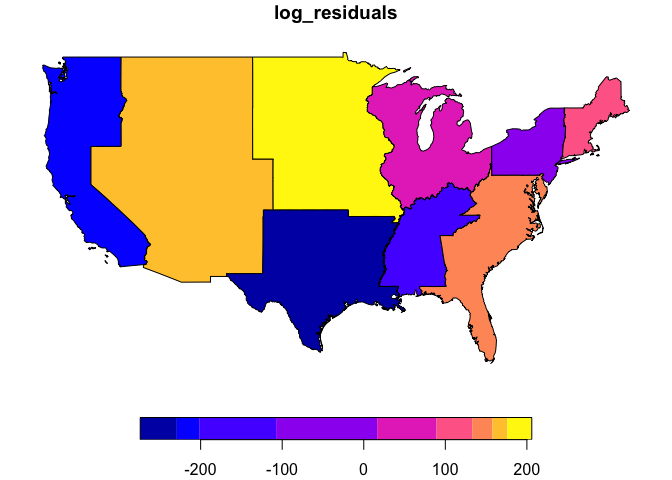<!-- -->

The predictions are slightly better, but still pretty smooth. 

f. Calculate residuals for each region and comment on where the model fits well and where it does not. Does it appear that there still may be unaccounted for spatial structure?


```r
mc_regional$log_residuals = mc_log_car$fit$residuals

plot(mc_regional[,"log_residuals"]) 
```

<!-- -->

The residuals are more "spread out" and the pattern is less obvious. There is still some spatial autocorrelation (two dark-ish blue regions in South that are touching) but it is a little better than the non-grouped model. 


