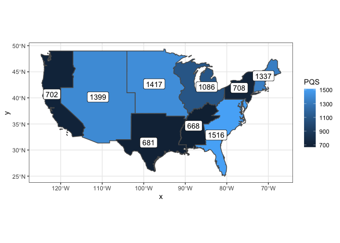
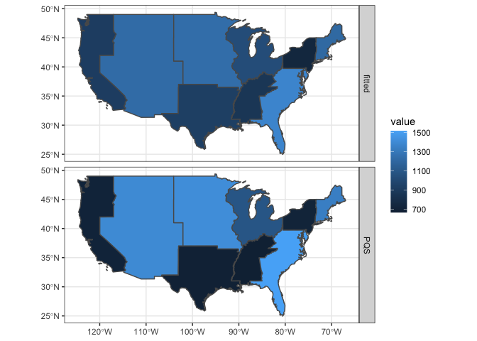

### Question 1

4.6.2 from Banerjee, Carlin, Gelfand (2nd ed.) - Suppose $Y_1$ and $Y_2$ are both binary variables, and their joint distribution is defined through conditional logit models. That is,

$$ \log \frac{P(Y_1=1|Y_2)}{P(Y_1=0|Y_2)} = \alpha_0 + \alpha_1 \, Y_2 
\text{ and } 
\log \frac{P(Y_2=1|Y_1)}{P(Y_2=0|Y_1)} = \beta_0 + \beta_1 \, Y_1 $$

Obtain the joint distribution of $Y_1$ and $Y_2$. Describe any necessary constraints on the values of $\alpha_0$, $\alpha_1$, $\beta_0$, and $\beta_1$.


$$ ~ $$

-----

### Question 2


a. Derive a weight matrix using the network diagram above. Connected nodes should be indicated with a `1` all other entries should be 0.


$$
W = \begin{pmatrix}\end{pmatrix}
$$

b. Given that $\boldsymbol\sigma^2 = (\sigma_1^2, \sigma_2^2,\ldots,\sigma_6^2)$ and $\boldsymbol\epsilon \sim \mathcal{N}(\boldsymbol{0},\, \boldsymbol{I}\,\boldsymbol\sigma^2)$ derive the values of $\boldsymbol\Sigma$ and $\boldsymbol\Sigma^{-1}$ for a CAR model.

$$ \boldsymbol\Sigma^{-1} = \begin{pmatrix}\end{pmatrix}$$

c. Repeat b. using an SAR model.

$$ \boldsymbol\Sigma^{-1} = \begin{pmatrix}\end{pmatrix}$$

-----

### Question 3

The data folder in this repository contains two shapefiles describing congressional district boundaries for the 112th (2011-2013) and 114th (2015-2017) congress.


```r
nc112 = st_read('data/nc_districts112.shp', quiet=TRUE, stringsAsFactors=TRUE)
nc114 = st_read('data/nc_districts114.shp', quiet=TRUE, stringsAsFactors=TRUE)
nc=st_read("nc_counties.gpkg", quiet=TRUE)


plot(nc112[,"DISTRICT"])
```

<!-- -->

```r
plot(nc114[,"DISTRICT"])
```

<!-- -->


a. A simplistic metric of distrinct compactness is the isoperimetric quotient, which is defined as the ratio of a shape's area to the area of a circle that has the same perimeter. Calculate and report this metric for all districts in both data sets. Also assesses if average compactness has changed between the 112th and 114th congress and if so in what direction?


```r
nc112_perim = st_length(st_cast(nc112, "MULTILINESTRING"))
nc114_perim = st_length(st_cast(nc114, "MULTILINESTRING"))
nc112_circle_area = (nc112_perim^2) / (4*pi)
nc114_circle_area = (nc114_perim^2) / (4*pi)
nc112$isoperimetric_quotient = as.double(st_area(nc112) / nc112_circle_area)
nc114$isoperimetric_quotient = as.double(st_area(nc114) / nc114_circle_area)

gridExtra::grid.arrange(
  ggplot(nc112) + 
    geom_sf(aes(fill=isoperimetric_quotient)) + 
    labs(title = "NC112") + 
    scale_fill_gradient(low="blue", high="yellow"),
  ggplot(nc114) + 
    geom_sf(aes(fill=isoperimetric_quotient)) + 
    labs(title = "NC114") + 
    scale_fill_gradient(low="blue", high="yellow")
)
```

<!-- -->

In general, the average compactness has not changed. The Western and Southwestern regions of NC have the highest isoperimetric quotient, but it decreases as we move East. The one outlier in the 112th Congress is the small yellow region in the middle of NC, but the average compactness in that region **decreases** in the 114th Congress.

b. Using NC county boundaries, generate a data set containing the congression boundaries of only Durham, Orange and Wake Counties. Plot these boundaries.


```r
ggplot() + 
  geom_sf(data=nc112, aes(fill = DISTRICT), alpha = 0.4) + 
  geom_sf(data=nc %>% filter(COUNTY == "Durham County" | 
                               COUNTY == "Wake County" | 
                               COUNTY == "Orange County"),
          fill="blue", alpha = 0.9)
```

<!-- -->


```r
congress_boundaries112 = st_intersection(filter(nc, COUNTY == "Durham County" | 
                                                  COUNTY == "Wake County" | 
                                                  COUNTY == "Orange County") %>% 
                                           st_transform(st_crs(nc112)), 
                                         nc112) 


gridExtra::grid.arrange(
  ggplot(congress_boundaries112) + 
    geom_sf(aes(fill=DISTRICT)) + 
    theme(legend.position="bottom") 
  ,
  ggplot(congress_boundaries112) + 
    geom_sf(aes(fill=COUNTY)) + 
    theme(legend.position="bottom", legend.direction = "vertical") 
  ,
  ncol=2, top = "NC112"
)
```

<!-- -->

```r
congress_boundaries114 = st_intersection(filter(nc, COUNTY == "Durham County" | 
                                                  COUNTY == "Wake County" | 
                                                  COUNTY == "Orange County") %>% 
                                           st_transform(st_crs(nc114)), 
                                         nc114) 

gridExtra::grid.arrange(
  ggplot(congress_boundaries114) + 
    geom_sf(aes(fill=DISTRICT)) + 
    theme(legend.position="bottom") 
  ,
  ggplot(congress_boundaries114) + 
    geom_sf(aes(fill=COUNTY)) + 
    theme(legend.position="bottom", legend.direction = "vertical") 
  ,
  ncol=2, top = "NC114"
)
```

<!-- -->

c. Create a map showing which regions of NC had their congressional district change between the 112th and 114th congress.


```r
g = ggplot()
for (one in nc114$DISTRICT) {
  data = st_sym_difference(nc114 %>% filter(DISTRICT==one),
                           nc112 %>% filter(DISTRICT==one))
  
  g = g + 
    geom_sf(data = data, col="NA", fill="lightblue") + 
    geom_sf(data=nc, fill=NA)
}

g
```

<!-- -->

-----

### Question 4

The data directory also contains data on Medicaid program quality scores for the lower 48 U.S. contiguous states in 1986. The data can be loaded as follows.


```r
mc = st_read('data/medicaid1986.shp', quiet=TRUE, stringsAsFactors=TRUE)

par(mfrow=c(1,2))
hist(mc$PQS)
qqnorm(mc$PQS)
qqline(mc$PQS)
```

<!-- -->

```r
plot(mc[,"PQS"])
```

<!-- -->

a. Construct a weight matrix using adjacency as determined by intersecting boundaries between the states (i.e. touching).


```r
listW = mat2listw(st_touches(mc, sparse=FALSE))
```

b. Using this weight matrix calculate Moran's I or Geary's C using the `PQS` column in the data. Do your results suggest autocorrelation? If so what kind?


```r
spdep::moran.test(mc$PQS, listw = listW)
```

```
## 
## 	Moran I test under randomisation
## 
## data:  mc$PQS  
## weights: listW    
## 
## Moran I statistic standard deviate = 4.1465, p-value = 1.688e-05
## alternative hypothesis: greater
## sample estimates:
## Moran I statistic       Expectation          Variance 
##       0.357181730      -0.021276596       0.008330514
```

```r
spdep::geary.test(mc$PQS, listw = listW)
```

```
## 
## 	Geary C test under randomisation
## 
## data:  mc$PQS 
## weights: listW 
## 
## Geary C statistic standard deviate = 3.3876, p-value = 0.0003525
## alternative hypothesis: Expectation greater than statistic
## sample estimates:
## Geary C statistic       Expectation          Variance 
##        0.62996661        1.00000000        0.01193165
```

Both Moran's I and Geary's C show p-values close to 0, indicating there is spatial autocorrelation. A Moran's I > 0 and a Geary's C < 1 indicates there is weak **positive** spatial autocorrelation.

c. Fit a CAR model for `PQS` using the weight matrix from a. Does your fitted value of $\phi$ agree with your conclusion in b.?


```r
mc_car = spatialreg::spautolm(formula = PQS ~ 1,
                              data=mc,
                              listw = listW,
                              family = "CAR")

summary(mc_car)
```

```
## 
## Call: spatialreg::spautolm(formula = PQS ~ 1, data = mc, listw = listW, 
##     family = "CAR")
## 
## Residuals:
##      Min       1Q   Median       3Q      Max 
## -53.0006 -20.2010  -2.5412  21.5905  53.7468 
## 
## Coefficients: 
##             Estimate Std. Error z value  Pr(>|z|)
## (Intercept) 211.4794     8.3384  25.362 < 2.2e-16
## 
## Lambda: 0.17726 LR test value: 11.965 p-value: 0.00054213 
## Numerical Hessian standard error of lambda: 0.011993 
## 
## Log likelihood: -228.5424 
## ML residual variance (sigma squared): 699.87, (sigma: 26.455)
## Number of observations: 48 
## Number of parameters estimated: 3 
## AIC: 463.08
```

A small value of phi indicates that there is weak spatial autocorrelation. Phi is positive --> positive spatial autocorrelation


```r
mc$fitted = mc_car$fit$fitted.values

mc %>% 
  select(PQS, fitted, geometry) %>%
  tidyr::gather(type, value, -geometry) %>%
  ggplot() + 
  geom_sf(aes(fill=value)) + 
  facet_grid(type~.)
```

<!-- -->

The predicted and observed values aren't actually that close. The fitted values are much smoother. 

d. Calculate residuals for each state, comment on where the model fits well and where it does not. Does it appear that there still may be unaccounted for spatial structure?


```r
mc$resids <- mc_car$fit$residuals

plot(mc[,"resids"])
```

<!-- -->

Looking at the residuals, it seems the model generally fits well in the Midwest, Southeast, and the East Coast

There still seems to be some spatial structure. Looking at NM, Texas, Oklahoma, Arkansas, and Lousiana, they all have the "same" residual. Nearby states also still have similar residuals (NC & SC), (Indiana & Ohio), etc. 

-----

### Question 5

In this question you will repeat the analysis in Question 4 after aggregating the medicaid data to a regional level. You will have to merge the geometries using their `SUB_REGION` value (e.g. California, Oregon, and Washington should be a single unioned multipolygon for the Pacific region) as well as aggregate `PQS` values (using the mean of the included states).

a. Create an updated sf objected containing the joined regional data.


```r
mc_regional = mc %>%
  group_by(SUB_REGION) %>%
  summarise(PQS = sum(PQS))

ggplot() + 
  geom_sf(data=mc_regional, aes(fill=PQS))
```

<!-- -->

b. Use a cholropleth plot to display the regional values of `PQS`.


```r
library(leaflet)
bins <- c(600,800,1000,1200,1400,1600)
pal <- colorBin("YlOrRd", domain = mc_regional$PQS, bins = bins)
labels <- sprintf(
  "<strong>%s</strong><br/>PQS: %g",
  mc_regional$SUB_REGION, mc_regional$PQS
) %>% 
  lapply(htmltools::HTML)

leaflet(mc_regional %>% st_transform('+proj=longlat +datum=WGS84')) %>%
  addTiles() %>%
  addPolygons(
    fillColor = ~pal(PQS),
    weight = 2,
    opacity = 1,
    color = "white",
    dashArray = "3",
    fillOpacity = 0.7,
    highlight = highlightOptions(
      weight = 5,
      color = "#666",
      dashArray = "",
      fillOpacity = 0.7,
      bringToFront = TRUE),
    label = labels,
    labelOptions = labelOptions(
      style = list("font-weight" = "normal", padding = "3px 8px"),
      textsize = "15px",
      direction = "auto")) %>% 
  addLegend(pal = pal, values = ~PQS, opacity = 0.7, title = NULL,
            position = "bottomright")
```

<!--html_preserve--><div id="htmlwidget-dbb622fb53012d385adb" style="width:672px;height:480px;" class="leaflet html-widget"></div>
<script type="application/json" data-for="htmlwidget-dbb622fb53012d385adb">{"x":{"options":{"crs":{"crsClass":"L.CRS.EPSG3857","code":null,"proj4def":null,"projectedBounds":null,"options":{}}},"calls":[{"method":"addTiles","args":["//{s}.tile.openstreetmap.org/{z}/{x}/{y}.png",null,null,{"minZoom":0,"maxZoom":18,"tileSize":256,"subdomains":"abc","errorTileUrl":"","tms":false,"noWrap":false,"zoomOffset":0,"zoomReverse":false,"opacity":1,"zIndex":1,"detectRetina":false,"attribution":"&copy; <a href=\"http://openstreetmap.org\">OpenStreetMap<\/a> contributors, <a href=\"http://creativecommons.org/licenses/by-sa/2.0/\">CC-BY-SA<\/a>"}]},{"method":"addPolygons","args":[[[[{"lng":[-88.5005645751953,-88.4377899169922,-88.2112884521484,-87.7880096435547,-87.7042694091797,-87.7373962402344,-87.9169311523437,-88.22216796875,-88.4127197265625,-88.4705429077148,-88.5941390991211,-88.5955123901367,-88.5005645751953],"lat":[47.2902565002441,47.3559761047363,47.4479217529297,47.470890045166,47.4160461425781,47.3931198120117,47.358097076416,47.2008285522461,46.988166809082,47.1115455627441,47.134838104248,47.2436676025391,47.2902565002441]}],[{"lng":[-88.4974594116211,-88.6252517700195,-88.9014663696289,-89.0285339355469,-89.1397933959961,-89.1928253173828,-89.2016983032227,-89.1560134887695,-88.4974594116211],"lat":[48.1739234924316,48.0332870483398,47.9603614807129,47.8507614135742,47.8241806030273,47.8447189331055,47.8839645385742,47.939338684082,48.1739234924316]}],[{"lng":[-88.0715637207031,-88.0878829956055,-88.3117065429688,-88.3591766357422,-88.4198532104492,-88.467643737793,-88.5113220214844,-88.5014266967773,-88.450698852539,-88.4225158691406,-88.4504699707031,-88.4767990112305,-88.4906997680664,-88.5172729492187,-88.5592727661133,-88.6142196655273,-88.6883697509766,-88.7391128540039,-88.7465057373047,-88.8632888793945,-88.932502746582,-88.9931716918945,-89.0650329589844,-89.1168212890625,-89.1463470458984,-89.169548034668,-89.1743316650391,-89.1502456665039,-89.1298599243164,-89.1935119628906,-89.2100524902344,-89.237678527832,-89.2640533447266,-89.2842330932617,-89.3032913208008,-89.309700012207,-89.2642440795898,-89.2620010375977,-89.2827682495117,-89.3109817504883,-89.3829498291016,-89.3799896240234,-89.4237976074219,-89.4405212402344,-89.4682159423828,-89.4653091430664,-89.4895935058594,-89.5138854980469,-89.5138854980469,-89.5005798339844,-89.4687423706055,-89.4357376098633,-89.4275741577148,-89.4536209106445,-89.4947814941406,-89.5249710083008,-89.5133666992188,-89.5191802978516,-89.5133743286133,-89.5215225219727,-89.5814361572265,-89.6664581298828,-89.6758575439453,-89.6910552978516,-89.7284469604492,-89.8517150878906,-89.8610458374023,-89.866813659668,-89.9005508422851,-89.937873840332,-89.9789123535156,-89.9582290649414,-90.0108108520508,-90.0419235229492,-90.1193389892578,-90.1347122192383,-90.2075271606445,-90.2540588378906,-90.2896347045898,-90.3367156982422,-90.3647689819336,-90.3693466186523,-90.3586883544922,-90.3396072387695,-90.3018417358398,-90.2657852172852,-90.26123046875,-90.2409439086914,-90.183708190918,-90.1835784912109,-90.2022399902344,-90.1965713500977,-90.1633987426758,-90.1351776123047,-90.1217269897461,-90.1131210327148,-90.1328125,-90.2439270019531,-90.2789306640625,-90.3197402954102,-90.4130706787109,-90.469841003418,-90.5304260253906,-90.5703277587891,-90.6272125244141,-90.6688766479492,-90.7060699462891,-90.7075881958008,-90.6903991699219,-90.7167358398438,-90.7181930541992,-90.7323379516602,-90.7380828857422,-90.7793426513672,-90.8504943847656,-90.9478912353516,-91.0363388061523,-91.0643844604492,-91.0936126708984,-91.1561889648438,-91.2032470703125,-91.3176651000977,-91.3670883178711,-91.373420715332,-91.3817138671875,-91.4491882324219,-91.4509887695312,-91.4340515136719,-91.4303894042969,-91.4472427368164,-91.4872894287109,-91.5040054321289,-91.516128540039,-91.5065460205078,-91.4989318847656,-91.4866943359375,-91.4485931396484,-91.418815612793,-91.385757446289,-91.3727569580078,-91.3853988647461,-91.3747940063477,-91.3821029663086,-91.4128723144531,-91.4111175537109,-91.3756103515625,-91.2620620727539,-91.2149124145508,-91.1624984741211,-91.1291580200195,-91.119987487793,-91.0927505493164,-91.0889053344727,-91.0492095947265,-90.9832763671875,-90.9607086181641,-90.9546508789062,-90.9577865600586,-90.9903411865234,-91.0182571411133,-91.0563201904297,-91.1015243530273,-91.1023483276367,-91.0732803344727,-91.0557861328125,-91.0274887084961,-91.0006942749023,-90.9496536254883,-90.8441390991211,-90.779899597168,-90.7082138061523,-90.6587905883789,-90.600700378418,-90.5408401489258,-90.4549942016602,-90.4349670410156,-90.4230041503906,-90.3483657836914,-90.3393478393555,-90.3411331176758,-90.3260269165039,-90.3048858642578,-90.2553100585938,-90.1958389282227,-90.1545181274414,-90.1426696777344,-90.1505355834961,-90.168098449707,-90.1666488647461,-90.1760864257812,-90.1915740966797,-90.2309341430664,-90.323600769043,-90.3677291870117,-90.4071731567383,-90.4179840087891,-90.4276809692383,-90.4415969848633,-90.4910430908203,-90.5635833740234,-90.605827331543,-90.6483459472656,-90.6517715454101,-90.6383285522461,-90.6255798339844,-90.6390914916992,-90.6642532348633,-90.6946640014648,-90.7454833984375,-90.8924179077148,-90.9192810058594,-90.9990539550781,-91.0660400390625,-91.081901550293,-91.0932998657226,-91.1389923095703,-91.1520843505859,-91.1596221923828,-91.1684417724609,-91.1612243652344,-91.0689239501953,-91.0662994384766,-91.078369140625,-91.1769180297852,-91.198112487793,-91.2107849121094,-91.2357711791992,-91.2234344482422,-91.2404251098633,-91.2328567504883,-91.2582550048828,-91.2587814331055,-91.2509689331055,-91.2918090820312,-91.3732147216797,-91.4257583618164,-91.5282745361328,-91.5690155029297,-91.6016387939453,-91.6520843505859,-91.7530670166016,-91.8485870361328,-91.8885345458984,-91.9221878051758,-91.9225921630859,-91.9387054443359,-91.9722213745117,-92.0911636352539,-92.2059631347656,-92.2489242553711,-92.2965087890625,-92.3202972412109,-92.340690612793,-92.5090255737305,-92.6087799072266,-92.6301727294922,-92.736946105957,-92.8053817749023,-92.7608261108398,-92.7640609741211,-92.7716674804688,-92.7537231445312,-92.7495651245117,-92.7669219970703,-92.7627868652344,-92.7965545654297,-92.7452163696289,-92.7447280883789,-92.7623748779297,-92.7552108764648,-92.7463836669922,-92.7071762084961,-92.6846618652344,-92.6485443115234,-92.6447677612305,-92.6546096801758,-92.6852111816406,-92.7279434204102,-92.761962890625,-92.8348236083984,-92.8766174316406,-92.8851852416992,-92.8598098754883,-92.8334274291992,-92.7789001464844,-92.7485580444336,-92.7338943481445,-92.7060394287109,-92.6660079956055,-92.5524749755859,-92.5237808227539,-92.4621505737305,-92.4248046875,-92.3647689819336,-92.3460311889648,-92.3271789550781,-92.289176940918,-92.2887496948242,-92.2884902954102,-92.2870788574219,-92.2089614868164,-92.0957794189453,-92.0039672851562,-91.921272277832,-91.5555877685547,-90.8615417480469,-90.774299621582,-90.7772598266601,-90.9260559082031,-90.7305297851562,-90.5406951904297,-90.4080200195312,-90.0186920166016,-89.8860855102539,-89.7910842895508,-89.3865737915039,-89.2144546508789,-89.1250534057617,-88.994743347168,-88.929557800293,-88.8847045898438,-88.6293792724609,-88.6179809570312,-88.5110931396484,-88.5128707885742,-88.4410400390625,-88.4458389282226,-88.4763946533203,-88.4464874267578,-88.1777038574219,-88.1890640258789,-88.0365600585938,-87.9005279541016,-87.6636352539062,-87.3713989257812,-87.1105346679688,-87.0062561035156,-86.8712310791015,-86.7593383789062,-86.6380615234375,-86.4622268676758,-86.1479415893555,-86.0965728759766,-85.8573760986328,-85.5037155151367,-85.22998046875,-84.9546813964844,-85.0268859863281,-85.0188903808594,-85.0515670776367,-85.0165557861328,-84.9312438964844,-84.8035888671875,-84.6297607421875,-84.5726165771484,-84.4159240722656,-84.3115768432617,-84.1816177368164,-84.2731018066406,-84.2470016479492,-84.1197128295898,-84.0295639038086,-84.0619659423828,-83.9894943237305,-83.9019470214844,-83.9064559936523,-84.1132583618164,-84.3544540405273,-84.501594543457,-84.6167984008789,-84.6889724731445,-84.7316818237305,-84.8510437011719,-85.0615615844727,-85.3781509399414,-85.5094451904297,-85.6552810668945,-85.859733581543,-85.9148406982422,-85.9169921875,-86.0677642822266,-86.2591781616211,-86.3154983520508,-86.3436584472656,-86.458137512207,-86.5292510986328,-86.5218734741211,-86.5759887695312,-86.6296539306641,-86.6849212646484,-86.6967849731445,-86.5845947265625,-86.7613296508789,-86.9014892578125,-87.1236267089844,-87.2605819702148,-87.3321075439453,-87.5837554931641,-87.5924072265625,-87.6727066040039,-87.6647796630859,-87.581169128418,-87.6184158325195,-87.620231628418,-87.7484512329102,-87.8398895263672,-87.8309173583984,-87.9856872558594,-87.9830780029297,-88.01318359375,-87.9756546020508,-88.0129165649414,-88.0403137207031,-87.9661254882812,-87.9263076782227,-87.8686828613281,-87.7641296386719,-87.7237243652344,-87.6143646240234,-87.5526885986328,-87.5515747070312,-87.4336471557617,-87.3673629760742,-87.3143692016602,-87.3729782104492,-87.4734420776367,-87.5374069213867,-87.5172424316406,-87.644287109375,-87.7260360717773,-87.7026443481445,-87.7859573364258,-87.8028717041016,-87.875244140625,-87.8897476196289,-87.8599853515625,-87.8918991088867,-87.8363571166992,-87.8197708129883,-87.7567291259766,-87.7914352416992,-87.7973098754883,-87.8369445800781,-87.7602386474609,-87.6705474853516,-87.6126251220703,-87.5298614501953,-87.4636688232422,-87.4192657470703,-87.4419326782227,-87.3947067260742,-87.2338180541992,-86.9424285888672,-86.8348007202148,-86.6175689697265,-86.4988098144531,-86.3742523193359,-86.2849502563477,-86.2178115844727,-86.2737808227539,-86.4631271362305,-86.5412216186523,-86.4477310180664,-86.4042663574219,-86.4340209960938,-86.4287338256836,-86.4594650268555,-86.4380645751953,-86.5185165405273,-86.3863372802734,-86.2718658447266,-86.2379455566406,-86.2585296630859,-86.1083908081055,-86.0828247070312,-86.0978698730469,-86.0673599243164,-85.7956695556641,-85.6101303100586,-85.5654296875,-85.6529235839844,-85.6379623413086,-85.526008605957,-85.4512786865234,-85.3847961425781,-85.3901672363281,-85.373176574707,-85.3054046630859,-85.0928039550781,-84.98583984375,-84.9216232299805,-85.0817565917969,-85.1203842163086,-85.0779571533203,-84.9833526611328,-84.9719772338867,-84.7241363525391,-84.4652404785156,-84.3214340209961,-84.2055435180664,-84.1352157592773,-84.1058959960938,-83.9228897094727,-83.7828140258789,-83.7123260498047,-83.5923767089844,-83.495849609375,-83.489616394043,-83.39404296875,-83.420783996582,-83.3987197875977,-83.3127365112305,-83.444465637207,-83.4339981079102,-83.4649276733398,-83.4293823242188,-83.3197555541992,-83.2808456420898,-83.320068359375,-83.3569946289062,-83.5291748046875,-83.5682601928711,-83.5984268188477,-83.7048187255859,-83.8736267089844,-83.9183883666992,-83.9381408691406,-83.6991958618164,-83.6546478271484,-83.5309448242188,-83.4942855834961,-83.4664459228516,-83.367202758789,-83.3260650634766,-82.9402084350586,-82.806037902832,-82.7279663085938,-82.6185607910156,-82.6058120727539,-82.5038986206055,-82.419921875,-82.472038269043,-82.4733276367187,-82.5182723999023,-82.6459655761719,-82.6341018676758,-82.7298889160156,-82.8204879760742,-82.8024444580078,-82.8882217407227,-82.8749923706055,-82.9294738769531,-83.107666015625,-83.1939468383789,-83.1901397705078,-83.4827575683594,-83.1538238525391,-83.0035171508789,-82.7959213256836,-82.784797668457,-83.0704803466797,-82.9090194702148,-82.717041015625,-82.548942565918,-82.3414993286133,-82.015739440918,-81.962043762207,-81.7386474609375,-81.4784240722656,-81.362434387207,-80.9999542236328,-80.5207977294922,-80.5228500366211,-80.5241317749023,-80.5202026367188,-80.5231399536133,-80.5211334228516,-80.5205154418945,-80.5222091674805,-80.5746231079102,-80.6117553710938,-80.6375427246094,-80.6679306030273,-80.6688232421875,-80.6336441040039,-80.6254577636719,-80.6020355224609,-80.6280517578125,-80.6294479370117,-80.6094512939453,-80.6047210693359,-80.6148910522461,-80.6503143310547,-80.6787567138672,-80.7010879516601,-80.702262878418,-80.7384338378906,-80.7390823364258,-80.7632522583008,-80.7590789794922,-80.7683181762695,-80.7962112426758,-80.8080291748047,-80.8123245239258,-80.7910385131836,-80.798713684082,-80.8261032104492,-80.8192901611328,-80.8709106445312,-80.8566360473633,-80.8324813842773,-80.8329696655273,-80.8635940551758,-80.8729248046875,-80.8812866210938,-80.9127655029297,-80.9327850341797,-80.9838180541992,-81.0327377319336,-81.0375518798828,-81.0984115600586,-81.1172561645508,-81.1807327270508,-81.2004699707031,-81.2251129150391,-81.2377853393555,-81.2841796875,-81.338996887207,-81.3760757446289,-81.4341354370117,-81.448112487793,-81.4651641845703,-81.5408020019531,-81.5575408935547,-81.5728378295898,-81.6676712036133,-81.6896743774414,-81.6980514526367,-81.7232208251953,-81.7590560913086,-81.7448501586914,-81.7537078857422,-81.786506652832,-81.819709777832,-81.8244171142578,-81.813606262207,-81.7758255004883,-81.7818756103516,-81.7624435424805,-81.7833709716797,-81.8239212036133,-81.8410568237305,-81.866943359375,-81.8928375244141,-81.9153900146484,-81.9319915771484,-81.8987503051758,-81.9279708862305,-81.937873840332,-81.9753265380859,-81.9998168945312,-82.0430221557617,-82.0586395263672,-82.0851516723633,-82.1013412475586,-82.1394500732422,-82.1462326049805,-82.1978530883789,-82.2168807983398,-82.1841049194336,-82.1891098022461,-82.1737899780273,-82.1843795776367,-82.2137908935547,-82.2710266113281,-82.2901000976562,-82.3143692016602,-82.3293075561523,-82.394889831543,-82.4150161743164,-82.4951095581055,-82.5476684570312,-82.5755386352539,-82.5867233276367,-82.6138610839844,-82.6698760986328,-82.6956939697266,-82.742057800293,-82.8024749755859,-82.8271026611328,-82.8539657592773,-82.8601379394531,-82.8801193237305,-82.8732986450195,-82.8904190063477,-82.9214096069336,-82.9725875854492,-83.0270462036133,-83.0609817504883,-83.1113433837891,-83.1432495117188,-83.1820373535156,-83.2451095581055,-83.2728500366211,-83.2901382446289,-83.3066253662109,-83.3204193115234,-83.3301162719727,-83.3715133666992,-83.4537048339844,-83.5001602172852,-83.5266418457031,-83.6184616088867,-83.6333236694336,-83.6432723999023,-83.6558380126953,-83.6786117553711,-83.7129058837891,-83.7703018188476,-83.7905426025391,-83.8376083374023,-83.8576278686523,-83.912612915039,-83.9622344970703,-84.0538711547851,-84.0889358520508,-84.1768188476562,-84.2287673950195,-84.2353591918945,-84.261589050293,-84.2901992797852,-84.3133773803711,-84.3458404541016,-84.3913726806641,-84.4197998046875,-84.4257431030273,-84.4449768066406,-84.4921112060547,-84.5153579711914,-84.5931243896484,-84.6227035522461,-84.6675415039062,-84.7429275512695,-84.7899780273438,-84.8115310668945,-84.8279113769531,-84.8867568969727,-84.8900451660156,-84.8763427734375,-84.8442764282227,-84.8344955444336,-84.8463668823242,-84.8759307861328,-84.8753051757812,-84.8597946166992,-84.8032760620117,-84.7887191772461,-84.7874984741211,-84.824478149414,-84.8188323974609,-84.9756622314453,-85.0251235961914,-85.0685043334961,-85.1197052001953,-85.1609802246094,-85.205207824707,-85.2714385986328,-85.3350524902344,-85.4182281494141,-85.4467315673828,-85.4537200927734,-85.424446105957,-85.4175033569336,-85.4324111938477,-85.466423034668,-85.5072402954102,-85.612678527832,-85.6436309814453,-85.6542663574219,-85.6814270019531,-85.7469635009766,-85.786247253418,-85.8065872192383,-85.8399429321289,-85.8523712158203,-85.912109375,-85.9147872924805,-85.930908203125,-85.9586181640625,-86.0066986083984,-86.0316543579102,-86.052749633789,-86.1050186157227,-86.1906509399414,-86.2521820068359,-86.2777252197266,-86.2914657592773,-86.2976989746094,-86.3416290283203,-86.364372253418,-86.3883285522461,-86.3871231079101,-86.343147277832,-86.3354415893555,-86.3440628051758,-86.3936996459961,-86.4072036743164,-86.4525451660156,-86.4648666381836,-86.4743576049805,-86.4425430297852,-86.4424896240234,-86.4583892822266,-86.5031356811523,-86.5191116333008,-86.5278549194336,-86.5308685302734,-86.5169219970703,-86.5227584838867,-86.5411071777344,-86.5818023681641,-86.5983276367188,-86.6147994995117,-86.6455841064453,-86.6659393310547,-86.6706848144531,-86.6603240966797,-86.6686706542969,-86.6891403198242,-86.728889465332,-86.7538375854492,-86.8028259277344,-86.8263168334961,-86.86328125,-86.9000854492187,-86.9315795898438,-86.9890365600586,-87.0131607055664,-87.0364837646484,-87.0713119506836,-87.1064300537109,-87.1318817138672,-87.1580810546875,-87.17578125,-87.2267608642578,-87.2727432250977,-87.3105545043945,-87.3875427246094,-87.452278137207,-87.5047912597656,-87.6043090820312,-87.6271209716797,-87.5947036743164,-87.593620300293,-87.6075744628906,-87.6516799926758,-87.684700012207,-87.6797027587891,-87.7093887329102,-87.7281799316406,-87.7537612915039,-87.8236236572266,-87.8571624755859,-87.8990097045898,-87.9218673706055,-87.934455871582,-87.9368209838867,-87.9102020263672,-87.9201431274414,-87.939582824707,-87.9587097167969,-88.0111923217773,-88.0355758666992,-88.0724716186523,-88.1336364746094,-88.1593704223633,-88.1576309204102,-88.1341705322266,-88.0715637207031],"lat":[37.5109901428223,37.4762725830078,37.4428520202637,37.409309387207,37.4202919006348,37.4007568359375,37.2968521118164,37.2577819824219,37.2056694030762,37.156909942627,37.0986709594727,37.0721435546875,37.0681800842285,37.064769744873,37.0728149414062,37.1090469360352,37.1354103088379,37.1411819458008,37.1521072387695,37.2021942138672,37.2184066772461,37.2200355529785,37.1858596801758,37.1121368408203,37.0931854248047,37.0642356872559,37.0257110595703,36.9984397888184,36.9881134033203,36.9867706298828,37.0289726257324,37.0417327880859,37.0871238708496,37.0912437438965,37.0853843688965,37.0609092712402,37.0277328491211,37.0086860656738,36.9992065429688,37.0096817016602,37.0492134094238,37.0990829467773,37.1372032165527,37.1653175354004,37.2242660522461,37.2537307739258,37.2560005187988,37.2764015197754,37.3049621582031,37.3294410705566,37.3394088745117,37.3557167053223,37.411018371582,37.4531860351562,37.4917259216309,37.5719566345215,37.6159286499023,37.6503753662109,37.6798400878906,37.6947975158691,37.7061042785645,37.7454528808594,37.7839698791504,37.8047943115234,37.840991973877,37.9050636291504,37.9054870605469,37.8918762207031,37.875904083252,37.878044128418,37.9118843078613,37.9636344909668,37.9693183898926,37.9932060241699,38.0322723388672,38.0539512634277,38.0889053344727,38.1221694946289,38.1668167114258,38.1887130737305,38.2342987060547,38.323558807373,38.3653297424316,38.3908462524414,38.4273567199707,38.5186882019043,38.5327682495117,38.5628051757812,38.6102714538574,38.6587715148926,38.7003631591797,38.7239646911621,38.7730979919434,38.7854843139648,38.8005104064941,38.8304672241211,38.8530311584473,38.9145088195801,38.9247169494629,38.9249076843262,38.962329864502,38.9591789245605,38.8916091918945,38.8713264465332,38.8807945251465,38.9352531433105,39.0377922058105,39.058177947998,39.0937004089355,39.1442108154297,39.195873260498,39.2247467041016,39.2478103637695,39.296802520752,39.3504524230957,39.4005851745605,39.4444122314453,39.4739837646484,39.5289268493652,39.5525932312012,39.6000213623047,39.6859169006348,39.7246398925781,39.7612724304199,39.8037719726562,39.8630485534668,39.8852424621582,39.9018287658691,39.9218368530273,39.9460639953613,40.0057525634766,40.0667114257812,40.1345443725586,40.2004585266113,40.2513771057129,40.3096237182617,40.3719024658203,40.3868751525879,40.3923606872559,40.4029884338379,40.4472503662109,40.5036544799805,40.5284957885742,40.5479927062988,40.5729713439941,40.6034393310547,40.6395454406738,40.6438179016113,40.6563110351562,40.6821479797363,40.7054023742676,40.761547088623,40.8337287902832,40.8795852661133,40.9239273071289,40.9505043029785,41.0703620910645,41.1043586730957,41.1443710327148,41.1658248901367,41.1762580871582,41.2315216064453,41.2678184509277,41.3348960876465,41.4013786315918,41.4235076904297,41.4310836791992,41.4212341308594,41.4446220397949,41.449821472168,41.4500617980957,41.4623184204102,41.5095863342285,41.5259704589844,41.5275459289551,41.5435791015625,41.5672721862793,41.5868492126465,41.6027984619141,41.6490898132324,41.7227363586426,41.7564659118652,41.78173828125,41.8061370849609,41.9307746887207,41.9839630126953,42.0334281921387,42.0610427856445,42.1037445068359,42.1205024719238,42.122688293457,42.1597213745117,42.1973190307617,42.2102088928223,42.2426452636719,42.2639236450195,42.340633392334,42.3600730895996,42.3887825012207,42.4218368530273,42.4605598449707,42.475643157959,42.4946975708008,42.5093612670898,42.5285606384277,42.5557136535644,42.5713920593262,42.6379318237305,42.6570053100586,42.6782455444336,42.6806831359863,42.7070655822754,42.7449226379394,42.783374786377,42.871452331543,42.9259071350098,43.0013313293457,43.0811996459961,43.0829048156738,43.1475944519043,43.2579193115234,43.280704498291,43.3133201599121,43.3539695739746,43.3705368041992,43.4240760803223,43.4647102355957,43.5008354187012,43.5487403869629,43.5989189147949,43.6773529052734,43.7224273681641,43.7881088256836,43.847225189209,43.9472274780273,43.9856567382812,44.034252166748,44.0349922180176,44.0408592224121,44.0669326782226,44.137264251709,44.1912231445312,44.2575302124023,44.2883758544922,44.317554473877,44.3391456604004,44.3645210266113,44.4156227111816,44.4384269714355,44.4562492370605,44.4922142028809,44.5405235290527,44.5528678894043,44.5751914978027,44.6103248596191,44.6426849365234,44.7136268615723,44.7461929321289,44.8354034423828,44.8622665405273,44.899528503418,44.9150352478027,44.9356880187988,45.0010375976562,45.0221519470215,45.0656433105469,45.113037109375,45.1564559936523,45.1866455078125,45.2124099731445,45.2976379394531,45.3182373046875,45.3631134033203,45.3955039978027,45.4394912719727,45.4552612304688,45.4700927734375,45.5472831726074,45.5643043518066,45.5634422302246,45.5788764953613,45.6449966430664,45.7106056213379,45.7309341430664,45.7633857727051,45.8373489379883,45.845027923584,45.8910064697266,45.9157524108887,45.9513206481934,45.9826354980469,45.9812507629395,46.0255584716797,46.0163040161133,46.0226516723633,46.0569343566895,46.0732879638672,46.1566581726074,46.4160423278809,46.6588439941406,46.6469306945801,46.7426872253418,46.6838607788086,46.6801948547363,46.7569236755371,46.9525489807129,46.9203033447266,46.8831901550293,46.5855598449707,46.6457557678223,46.5875816345215,46.5686645507812,46.6786880493164,46.7689895629883,46.8247680664062,46.8502655029297,46.9234390258789,46.9966697692871,46.9971694946289,47.0309944152832,47.1046257019043,47.225887298584,47.1311874389648,47.1065788269043,47.0326614379883,46.9908065795898,46.9283752441406,46.8552207946777,46.7994651794434,46.9459648132324,46.9010314941406,46.9119415283203,46.909839630127,46.8369293212891,46.508056640625,46.501537322998,46.5363578796387,46.4444198608398,46.4866943359375,46.4223175048828,46.5611343383789,46.6730842590332,46.6552963256836,46.6948280334473,46.6741676330566,46.756763458252,46.7709274291992,46.6943168640137,46.5490036010742,46.505558013916,46.4764251708984,46.4878234863281,46.444034576416,46.4829216003418,46.4079055786133,46.4806365966797,46.4886474609375,46.2487030029297,46.2072906494141,46.1714286804199,46.1760902404785,46.1289253234863,46.0944519042969,46.0259666442871,46.0058822631836,45.9602203369141,45.9785194396973,45.9991722106934,45.978328704834,46.038215637207,46.0359039306641,45.8556671142578,45.890625,46.0247421264648,46.1000480651855,46.1019172668457,45.9728813171387,45.9694862365723,45.9579963684082,45.9182090759277,45.9642333984375,45.9469566345215,45.9057083129883,45.8344192504883,45.762767791748,45.7489814758301,45.7241134643555,45.7101936340332,45.6212501525879,45.6500663757324,45.6925315856934,45.8139038085938,45.8260955810547,45.7148056030273,45.6962776184082,45.5548286437988,45.4239654541016,45.1627502441406,45.1085166931152,45.1406898498535,45.1090698242188,45.0946540832519,45.0568199157715,44.9920082092285,44.9616279602051,44.9273338317871,44.8733558654785,44.7204818725586,44.6772727966309,44.6391258239746,44.5958213806152,44.622241973877,44.5714569091797,44.5355033874512,44.5391464233398,44.6169128417969,44.6440544128418,44.6892929077148,44.8330535888672,44.8513412475586,44.8230285644531,44.8911018371582,44.8115692138672,44.7947196960449,44.6769180297852,44.5339469909668,44.3278541564941,44.1757583618164,44.0978355407715,43.8939094543457,43.6731796264648,43.5462989807129,43.4587135314941,43.3585891723633,43.197208404541,43.0758628845215,43.0257606506348,42.9645767211914,42.8415451049805,42.7775268554688,42.6666221618652,42.4891319274902,42.3142127990723,42.1564559936523,42.0598220825195,41.8473320007324,41.7235908508301,41.6715888977051,41.6763305664062,41.6580772399902,41.6341552734375,41.6261520385742,41.7164649963379,41.7654647827148,41.9074058532715,42.126407623291,42.2493858337402,42.4222946166992,42.7748031616211,43.1210289001465,43.4751586914062,43.6631813049316,43.7726593017578,43.7666358947754,43.7814521789551,43.8201179504395,43.9501800537109,43.9455871582031,44.0536155700684,44.1832008361816,44.3512268066406,44.522274017334,44.7007331848144,44.7344436645508,44.7779312133789,44.8506164550781,44.8982620239258,44.9859771728516,45.1965293884277,45.1805610656738,44.9583625793457,44.778434753418,44.7631607055664,44.860538482666,45.0106010437012,45.2115898132324,45.2735366821289,45.3203773498535,45.3702163696289,45.3731689453125,45.4098892211914,45.4646415710449,45.5697708129883,45.6301765441895,45.6837043762207,45.737735748291,45.7802925109863,45.6536254882812,45.6655960083008,45.6308937072754,45.5713310241699,45.4987373352051,45.4917602539062,45.4094352722168,45.4123802185059,45.3494873046875,45.3607864379883,45.3289222717285,45.272891998291,45.2571678161621,45.2136268615723,45.0986061096191,45.0527610778809,45.011116027832,44.9978713989258,44.9262847900391,44.8606338500977,44.7031707763672,44.5154457092285,44.3351173400879,44.2612571716309,44.1701011657715,44.0704765319824,43.9971466064453,43.9628219604492,43.9169769287109,43.6982612609863,43.5996208190918,43.6073989868164,43.7259254455566,43.702823638916,43.7457237243652,43.8444366455078,43.9404449462891,44.0699462890625,44.0335540771484,43.9724960327148,43.7878494262695,43.6945495605469,43.1722259521484,42.9724349975586,42.8986511230469,42.7628631591797,42.6340179443359,42.6316947937012,42.6693496704102,42.6811943054199,42.6357612609863,42.6128921508789,42.495719909668,42.4580307006836,42.3630027770996,42.292667388916,42.1157073974609,42.033935546875,41.7250823974609,41.6260414123535,41.538143157959,41.53759765625,41.5073661804199,41.4560585021973,41.4294166564941,41.4504737854004,41.3912887573242,41.4314575195312,41.5152702331543,41.5018768310547,41.4911041259766,41.6316680908203,41.7242393493652,41.8502044677734,41.98681640625,41.8507194519043,41.4950485229492,41.4892349243164,41.1295700073242,40.8972091674805,40.8541069030762,40.6371383666992,40.615909576416,40.6199989318848,40.6139183044434,40.5820732116699,40.5682144165039,40.5391387939453,40.5043983459473,40.4804725646973,40.3981590270996,40.3885955810547,40.3732070922852,40.3061752319336,40.2764320373535,40.2456092834473,40.1940803527832,40.1681098937988,40.1540184020996,40.0355911254883,39.9834022521973,39.9469413757324,39.9211921691895,39.9132385253906,39.9197654724121,39.915828704834,39.9048271179199,39.8722724914551,39.8566474914551,39.8395919799805,39.8089256286621,39.7599182128906,39.7362594604492,39.7187576293945,39.7033233642578,39.6802749633789,39.6623344421387,39.6240043640137,39.6072769165039,39.6068649291992,39.581729888916,39.5440673828125,39.5325889587402,39.4963760375976,39.4677085876465,39.4377250671387,39.4158210754395,39.4082832336426,39.3883972167969,39.3869972229004,39.3535690307617,39.3456153869629,39.405948638916,39.4109535217285,39.4067840576172,39.3526344299316,39.3325805664062,39.2658424377441,39.2704200744629,39.2601509094238,39.2199440002441,39.213191986084,39.1756744384766,39.1257972717285,39.0946426391602,39.0771789550781,39.0769386291504,39.0663375854492,39.0440292358398,39.0167503356934,38.968448638916,38.9300994873047,38.9234809875488,38.9483871459961,38.9378089904785,38.885627746582,38.8733711242676,38.8843650817871,38.894660949707,38.9321441650391,38.9841918945312,38.991096496582,38.9929275512695,39.0151824951172,39.0140609741211,38.9889869689941,38.9771194458008,38.9520149230957,38.8993186950684,38.8387069702148,38.8045387268066,38.7788581848145,38.7102203369141,38.6778106689453,38.6321067810059,38.5949478149414,38.5847511291504,38.5948066711426,38.5799980163574,38.465145111084,38.4418678283691,38.4283866882324,38.4303092956543,38.4057502746582,38.4004287719727,38.4038200378418,38.4124374389648,38.4725875854492,38.5020599365234,38.5390625,38.5529861450195,38.5572090148926,38.5715827941895,38.6003799438476,38.6523170471191,38.6832237243652,38.7189292907715,38.7426986694336,38.746337890625,38.7195663452148,38.7144355773926,38.6856498718262,38.6647567749023,38.6192626953125,38.6097640991211,38.624095916748,38.6091804504394,38.5965614318848,38.5962409973145,38.6064872741699,38.6319122314453,38.6549224853516,38.6637001037598,38.6900634765625,38.6960372924805,38.6778984069824,38.6648979187012,38.6357879638672,38.6238059997559,38.6208534240723,38.6354789733887,38.6507453918457,38.6937713623047,38.7118072509766,38.7448463439941,38.7578887939453,38.7775764465332,38.7636642456055,38.7654342651367,38.7884292602539,38.8126220703125,38.8744888305664,38.9174118041992,38.9444732666016,39.0140113830566,39.0377502441406,39.0356826782227,39.0472755432129,39.0846633911133,39.1117668151855,39.1073036193848,39.0941352844238,39.0702056884766,39.0748748779297,39.0895652770996,39.1420059204102,39.1069755554199,39.1025276184082,39.103630065918,39.0649871826172,39.0505905151367,39.0328369140625,39.0057716369629,38.9827156066895,38.9545707702637,38.9275436401367,38.9093704223633,38.9019813537598,38.8971290588379,38.8843231201172,38.8665809631348,38.834400177002,38.7933464050293,38.7805786132812,38.7642288208008,38.7503623962402,38.7140769958496,38.6951141357422,38.6957550048828,38.7443161010742,38.736946105957,38.7383575439453,38.724781036377,38.6946144104004,38.5847778320312,38.5614128112793,38.5369529724121,38.5181121826172,38.4713554382324,38.446605682373,38.3836212158203,38.3376846313477,38.3008842468262,38.2702445983887,38.2823219299316,38.2861099243164,38.2762222290039,38.2384910583496,38.179931640625,38.0648040771484,38.0339775085449,38.0117683410645,38.0016937255859,37.9928779602051,37.9667129516602,38.0112648010254,38.0176887512207,38.0406532287598,38.05810546875,38.0784225463867,38.1502380371094,38.1772232055664,38.1932258605957,38.1947441101074,38.1679573059082,38.1554946899414,38.1439628601074,38.134204864502,38.1232299804688,38.108154296875,38.1296920776367,38.129093170166,38.111644744873,38.0886344909668,38.0759315490723,38.0590972900391,38.051586151123,38.0469856262207,38.0186309814453,37.9874153137207,37.9421806335449,37.9278106689453,37.9214553833008,37.9256057739258,37.921012878418,37.8579177856445,37.8459434509277,37.8473243713379,37.8605842590332,37.902515411377,37.9131393432617,37.9117965698242,37.8945655822754,37.8983039855957,37.9787445068359,37.9915046691895,37.9868659973145,37.9536437988281,37.93798828125,37.9305648803711,37.9247131347656,37.9079551696777,37.8070869445801,37.7842025756836,37.7896881103516,37.8269195556641,37.8385925292969,37.8490715026855,37.8707733154297,37.8936729431152,37.9349250793457,37.9364776611328,37.915584564209,37.9711151123047,37.923412322998,37.8907241821289,37.8648681640625,37.8437767028809,37.8281326293945,37.8363304138184,37.8970069885254,37.8997116088867,37.8945426940918,37.8980865478516,37.8782119750977,37.8909034729004,37.9245529174805,37.919864654541,37.9041595458984,37.8751792907715,37.8385696411133,37.809684753418,37.7995071411133,37.776180267334,37.8013076782227,37.8056831359863,37.7354011535644,37.7007446289062,37.6606864929199,37.6284790039062,37.5835723876953,37.5109901428223]}],[{"lng":[-83.8546752929688,-83.8011016845703,-83.7564163208008,-83.6735916137695,-83.6803131103516,-83.7324447631836,-83.6498870849609,-83.5895004272461,-83.5339965820312,-83.4731979370117,-83.5161666870117,-83.5798187255859,-83.6297073364258,-83.8048782348633,-83.8528060913086,-83.8858871459961,-83.8546752929688],"lat":[46.0140113830566,45.9883918762207,46.0273170471191,46.0361709594727,46.0717735290527,46.0840873718262,46.1039505004883,46.0884971618652,46.0117683410645,45.9875259399414,45.9256935119629,45.91748046875,45.9535751342773,45.9367446899414,45.997428894043,45.970832824707,46.0140113830566]}],[{"lng":[-87.0344085693359,-86.9861373901367,-86.9675979614258,-86.995620727539,-87.0449981689453,-87.0253372192383,-87.0797653198242,-87.044792175293,-87.0875701904297,-87.0837936401367,-87.1124496459961,-87.1785888671875,-87.1686859130859,-87.2055511474609,-87.3110275268555,-87.3786392211914,-87.4053192138672,-87.3420562744141,-87.2833786010742,-87.2308044433594,-87.1778030395508,-87.0659484863281,-87.0344085693359],"lat":[45.2904205322266,45.2986717224121,45.2402877807617,45.2184219360352,45.2490310668945,45.1499824523926,45.1473159790039,45.0955200195312,45.0921859741211,45.0532913208008,45.064769744873,44.9828109741211,44.9333267211914,44.8732414245605,44.7987747192383,44.8377456665039,44.911205291748,45.0152206420898,45.0526275634766,45.1750755310059,45.1549835205078,45.2964782714844,45.2904205322266]}]],[[{"lng":[-88.4014053344726,-88.3992156982422,-88.464225769043,-88.5777435302734,-88.6832427978516,-88.8737564086914,-88.9301910400391,-88.8856964111328,-89.2760772705078,-89.2734832763672,-89.3349990844727,-89.3574829101562,-89.3184967041015,-89.4155654907227,-89.4380722045898,-89.5738296508789,-89.6099472045898,-89.6062545776367,-89.6216049194336,-89.6258850097656,-89.6391143798828,-89.6370239257812,-89.6185302734375,-89.6201400756836,-89.6333923339844,-89.6466293334961,-89.6546096801758,-89.6753082275391,-89.6753997802734,-89.6833877563477,-89.6945343017578,-89.6956176757812,-89.7131195068359,-89.718994140625,-89.7322540283203,-89.7551116943359,-89.7727279663086,-89.7907791137695,-89.8202362060547,-89.8054656982422,-89.8192825317383,-89.8294525146484,-89.8453750610352,-89.835319519043,-89.8417129516602,-89.8412704467773,-89.8306503295898,-89.8439788818359,-89.8355407714844,-89.8233261108398,-89.8254928588867,-89.8132781982422,-89.8246154785156,-89.8108596801758,-89.7964935302734,-89.7960205078125,-89.7747268676758,-89.7849502563477,-89.7657775878906,-89.7632369995117,-89.7467269897461,-89.7456817626953,-89.7579803466797,-89.7404022216797,-89.7484664916992,-89.7394485473633,-89.7197494506836,-89.7267074584961,-89.7235488891602,-89.7326431274414,-89.8334808349609,-90.2592849731445,-90.3435668945312,-90.5425567626953,-90.5601577758789,-90.8296127319336,-91.0569076538086,-91.1791000366211,-91.6321792602539,-91.6276550292969,-91.5726699829102,-91.5519638061523,-91.5648574829102,-91.6199951171875,-91.5913696289062,-91.6008453369141,-91.6368789672851,-91.6435623168945,-91.6340942382812,-91.5568008422852,-91.516960144043,-91.5023574829101,-91.5056381225586,-91.5426712036133,-91.5442886352539,-91.5344543457031,-91.5592575073242,-91.5676116943359,-91.5523529052734,-91.5346832275391,-91.534049987793,-91.5228958129883,-91.4945907592773,-91.4807205200195,-91.4658050537109,-91.4731750488281,-91.5077819824219,-91.5063629150391,-91.5028381347656,-91.46435546875,-91.4234619140625,-91.4041366577148,-91.4152679443359,-91.4970321655273,-91.5087585449219,-91.5076904296875,-91.4976501464844,-91.4572601318359,-91.4082870483398,-91.3890686035156,-91.3878326416016,-91.3649597167969,-91.3703842163086,-91.3397979736328,-91.2825088500977,-91.2638778686523,-91.2625732421875,-91.3361434936523,-91.3670196533203,-91.3471221923828,-91.3347320556641,-91.3033599853516,-91.2925338745117,-91.2766876220703,-91.250617980957,-91.2412719726562,-91.2645797729492,-91.2443695068359,-91.2014312744141,-91.1630325317383,-91.1080017089844,-91.072380065918,-91.0731353759765,-91.0868835449219,-91.1430130004883,-91.1455841064453,-91.125617980957,-91.0893020629883,-91.0650100708008,-91.0738143920898,-91.0410842895508,-91.0112838745117,-91.0038299560547,-91.0244140625,-91.0544738769531,-91.0453109741211,-91.0540466308594,-91.0830078125,-91.1087112426758,-91.1565399169922,-91.1668472290039,-91.1572647094727,-91.1159515380859,-91.1005706787109,-91.0879135131836,-91.0624618530273,-91.0416488647461,-90.9772186279297,-90.9710159301758,-90.9838180541992,-90.9807662963867,-90.9716567993164,-90.9292449951172,-90.916374206543,-90.8753509521484,-90.8851547241211,-90.914924621582,-90.9845657348633,-90.9988632202148,-91.0092086791992,-90.969985961914,-90.9654846191406,-90.9874496459961,-91.0269088745117,-91.0585098266602,-91.1176834106445,-91.1187438964844,-91.0887832641602,-91.0372009277344,-91.0196838378906,-90.9920501708984,-90.9950714111328,-91.0630874633789,-91.0732650756836,-91.0588684082031,-91.0323257446289,-90.9986572265625,-90.9961318969727,-91.0078811645508,-91.0274658203125,-91.0476303100586,-91.0638122558594,-91.1109924316406,-91.1462631225586,-91.1395568847656,-91.0590286254883,-91.0977096557617,-91.1364669799805,-91.1563415527344,-91.1421508789062,-91.0795288085937,-91.0755920410156,-91.0926742553711,-91.11181640625,-91.1323547363281,-91.1299362182617,-91.1371765136719,-91.1697006225586,-91.1983108520508,-91.2091598510742,-91.161865234375,-91.1621322631836,-91.1606750488281,-91.1566848754883,-91.1239852905273,-91.117790222168,-91.1467895507812,-91.1905364990234,-91.1955032348633,-91.1776275634766,-91.1213302612305,-91.0958557128906,-91.0863189697266,-91.0920028686523,-91.0545425415039,-91.0404281616211,-91.0538330078125,-91.0763244628906,-91.1029052734375,-91.1225051879883,-91.1417465209961,-91.1304244995117,-91.1069412231445,-91.0786895751953,-91.0615158081055,-91.0609817504883,-91.0737609863281,-91.0858001708984,-91.0991287231445,-91.1376342773438,-91.1849822998047,-91.2041625976562,-91.1988296508789,-91.1305160522461,-91.1197128295898,-91.1189575195312,-91.1287994384766,-91.1649780273438,-91.1741790771484,-91.1717300415039,-91.181770324707,-91.2328491210938,-91.2271499633789,-91.2076416015625,-91.1804046630859,-91.1828460693359,-91.2041015625,-91.2134857177734,-91.2276306152344,-91.2267303466797,-91.1878051757812,-91.1680221557617,-91.1506500244141,-91.1544036865234,-91.2053070068359,-91.2151412963867,-91.2116775512695,-91.1632995605469,-91.1210479736328,-91.0837707519531,-91.0378341674805,-91.0388259887695,-91.0562133789062,-91.1045684814453,-91.1289443969727,-91.1380004882812,-91.1428909301758,-91.1369857788086,-91.1054153442383,-91.0663909912109,-91.0434036254883,-91.0184326171875,-90.995376586914,-90.9840393066406,-90.9903717041016,-91.0288543701172,-91.054817199707,-91.0613708496094,-91.0184631347656,-91.0757064819336,-91.0888519287109,-91.069694519043,-91.0310592651367,-91.0095443725586,-91.000259399414,-90.98681640625,-90.9647903442383,-90.9611282348633,-90.9752731323242,-90.9733657836914,-90.9504699707031,-90.886344909668,-90.8663330078125,-90.9063110351562,-90.9422454833984,-90.9533462524414,-90.9289169311523,-90.8466110229492,-90.8288650512695,-90.8075103759765,-90.8229217529297,-90.9214859008789,-90.933708190918,-90.9284362792969,-90.863410949707,-90.8313598632812,-90.8238372802734,-90.8064193725586,-90.7925262451172,-90.7582550048828,-90.7477569580078,-90.7618560791016,-90.7553100585937,-90.6874847412109,-90.6811370849609,-90.6893768310547,-90.6793365478516,-90.6578140258789,-90.6572418212891,-90.6037902832031,-90.5791244506836,-90.5744018554688,-90.5900497436523,-90.5803451538086,-90.5656814575195,-90.5371475219727,-90.5306167602539,-90.5776138305664,-90.5879898071289,-90.5792999267578,-90.5610580444336,-90.5390625,-90.5475463867188,-90.5389633178711,-90.5088119506836,-90.4662246704102,-90.4699783325195,-90.5135650634766,-90.5332794189453,-90.5477447509766,-90.5272598266602,-90.5160446166992,-90.5012817382812,-90.4987335205078,-90.5169677734375,-90.5044174194336,-90.4859237670898,-90.4514312744141,-90.4488677978515,-90.4667053222656,-90.451904296875,-90.4747161865234,-90.4705276489258,-90.4380874633789,-90.4278411865234,-90.4335479736328,-90.4223098754883,-90.4039306640625,-90.341423034668,-90.3228225708008,-90.3015518188477,-90.299446105957,-90.296272277832,-90.2667083740234,-90.2428436279297,-90.2418975830078,-90.2481689453125,-90.2995071411133,-90.3053512573242,-90.2918090820312,-90.1957092285156,-90.1690826416015,-90.1783447265625,-90.1644744873047,-90.1437301635742,-90.0829238891602,-90.0645370483398,-90.0624313354492,-90.0733032226562,-90.068962097168,-90.0901031494141,-90.1059417724609,-90.1521224975586,-90.1697463989258,-90.1569900512695,-90.1063461303711,-90.0987014770508,-90.1056213378906,-90.0871353149414,-90.0754776000977,-90.0851593017578,-90.1122436523438,-90.1324691772461,-90.1401672363281,-90.1678161621094,-90.1726760864258,-90.1372756958008,-90.1019592285156,-90.0822296142578,-90.0748443603516,-90.0739364624023,-90.0602951049805,-90.0467834472656,-89.9995651245117,-90.0418167114258,-90.040901184082,-90.0330505371094,-89.9895858764648,-89.962272644043,-89.9475479125977,-89.9311752319336,-89.9216613769531,-89.9580307006836,-89.9570465087891,-89.87744140625,-89.8638381958008,-89.8491973876953,-89.8572463989258,-89.8651809692383,-89.8934020996094,-89.9297409057617,-89.952033996582,-89.9510345458984,-89.909782409668,-89.8598709106445,-89.8270416259766,-89.7999038696289,-89.7903823852539,-89.7597961425781,-89.7359390258789,-89.7008285522461,-89.7014389038086,-89.7577133178711,-89.7662734985352,-89.7629089355469,-89.7379760742188,-89.7146835327148,-89.6646499633789,-89.6493377685547,-89.6454010009766,-89.664192199707,-89.713134765625,-89.7217559814453,-89.6888427734375,-89.6781692504883,-89.6673889160156,-89.5894241333008,-89.5894546508789,-89.6185607910156,-89.6767883300781,-89.6956558227539,-89.6945419311523,-89.6705856323242,-89.6180801391602,-89.5416488647461,-89.5353775024414,-89.542236328125,-89.6067657470703,-89.6227951049805,-89.6056900024414,-89.5445556640625,-89.5193328857422,-89.5200042724609,-89.5451812744141,-89.5160217285156,-89.5331954956055,-89.5669860839844,-89.5681533813477,-89.5561370849609,-89.5303649902344,-89.4931259155273,-89.4816741943359,-89.4713745117187,-89.4816818237305,-89.4758224487305,-89.4919891357422,-89.470832824707,-89.4485168457031,-89.4147109985352,-89.4181365966797,-89.3738784790039,-89.3635482788086,-89.3423233032227,-89.3222732543945,-89.2834243774414,-89.2416152954102,-89.2100601196289,-89.2001190185547,-89.1770935058594,-89.1678314208984,-89.1974945068359,-89.1962966918945,-89.1772003173828,-89.1513671875,-89.1254730224609,-89.1258392333984,-89.1643753051758,-89.1734619140625,-89.1664962768555,-89.1295852661133,-89.1049652099609,-89.1071472167969,-89.1298599243164,-89.1502456665039,-89.1743316650391,-89.169548034668,-89.1463470458984,-89.1168212890625,-89.0650329589844,-88.9931716918945,-88.932502746582,-88.8632888793945,-88.7465057373047,-88.7391128540039,-88.6883697509766,-88.6142196655273,-88.5592727661133,-88.5172729492187,-88.4906997680664,-88.4767990112305,-88.4504699707031,-88.4225158691406,-88.450698852539,-88.5014266967773,-88.5113220214844,-88.467643737793,-88.4198532104492,-88.3591766357422,-88.3117065429688,-88.0878829956055,-88.0715637207031,-88.1341705322266,-88.1576309204102,-88.1593704223633,-88.1336364746094,-88.0724716186523,-88.0355758666992,-88.0111923217773,-87.9587097167969,-87.939582824707,-87.9201431274414,-87.9102020263672,-87.9368209838867,-87.934455871582,-87.9218673706055,-87.8990097045898,-87.8571624755859,-87.8236236572266,-87.7537612915039,-87.7281799316406,-87.7093887329102,-87.6797027587891,-87.684700012207,-87.6516799926758,-87.6075744628906,-87.593620300293,-87.5947036743164,-87.6271209716797,-87.6043090820312,-87.5047912597656,-87.452278137207,-87.3875427246094,-87.3105545043945,-87.2727432250977,-87.2267608642578,-87.17578125,-87.1580810546875,-87.1318817138672,-87.1064300537109,-87.0713119506836,-87.0364837646484,-87.0131607055664,-86.9890365600586,-86.9315795898438,-86.9000854492187,-86.86328125,-86.8263168334961,-86.8028259277344,-86.7538375854492,-86.728889465332,-86.6891403198242,-86.6686706542969,-86.6603240966797,-86.6706848144531,-86.6659393310547,-86.6455841064453,-86.6147994995117,-86.5983276367188,-86.5818023681641,-86.5411071777344,-86.5227584838867,-86.5169219970703,-86.5308685302734,-86.5278549194336,-86.5191116333008,-86.5031356811523,-86.4583892822266,-86.4424896240234,-86.4425430297852,-86.4743576049805,-86.4648666381836,-86.4525451660156,-86.4072036743164,-86.3936996459961,-86.3440628051758,-86.3354415893555,-86.343147277832,-86.3871231079101,-86.3883285522461,-86.364372253418,-86.3416290283203,-86.2976989746094,-86.2914657592773,-86.2777252197266,-86.2521820068359,-86.1906509399414,-86.1050186157227,-86.052749633789,-86.0316543579102,-86.0066986083984,-85.9586181640625,-85.930908203125,-85.9147872924805,-85.912109375,-85.8523712158203,-85.8399429321289,-85.8065872192383,-85.786247253418,-85.7469635009766,-85.6814270019531,-85.6542663574219,-85.6436309814453,-85.612678527832,-85.5072402954102,-85.466423034668,-85.4324111938477,-85.4175033569336,-85.424446105957,-85.4537200927734,-85.4467315673828,-85.4182281494141,-85.3350524902344,-85.2714385986328,-85.205207824707,-85.1609802246094,-85.1197052001953,-85.0685043334961,-85.0251235961914,-84.9756622314453,-84.8188323974609,-84.824478149414,-84.7874984741211,-84.7887191772461,-84.8032760620117,-84.8597946166992,-84.8753051757812,-84.8759307861328,-84.8463668823242,-84.8344955444336,-84.8442764282227,-84.8763427734375,-84.8900451660156,-84.8867568969727,-84.8279113769531,-84.8115310668945,-84.7899780273438,-84.7429275512695,-84.6675415039062,-84.6227035522461,-84.5931243896484,-84.5153579711914,-84.4921112060547,-84.4449768066406,-84.4257431030273,-84.4197998046875,-84.3913726806641,-84.3458404541016,-84.3133773803711,-84.2901992797852,-84.261589050293,-84.2353591918945,-84.2287673950195,-84.1768188476562,-84.0889358520508,-84.0538711547851,-83.9622344970703,-83.912612915039,-83.8576278686523,-83.8376083374023,-83.7905426025391,-83.7703018188476,-83.7129058837891,-83.6786117553711,-83.6558380126953,-83.6432723999023,-83.6333236694336,-83.6184616088867,-83.5266418457031,-83.5001602172852,-83.4537048339844,-83.3715133666992,-83.3301162719727,-83.3204193115234,-83.3066253662109,-83.2901382446289,-83.2728500366211,-83.2451095581055,-83.1820373535156,-83.1432495117188,-83.1113433837891,-83.0609817504883,-83.0270462036133,-82.9725875854492,-82.9214096069336,-82.8904190063477,-82.8732986450195,-82.8801193237305,-82.8601379394531,-82.8539657592773,-82.8271026611328,-82.8024749755859,-82.742057800293,-82.6956939697266,-82.6698760986328,-82.6138610839844,-82.5867233276367,-82.5983581542969,-82.5724182128906,-82.5801696777344,-82.5746994018555,-82.5892333984375,-82.6163482666015,-82.6067657470703,-82.613883972168,-82.6472778320312,-82.6462478637695,-82.5933303833008,-82.5248031616211,-82.4759063720703,-82.4803009033203,-82.493522644043,-82.5003356933594,-82.4377365112305,-82.4216384887695,-82.4059371948242,-82.3399810791016,-82.3196334838867,-82.3295364379883,-82.2957611083984,-82.2385101318359,-82.2055816650391,-82.1856918334961,-82.1594543457031,-82.1319274902344,-82.1376190185547,-82.1466674804688,-82.1426544189453,-82.0845413208008,-82.0558166503906,-82.0492858886719,-82.0265045166016,-81.9767303466797,-81.9597320556641,-82.2890853881836,-82.3539733886719,-82.4060134887695,-82.550163269043,-82.5681457519531,-82.7192153930664,-82.7214965820312,-82.7092895507812,-82.7201766967773,-82.7237167358398,-82.8123397827148,-82.8666763305664,-82.8607482910156,-82.8781585693359,-82.9509201049805,-83.046745300293,-83.0680618286133,-83.1283264160156,-83.1244964599609,-83.1386184692383,-83.2037582397461,-83.3214797973633,-83.3859481811523,-83.4042434692383,-83.4603118896484,-83.5309829711914,-83.6468887329102,-83.6752624511719,-83.4643020629883,-83.2751312255859,-83.2484893798828,-83.2110290527344,-82.9868087768555,-82.8499374389648,-82.6109619140625,-82.2969970703125,-82.2168045043945,-82.1543273925781,-81.9294586181641,-81.9184494018555,-81.8290557861328,-81.6524353027344,-81.6699981689453,-81.7027969360352,-81.6982803344727,-81.7410736083984,-81.7403793334961,-81.7094573974609,-81.7304916381836,-81.8305740356445,-81.9111557006836,-81.9331130981445,-82.0204544067383,-82.0777587890625,-82.1180801391602,-82.154052734375,-82.2077331542969,-82.2623062133789,-82.3119277954101,-82.3738555908203,-82.4084243774414,-82.4751968383789,-82.5069351196289,-82.5541458129883,-82.5993041992188,-82.6058044433594,-82.5922317504883,-82.6044006347656,-82.628044128418,-82.6438903808594,-82.7632293701172,-82.7735977172852,-82.7764434814453,-82.8086700439453,-82.8562698364258,-82.8959732055664,-82.9140701293945,-82.9068222045898,-82.9627532958984,-82.9870071411133,-83.0599594116211,-83.1181869506836,-83.1436614990234,-83.1853485107422,-83.2438507080078,-83.253303527832,-83.2591247558594,-83.2984161376953,-83.3430252075195,-83.387092590332,-83.4582901000977,-83.5057983398438,-83.56103515625,-83.6138610839844,-83.6728744506836,-83.77587890625,-83.8302001953125,-83.8812255859375,-83.9100112915039,-83.954704284668,-84.0126495361328,-84.0063095092773,-84.0292053222656,-84.0308609008789,-84.0427780151367,-84.1016464233398,-84.1797256469726,-84.225944519043,-84.2910385131836,-84.3238525390625,-84.6187515258789,-84.7711944580078,-84.8004760742188,-84.9679107666015,-84.9728469848633,-85.2677612304688,-85.3599853515625,-85.4674224853516,-85.6089935302734,-85.5830917358398,-85.5347290039062,-85.5258712768555,-85.5118942260742,-85.4603271484375,-85.4166107177734,-85.3957824707031,-85.3840560913086,-85.335334777832,-85.3050308227539,-85.2938766479492,-85.233901977539,-85.2335586547851,-85.180778503418,-85.1623611450195,-85.1281509399414,-85.1333618164062,-85.1249465942383,-85.1139297485352,-85.107795715332,-85.0905380249023,-85.1038665771484,-85.0863876342773,-85.0842132568359,-85.0708389282227,-84.995719909668,-84.9898834228516,-84.9654541015625,-84.9710311889648,-84.9845581054688,-84.9717330932617,-85.0021591186523,-85.0054016113281,-84.921142578125,-84.8946762084961,-84.8940887451172,-84.9054336547852,-84.9237518310547,-84.9160766601562,-84.9284439086914,-84.9758148193359,-84.9604568481445,-85.0078964233398,-85.0244522094727,-85.0533828735352,-85.046257019043,-85.0567245483398,-85.0620803833008,-85.056770324707,-85.0701370239258,-85.1152191162109,-85.1356353759765,-85.1316299438477,-85.1302337646484,-85.1153564453125,-85.1187438964844,-85.1112747192383,-85.0593566894531,-85.0427932739258,-85.0427703857422,-85.0663833618164,-85.0614776611328,-85.0880126953125,-85.082633972168,-85.081298828125,-85.1034317016602,-85.0936737060547,-85.10302734375,-85.0934371948242,-85.068733215332,-85.0381393432617,-85.0170669555664,-85.0016784667969,-85.4850769042969,-85.4866638183594,-86.0318832397461,-86.1815338134766,-86.3839721679688,-86.7018966674805,-86.7794036865234,-87.1631469726562,-87.5985946655273,-87.5898818969727,-87.6257247924805,-87.6159286499023,-87.5419158935547,-87.5266189575195,-87.4601593017578,-87.4189147949219,-87.3986663818359,-87.3933029174805,-87.4220886230469,-87.4453735351562,-87.4188385009766,-87.4052734375,-87.4664611816406,-87.5875854492188,-87.5934219360352,-87.7953414916992,-88.0025634765625,-87.7799530029297,-87.7575149536133,-87.9034729003906,-87.9133911132812,-88.0197906494141,-88.1356811523438,-88.3203201293945,-88.4014053344726],"lat":[30.3933525085449,30.3526859283447,30.3258762359619,30.3805503845215,30.3421230316162,30.4300785064697,30.4166030883789,30.3980903625488,30.3146438598633,30.3721904754639,30.3802280426025,30.3650894165039,30.3186569213867,30.2562885284424,30.2007694244385,30.1947383880615,30.2412242889404,30.2476329803467,30.2567691802978,30.2901611328125,30.2956352233887,30.3116493225098,30.3235664367676,30.3432350158691,30.3551139831543,30.3550968170166,30.3788719177246,30.399881362915,30.4451599121094,30.4625263214111,30.4679946899414,30.4780540466309,30.4812240600586,30.4958457946777,30.4976463317871,30.5154304504395,30.5510559082031,30.5537528991699,30.624080657959,30.6492671966553,30.6510562896729,30.6706848144531,30.6660633087158,30.6756935119629,30.6793308258057,30.7003612518311,30.703592300415,30.7122364044189,30.7291736602783,30.7328662872314,30.7424602508545,30.7479801177979,30.7895374298096,30.8115119934082,30.8124656677246,30.8289184570312,30.8303451538086,30.8613929748535,30.8618984222412,30.9002857208252,30.90260887146,30.9099216461182,30.9208583831787,30.9259243011475,30.9496631622314,30.9652156829834,30.9753093719482,30.984432220459,31.0013408660889,31.0072612762451,31.0070018768311,31.0071907043457,31.0052108764648,31.0021514892578,31.0015277862549,31.0013675689697,31.0002403259277,31.0002841949463,31.0011863708496,31.0117816925049,31.032470703125,31.0579833984375,31.081958770752,31.1275177001953,31.1783065795898,31.2137546539307,31.2409286499023,31.2709426879883,31.2775192260742,31.2702960968018,31.2828979492188,31.2986869812012,31.3232860565186,31.3468151092529,31.3687038421631,31.3825798034668,31.3880596160889,31.421236038208,31.4329299926758,31.4341659545898,31.4090690612793,31.3919219970703,31.3750801086426,31.3776111602783,31.4039001464844,31.4202060699463,31.4529151916504,31.525520324707,31.5347137451172,31.5426998138428,31.5625801086426,31.5861873626709,31.6024265289307,31.6041927337646,31.6217803955078,31.643705368042,31.6507301330566,31.6268005371094,31.6253643035889,31.6544399261475,31.7165184020996,31.7515773773193,31.7533111572266,31.7583789825439,31.7497234344482,31.7595996856689,31.7737636566162,31.7634582519531,31.7707042694092,31.7956695556641,31.8433170318603,31.8629837036133,31.8613319396973,31.82737159729,31.8186588287353,31.83522605896,31.8654251098633,31.878511428833,31.9142894744873,31.9882907867432,31.9918270111084,32.0210571289062,32.0319938659668,32.0436553955078,32.066104888916,32.0856742858887,32.0882453918457,32.0568428039551,32.0585517883301,32.093994140625,32.1076698303223,32.1340599060059,32.169261932373,32.1698989868164,32.1845321655273,32.1586723327637,32.134391784668,32.1485786437988,32.1349906921387,32.1447830200195,32.171989440918,32.2058639526367,32.2256050109863,32.2148857116699,32.2323875427246,32.2327423095703,32.249439239502,32.2234039306641,32.2690658569336,32.2871322631836,32.2976531982422,32.3036994934082,32.2974052429199,32.3053169250488,32.3796501159668,32.3813552856445,32.3458976745605,32.3563957214355,32.3662338256836,32.3970832824707,32.419017791748,32.4400367736816,32.4529647827148,32.4424171447754,32.4469985961914,32.4985694885254,32.5240669250488,32.5486373901367,32.496955871582,32.4908142089844,32.4952812194824,32.5116424560547,32.5421600341797,32.5616111755371,32.5763893127441,32.5826721191406,32.6154670715332,32.6259765625,32.6426734924316,32.6415023803711,32.6143531799316,32.606388092041,32.597526550293,32.6448516845703,32.6631736755371,32.723518371582,32.749397277832,32.7511253356934,32.7626800537109,32.8412132263184,32.8771629333496,32.9537124633789,32.987621307373,32.9873504638672,32.9752235412598,32.9374656677246,32.9177856445312,32.9050216674805,32.9141616821289,32.9358520507812,33.0002937316895,33.0130386352539,33.0217094421387,33.0404319763184,33.0472717285156,33.0655708312988,33.0906524658203,33.113224029541,33.1404647827148,33.1502876281738,33.1310691833496,33.1450843811035,33.1616020202637,33.2256965637207,33.2457809448242,33.2819213867188,33.2935752868652,33.2923583984375,33.249210357666,33.2685050964355,33.3223838806152,33.3594017028809,33.3934059143066,33.4101791381836,33.4317970275879,33.4600105285645,33.4662055969238,33.4628562927246,33.4148979187012,33.3888778686523,33.3918304443359,33.4142990112305,33.4221115112305,33.4431228637695,33.4528312683105,33.4696731567383,33.4931907653809,33.5117797851562,33.5043678283691,33.4666442871094,33.4473876953125,33.4434432983398,33.4594535827637,33.4733963012695,33.5120124816895,33.5233497619629,33.5385055541992,33.5392761230469,33.5563507080078,33.5904808044434,33.5746803283691,33.5772438049316,33.6161613464355,33.6370315551758,33.6699447631836,33.6907234191895,33.7089653015137,33.7183151245117,33.6775283813476,33.6625862121582,33.6832160949707,33.7054901123047,33.7193565368652,33.7082328796387,33.7124404907227,33.7232246398926,33.7718200683594,33.780086517334,33.776439666748,33.7865257263184,33.7695541381836,33.763973236084,33.7715492248535,33.7853393554688,33.7988967895508,33.8165855407715,33.8435249328613,33.8670806884766,33.9363059997559,33.9746437072754,33.9944686889648,34.0060958862305,33.9856986999512,33.9905281066895,33.9683723449707,33.9608154296875,33.9674606323242,33.978874206543,33.9946060180664,34.0109977722168,34.0312881469727,34.0407104492188,34.1009521484375,34.1027488708496,34.1259422302246,34.1558036804199,34.1856498718262,34.1475448608398,34.1486587524414,34.1661720275879,34.190544128418,34.2048301696777,34.234676361084,34.2501945495605,34.2191619873047,34.2295341491699,34.2773399353027,34.2993469238281,34.2999572753906,34.2789764404297,34.3177185058594,34.3639144897461,34.3721656799316,34.377872467041,34.3633995056152,34.3201446533203,34.3179740905762,34.330005645752,34.365909576416,34.404598236084,34.4329986572266,34.4539451599121,34.4965057373047,34.5202217102051,34.5325088500977,34.543327331543,34.5556488037109,34.6047439575195,34.627815246582,34.6456108093262,34.7002868652344,34.6859474182129,34.6518058776855,34.6368942260742,34.6380653381348,34.6720390319824,34.7042541503906,34.7020683288574,34.7132530212402,34.7903366088867,34.8073234558105,34.8056030273438,34.7898330688476,34.7657852172852,34.7483711242676,34.7298545837402,34.7268333435059,34.7411994934082,34.7607498168945,34.7996635437012,34.8252182006836,34.8577270507812,34.8809242248535,34.8861808776855,34.8726425170898,34.8353538513184,34.8322677612305,34.8410377502441,34.8605766296387,34.8502655029297,34.8517761230469,34.8649597167969,34.8826904296875,34.8965110778809,34.9207305908203,34.9389038085938,34.9497604370117,34.9784812927246,35.0006942749023,35.0484580993652,35.0408973693848,35.0778274536133,35.1086463928223,35.1296119689941,35.1365356445312,35.1250495910645,35.1473846435547,35.1669158935547,35.1918334960937,35.2127380371094,35.2543983459473,35.2638473510742,35.2640571594238,35.2825660705566,35.3062438964844,35.3146858215332,35.3455924987793,35.3659820556641,35.3815078735352,35.4065284729004,35.4182815551758,35.4176902770996,35.407600402832,35.3830451965332,35.3842544555664,35.4237174987793,35.4425239562988,35.4735679626465,35.4782066345215,35.4723434448242,35.4265060424805,35.4134101867676,35.4171028137207,35.4454536437988,35.5124397277832,35.5428466796875,35.5524139404297,35.5616760253906,35.5322914123535,35.5269012451172,35.5292320251465,35.5460586547852,35.5785942077637,35.6031036376953,35.6333351135254,35.6297454833984,35.6452217102051,35.6710624694824,35.6733055114746,35.6559715270996,35.6762657165527,35.7124862670898,35.7342681884766,35.7548370361328,35.7481918334961,35.7582702636719,35.7742233276367,35.8055534362793,35.8174209594727,35.8070373535156,35.8275146484375,35.8420372009277,35.8714179992676,35.8841018676758,35.8968124389648,35.9150123596191,35.9114265441895,35.8856468200684,35.894287109375,35.9137992858887,35.9378204345703,35.9663238525391,35.9998779296875,36.0257949829102,36.0829696655273,36.0993156433105,36.1297912597656,36.1520195007324,36.1837425231934,36.2208671569824,36.240795135498,36.2521362304688,36.2548942565918,36.2408981323242,36.2572784423828,36.2645378112793,36.2808647155762,36.3080368041992,36.3347816467285,36.3547515869141,36.3457221984863,36.3559303283691,36.4010581970215,36.4409599304199,36.471809387207,36.4981079101562,36.5187377929687,36.5414085388184,36.5577430725098,36.5645561218262,36.5591163635254,36.5477752685547,36.5255546569824,36.504695892334,36.4985466003418,36.465461730957,36.4459533691406,36.4563789367676,36.5026168823242,36.5105628967285,36.6161880493164,36.6257019042969,36.628849029541,36.6220169067383,36.5752487182617,36.5692672729492,36.5818939208984,36.6312980651855,36.6530036926269,36.6715698242188,36.7133674621582,36.7274208068848,36.7609252929688,36.7590408325195,36.7680320739746,36.7924118041992,36.8044204711914,36.8293838500977,36.8434219360352,36.8664398193359,36.9538688659668,36.9774513244629,36.9881134033203,36.9984397888184,37.0257110595703,37.0642356872559,37.0931854248047,37.1121368408203,37.1858596801758,37.2200355529785,37.2184066772461,37.2021942138672,37.1521072387695,37.1411819458008,37.1354103088379,37.1090469360352,37.0728149414062,37.064769744873,37.0681800842285,37.0721435546875,37.0986709594727,37.156909942627,37.2056694030762,37.2577819824219,37.2968521118164,37.4007568359375,37.4202919006348,37.409309387207,37.4428520202637,37.4762725830078,37.5109901428223,37.5835723876953,37.6284790039062,37.6606864929199,37.7007446289062,37.7354011535644,37.8056831359863,37.8013076782227,37.776180267334,37.7995071411133,37.809684753418,37.8385696411133,37.8751792907715,37.9041595458984,37.919864654541,37.9245529174805,37.8909034729004,37.8782119750977,37.8980865478516,37.8945426940918,37.8997116088867,37.8970069885254,37.8363304138184,37.8281326293945,37.8437767028809,37.8648681640625,37.8907241821289,37.923412322998,37.9711151123047,37.915584564209,37.9364776611328,37.9349250793457,37.8936729431152,37.8707733154297,37.8490715026855,37.8385925292969,37.8269195556641,37.7896881103516,37.7842025756836,37.8070869445801,37.9079551696777,37.9247131347656,37.9305648803711,37.93798828125,37.9536437988281,37.9868659973145,37.9915046691895,37.9787445068359,37.8983039855957,37.8945655822754,37.9117965698242,37.9131393432617,37.902515411377,37.8605842590332,37.8473243713379,37.8459434509277,37.8579177856445,37.921012878418,37.9256057739258,37.9214553833008,37.9278106689453,37.9421806335449,37.9874153137207,38.0186309814453,38.0469856262207,38.051586151123,38.0590972900391,38.0759315490723,38.0886344909668,38.111644744873,38.129093170166,38.1296920776367,38.108154296875,38.1232299804688,38.134204864502,38.1439628601074,38.1554946899414,38.1679573059082,38.1947441101074,38.1932258605957,38.1772232055664,38.1502380371094,38.0784225463867,38.05810546875,38.0406532287598,38.0176887512207,38.0112648010254,37.9667129516602,37.9928779602051,38.0016937255859,38.0117683410645,38.0339775085449,38.0648040771484,38.179931640625,38.2384910583496,38.2762222290039,38.2861099243164,38.2823219299316,38.2702445983887,38.3008842468262,38.3376846313477,38.3836212158203,38.446605682373,38.4713554382324,38.5181121826172,38.5369529724121,38.5614128112793,38.5847778320312,38.6946144104004,38.724781036377,38.7383575439453,38.736946105957,38.7443161010742,38.6957550048828,38.6951141357422,38.7140769958496,38.7503623962402,38.7642288208008,38.7805786132812,38.7933464050293,38.834400177002,38.8665809631348,38.8843231201172,38.8971290588379,38.9019813537598,38.9093704223633,38.9275436401367,38.9545707702637,38.9827156066895,39.0057716369629,39.0328369140625,39.0505905151367,39.0649871826172,39.103630065918,39.1025276184082,39.1069755554199,39.1420059204102,39.0895652770996,39.0748748779297,39.0702056884766,39.0941352844238,39.1073036193848,39.1117668151855,39.0846633911133,39.0472755432129,39.0356826782227,39.0377502441406,39.0140113830566,38.9444732666016,38.9174118041992,38.8744888305664,38.8126220703125,38.7884292602539,38.7654342651367,38.7636642456055,38.7775764465332,38.7578887939453,38.7448463439941,38.7118072509766,38.6937713623047,38.6507453918457,38.6354789733887,38.6208534240723,38.6238059997559,38.6357879638672,38.6648979187012,38.6778984069824,38.6960372924805,38.6900634765625,38.6637001037598,38.6549224853516,38.6319122314453,38.6064872741699,38.5962409973145,38.5965614318848,38.6091804504394,38.624095916748,38.6097640991211,38.6192626953125,38.6647567749023,38.6856498718262,38.7144355773926,38.7195663452148,38.746337890625,38.7426986694336,38.7189292907715,38.6832237243652,38.6523170471191,38.6003799438476,38.5715827941895,38.5572090148926,38.5529861450195,38.5390625,38.5020599365234,38.4725875854492,38.4124374389648,38.3683815002441,38.3077278137207,38.2924270629883,38.2558898925781,38.245304107666,38.2387275695801,38.1937408447266,38.1780090332031,38.1693496704102,38.1462440490723,38.1098747253418,38.0155715942383,37.9758148193359,37.9543037414551,37.9424209594727,37.9221687316895,37.8947601318359,37.8722610473633,37.8116226196289,37.7843017578125,37.7583274841309,37.7440719604492,37.6689567565918,37.6566734313965,37.6239128112793,37.6405639648438,37.5934638977051,37.5904312133789,37.5697898864746,37.5658149719238,37.5573463439941,37.5482025146484,37.5252342224121,37.5513458251953,37.5304107666016,37.5431442260742,37.531063079834,37.3047523498535,37.2604103088379,37.2505950927734,37.1992721557617,37.1938133239746,37.1099166870117,37.093017578125,37.075382232666,37.0658302307129,37.0338935852051,37.0055046081543,36.9744911193848,36.9320678710938,36.8936004638672,36.8639869689941,36.8587036132812,36.8509063720703,36.7790641784668,36.7510795593262,36.7399711608887,36.7341728210449,36.7094459533691,36.6881332397461,36.6722412109375,36.6617469787598,36.6613960266113,36.6168937683105,36.5986213684082,36.5987548828125,36.6003799438477,36.5898475646973,36.5880012512207,36.5911979675293,36.5909461975098,36.5914459228516,36.5916976928711,36.5939674377441,36.595043182373,36.5958366394043,36.6134948730469,36.6114807128906,36.6075553894043,36.5896492004395,36.5193405151367,36.4717788696289,36.3917846679688,36.3618583679199,36.3337249755859,36.3293418884277,36.3346557617188,36.2907524108887,36.2633209228516,36.129711151123,36.1001396179199,36.0962562561035,36.1396217346191,36.1470146179199,36.1203765869141,36.1221504211426,36.0986976623535,36.0753173828125,35.9931755065918,35.972541809082,35.9561080932617,35.9632987976074,36.003547668457,36.0224494934082,36.0429878234863,36.0543403625488,36.0517234802246,35.9995460510254,35.9875030517578,35.9565734863281,35.9208717346191,35.9474258422852,35.9483604431152,35.9278678894043,35.8722152709961,35.7918510437012,35.7739906311035,35.7825775146484,35.7638092041016,35.7626838684082,35.7288856506348,35.7182159423828,35.7007064819336,35.6910095214844,35.6563262939453,35.6532592773438,35.6252174377441,35.5972785949707,35.5595512390137,35.55517578125,35.5717391967773,35.5649719238281,35.552604675293,35.5190620422363,35.5105857849121,35.4764785766602,35.4554595947266,35.4076232910156,35.372859954834,35.3252906799316,35.2925224304199,35.272575378418,35.2455520629883,35.2409896850586,35.261604309082,35.2105445861816,34.9890098571777,34.9886817932129,34.9906806945801,34.9927558898926,34.9926071166992,34.9925537109375,34.9890747070312,34.9899024963379,34.990047454834,34.9900856018066,34.8622436523438,34.6224060058594,34.584602355957,34.5229301452637,34.2900695800781,34.0868225097656,33.9597282409668,33.9053077697754,33.6548156738281,33.4904823303223,33.4257621765137,33.1291160583496,33.1200180053711,32.8716850280762,32.807315826416,32.7769393920898,32.7561836242676,32.7442512512207,32.7342567443848,32.6898384094238,32.6760177612305,32.6457748413086,32.6283149719238,32.6028671264648,32.5811157226562,32.5187873840332,32.4546928405762,32.4293060302734,32.3966674804688,32.3869476318359,32.3713569641113,32.3469314575195,32.3294448852539,32.2929878234863,32.2685852050781,32.2590255737305,32.2494049072266,32.2472381591797,32.2284049987793,32.2178268432617,32.2120971679688,32.1917762756348,32.1787261962891,32.1661224365234,32.1264839172363,32.0907402038574,32.0694885253906,32.0498542785645,32.017219543457,31.9805450439453,31.9072647094727,31.8547229766846,31.7836513519287,31.7786903381348,31.7314014434814,31.7084064483643,31.6840763092041,31.6210975646973,31.554220199585,31.5194892883301,31.4759178161621,31.4404907226562,31.3670597076416,31.3321590423584,31.3029041290283,31.2712593078613,31.2268962860107,31.1967430114746,31.1720314025879,31.1621837615967,31.1265316009522,31.0799198150635,31.0010681152344,31.0008201599121,31.0008163452148,30.9931468963623,30.995044708252,30.9913578033447,30.9979114532471,30.998010635376,31.0029754638672,31.0024490356445,30.9541778564453,30.8767166137695,30.8481101989746,30.7855072021484,30.7483024597168,30.7056121826172,30.6926193237305,30.6678237915039,30.6199054718018,30.5562992095947,30.5311946868896,30.4815044403076,30.4401626586914,30.3595218658447,30.3190536499023,30.2782135009766,30.2337284088135,30.2334003448486,30.2724361419678,30.2992210388184,30.4210987091064,30.6209926605225,30.7440013885498,30.3369579315186,30.4040946960449,30.3933525085449]}]],[[{"lng":[-73.2934951782227,-73.2915802001953,-73.2408752441406,-73.0514678955078,-72.8773574829102,-72.7826538085938,-72.7577819824219,-72.7644805908203,-72.9567642211914,-73.031379699707,-73.2494888305664,-73.2934951782227],"lat":[40.6262817382812,40.6329765319824,40.6329765319824,40.6750679016113,40.737247467041,40.7640342712402,40.7678604125977,40.7582931518555,40.6999397277832,40.6712417602539,40.6253242492676,40.6262817382812]}],[{"lng":[-75.4896392822266,-75.4763336181641,-75.4751281738281,-75.4607543945312,-75.4280090332031,-75.4121170043945,-75.4208297729492,-75.470344543457,-75.5837936401367,-75.6443405151367,-75.6951141357422,-75.7459335327148,-75.7752685546875,-75.7914352416992,-76.1395492553711,-76.2334442138672,-76.5701446533203,-76.7907943725586,-76.9971084594727,-77.2213439941406,-77.4647216796875,-77.4760818481445,-78.0962219238281,-78.3348159790039,-78.3850479125977,-78.8180160522461,-78.9304275512695,-79.3968505859375,-79.4812088012695,-79.7653579711914,-79.9184875488281,-80.4292831420898,-80.5244674682617,-80.5248565673828,-80.5251693725586,-80.526252746582,-80.5237731933594,-80.5245666503906,-80.5222091674805,-80.5205154418945,-80.5211334228516,-80.5231399536133,-80.5202026367188,-80.5241317749023,-80.5228500366211,-80.5207977294922,-79.7634658813476,-79.4442520141602,-79.3551177978515,-79.1424713134766,-79.0439910888672,-78.8594436645508,-78.9367904663086,-78.8830337524414,-78.9258346557617,-79.0613479614258,-79.0395584106445,-79.0624694824219,-78.4649047851562,-77.9922714233398,-77.7452774047852,-77.5759887695312,-77.3776016235352,-76.9148406982422,-76.7371520996094,-76.7187957763672,-76.6199569702148,-76.4549942016602,-76.2231140136719,-76.1849212646484,-76.2060165405273,-76.2403411865234,-76.1940689086914,-76.1294174194336,-76.1348724365234,-76.2018890380859,-76.2972259521484,-76.3632125854492,-75.8483505249023,-75.7589721679688,-75.3292007446289,-74.9688186645508,-74.7364807128906,-74.0219345092773,-73.3451461791992,-73.3511810302734,-73.3368377685547,-73.3827285766602,-73.3694763183594,-73.3272094726562,-73.3735809326172,-73.3585739135742,-73.3735198974609,-73.3705596923828,-73.3822479248047,-73.3717193603515,-73.3482360839844,-73.3348770141602,-73.2937469482422,-73.300422668457,-73.3302154541016,-73.3057556152344,-73.3777618408203,-73.3824920654297,-73.4082946777344,-73.4091873168945,-73.4356460571289,-73.4364318847656,-73.4086837768555,-73.417839050293,-73.4057693481445,-73.3755569458008,-73.3851776123047,-73.3594360351562,-73.3571090698242,-73.3714294433594,-73.4234008789062,-73.4187622070312,-73.388557434082,-73.364128112793,-73.3039779663086,-73.294548034668,-73.2821807861328,-73.2918472290039,-73.2604293823242,-73.2388381958008,-73.2505187988281,-73.2764511108398,-73.280029296875,-73.2966156005859,-73.2697219848633,-73.2585067749023,-73.3512725830078,-73.4992752075195,-73.4846649169922,-73.517578125,-73.5308227539062,-73.5447235107422,-73.5506896972656,-73.4785537719727,-73.7256622314453,-73.6541519165039,-73.6535797119141,-73.7804641723633,-73.7967681884766,-73.920280456543,-74.0065994262695,-74.1294708251953,-74.1159439086914,-74.1472702026367,-74.2086639404297,-74.2793197631836,-74.2693252563477,-74.2249145507812,-74.1222991943359,-73.9788589477539,-74.0396499633789,-74.0918426513672,-74.0841903686523,-74.0347137451172,-74.0502090454102,-74.1225967407227,-74.077751159668,-74.1596450805664,-74.1718444824219,-74.2380905151367,-74.3237533569336,-74.3292617797852,-74.4127960205078,-74.4015274047852,-74.460823059082,-74.4479064941406,-74.6586303710938,-74.6229248046875,-74.6249847412109,-74.8026809692383,-74.879638671875,-74.8766860961914,-74.968505859375,-74.8905868530273,-74.9170379638672,-75.0147857666016,-75.1203308105469,-75.4160308837891,-75.5531158447266,-75.5170440673828,-75.5705871582031,-75.4896392822266],"lat":[39.7147445678711,39.719970703125,39.7417182922363,39.7632484436035,39.7781295776367,39.7896575927734,39.7988700866699,39.8264350891113,39.8400077819824,39.8381958007812,39.8203468322754,39.7748184204102,39.7244415283203,39.7237548828125,39.7221221923828,39.7217483520508,39.7201614379883,39.7211532592773,39.7207908630371,39.7205810546875,39.7199783325195,39.7195281982422,39.7253684997559,39.724006652832,39.7236595153809,39.723030090332,39.7222518920898,39.7192344665527,39.7201957702637,39.7217292785645,39.7215881347656,39.7197608947754,39.7211265563965,39.9583435058594,40.0227508544922,40.1624488830566,40.4029655456543,40.4787178039551,40.6371383666992,40.8541069030762,40.8972091674805,41.1295700073242,41.4892349243164,41.4950485229492,41.8507194519043,41.98681640625,42.2672691345215,42.419303894043,42.4934043884277,42.5745582580566,42.6991882324219,42.7926864624023,42.9741744995117,43.0223007202148,43.0665702819824,43.0905494689941,43.1446838378906,43.2681617736816,43.3719367980957,43.3655128479004,43.3351097106934,43.2414855957031,43.2756500244141,43.2785301208496,43.3426666259766,43.3233757019043,43.4140853881836,43.5006523132324,43.554084777832,43.633129119873,43.6826324462891,43.8350639343262,43.9124298095703,43.9321479797363,44.0131721496582,44.065544128418,44.0419616699219,44.0983009338379,44.390209197998,44.5174751281738,44.8105697631836,44.9485778808594,44.9928665161133,44.9908027648926,45.0060997009277,44.98193359375,44.9325637817383,44.8478927612305,44.8190765380859,44.7992515563965,44.724193572998,44.6803245544434,44.6612319946289,44.6343040466309,44.6197624206543,44.5791206359863,44.5539245605469,44.5442810058594,44.432804107666,44.4054832458496,44.3673400878906,44.2600898742676,44.2011947631836,44.1720542907715,44.136173248291,44.1065559387207,44.0638427734375,44.0456237792969,44.0181655883789,43.9881401062012,43.9147491455078,43.8859176635742,43.8044471740723,43.7783660888672,43.7564964294434,43.7142181396484,43.6320495605469,43.5824127197266,43.5690765380859,43.614933013916,43.6246490478516,43.6195869445801,43.5931205749512,43.5749664306641,43.5593147277832,43.5127639770508,43.3107795715332,42.9402160644531,42.8370246887207,42.8034706115723,42.7474021911621,42.745979309082,42.5046730041504,42.0773696899414,42.0473365783691,41.6655921936035,41.5226516723633,41.3652038574219,41.2935256958008,41.2106590270996,41.1002578735352,41.0125198364258,40.9982948303223,40.886589050293,40.8322334289551,40.8027038574219,40.7038993835449,40.6469688415527,40.7055244445801,40.6753768920898,40.5910835266113,40.5141983032227,40.4636421203613,40.4434776306152,40.4513511657715,40.3235054016113,40.1017265319824,40.1159706115723,40.0880661010742,40.091251373291,40.0567398071289,40.0514450073242,40.0421562194824,39.8784866333008,39.7181549072266,39.6239280700684,39.5719680786133,39.523509979248,39.5425033569336,39.5025100708008,39.4266395568848,39.3809585571289,39.2871360778809,39.2815170288086,39.2507133483887,39.0262603759766,38.9897308349609,38.9565696716309,38.9716262817383,39.1137466430664,39.170524597168,39.1982498168945,39.1845779418945,39.3748588562012,39.4904022216797,39.5664558410645,39.6176223754883,39.7147445678711]}],[{"lng":[-74.2373504638672,-74.2373504638672,-74.1667098999023,-74.0732803344727,-74.0596084594727,-74.1234130859375,-74.1940536499023,-74.2373504638672],"lat":[40.5058975219727,40.5377998352051,40.6243934631348,40.6494598388672,40.6016044616699,40.5446357727051,40.5104560852051,40.5058975219727]}],[{"lng":[-73.7526321411133,-73.9280090332031,-73.7618179321289,-73.7653579711914,-73.8464813232422,-73.9161529541016,-73.8802337646484,-74.0044555664062,-74.0281372070312,-73.9560241699219,-73.8994369506836,-73.7543411254883,-73.7499008178711,-73.5987014770508,-73.4785232543945,-73.4310836791992,-73.2149658203125,-73.1414260864258,-73.0217208862305,-72.6320343017578,-72.3175048828125,-72.281623840332,-72.3547515869141,-72.4168167114258,-72.5514373779297,-72.6052780151367,-72.4765777587891,-72.2935562133789,-72.2038269042969,-72.0774917602539,-71.924186706543,-71.870475769043,-71.919189453125,-72.5216293334961,-73.4229583740234,-73.7526321411133],"lat":[40.594482421875,40.557544708252,40.6181335449219,40.6368293762207,40.6524963378906,40.6310272216797,40.5901641845703,40.5811538696289,40.639232635498,40.7392807006836,40.7970161437988,40.7887496948242,40.844898223877,40.9030456542969,40.8796463012695,40.9224586486816,40.9009437561035,40.9512977600098,40.968334197998,40.9811859130859,41.1492347717285,41.1424369812012,41.1101036071777,41.0259399414062,40.9660797119141,40.905200958252,40.9200477600098,41.0239181518555,41.0352745056152,41.0004730224609,41.0847702026367,41.074405670166,41.0304718017578,40.81494140625,40.6612243652344,40.594482421875]}]],[[{"lng":[-114.519844055176,-114.558303833008,-114.60913848877,-114.633178710938,-114.644371032715,-114.663162231445,-114.710563659668,-114.708671569824,-114.67733001709,-114.679260253906,-114.686920166016,-114.676902770996,-114.734634399414,-114.702812194824,-114.724143981934,-114.644302368164,-114.629783630371,-114.620300292969,-114.597297668457,-114.586273193359,-114.528633117676,-114.539459228516,-114.526382446289,-114.524475097656,-114.53564453125,-114.494888305664,-114.509498596191,-114.503768920898,-114.520332336426,-114.510932922363,-114.520172119141,-114.497398376465,-114.524841308594,-114.517417907715,-114.428192138672,-114.423240661621,-114.409378051758,-114.32201385498,-114.28458404541,-114.234992980957,-114.149131774902,-114.124450683594,-114.133346557617,-114.152633666992,-114.181297302246,-114.257057189941,-114.282608032227,-114.30207824707,-114.331848144531,-114.375717163086,-114.383071899414,-114.376037597656,-114.408950805664,-114.43350982666,-114.421478271484,-114.46484375,-114.497009277344,-114.524757385254,-114.541244506836,-114.56941986084,-114.62646484375,-114.629676818848,-114.620208740234,-114.631477355957,-114.620269775391,-115.625358581543,-115.884918212891,-117.159523010254,-117.837760925293,-118.416465759277,-119.151466369629,-119.317832946777,-119.574684143066,-119.888328552246,-119.994239807129,-119.994132995605,-119.993522644043,-119.994506835938,-119.994277954102,-119.994979858398,-119.995132446289,-119.995277404785,-119.992401123047,-119.350654602051,-119.309906005859,-118.184326171875,-117.017906188965,-117.02530670166,-117.022804260254,-117.036125183105,-117.026634216309,-117.00951385498,-117.015228271484,-116.98477935791,-116.977157592773,-116.977149963379,-116.958724975586,-116.96696472168,-116.932601928711,-116.97582244873,-116.962448120117,-116.945892333984,-116.901260375977,-116.912055969238,-116.98087310791,-116.975128173828,-116.991706848145,-117.029350280762,-117.051025390625,-117.080383300781,-117.099555969238,-117.111686706543,-117.142272949219,-117.169715881348,-117.212562561035,-117.216445922852,-117.200592041016,-117.235908508301,-117.216209411621,-117.22339630127,-117.202949523926,-117.186378479004,-117.144149780273,-117.142929077148,-117.129493713379,-117.078346252441,-117.065505981445,-117.038566589355,-116.950492858887,-116.908622741699,-116.896369934082,-116.866081237793,-116.834403991699,-116.846565246582,-116.830406188965,-116.84716796875,-116.85489654541,-116.847106933594,-116.853523254395,-116.80632019043,-116.786224365234,-116.77710723877,-116.760284423828,-116.73560333252,-116.687835693359,-116.671287536621,-116.564796447754,-116.553527832031,-116.477577209473,-116.469444274902,-116.513938903809,-116.527297973633,-116.55965423584,-116.653419494629,-116.702201843262,-116.772727966309,-116.790283203125,-116.855491638184,-116.897216796875,-116.918151855469,-116.956741333008,-116.986228942871,-116.960655212402,-116.928443908691,-116.966506958008,-116.971740722656,-117.00065612793,-117.026985168457,-117.063194274902,-117.043479919434,-117.037567138672,-117.04093170166,-117.039962768555,-117.041381835937,-117.04077911377,-117.036437988281,-117.03783416748,-117.028045654297,-117.030975341797,-116.0625,-114.728332519531,-114.0625,-112.1875,-111.281875610352,-110.75,-109.5,-108.25,-107.1875,-106.125,-105.0625,-104.0625,-104.051826477051,-104.051620483398,-104.04793548584,-104.046821594238,-104.045440673828,-104.046951293945,-104.04621887207,-104.047348022461,-104.048416137695,-104.049026489258,-104.043357849121,-104.042579650879,-104.059349060059,-104.058975219727,-104.060546875,-104.059242248535,-104.058990478516,-104.057426452637,-104.058670043945,-104.055709838867,-104.055725097656,-104.053009033203,-104.053108215332,-104.054992675781,-104.053504943848,-104.051200866699,-103.571823120117,-103.382469177246,-102.651802062988,-102.620788574219,-102.04727935791,-102.046531677246,-102.045570373535,-102.047157287598,-102.047080993652,-102.051071166992,-102.048980712891,-102.04833984375,-102.047416687012,-102.048515319824,-102.04711151123,-102.04712677002,-102.04508972168,-102.045600891113,-102.043518066406,-102.043998718262,-102.041557312012,-102.036758422852,-102.997222900391,-102.996917724609,-103.026802062988,-103.023559570312,-103.022117614746,-103.021797180176,-103.025650024414,-103.024749755859,-103.022155761719,-103.029144287109,-103.032760620117,-103.038238525391,-103.042602539062,-103.048835754395,-103.059547424316,-103.055191040039,-103.057968139648,-103.332092285156,-103.728973388672,-103.980895996094,-104.018814086914,-104.850563049316,-104.921798706055,-106.002708435059,-106.37784576416,-106.623077392578,-106.649513244629,-106.632057189941,-106.633201599121,-106.643531799316,-106.615577697754,-106.614440917969,-106.538970947266,-107.282997131348,-108.202659606934,-108.210060119629,-109.04500579834,-110.451942443848,-111.071319580078,-111.368865966797,-113.32837677002,-114.82096862793,-114.808601379395,-114.721260070801,-114.711906433105,-114.693252563477,-114.603157043457,-114.602737426758,-114.571174621582,-114.571426391602,-114.559967041016,-114.56079864502,-114.542221069336,-114.542404174805,-114.529312133789,-114.534294128418,-114.525436401367,-114.460655212402,-114.475662231445,-114.46760559082,-114.519844055176],"lat":[33.0276679992676,33.0367431640625,33.0269622802734,33.0335273742676,33.0443725585938,33.0388832092285,33.095344543457,33.1223373413086,33.1672134399414,33.2245597839355,33.2392234802246,33.2679824829102,33.3056755065918,33.3523864746094,33.4110298156738,33.4190864562988,33.439395904541,33.4685707092285,33.4860992431641,33.5094184875488,33.5600471496582,33.5804824829102,33.6221122741699,33.6654815673828,33.6827125549316,33.7083473205566,33.7431793212891,33.7716941833496,33.8260116577148,33.8419456481934,33.862907409668,33.9250183105469,33.9523963928223,33.9650459289551,34.0298271179199,34.0783157348633,34.1026382446289,34.1412811279297,34.171215057373,34.186206817627,34.2669639587402,34.2726058959961,34.3145332336426,34.3364334106445,34.3651924133301,34.4054756164551,34.4120559692383,34.4357414245605,34.4548606872559,34.4596672058105,34.4770736694336,34.5365524291992,34.5837135314941,34.5989532470703,34.6108856201172,34.7098655700684,34.7447509765625,34.7489051818848,34.759952545166,34.8318557739258,34.8755302429199,34.9194984436035,34.9436073303223,34.9976501464844,34.9989128112793,35.7957229614258,36.0012588500977,36.9596557617188,37.4573669433594,37.8867454528809,38.4118843078613,38.5271949768066,38.7030029296875,38.9223442077637,38.994197845459,39.0635833740234,39.1062240600586,39.158805847168,39.311637878418,39.4435920715332,39.720703125,41.1776695251465,41.989315032959,41.9889602661133,41.9892425537109,41.9967422485352,41.9949035644531,43.6791496276855,43.7538185119629,43.8002586364746,43.8316841125488,43.8398857116699,43.8530883789062,43.8594665527344,43.8735847473145,43.9045562744141,43.9286918640137,43.9633102416992,44.0143165588379,44.0740089416504,44.0904121398926,44.0931396484375,44.146427154541,44.177417755127,44.1979560852051,44.2252960205078,44.2471771240234,44.2494506835938,44.2316703796387,44.2439613342285,44.2671928405762,44.2699203491211,44.2507476806641,44.2534484863281,44.2848358154297,44.30078125,44.3395538330078,44.3900985717773,44.4279708862305,44.4731025695801,44.4859008789062,44.5119209289551,44.5347709655762,44.5594024658203,44.572639465332,44.689453125,44.6976737976074,44.7492332458496,44.7761535644531,44.8290596008301,44.8486747741699,44.8687286376953,44.9202651977539,44.9549713134766,44.9727554321289,44.9718627929688,44.9800872802734,45.0001640319824,45.0170669555664,45.049877166748,45.0758743286133,45.0996017456055,45.1064224243164,45.1374282836914,45.2624702453613,45.3355293273926,45.4599800109863,45.4937629699707,45.5661735534668,45.606372833252,45.664608001709,45.7108459472656,45.7475433349609,45.7807502746582,45.8192901611328,45.8198852539062,45.8459892272949,45.9037208557129,45.980640411377,45.9953002929688,46.0658111572266,46.0786323547363,46.0973968505859,46.1656036376953,46.1976737976074,46.2494277954102,46.3025665283203,46.3355445861816,46.3488159179688,46.3886909484863,46.4280967712402,46.5367164611816,47.1194229125977,47.258602142334,47.3615417480469,47.97119140625,48.0462837219238,48.8381500244141,49,48.9999961853027,49,49,48.9999961853027,49,49,48.9999961853027,48.9999961853027,48.9999961853027,48.9999961853027,48.9999961853027,49,48.6457977294922,48.3909950256348,48.0000610351562,47.4000015258789,47.3338165283203,46.642936706543,46.5425300598145,46.280876159668,45.9429931640625,45.8830528259277,45.2128868103027,44.9978179931641,44.9973487854004,44.5743675231934,44.1818428039551,44.1458435058594,43.8529281616211,43.5037384033203,43.4791603088379,43.0030937194824,42.6147041320801,41.9998512268066,41.6982460021973,41.5642471313476,41.3881072998047,41.0032272338867,40.9996643066406,41.0003318786621,40.9981346130371,41.0002250671387,40.9980773925781,40.7431335449219,40.697322845459,40.4310836791992,40.3426513671875,39.9989280700684,39.5686988830566,39.5628089904785,39.1267509460449,39.0369987487793,38.6925392150879,38.6154861450195,38.2633285522461,38.2538070678711,37.7343864440918,37.6414604187012,37.3862609863281,36.9889717102051,36.9985046386719,36.4923439025879,36.4915657043457,36.0560264587402,35.7422866821289,35.6236038208008,35.1772079467773,34.9647178649902,34.7452659606934,34.3077430725098,33.8260879516602,33.5657424926758,33.3777275085449,32.9535331726074,32.5154304504395,32.0849952697754,32.0018997192383,32.0041542053223,32.006103515625,32.0058898925781,32.0072784423828,32.0031509399414,32.0042686462402,32.0015525817871,32.0006446838379,32.0009880065918,31.9802284240723,31.9721183776855,31.9139976501465,31.8951015472412,31.8446350097656,31.8177280426025,31.7861976623535,31.7849807739258,31.7868041992188,31.3437423706055,31.3433475494385,31.3375587463379,31.3355350494385,31.4314384460449,32.0435600280762,32.4871139526367,32.6159934997559,32.7208099365234,32.7349662780762,32.7413787841797,32.7262382507324,32.73583984375,32.7373924255371,32.7487831115723,32.7488899230957,32.7607078552246,32.7607040405273,32.7711868286133,32.7713661193848,32.7880020141602,32.8098678588867,32.8453788757324,32.9358673095703,32.9777488708496,33.0276679992676]}]],[[{"lng":[-70.0322570800781,-70.0070495605469,-70.0271606445312,-70.0881729125977,-70.035026550293,-70.0498046875,-69.9665222167969,-69.9689865112305,-70.103645324707,-70.2138061523438,-70.207633972168,-70.0984115600586,-70.0322570800781],"lat":[41.3118095397949,41.3246536254883,41.3370895385742,41.2967262268066,41.3495979309082,41.3918418884277,41.2947692871094,41.2516937255859,41.2381553649902,41.2700805664062,41.2939643859863,41.2775077819824,41.3118095397949]}],[{"lng":[-70.6048583984375,-70.5682220458984,-70.5533599853516,-70.5763854980469,-70.5156860351562,-70.4866714477539,-70.7392044067383,-70.7702407836914,-70.8444442749023,-70.7830505371094,-70.7714538574219,-70.7522964477539,-70.6680145263672,-70.6063690185547,-70.6048583984375],"lat":[41.4295501708984,41.4644546508789,41.4172744750977,41.4101715087891,41.3985443115234,41.3414421081543,41.334041595459,41.2980499267578,41.3484878540039,41.3524055480957,41.3248672485352,41.3820571899414,41.4548263549805,41.474552154541,41.4295501708984]}],[{"lng":[-68.3884582519531,-68.3507919311523,-68.3559875488281,-68.2392501831055,-68.1653137207031,-68.3052444458008,-68.3212509155273,-68.4034271240234,-68.3884582519531],"lat":[44.3771743774414,44.3988723754883,44.4287796020508,44.4374847412109,44.334415435791,44.2899513244629,44.2249984741211,44.2707214355469,44.3771743774414]}],[{"lng":[-73.5308227539062,-73.517578125,-73.4846649169922,-73.4992752075195,-73.3512725830078,-73.2585067749023,-73.2697219848633,-73.2966156005859,-73.280029296875,-73.2764511108398,-73.2505187988281,-73.2388381958008,-73.2604293823242,-73.2918472290039,-73.2821807861328,-73.294548034668,-73.3039779663086,-73.364128112793,-73.388557434082,-73.4187622070312,-73.4234008789062,-73.3714294433594,-73.3571090698242,-73.3594360351562,-73.3851776123047,-73.3755569458008,-73.4057693481445,-73.417839050293,-73.4086837768555,-73.4364318847656,-73.4356460571289,-73.4091873168945,-73.4082946777344,-73.3824920654297,-73.3777618408203,-73.3057556152344,-73.3302154541016,-73.300422668457,-73.2937469482422,-73.3348770141602,-73.3482360839844,-73.3717193603515,-73.3822479248047,-73.3705596923828,-73.3735198974609,-73.3585739135742,-73.3735809326172,-73.3272094726562,-73.3694763183594,-73.3827285766602,-73.3368377685547,-73.3511810302734,-73.3451461791992,-73.1889724731445,-72.5476684570312,-71.9023284912109,-71.5058441162109,-71.5034713745117,-71.4308853149414,-71.4029998779297,-71.4470367431641,-71.3868560791016,-71.2977142333984,-71.1535720825195,-71.0879898071289,-70.9598617553711,-70.8769302368164,-70.8433609008789,-70.8131484985352,-70.8296127319336,-70.7974472045898,-70.6354141235352,-70.7203903198242,-70.5527496337891,-70.3968658447266,-70.4166946411133,-70.2544479370117,-70.2479476928711,-70.3107757568359,-70.2805023193359,-70.3053283691406,-70.2298049926758,-70.2839736938477,-70.191535949707,-70.0470886230469,-70.0146255493164,-69.9854583740234,-69.2307891845703,-69.047477722168,-69.0372314453125,-68.8953857421875,-68.5151824951172,-68.3917694091797,-68.3353271484375,-68.2313232421875,-67.7915496826172,-67.7808303833008,-67.7561569213867,-67.7951126098633,-67.7599105834961,-67.803596496582,-67.8039779663086,-67.7535018920898,-67.7185821533203,-67.6156921386719,-67.4398574829102,-67.4166412353516,-67.5046615600586,-67.4191131591797,-67.4785079956055,-67.4399948120117,-67.3461685180664,-67.274658203125,-67.1664733886719,-67.1512298583984,-67.065933227539,-67.1472778320312,-66.9698486328125,-67.0082931518555,-67.2009353637695,-67.3090362548828,-67.3890762329102,-67.5715560913086,-67.6194000244141,-67.8117752075195,-67.8591156005859,-67.9005966186523,-67.9688949584961,-67.9639892578125,-67.9870758056641,-68.0169448852539,-68.0749282836914,-68.1368103027344,-68.2461547851562,-68.3643035888672,-68.4291076660156,-68.5527191162109,-68.5306091308594,-68.5599594116211,-68.740837097168,-68.8133773803711,-68.8142929077148,-68.7418746948242,-68.7458038330078,-68.8240737915039,-68.824333190918,-68.8611297607422,-68.8084259033203,-68.8122024536133,-68.9597015380859,-68.9855499267578,-69.0220031738281,-69.0749740600586,-69.2196502685547,-69.2941589355469,-69.3469619750976,-69.3949966430664,-69.4837417602539,-69.5898361206055,-69.6649627685547,-69.6557540893555,-69.6134414672852,-69.7211456298828,-69.7490386962891,-69.7251815795898,-69.7508697509766,-69.7781829833984,-69.8005218505859,-69.7672653198242,-69.7777862548828,-69.8604354858398,-69.7920379638672,-69.8309020996094,-69.852294921875,-69.8466644287109,-69.8872985839844,-69.9036407470703,-69.9734115600586,-70.0000076293945,-69.9878768920898,-70.0269088745117,-70.1571350097656,-70.2363052368164,-70.2227478027344,-70.3421173095703,-70.3664321899414,-70.4574813842773,-70.5394439697266,-70.6661758422852,-70.8191680908203,-70.8852462768555,-70.875129699707,-70.9059143066406,-70.8869934082031,-70.8109283447265,-70.7346420288086,-70.8143844604492,-70.7402038574219,-70.5937118530273,-70.6339645385742,-70.8136367797852,-70.8941116333008,-70.9611282348633,-71.03466796875,-70.923713684082,-70.893180847168,-70.8251724243164,-70.7751083374023,-70.6865539550781,-70.6192245483398,-70.5408630371094,-70.5382308959961,-70.4240417480469,-70.2743682861328,-70.3416595458984,-70.2057952880859,-70.0197525024414,-70.0009841918945,-70.1010284423828,-70.2556762695312,-70.1356201171875,-70.0510025024414,-69.9647064208984,-69.9183197021484,-69.954963684082,-70.3981475830078,-70.4334487915039,-70.6376647949219,-70.665412902832,-70.6202850341797,-70.8399505615234,-70.8926467895508,-71.0017013549805,-71.1176452636719,-71.2004470825195,-71.1993179321289,-71.2294845581055,-71.2845077514648,-71.3678894042969,-71.3940811157226,-71.369514465332,-71.4197463989258,-71.4278182983398,-71.4903869628906,-71.7227554321289,-71.8671646118164,-72.2818908691406,-72.3268280029297,-72.3788833618164,-72.3786239624023,-72.5277099609375,-72.9071884155273,-73.104866027832,-73.6535797119141,-73.6541519165039,-73.7256622314453,-73.4785537719727,-73.5506896972656,-73.5447235107422,-73.5308227539062],"lat":[41.5226516723633,41.6655921936035,42.0473365783691,42.0773696899414,42.5046730041504,42.745979309082,42.7474021911621,42.8034706115723,42.8370246887207,42.9402160644531,43.3107795715332,43.5127639770508,43.5593147277832,43.5749664306641,43.5931205749512,43.6195869445801,43.6246490478516,43.614933013916,43.5690765380859,43.5824127197266,43.6320495605469,43.7142181396484,43.7564964294434,43.7783660888672,43.8044471740723,43.8859176635742,43.9147491455078,43.9881401062012,44.0181655883789,44.0456237792969,44.0638427734375,44.1065559387207,44.136173248291,44.1720542907715,44.2011947631836,44.2600898742676,44.3673400878906,44.4054832458496,44.432804107666,44.5442810058594,44.5539245605469,44.5791206359863,44.6197624206543,44.6343040466309,44.6612319946289,44.6803245544434,44.724193572998,44.7992515563965,44.8190765380859,44.8478927612305,44.9325637817383,44.98193359375,45.0060997009277,45.0084457397461,45.0053253173828,45.0072937011719,45.0133056640625,45.0598449707031,45.1169471740723,45.2027587890625,45.2360382080078,45.2348861694336,45.2934494018555,45.237922668457,45.3014221191406,45.3388175964355,45.2253952026367,45.2780876159668,45.3546295166016,45.3906784057617,45.4251251220703,45.391918182373,45.5129089355469,45.6606178283691,45.7220001220703,45.7902641296387,45.8989639282227,45.944580078125,45.9687423706055,46.0531158447266,46.0666198730469,46.1373977661133,46.1902122497559,46.3348045349121,46.426082611084,46.5705642700195,46.6913299560547,47.453296661377,47.4219932556152,47.2573280334473,47.1822204589844,47.2969245910645,47.2850570678711,47.3573341369629,47.352108001709,47.0609588623047,45.9470062255859,45.9165229797363,45.87841796875,45.8277397155762,45.7944488525391,45.678050994873,45.6592254638672,45.6812362670898,45.6051330566406,45.5924949645996,45.5034866333008,45.4857482910156,45.3757820129395,45.2802085876465,45.189510345459,45.1221771240234,45.1827087402344,45.1561889648438,45.1219139099121,44.9592170715332,44.9045028686523,44.8285751342773,44.7805442810059,44.6537017822266,44.6534423828125,44.6913223266602,44.5982551574707,44.5401611328125,44.5539321899414,44.5359992980957,44.452320098877,44.4711494445801,44.5052490234375,44.484733581543,44.3848762512207,44.3812942504883,44.4751586914062,44.4905700683594,44.4313087463379,44.4652290344238,44.3989715576172,44.2897567749023,44.2598075866699,44.3462524414062,44.3273544311523,44.4139137268066,44.507209777832,44.55224609375,44.6088333129883,44.6640167236328,44.610897064209,44.569580078125,44.4945182800293,44.4302558898926,44.2710342407227,44.2440147399902,44.0689849853516,43.946704864502,43.9421081542969,44.0158882141113,44.0250473022461,43.887077331543,43.8447799682617,43.8521423339844,43.9801712036133,44.0335350036621,43.9379005432129,43.8932952880859,43.7843933105469,43.7616195678711,43.791187286377,44.0267906188965,44.0476570129395,44.0740737915039,43.9999237060547,43.7560005187988,43.7279014587402,43.7442436218262,43.8422622680664,43.8766326904297,43.7906494140625,43.7687644958496,43.7861251831055,43.8456573486328,43.8455200195312,43.7897300720215,43.6857147216797,43.5771560668945,43.5348243713379,43.4302177429199,43.3493843078613,43.3356323242188,43.0909614562988,43.1217842102051,43.1276206970215,43.1014404296875,43.0839347839355,43.0587959289551,43.0896530151367,43.0586738586426,42.8669738769531,42.6634292602539,42.6462097167969,42.5825462341309,42.5463409423828,42.4479713439941,42.4322967529297,42.285530090332,42.2344169616699,42.2656669616699,42.2604064941406,42.2485389709473,42.1530647277832,41.9680862426758,41.9308471679688,41.8056564331055,41.7435150146484,41.7215538024902,41.7117042541504,41.7124633789062,41.7814102172852,41.8562431335449,42.0020904541016,42.0600166320801,42.0723915100098,42.026195526123,41.9039878845215,41.7675437927246,41.6713829040527,41.6124610900879,41.5696449279785,41.5396957397461,41.5560188293457,41.7355308532715,41.6265869140625,41.6338081359863,41.52001953125,41.4929580688477,41.4632148742676,41.6783981323242,41.707592010498,41.6794471740723,41.7412490844727,41.7610549926758,41.7031898498535,41.6521110534668,41.4865875244141,41.3919830322266,41.3271636962891,41.3226699829102,41.2810478210449,41.2895431518555,41.3582496643066,41.278003692627,41.2636032104492,41.2699661254883,41.1609420776367,40.9982948303223,41.0125198364258,41.1002578735352,41.2106590270996,41.2935256958008,41.3652038574219,41.5226516723633]}],[{"lng":[-71.2696762084961,-71.2199554443359,-71.2391815185547,-71.2885131835938,-71.3500289916992,-71.2696762084961],"lat":[41.621166229248,41.6355400085449,41.4747467041016,41.4835166931152,41.4457550048828,41.621166229248]}]],[[{"lng":[-122.731903076172,-122.664329528809,-122.603103637695,-122.524475097656,-122.527374267578,-122.622230529785,-122.730751037598,-122.609649658203,-122.544937133789,-122.49494934082,-122.37873840332,-122.354148864746,-122.385711669922,-122.441535949707,-122.470359802246,-122.543701171875,-122.607360839844,-122.694274902344,-122.76749420166,-122.731903076172],"lat":[48.2768249511719,48.3969535827637,48.4049644470215,48.3212203979492,48.2836875915527,48.2965278625488,48.2255935668945,48.2065010070801,48.0770416259766,48.0942535400391,48.0323295593262,47.9640693664551,47.9047317504883,47.9182395935059,47.9876937866211,47.967716217041,48.0316162109375,48.1813659667969,48.2189979553223,48.2768249511719]}],[{"lng":[-122.966690063477,-123.093940734863,-123.158424377441,-123.168601989746,-123.139755249023,-123.102424621582,-123.010803222656,-123.00740814209,-122.966690063477,-123.020980834961,-123.017593383789,-122.966690063477],"lat":[48.4439735412598,48.4796028137207,48.5220222473145,48.562744140625,48.6238250732422,48.6085548400879,48.5576553344727,48.5338973999023,48.5271110534668,48.5135383605957,48.4897842407226,48.4439735412598]}],[{"lng":[-118.350051879883,-118.41919708252,-118.510765075684,-118.598602294922,-118.570571899414,-118.540672302246,-118.350051879883],"lat":[32.8191566467285,32.8060760498047,32.8920402526855,33.0209884643555,33.0359382629395,32.9873504638672,32.8191566467285]}],[{"lng":[-118.593864440918,-118.361488342285,-118.293685913086,-118.303131103516,-118.454475402832,-118.480430603027,-118.555519104004,-118.593864440918],"lat":[33.4807929992676,33.4109840393066,33.3344192504883,33.3074645996094,33.3247566223145,33.4195251464844,33.434455871582,33.4807929992676]}],[{"lng":[-120.16641998291,-120.237579345703,-120.045837402344,-119.962425231934,-120.108215332031,-120.16641998291],"lat":[33.9241600036621,34.0108871459961,34.0411033630371,33.9477577209473,33.8948097229004,33.9241600036621]}],[{"lng":[-119.866859436035,-119.666961669922,-119.571632385254,-119.52214050293,-119.538421630859,-119.711578369141,-119.846313476562,-119.88809967041,-119.873023986816,-119.926727294922,-119.866859436035],"lat":[34.0752258300781,34.0213394165039,34.055778503418,34.0345878601074,34.0064926147461,33.9652786254883,33.9684104919434,34.0046653747559,34.0318717956543,34.0591773986816,34.0752258300781]}],[{"lng":[-121.664154052734,-121.781295776367,-121.901695251465,-121.983474731445,-122.231163024902,-122.271919250488,-122.314674377441,-122.337821960449,-122.284271240234,-122.271690368652,-122.39737701416,-122.428115844727,-122.487846374512,-122.527557373047,-122.473457336426,-122.505363464355,-122.440696716309,-122.48893737793,-122.457176208496,-122.514640808105,-122.665298461914,-122.690628051758,-122.821090698242,-122.920074462891,-122.955490112305,-123.009620666504,-122.938163757324,-122.993537902832,-123.04768371582,-123.120429992676,-123.296821594238,-123.522766113281,-123.720771789551,-123.682319641113,-123.812591552734,-123.753524780273,-123.782402038574,-123.836975097656,-124.006500244141,-124.093414306641,-124.344146728516,-124.334945678711,-124.391471862793,-124.108268737793,-124.14852142334,-124.070419311523,-124.056770324707,-124.143020629883,-124.241905212402,-124.20630645752,-124.20524597168,-124.351036071777,-124.413841247559,-124.436599731445,-124.390548706055,-124.399864196777,-124.558395385742,-124.48412322998,-124.385543823242,-124.404846191406,-124.272766113281,-124.22477722168,-124.157096862793,-124.117088317871,-124.053176879883,-124.074340820312,-124.00634765625,-123.955375671387,-123.979316711426,-123.935432434082,-123.890869140625,-123.858268737793,-123.952171325684,-123.934829711914,-123.975379943848,-123.955024719238,-123.995254516602,-123.919937133789,-123.976081848145,-123.792846679688,-123.775833129883,-123.819725036621,-123.760162353516,-123.715911865234,-123.668998718262,-123.515785217285,-123.362319946289,-123.303482055664,-123.469528198242,-123.618827819824,-123.72420501709,-123.88451385498,-123.992065429688,-124.077842712402,-124.064231872559,-124.021766662598,-124.011734008789,-123.840187072754,-123.939422607422,-123.892295837402,-123.956436157227,-123.925193786621,-123.839691162109,-123.894264221191,-124.041877746582,-124.089767456055,-124.100784301758,-124.137542724609,-124.104476928711,-124.103454589844,-124.027526855469,-124.04564666748,-123.811378479004,-123.994583129883,-124.033111572266,-124.11107635498,-124.160751342773,-124.191444396973,-124.230133056641,-124.318130493164,-124.347778320312,-124.372299194336,-124.482719421387,-124.605361938477,-124.731422424316,-124.703857421875,-124.7158203125,-124.562202453613,-123.989898681641,-123.395561218262,-123.121932983398,-122.920310974121,-122.923561096191,-122.839828491211,-122.767601013184,-122.801651000977,-122.660293579102,-122.652320861816,-122.744598388672,-122.788528442383,-122.808242797852,-122.857528686523,-122.898094177246,-122.981475830078,-123.112648010254,-123.152793884277,-123.009208679199,-122.831993103027,-123.034942626953,-123.111419677734,-123.02507019043,-122.915702819824,-122.751678466797,-122.721794128418,-122.609901428223,-122.611953735352,-122.530632019043,-122.472343444824,-122.620254516602,-122.58521270752,-122.554016113281,-122.541458129883,-122.503219604492,-122.557205200195,-122.54288482666,-122.587013244629,-122.551918029785,-122.579292297363,-122.610305786133,-122.605674743652,-122.698501586914,-122.627510070801,-122.636192321777,-122.740303039551,-122.768463134766,-122.718559265137,-122.759994506836,-122.823860168457,-122.772087097168,-122.800933837891,-122.879119873047,-123.11417388916,-123.079940795898,-123.030090332031,-122.921897888184,-122.788803100586,-122.726943969727,-122.698837280273,-122.59056854248,-122.529525756836,-122.545349121094,-122.422859191895,-122.391609191895,-122.440368652344,-122.41960144043,-122.324142456055,-122.318504333496,-122.391395568848,-122.380981445312,-122.41357421875,-122.393249511719,-122.30167388916,-122.228874206543,-122.215744018555,-122.367073059082,-122.400749206543,-122.461585998535,-122.453155517578,-122.360076904297,-122.513244628906,-122.540802001953,-122.507858276367,-122.403137207031,-122.377052307129,-122.563087463379,-122.665748596191,-122.698127746582,-122.606895446777,-122.521949768066,-122.472557067871,-122.504020690918,-122.428268432617,-122.486518859863,-122.525276184082,-122.515571594238,-122.696113586426,-122.752952575684,-122.821128845215,-122.742652893066,-122.763832092285,-120.855827331543,-118.84245300293,-118.199234008789,-117.4375,-117.030975341797,-117.028045654297,-117.03783416748,-117.036437988281,-117.04077911377,-117.041381835937,-117.039962768555,-117.04093170166,-117.037567138672,-117.043479919434,-117.063194274902,-117.026985168457,-117.00065612793,-116.971740722656,-116.966506958008,-116.928443908691,-116.960655212402,-116.986228942871,-116.956741333008,-116.918151855469,-116.897216796875,-116.855491638184,-116.790283203125,-116.772727966309,-116.702201843262,-116.653419494629,-116.55965423584,-116.527297973633,-116.513938903809,-116.469444274902,-116.477577209473,-116.553527832031,-116.564796447754,-116.671287536621,-116.687835693359,-116.73560333252,-116.760284423828,-116.77710723877,-116.786224365234,-116.80632019043,-116.853523254395,-116.847106933594,-116.85489654541,-116.84716796875,-116.830406188965,-116.846565246582,-116.834403991699,-116.866081237793,-116.896369934082,-116.908622741699,-116.950492858887,-117.038566589355,-117.065505981445,-117.078346252441,-117.129493713379,-117.142929077148,-117.144149780273,-117.186378479004,-117.202949523926,-117.22339630127,-117.216209411621,-117.235908508301,-117.200592041016,-117.216445922852,-117.212562561035,-117.169715881348,-117.142272949219,-117.111686706543,-117.099555969238,-117.080383300781,-117.051025390625,-117.029350280762,-116.991706848145,-116.975128173828,-116.98087310791,-116.912055969238,-116.901260375977,-116.945892333984,-116.962448120117,-116.97582244873,-116.932601928711,-116.96696472168,-116.958724975586,-116.977149963379,-116.977157592773,-116.98477935791,-117.015228271484,-117.00951385498,-117.026634216309,-117.036125183105,-117.022804260254,-117.02530670166,-117.017906188965,-118.184326171875,-119.309906005859,-119.350654602051,-119.992401123047,-119.995277404785,-119.995132446289,-119.994979858398,-119.994277954102,-119.994506835938,-119.993522644043,-119.994132995605,-119.994239807129,-119.888328552246,-119.574684143066,-119.317832946777,-119.151466369629,-118.416465759277,-117.837760925293,-117.159523010254,-115.884918212891,-115.625358581543,-114.620269775391,-114.631477355957,-114.620208740234,-114.629676818848,-114.62646484375,-114.56941986084,-114.541244506836,-114.524757385254,-114.497009277344,-114.46484375,-114.421478271484,-114.43350982666,-114.408950805664,-114.376037597656,-114.383071899414,-114.375717163086,-114.331848144531,-114.30207824707,-114.282608032227,-114.257057189941,-114.181297302246,-114.152633666992,-114.133346557617,-114.124450683594,-114.149131774902,-114.234992980957,-114.28458404541,-114.32201385498,-114.409378051758,-114.423240661621,-114.428192138672,-114.517417907715,-114.524841308594,-114.497398376465,-114.520172119141,-114.510932922363,-114.520332336426,-114.503768920898,-114.509498596191,-114.494888305664,-114.53564453125,-114.524475097656,-114.526382446289,-114.539459228516,-114.528633117676,-114.586273193359,-114.597297668457,-114.620300292969,-114.629783630371,-114.644302368164,-114.724143981934,-114.702812194824,-114.734634399414,-114.676902770996,-114.686920166016,-114.679260253906,-114.67733001709,-114.708671569824,-114.710563659668,-114.663162231445,-114.644371032715,-114.633178710938,-114.60913848877,-114.558303833008,-114.519844055176,-114.46760559082,-114.475662231445,-114.460655212402,-114.525436401367,-114.534294128418,-114.529312133789,-114.542404174805,-114.542221069336,-114.56079864502,-114.559967041016,-114.571426391602,-114.571174621582,-114.602737426758,-114.603157043457,-114.693252563477,-114.711906433105,-114.721260070801,-116.10612487793,-117.127235412598,-117.198944091797,-117.119743347168,-117.123664855957,-117.197906494141,-117.247337341309,-117.284454345703,-117.253997802734,-117.327568054199,-117.409271240234,-117.596450805664,-118.105819702148,-118.245712280273,-118.285987854004,-118.404182434082,-118.428047180176,-118.387268066406,-118.411201477051,-118.540939331055,-118.78719329834,-118.938430786133,-119.215393066406,-119.265823364258,-119.482055664062,-119.605331420898,-119.868461608887,-120.010520935059,-120.139183044434,-120.455207824707,-120.508407592773,-120.640289306641,-120.600624084473,-120.630668640137,-120.607154846191,-120.664939880371,-120.643333435059,-120.615760803223,-120.637405395508,-120.860328674316,-120.882583618164,-120.848983764648,-120.874198913574,-120.990928649902,-121.145530700684,-121.269226074219,-121.32804107666,-121.444496154785,-121.688751220703,-121.881210327148,-121.954216003418,-121.910354614258,-121.866317749023,-121.807502746582,-121.760330200195,-121.790649414062,-121.882469177246,-122.060256958008,-122.17236328125,-122.273551940918,-122.413551330566,-122.388168334961,-122.440376281738,-122.504592895508,-122.497123718262,-122.497131347656,-122.399848937988,-122.345390319824,-122.365249633789,-122.358589172363,-122.088233947754,-121.974266052246,-122.091949462891,-122.198654174805,-122.311332702637,-122.30647277832,-122.370414733887,-122.378601074219,-122.294441223145,-121.999549865723,-121.697891235352,-121.656684875488,-121.575820922852,-121.568481445312,-121.546409606934,-121.571769714355,-121.553085327148,-121.658515930176,-121.664154052734],"lat":[38.1693687438965,38.0668563842773,38.0729904174805,38.1395835876465,38.071159362793,38.1595001220703,38.2060165405273,38.1936645507812,38.1593933105469,38.0975646972656,38.1614189147949,38.1138877868652,38.1134948730469,38.1507530212402,38.0855369567871,38.0187301635742,37.9830322265625,37.9318428039551,37.8342933654785,37.8221778869629,37.9069938659668,37.8944664001465,38.0077476501465,38.0306968688965,37.9908294677734,37.9945373535156,38.1533432006836,38.2973098754883,38.2942237854004,38.4336853027344,38.547420501709,38.7577476501465,38.924861907959,39.0419006347656,39.3479118347168,39.5519943237305,39.6872291564941,39.8265228271484,39.9987144470215,40.100513458252,40.252571105957,40.3276977539062,40.4353828430176,40.9783630371094,41.1289863586426,41.3139877319336,41.4583206176758,41.7273559570312,41.7769203186035,41.8484916687012,41.9978141784668,42.0988426208496,42.2460594177246,42.4297752380371,42.5531959533691,42.6228675842285,42.8326263427734,42.955623626709,43.2617568969727,43.300365447998,43.4592704772949,43.605167388916,43.8572769165039,44.2696723937988,44.6623001098633,44.8149032592773,45.0362739562988,45.293140411377,45.4852600097656,45.5081405639648,45.4742240905762,45.4992561340332,45.5687026977539,45.7030067443848,45.7756538391113,45.8712120056152,45.9420928955078,46.0124931335449,46.202880859375,46.1116180419922,46.1445999145508,46.1938209533691,46.2101097106934,46.1700630187988,46.1746673583984,46.2362594604492,46.1443214416504,46.144905090332,46.2751922607422,46.2588348388672,46.2855949401855,46.2406120300293,46.3104515075684,46.2674369812012,46.6399269104004,46.5837211608887,46.3838577270508,46.4045181274414,46.4812927246094,46.5112571716309,46.6174049377441,46.6732406616211,46.7184677124023,46.7451667785645,46.7160377502441,46.7292060852051,46.7896537780762,46.9001731872559,46.9083366394043,46.8743324279785,46.8239517211914,46.8874397277832,46.9641494750977,46.9765739440918,47.0312232971191,47.0428657531738,46.929801940918,47.1671752929688,47.2752647399902,47.3494338989258,47.5271072387695,47.6389617919922,47.8084564208984,47.8739395141601,48.150203704834,48.2322120666504,48.3777732849121,48.3574867248535,48.1593551635742,48.1112174987793,48.1489181518555,48.0943641662598,48.0669822692871,48.1333198547363,48.1441764831543,48.085506439209,47.9173431396484,47.864616394043,47.8091735839844,47.802734375,47.8572616577148,47.8275146484375,47.6727027893066,47.6056594848633,47.4564590454102,47.3487319946289,47.3532104492188,47.438648223877,47.3562355041504,47.371753692627,47.5161209106445,47.6147918701172,47.6608734130859,47.7570838928223,47.8501930236816,47.9363746643066,47.9096450805664,47.7551612854004,47.697151184082,47.5713729858398,47.5836868286133,47.5229148864746,47.507396697998,47.3985443115234,47.3741073608398,47.3341102600098,47.2835121154785,47.2515678405762,47.2935791015625,47.270751953125,47.2922668457031,47.3987350463867,47.3987617492676,47.3416328430176,47.2663383483887,47.2233123779297,47.1626777648926,47.2350082397461,47.3375434875488,47.3609237670898,47.2994155883789,47.2081642150879,47.0902404785156,47.1009559631348,47.0481452941895,47.1260414123535,47.0826225280762,47.0985069274902,47.1802406311035,47.2876358032226,47.3164558410645,47.259651184082,47.2779006958008,47.3013038635254,47.3190231323242,47.3445014953613,47.3902931213379,47.5104217529297,47.595588684082,47.6643600463867,47.774356842041,47.9503974914551,47.969295501709,48.0076217651367,48.1283226013184,48.2253952026367,48.2285423278809,48.1286735534668,48.0602798461914,48.1341552734375,48.2106399536133,48.2539710998535,48.2467727661133,48.2898979187012,48.414421081543,48.4130706787109,48.4945030212402,48.5189971923828,48.4585762023926,48.4623680114746,48.5596160888672,48.5995674133301,48.6387405395508,48.7118949890137,48.7580909729004,48.8031845092773,48.91015625,48.9508934020996,48.9559745788574,48.9999122619629,48.9999732971191,49,49.0000038146973,48.9999961853027,49,48.8381500244141,48.0462837219238,47.97119140625,47.3615417480469,47.258602142334,47.1194229125977,46.5367164611816,46.4280967712402,46.3886909484863,46.3488159179688,46.3355445861816,46.3025665283203,46.2494277954102,46.1976737976074,46.1656036376953,46.0973968505859,46.0786323547363,46.0658111572266,45.9953002929688,45.980640411377,45.9037208557129,45.8459892272949,45.8198852539062,45.8192901611328,45.7807502746582,45.7475433349609,45.7108459472656,45.664608001709,45.606372833252,45.5661735534668,45.4937629699707,45.4599800109863,45.3355293273926,45.2624702453613,45.1374282836914,45.1064224243164,45.0996017456055,45.0758743286133,45.049877166748,45.0170669555664,45.0001640319824,44.9800872802734,44.9718627929688,44.9727554321289,44.9549713134766,44.9202651977539,44.8687286376953,44.8486747741699,44.8290596008301,44.7761535644531,44.7492332458496,44.6976737976074,44.689453125,44.572639465332,44.5594024658203,44.5347709655762,44.5119209289551,44.4859008789062,44.4731025695801,44.4279708862305,44.3900985717773,44.3395538330078,44.30078125,44.2848358154297,44.2534484863281,44.2507476806641,44.2699203491211,44.2671928405762,44.2439613342285,44.2316703796387,44.2494506835938,44.2471771240234,44.2252960205078,44.1979560852051,44.177417755127,44.146427154541,44.0931396484375,44.0904121398926,44.0740089416504,44.0143165588379,43.9633102416992,43.9286918640137,43.9045562744141,43.8735847473145,43.8594665527344,43.8530883789062,43.8398857116699,43.8316841125488,43.8002586364746,43.7538185119629,43.6791496276855,41.9949035644531,41.9967422485352,41.9892425537109,41.9889602661133,41.989315032959,41.1776695251465,39.720703125,39.4435920715332,39.311637878418,39.158805847168,39.1062240600586,39.0635833740234,38.994197845459,38.9223442077637,38.7030029296875,38.5271949768066,38.4118843078613,37.8867454528809,37.4573669433594,36.9596557617188,36.0012588500977,35.7957229614258,34.9989128112793,34.9976501464844,34.9436073303223,34.9194984436035,34.8755302429199,34.8318557739258,34.759952545166,34.7489051818848,34.7447509765625,34.7098655700684,34.6108856201172,34.5989532470703,34.5837135314941,34.5365524291992,34.4770736694336,34.4596672058105,34.4548606872559,34.4357414245605,34.4120559692383,34.4054756164551,34.3651924133301,34.3364334106445,34.3145332336426,34.2726058959961,34.2669639587402,34.186206817627,34.171215057373,34.1412811279297,34.1026382446289,34.0783157348633,34.0298271179199,33.9650459289551,33.9523963928223,33.9250183105469,33.862907409668,33.8419456481934,33.8260116577148,33.7716941833496,33.7431793212891,33.7083473205566,33.6827125549316,33.6654815673828,33.6221122741699,33.5804824829102,33.5600471496582,33.5094184875488,33.4860992431641,33.4685707092285,33.439395904541,33.4190864562988,33.4110298156738,33.3523864746094,33.3056755065918,33.2679824829102,33.2392234802246,33.2245597839355,33.1672134399414,33.1223373413086,33.095344543457,33.0388832092285,33.0443725585938,33.0335273742676,33.0269622802734,33.0367431640625,33.0276679992676,32.9777488708496,32.9358673095703,32.8453788757324,32.8098678588867,32.7880020141602,32.7713661193848,32.7711868286133,32.7607040405273,32.7607078552246,32.7488899230957,32.7487831115723,32.7373924255371,32.73583984375,32.7262382507324,32.7413787841797,32.7349662780762,32.7208099365234,32.6194076538086,32.5357246398926,32.718391418457,32.6028175354004,32.6788787841797,32.738883972168,32.6800422668457,32.8511734008789,32.888126373291,33.111442565918,33.2340545654297,33.3945045471191,33.7475471496582,33.7739067077637,33.7038879394531,33.7384338378906,33.7754325866699,33.8123092651367,33.8829536437988,34.0372428894043,34.0182495117188,34.0400733947754,34.1463356018066,34.238094329834,34.3748664855957,34.4164390563965,34.4048004150391,34.461669921875,34.4719123840332,34.442512512207,34.5213890075684,34.5723533630371,34.7040405273438,34.7599258422852,34.8556365966797,34.9038314819336,34.9726600646973,35.0748405456543,35.1400527954102,35.2092781066895,35.2594299316406,35.3645629882812,35.427791595459,35.4566078186035,35.6293525695801,35.6635665893555,35.8010673522949,35.8798866271973,36.1811714172363,36.3069801330566,36.5828132629395,36.6404685974121,36.6077537536621,36.6482620239258,36.819034576416,36.8503723144531,36.9621467590332,36.9475555419922,37.000919342041,37.1068344116211,37.2391815185547,37.3524703979492,37.4795417785645,37.5229644775391,37.7003211975098,37.7830123901367,37.8086967468262,37.7252922058105,37.7025184631348,37.6098518371582,37.4526023864746,37.4607810974121,37.4973754882812,37.7352714538574,37.7785339355469,37.8918380737305,37.9094200134277,37.9735221862793,38.0148735046387,38.0572319030762,38.0235748291016,38.086181640625,38.0942192077637,38.0637474060059,38.0635528564453,38.1138801574707,38.1374435424805,38.0965461730957,38.1693687438965]}]],[[{"lng":[-80.2496795654297,-80.3558883666992,-80.5880355834961,-80.353286743164,-80.3305206298828,-80.3618240356445,-80.2496795654297],"lat":[25.3545455932617,25.1578330993652,24.9559669494629,25.2111339569092,25.2675857543945,25.2961044311523,25.3545455932617]}],[{"lng":[-82.1021270751953,-82.067138671875,-82.0976409912109,-82.1358947753906,-82.1834945678711,-82.1288375854492,-82.1021270751953],"lat":[26.5857238769531,26.4972076416016,26.4935855865479,26.6422786712646,26.6830825805664,26.6933422088623,26.5857238769531]}],[{"lng":[-80.688850402832,-80.6540222167969,-80.6094207763672,-80.662956237793,-80.6673355102539,-80.6057968139648,-80.7212677001953,-80.688850402832],"lat":[28.5814895629883,28.6006164550781,28.5732917785644,28.4271297454834,28.3015556335449,28.1446533203125,28.3851184844971,28.5814895629883]}],[{"lng":[-80.7261276245117,-80.5799179077148,-80.5261764526367,-80.5878829956055,-80.6218566894531,-80.5776748657227,-80.5993576049805,-80.660270690918,-80.6921081542969,-80.7806701660156,-80.7861557006836,-80.735221862793,-80.7542953491211,-80.6414260864258,-80.7261276245117],"lat":[28.7840976715088,28.589879989624,28.4631843566894,28.4089794158936,28.4123783111572,28.5483779907227,28.6036491394043,28.6183776855469,28.5880756378174,28.6186866760254,28.6874446868896,28.7063465118408,28.7366142272949,28.6570739746094,28.7840976715088]}],[{"lng":[-80.7360610961914,-80.763557434082,-80.8174057006836,-80.8913040161133,-80.9165115356445,-80.8993225097656,-80.862663269043,-80.7360610961914],"lat":[28.7885761260986,28.8218002319336,28.8951244354248,29.0131301879883,29.0715599060059,29.0612487792969,28.991361618042,28.7885761260986]}],[{"lng":[-86.8339233398438,-86.7915954589844,-86.6208724975586,-86.5348052978516,-86.522819519043,-86.5326919555664,-86.7386856079101,-86.7930068969727,-86.8346252441406,-87.2423782348633,-87.2670745849609,-87.2903518676758,-87.2861175537109,-87.2021713256836,-87.1393814086914,-87.0476760864258,-86.9291610717773,-86.8339233398438],"lat":[30.3995361328125,30.4037704467773,30.4143524169922,30.4065914154053,30.4009475708008,30.3931884765625,30.4023590087891,30.3903656005859,30.3868389129639,30.321231842041,30.321231842041,30.33251953125,30.3395729064941,30.3346347808838,30.3515663146973,30.3692016601562,30.3811950683594,30.3995361328125]}],[{"lng":[-80.7679748535156,-80.7192535400391,-80.6667861938477,-80.8194351196289,-80.7679748535156],"lat":[32.2584457397461,32.2720031738281,32.2199096679688,32.1044883728027,32.2584457397461]}],[{"lng":[-81.485237121582,-81.4165878295898,-81.4032363891602,-81.4559020996094,-81.4796447753906,-81.4700698852539,-81.5034866333008,-81.485237121582],"lat":[30.9036483764648,30.970365524292,30.9385681152344,30.7161903381348,30.7366466522217,30.8600234985352,30.8815002441406,30.9036483764648]}],[{"lng":[-75.4912185668945,-75.5336227416992,-75.4569778442383,-75.5262985229492,-75.7492904663086,-75.6915664672852,-75.521484375,-75.4754180908203,-75.4912185668945],"lat":[35.6704978942871,35.768856048584,35.6173973083496,35.2279167175293,35.189826965332,35.2349891662598,35.2813568115234,35.5644950866699,35.6704978942871]}],[{"lng":[-76.2931289672852,-76.2945098876953,-76.3390655517578,-76.314453125,-76.3226318359375,-76.3425445556641,-76.3297119140625,-76.3755645751953,-76.3567962646484,-76.2998123168945,-76.2481460571289,-76.2467346191406,-76.2735137939453,-76.2931289672852],"lat":[38.9077224731445,38.9675674438477,38.9566612243652,38.9419250488281,38.9120864868164,38.9240570068359,38.8758888244629,38.8541030883789,38.9581871032715,39.0405960083008,38.9788970947266,38.9235801696777,38.9492301940918,38.9077224731445]}],[{"lng":[-75.2425842285156,-75.2988586425781,-75.3391799926758,-75.3860778808594,-75.3448104858398,-75.3785705566406,-75.3466873168945,-75.2707214355469,-75.2444610595703,-75.2097549438477,-75.1647415161133,-75.0943984985352,-75.1731796264648,-75.2425842285156],"lat":[38.0285263061523,37.9628753662109,37.8887825012207,37.8756523132324,37.901912689209,37.9009742736816,37.9187965393066,38.027587890625,38.0379028320312,38.0941772460938,38.2048454284668,38.3202018737793,38.1241874694824,38.0285263061523]}],[{"lng":[-76.5442733764648,-76.5551452636719,-76.5377502441406,-76.4844818115234,-76.4322967529297,-76.3746795654297,-76.2877044677734,-76.4692611694336,-76.5442733764648],"lat":[34.5878295898438,34.6106605529785,34.6139221191406,34.6976318359375,34.760684967041,34.8128700256348,34.877010345459,34.6932830810547,34.5878295898438]}],[{"lng":[-76.0170059204102,-75.9756927490234,-75.8539352416992,-75.7637023925781,-75.8115386962891,-75.9039459228516,-76.0028762817383,-76.0170059204102],"lat":[35.0694351196289,35.1161842346191,35.1672821044922,35.1922836303711,35.1640205383301,35.1324920654297,35.0694351196289,35.0694351196289]}],[{"lng":[-80.785888671875,-80.7626419067383,-80.8323287963867,-80.8509292602539,-80.7474136352539,-80.4924697875977,-80.5095825195312,-80.4820785522461,-80.4016036987305,-80.3576049804688,-80.2398681640625,-80.1903228759766,-80.2242202758789,-80.2898635864258,-80.327018737793,-80.2906494140625,-80.2215042114258,-80.1482009887695,-80.0905990600586,-80.1148452758789,-80.0511474609375,-80.0849304199219,-80.1280136108398,-80.1933288574219,-80.3016815185547,-80.3302154541016,-80.3022003173828,-80.4170379638672,-80.421028137207,-80.5520935058594,-80.6940383911133,-80.8570098876953,-80.9760818481445,-81.1192169189453,-81.1484298706055,-81.1839828491211,-81.1407699584961,-81.0117645263672,-80.9512329101562,-80.9154815673828,-80.9744873046875,-81.1435241699219,-81.2585754394531,-81.2001495361328,-81.2564086914062,-81.5309371948242,-81.7184829711914,-81.7058868408203,-81.7949066162109,-81.8140487670898,-81.8495407104492,-81.8644027709961,-81.9422073364258,-81.9683074951172,-81.9289627075195,-81.8844680786133,-81.7741088867188,-81.8972930908203,-81.9446411132812,-82.0216598510742,-82.0838470458984,-82.0684585571289,-82.0519561767578,-82.0980606079102,-81.9916305541992,-81.9793853759765,-81.9930419921875,-82.0128784179688,-82.1533966064453,-82.2576446533203,-82.2823638916015,-82.2577667236328,-82.1766815185547,-82.1540145874023,-82.2900238037109,-82.3556137084961,-82.3983535766602,-82.3688507080078,-82.3438110351562,-82.3802185058594,-82.5071105957031,-82.5313110351562,-82.5146636962891,-82.5701370239258,-82.5329208374023,-82.5657424926758,-82.6861038208008,-82.6390686035156,-82.6660079956055,-82.681884765625,-82.4884490966797,-82.5143814086914,-82.427360534668,-82.5757522583008,-82.6389465332031,-82.5697860717773,-82.554443359375,-82.6265563964844,-82.5402221679687,-82.5526809692383,-82.4045639038086,-82.3990020751953,-82.461181640625,-82.4833145141602,-82.5107803344727,-82.539176940918,-82.6457443237305,-82.6508636474609,-82.6985168457031,-82.6728973388672,-82.7008438110352,-82.6449203491211,-82.7256622314453,-82.5644454956055,-82.6238327026367,-82.6447982788086,-82.6785049438477,-82.7940139770508,-82.7283401489258,-82.7411804199219,-82.8444595336914,-82.7793197631836,-82.6736526489258,-82.6362533569336,-82.6815567016602,-82.6366958618164,-82.6367950439453,-82.7554931640625,-82.8023223876953,-83.0369033813477,-83.0740814208984,-83.1423568725586,-83.1091461181641,-83.1747817993164,-83.2344741821289,-83.3801727294922,-83.4051132202148,-83.5505828857422,-83.6543121337891,-83.9718551635742,-84.0747375488281,-84.147964477539,-84.2331771850586,-84.3540267944336,-84.3605194091797,-84.4377899169922,-84.4332046508789,-84.3390426635742,-84.3470153808594,-84.4646377563477,-84.8581237792969,-84.9286041259766,-84.9883728027344,-85.21484375,-85.3649597167969,-85.4096832275391,-85.4141311645508,-85.3930740356445,-85.4026260375977,-85.3581237792969,-85.3066711425781,-85.3006057739258,-85.3848724365234,-85.6285705566406,-85.568603515625,-85.471435546875,-85.4150924682617,-85.4324645996094,-85.3827743530273,-85.3827362060547,-85.395751953125,-85.4643936157227,-85.5297927856445,-85.7098999023437,-85.666130065918,-85.6002502441406,-85.5695495605469,-85.7172012329102,-85.7527770996094,-85.8504867553711,-85.8300094604492,-85.7579879760742,-85.7264633178711,-85.9870758056641,-86.3875122070312,-86.5053634643555,-86.3881607055664,-86.2400894165039,-86.2416229248047,-86.1147003173828,-86.1229934692383,-86.2196655273438,-86.3879318237305,-86.4526901245117,-86.6102828979492,-86.7903900146484,-87.1934127807617,-86.9325485229492,-87.0144348144531,-86.9862289428711,-87.0196151733398,-87.0693054199219,-87.1245651245117,-87.1715850830078,-87.1601333618164,-87.27392578125,-87.4241027832031,-87.4092788696289,-87.3468322753906,-87.3474197387695,-87.4188385009766,-87.4453735351562,-87.4220886230469,-87.3933029174805,-87.3986663818359,-87.4189147949219,-87.4601593017578,-87.5266189575195,-87.5419158935547,-87.6159286499023,-87.6257247924805,-87.5898818969727,-87.5985946655273,-87.1631469726562,-86.7794036865234,-86.7018966674805,-86.3839721679688,-86.1815338134766,-86.0318832397461,-85.4866638183594,-85.4850769042969,-85.0016784667969,-85.0170669555664,-85.0381393432617,-85.068733215332,-85.0934371948242,-85.10302734375,-85.0936737060547,-85.1034317016602,-85.081298828125,-85.082633972168,-85.0880126953125,-85.0614776611328,-85.0663833618164,-85.0427703857422,-85.0427932739258,-85.0593566894531,-85.1112747192383,-85.1187438964844,-85.1153564453125,-85.1302337646484,-85.1316299438477,-85.1356353759765,-85.1152191162109,-85.0701370239258,-85.056770324707,-85.0620803833008,-85.0567245483398,-85.046257019043,-85.0533828735352,-85.0244522094727,-85.0078964233398,-84.9604568481445,-84.9758148193359,-84.9284439086914,-84.9160766601562,-84.9237518310547,-84.9054336547852,-84.8940887451172,-84.8946762084961,-84.921142578125,-85.0054016113281,-85.0021591186523,-84.9717330932617,-84.9845581054688,-84.9710311889648,-84.9654541015625,-84.9898834228516,-84.995719909668,-85.0708389282227,-85.0842132568359,-85.0863876342773,-85.1038665771484,-85.0905380249023,-85.107795715332,-85.1139297485352,-85.1249465942383,-85.1333618164062,-85.1281509399414,-85.1623611450195,-85.180778503418,-85.2335586547851,-85.233901977539,-85.2938766479492,-85.3050308227539,-85.335334777832,-85.3840560913086,-85.3957824707031,-85.4166107177734,-85.4603271484375,-85.5118942260742,-85.5258712768555,-85.5347290039062,-85.5830917358398,-85.6089935302734,-85.4674224853516,-85.3599853515625,-85.2677612304688,-84.9728469848633,-84.9679107666015,-84.8004760742188,-84.7711944580078,-84.6187515258789,-84.3238525390625,-84.2910385131836,-84.225944519043,-84.1797256469726,-84.1016464233398,-84.0427780151367,-84.0308609008789,-84.0292053222656,-84.0063095092773,-84.0126495361328,-83.954704284668,-83.9100112915039,-83.8812255859375,-83.8302001953125,-83.77587890625,-83.6728744506836,-83.6138610839844,-83.56103515625,-83.5057983398438,-83.4582901000977,-83.387092590332,-83.3430252075195,-83.2984161376953,-83.2591247558594,-83.253303527832,-83.2438507080078,-83.1853485107422,-83.1436614990234,-83.1181869506836,-83.0599594116211,-82.9870071411133,-82.9627532958984,-82.9068222045898,-82.9140701293945,-82.8959732055664,-82.8562698364258,-82.8086700439453,-82.7764434814453,-82.7735977172852,-82.7632293701172,-82.6438903808594,-82.628044128418,-82.6044006347656,-82.5922317504883,-82.6058044433594,-82.5993041992188,-82.5541458129883,-82.5069351196289,-82.4751968383789,-82.4084243774414,-82.3738555908203,-82.3119277954101,-82.2623062133789,-82.2077331542969,-82.154052734375,-82.1180801391602,-82.0777587890625,-82.0204544067383,-81.9331130981445,-81.9111557006836,-81.8305740356445,-81.7304916381836,-81.7094573974609,-81.7403793334961,-81.7410736083984,-81.6982803344727,-81.7027969360352,-81.6699981689453,-81.6524353027344,-81.8290557861328,-81.9184494018555,-81.9294586181641,-82.1543273925781,-82.2168045043945,-82.2969970703125,-82.6109619140625,-82.8499374389648,-82.9868087768555,-83.2110290527344,-83.2484893798828,-83.2751312255859,-83.4643020629883,-83.6752624511719,-83.6468887329102,-83.5309829711914,-83.4603118896484,-83.4042434692383,-83.3859481811523,-83.3214797973633,-83.2037582397461,-83.1386184692383,-83.1244964599609,-83.1283264160156,-83.0680618286133,-83.046745300293,-82.9509201049805,-82.8781585693359,-82.8607482910156,-82.8666763305664,-82.8123397827148,-82.7237167358398,-82.7201766967773,-82.7092895507812,-82.7214965820312,-82.7192153930664,-82.5681457519531,-82.550163269043,-82.4060134887695,-82.3539733886719,-82.2890853881836,-81.9597320556641,-81.9767303466797,-82.0265045166016,-82.0492858886719,-82.0558166503906,-82.0845413208008,-82.1426544189453,-82.1466674804688,-82.1376190185547,-82.1319274902344,-82.1594543457031,-82.1856918334961,-82.2055816650391,-82.2385101318359,-82.2957611083984,-82.3295364379883,-82.3196334838867,-82.3399810791016,-82.4059371948242,-82.4216384887695,-82.4377365112305,-82.5003356933594,-82.493522644043,-82.4803009033203,-82.4759063720703,-82.5248031616211,-82.5933303833008,-82.6462478637695,-82.6472778320312,-82.613883972168,-82.6067657470703,-82.6163482666015,-82.5892333984375,-82.5746994018555,-82.5801696777344,-82.5724182128906,-82.5983581542969,-82.5867233276367,-82.5755386352539,-82.5476684570312,-82.4951095581055,-82.4150161743164,-82.394889831543,-82.3293075561523,-82.3143692016602,-82.2901000976562,-82.2710266113281,-82.2137908935547,-82.1843795776367,-82.1737899780273,-82.1891098022461,-82.1841049194336,-82.2168807983398,-82.1978530883789,-82.1462326049805,-82.1394500732422,-82.1013412475586,-82.0851516723633,-82.0586395263672,-82.0430221557617,-81.9998168945312,-81.9753265380859,-81.937873840332,-81.9279708862305,-81.8987503051758,-81.9319915771484,-81.9153900146484,-81.8928375244141,-81.866943359375,-81.8410568237305,-81.8239212036133,-81.7833709716797,-81.7624435424805,-81.7818756103516,-81.7758255004883,-81.813606262207,-81.8244171142578,-81.819709777832,-81.786506652832,-81.7537078857422,-81.7448501586914,-81.7590560913086,-81.7232208251953,-81.6980514526367,-81.6896743774414,-81.6676712036133,-81.5728378295898,-81.5575408935547,-81.5408020019531,-81.4651641845703,-81.448112487793,-81.4341354370117,-81.3760757446289,-81.338996887207,-81.2841796875,-81.2377853393555,-81.2251129150391,-81.2004699707031,-81.1807327270508,-81.1172561645508,-81.0984115600586,-81.0375518798828,-81.0327377319336,-80.9838180541992,-80.9327850341797,-80.9127655029297,-80.8812866210938,-80.8729248046875,-80.8635940551758,-80.8329696655273,-80.8324813842773,-80.8566360473633,-80.8709106445312,-80.8192901611328,-80.8261032104492,-80.798713684082,-80.7910385131836,-80.8123245239258,-80.8080291748047,-80.7962112426758,-80.7683181762695,-80.7590789794922,-80.7632522583008,-80.7390823364258,-80.7384338378906,-80.702262878418,-80.7010879516601,-80.6787567138672,-80.6503143310547,-80.6148910522461,-80.6047210693359,-80.6094512939453,-80.6294479370117,-80.6280517578125,-80.6020355224609,-80.6254577636719,-80.6336441040039,-80.6688232421875,-80.6679306030273,-80.6375427246094,-80.6117553710938,-80.5746231079102,-80.5222091674805,-80.5245666503906,-80.5237731933594,-80.526252746582,-80.5251693725586,-80.5248565673828,-80.5244674682617,-80.4292831420898,-79.9184875488281,-79.7653579711914,-79.4812088012695,-79.3968505859375,-78.9304275512695,-78.8180160522461,-78.3850479125977,-78.3348159790039,-78.0962219238281,-77.4760818481445,-77.4647216796875,-77.2213439941406,-76.9971084594727,-76.7907943725586,-76.5701446533203,-76.2334442138672,-76.1395492553711,-75.7914352416992,-75.7752685546875,-75.7459335327148,-75.6951141357422,-75.6443405151367,-75.5837936401367,-75.470344543457,-75.4208297729492,-75.4121170043945,-75.4280090332031,-75.4607543945312,-75.4751281738281,-75.4763336181641,-75.4896392822266,-75.610725402832,-75.5629959106445,-75.5901870727539,-75.5155715942383,-75.4024810791016,-75.3977279663086,-75.3248519897461,-75.3078994750977,-75.1909408569336,-75.083137512207,-75.0459976196289,-75.0876922607422,-75.0682983398438,-75.0930938720703,-75.1552429199219,-75.1509857177734,-75.2628631591797,-75.3734283447266,-75.3727798461914,-75.617919921875,-75.5899047851562,-75.6994934082031,-75.6502685546875,-75.7275238037109,-75.7565002441406,-75.7052688598633,-75.8130264282226,-75.8204879760742,-75.790771484375,-75.8266754150391,-75.8971099853516,-75.9313888549805,-75.9709854125977,-76.0184707641601,-75.9344482421875,-75.965446472168,-75.954704284668,-75.9307556152344,-75.8673706054688,-75.9411010742188,-75.929557800293,-75.8872756958008,-75.9059906005859,-75.7997207641602,-75.782600402832,-75.6960830688476,-75.6867065429688,-75.7339782714844,-75.658447265625,-75.6482162475586,-75.8657302856445,-75.7695541381836,-75.8977966308594,-75.8380737304687,-75.8616714477539,-75.7941741943359,-75.8949584960938,-75.8724365234375,-75.8868255615234,-75.9499282836914,-75.9952850341797,-76.0208053588867,-76.0654602050781,-76.2942733764648,-76.2919845581055,-76.1922149658203,-76.2510528564453,-76.0319366455078,-76.0280609130859,-76.0469207763672,-76.0759963989258,-76.1240386962891,-76.1740417480469,-76.2233123779297,-76.2671203613281,-76.3376235961914,-76.3505325317383,-76.2724151611328,-76.1951751708984,-76.1658554077148,-76.114372253418,-76.0758666992188,-76.102897644043,-76.0954971313477,-76.1138687133789,-76.1996688842773,-76.1112823486328,-76.2217712402344,-76.2388916015625,-76.2184371948242,-76.1123733520508,-76.0374221801758,-75.849739074707,-75.9787979125977,-75.95263671875,-75.9747619628906,-76.0314102172852,-76.0785064697266,-76.1545257568359,-76.2266616821289,-76.3640289306641,-76.399040222168,-76.5312957763672,-76.6040267944336,-76.5651321411133,-76.5769805908203,-76.6073303222656,-76.5951385498047,-76.5639190673828,-76.4239349365234,-76.472038269043,-76.5491256713867,-76.5252532958984,-76.5088958740234,-76.3858108520508,-76.4054565429688,-76.4214630126953,-76.471923828125,-76.5200805664062,-76.6472549438477,-76.3437805175781,-76.3301696777344,-76.5772705078125,-76.7602386474609,-76.8641815185547,-76.908576965332,-76.973030090332,-77.0023956298828,-77.2209243774414,-77.2558746337891,-77.2777557373047,-77.1299896240234,-77.1972579956055,-77.1947479248047,-77.2275924682617,-77.3036193847656,-77.3384857177734,-77.2894821166992,-77.3218231201172,-77.2406997680664,-77.0545349121094,-76.9993591308594,-76.9364624023438,-76.5956039428711,-76.5490341186523,-76.5580444335938,-76.5736923217773,-76.524543762207,-76.3677444458008,-76.2592010498047,-76.2519226074219,-76.3245391845703,-76.309944152832,-76.3570022583008,-76.3230590820312,-76.3448715209961,-76.5070877075195,-76.5804595947266,-76.6317749023438,-76.7718505859375,-76.8185043334961,-76.7323532104492,-76.6817321777344,-76.5694961547851,-76.3146438598633,-76.3486404418945,-76.5128555297852,-76.4341812133789,-76.3556671142578,-76.2545928955078,-76.2751922607422,-76.3009719848633,-76.3390197753906,-76.4468688964844,-76.4639358520508,-76.4170837402344,-76.4037551879883,-76.4555511474609,-76.3927383422852,-76.4611358642578,-76.6534881591797,-76.7046813964844,-76.6699829101562,-76.5950393676758,-76.4246673583984,-76.4129943847656,-76.3968734741211,-76.3637847900391,-76.3373184204102,-76.2856750488281,-76.3956909179688,-76.2789306640625,-76.293342590332,-76.3845520019531,-76.4261169433594,-76.531120300293,-76.515266418457,-76.5644912719727,-76.5684432983398,-76.6249160766602,-76.6100311279297,-76.6480941772461,-76.697151184082,-76.7461013793945,-76.7959289550781,-76.8571701049805,-76.87548828125,-76.8784255981445,-76.9414901733398,-76.9008636474609,-76.7973937988281,-76.7292098999023,-76.6859664916992,-76.6715393066406,-76.665641784668,-76.5778274536133,-76.6133728027344,-76.555046081543,-76.4895095825195,-76.5171737670898,-76.482177734375,-76.4866180419922,-76.5605163574219,-76.5618515014648,-76.507194519043,-76.4108047485352,-76.34814453125,-76.3419189453125,-76.3940887451172,-76.4011840820312,-76.3174362182617,-76.2927017211914,-76.3076171875,-76.2842254638672,-76.2023315429687,-76.1916656494141,-76.1184310913086,-75.995361328125,-75.8781661987305,-75.7731552124023,-75.5449676513672,-75.7027359008789,-75.7408676147461,-75.7831726074219,-75.901985168457,-75.8928527832031,-75.950798034668,-75.998664855957,-75.9119186401367,-75.9248046875,-75.9772796630859,-75.9762878417969,-76.0271682739258,-76.0618591308594,-76.0459594726562,-76.0332107543945,-76.091064453125,-75.97607421875,-75.9697647094727,-76.0016098022461,-75.9512557983398,-75.9281234741211,-75.9245910644531,-75.8000564575195,-75.7988510131836,-75.8551635742188,-75.9137649536133,-75.9575119018555,-75.9419326782227,-76.0089721679688,-75.9571838378906,-75.9813385009766,-76.1831665039062,-76.2189025878906,-76.1127090454102,-76.1419372558594,-76.234977722168,-76.2989273071289,-76.275505065918,-76.4805297851562,-76.4204254150391,-76.5230102539062,-76.5940017700195,-76.6490173339844,-76.6332092285156,-76.6901550292969,-76.7265090942383,-76.6887359619141,-76.7766418457031,-76.9240798950195,-76.7413482666016,-76.7074966430664,-76.7450637817383,-76.7606735229492,-76.6937637329102,-76.7411270141602,-76.6972198486328,-76.4094696044922,-76.3714828491211,-76.2137680053711,-76.0896377563477,-76.0260467529297,-76.0759124755859,-76.0430679321289,-76.1673049926758,-76.1047439575195,-76.0212097167969,-75.9878540039062,-75.8180541992188,-75.7489624023438,-75.7293701171875,-75.779052734375,-75.8914947509766,-76.052978515625,-76.1816177368164,-76.4988021850586,-76.5337524414062,-76.4584350585938,-76.4465255737305,-76.5189437866211,-76.4925384521484,-76.6381988525391,-76.6287689208984,-76.7053756713867,-77.1037673950195,-76.9831848144531,-76.6949005126953,-76.6145172119141,-76.5912094116211,-76.5409774780273,-76.5071258544922,-76.6400909423828,-76.605224609375,-76.6242218017578,-76.6780090332031,-76.8494644165039,-76.9414901733398,-76.943244934082,-77.0478820800781,-77.1046752929688,-77.1105880737305,-77.0011901855469,-76.9131088256836,-76.6470489501953,-76.6700592041016,-76.5297775268555,-76.4450302124023,-76.4240570068359,-76.364013671875,-76.3294067382812,-76.3147125244141,-76.4699020385742,-76.6253128051758,-77.0505294799805,-77.1489562988281,-77.12939453125,-77.1566009521484,-77.5386352539062,-77.5867614746094,-77.6097259521484,-77.6026153564453,-77.7505264282227,-77.864387512207,-77.894401550293,-77.9267578125,-77.9607315063477,-77.9585266113281,-78.0348052978516,-78.579719543457,-78.6228561401367,-78.5861968994141,-78.8551330566406,-79.0009384155273,-79.1211013793945,-79.1503829956055,-79.1583480834961,-79.2710723876953,-79.2021408081055,-79.2297897338867,-79.3489761352539,-79.2980575561523,-79.2881011962891,-79.4108352661133,-79.5825653076172,-79.6174392700195,-79.5878524780273,-79.6070175170898,-79.7525177001953,-79.9076766967773,-79.8000564575195,-79.9073333740234,-79.9304428100586,-79.9623107910156,-79.9481735229492,-79.891845703125,-79.8965835571289,-79.9968032836914,-80.2109832763672,-80.2908325195312,-80.3473510742188,-80.3910446166992,-80.4161682128906,-80.3999786376953,-80.4808807373047,-80.5505676269531,-80.5390548706055,-80.6465835571289,-80.6437301635742,-80.4862442016602,-80.4429702758789,-80.460563659668,-80.6261978149414,-80.6781845092773,-80.7421340942383,-80.7995529174805,-80.7849578857422,-80.8306884765625,-80.8673477172851,-80.8220367431641,-80.7807312011719,-80.893081665039,-81.1050415039062,-80.8949203491211,-80.9737243652344,-80.9710464477539,-81.140022277832,-81.1801681518555,-81.2074279785156,-81.1974716186523,-81.2040786743164,-81.2398529052734,-81.2844619750977,-81.2451171875,-81.206657409668,-81.2202758789062,-81.180419921875,-81.1416397094727,-81.0391845703125,-81.0612182617188,-81.1370010375977,-81.174186706543,-81.1965408325195,-81.1753540039062,-81.2899017333984,-81.1351165771484,-81.187370300293,-81.2408981323242,-81.2393264770508,-81.194953918457,-81.208755493164,-81.3132476806641,-81.3657608032227,-81.4105224609375,-81.3949508666992,-81.3889923095703,-81.3010177612305,-81.310432434082,-81.3811874389648,-81.528564453125,-81.5254364013672,-81.4755172729492,-81.5356063842773,-81.4910354614258,-81.5287399291992,-81.4850082397461,-81.5294494628906,-81.4985656738281,-81.5287780761719,-81.4989700317383,-81.5183029174805,-81.4577178955078,-81.4809875488281,-81.4434509277344,-81.4329605102539,-81.3029632568359,-81.3166961669922,-81.2439956665039,-81.2339782714844,-81.1100997924805,-81.0972747802734,-80.785888671875],"lat":[28.7849254608154,28.7360649108887,28.7859172821045,28.7854309082031,28.3987102508545,27.8698768615723,27.8254051208496,27.8454189300537,27.7032775878906,27.5553493499756,27.2643241882324,27.1853580474854,27.2147407531738,27.2410144805908,27.2479381561279,27.2125282287598,27.2025165557861,27.1087398529053,26.9737091064453,26.973503112793,26.7968578338623,26.326021194458,25.9771671295166,25.7596549987793,25.6133689880371,25.4896278381348,25.4008102416992,25.2495059967041,25.1918201446533,25.2119197845459,25.1518974304199,25.185230255127,25.1300983428955,25.1337852478027,25.1642875671387,25.2684803009033,25.3203678131104,25.2140293121338,25.2021369934082,25.2463264465332,25.3220634460449,25.3964328765869,25.6807155609131,25.7100391387939,25.8027229309082,25.9142818450928,25.9232044219971,25.9997978210449,26.1107921600342,26.2841033935547,26.3318347930908,26.4391956329346,26.4672050476074,26.5170269012451,26.5346260070801,26.6426372528076,26.7099189758301,26.6634178161621,26.550365447998,26.5243244171143,26.7154426574707,26.7666244506836,26.8663673400879,26.9214458465576,26.962718963623,27.0313453674316,27.0313415527344,26.9762134552002,26.9367256164551,27.0040721893311,27.0242214202881,26.9975700378418,26.9133529663086,26.7897834777832,26.8495426177979,26.9485569000244,26.9981784820557,26.9475994110107,26.9032917022705,26.9469566345215,27.2366638183594,27.2599506378174,27.2101249694824,27.2739543914795,27.3314781188965,27.386360168457,27.4735279083252,27.5031433105469,27.4932708740234,27.5241146087646,27.4777488708496,27.5116729736328,27.5225429534912,27.5120086669922,27.5363235473633,27.5523986816406,27.5819263458252,27.5548801422119,27.6077938079834,27.6437034606934,27.7913227081299,27.9059181213379,27.9398555755615,27.8216438293457,27.8309288024902,27.9354286193848,28.0285511016846,28.0068664550781,28.0458736419678,28.010217666626,27.9750556945801,27.9662857055664,27.9402637481689,27.8781604766846,27.8482246398926,27.7154178619385,27.7052803039551,27.8293514251709,27.7174663543701,27.6855602264404,27.8503398895264,28.172737121582,28.4282321929932,28.6924839019775,28.8081226348877,28.8140182495117,28.8844509124756,29.0084095001221,29.1548862457275,29.1791439056396,29.2654113769531,29.2994117736816,29.3279438018799,29.3434410095215,29.4337024688721,29.5196437835693,29.669376373291,29.7371006011963,29.9107456207275,30.0772743225098,30.0997409820557,30.0815181732178,30.1079063415527,30.0694198608398,29.9771842956543,29.9915866851807,29.9593391418457,29.9469337463379,29.9099597930908,29.9294204711914,29.7466487884521,29.7777614593506,29.7197093963623,29.7013454437256,29.6828060150146,29.7765560150146,29.8628597259521,29.8752059936523,29.7941551208496,29.6910419464111,29.7014980316162,29.8095874786377,29.9235954284668,30.0923881530762,30.0980911254883,30.0216598510742,30.0313491821289,30.0455513000488,30.0240669250488,30.0360832214355,30.0583648681641,30.0509605407715,30.1314849853516,30.1785717010498,30.2514896392822,30.2509517669678,30.3108062744141,30.2648620605469,30.2967300415039,30.280158996582,30.2326126098633,30.2287445068359,30.1286392211914,30.2742290496826,30.3874588012695,30.4097728729248,30.4058132171631,30.3996887207031,30.4283294677734,30.3856029510498,30.4262638092041,30.4876575469971,30.4619693756104,30.5010395050049,30.4234523773193,30.4177646636963,30.3550224304199,30.4633674621582,30.5142383575439,30.5902366638184,30.587272644043,30.450366973877,30.5644721984863,30.5575408935547,30.4648361206055,30.3571853637695,30.3234710693359,30.4020404815674,30.4313011169434,30.4569721221924,30.4815044403076,30.5311946868896,30.5562992095947,30.6199054718018,30.6678237915039,30.6926193237305,30.7056121826172,30.7483024597168,30.7855072021484,30.8481101989746,30.8767166137695,30.9541778564453,31.0024490356445,31.0029754638672,30.998010635376,30.9979114532471,30.9913578033447,30.995044708252,30.9931468963623,31.0008163452148,31.0008201599121,31.0010681152344,31.0799198150635,31.1265316009522,31.1621837615967,31.1720314025879,31.1967430114746,31.2268962860107,31.2712593078613,31.3029041290283,31.3321590423584,31.3670597076416,31.4404907226562,31.4759178161621,31.5194892883301,31.554220199585,31.6210975646973,31.6840763092041,31.7084064483643,31.7314014434814,31.7786903381348,31.7836513519287,31.8547229766846,31.9072647094727,31.9805450439453,32.017219543457,32.0498542785645,32.0694885253906,32.0907402038574,32.1264839172363,32.1661224365234,32.1787261962891,32.1917762756348,32.2120971679688,32.2178268432617,32.2284049987793,32.2472381591797,32.2494049072266,32.2590255737305,32.2685852050781,32.2929878234863,32.3294448852539,32.3469314575195,32.3713569641113,32.3869476318359,32.3966674804688,32.4293060302734,32.4546928405762,32.5187873840332,32.5811157226562,32.6028671264648,32.6283149719238,32.6457748413086,32.6760177612305,32.6898384094238,32.7342567443848,32.7442512512207,32.7561836242676,32.7769393920898,32.807315826416,32.8716850280762,33.1200180053711,33.1291160583496,33.4257621765137,33.4904823303223,33.6548156738281,33.9053077697754,33.9597282409668,34.0868225097656,34.2900695800781,34.5229301452637,34.584602355957,34.6224060058594,34.8622436523438,34.9900856018066,34.990047454834,34.9899024963379,34.9890747070312,34.9925537109375,34.9926071166992,34.9927558898926,34.9906806945801,34.9886817932129,34.9890098571777,35.2105445861816,35.261604309082,35.2409896850586,35.2455520629883,35.272575378418,35.2925224304199,35.3252906799316,35.372859954834,35.4076232910156,35.4554595947266,35.4764785766602,35.5105857849121,35.5190620422363,35.552604675293,35.5649719238281,35.5717391967773,35.55517578125,35.5595512390137,35.5972785949707,35.6252174377441,35.6532592773438,35.6563262939453,35.6910095214844,35.7007064819336,35.7182159423828,35.7288856506348,35.7626838684082,35.7638092041016,35.7825775146484,35.7739906311035,35.7918510437012,35.8722152709961,35.9278678894043,35.9483604431152,35.9474258422852,35.9208717346191,35.9565734863281,35.9875030517578,35.9995460510254,36.0517234802246,36.0543403625488,36.0429878234863,36.0224494934082,36.003547668457,35.9632987976074,35.9561080932617,35.972541809082,35.9931755065918,36.0753173828125,36.0986976623535,36.1221504211426,36.1203765869141,36.1470146179199,36.1396217346191,36.0962562561035,36.1001396179199,36.129711151123,36.2633209228516,36.2907524108887,36.3346557617188,36.3293418884277,36.3337249755859,36.3618583679199,36.3917846679688,36.4717788696289,36.5193405151367,36.5896492004395,36.6075553894043,36.6114807128906,36.6134948730469,36.5958366394043,36.595043182373,36.5939674377441,36.5916976928711,36.5914459228516,36.5909461975098,36.5911979675293,36.5880012512207,36.5898475646973,36.6003799438477,36.5987548828125,36.5986213684082,36.6168937683105,36.6613960266113,36.6617469787598,36.6722412109375,36.6881332397461,36.7094459533691,36.7341728210449,36.7399711608887,36.7510795593262,36.7790641784668,36.8509063720703,36.8587036132812,36.8639869689941,36.8936004638672,36.9320678710938,36.9744911193848,37.0055046081543,37.0338935852051,37.0658302307129,37.075382232666,37.093017578125,37.1099166870117,37.1938133239746,37.1992721557617,37.2505950927734,37.2604103088379,37.3047523498535,37.531063079834,37.5431442260742,37.5304107666016,37.5513458251953,37.5252342224121,37.5482025146484,37.5573463439941,37.5658149719238,37.5697898864746,37.5904312133789,37.5934638977051,37.6405639648438,37.6239128112793,37.6566734313965,37.6689567565918,37.7440719604492,37.7583274841309,37.7843017578125,37.8116226196289,37.8722610473633,37.8947601318359,37.9221687316895,37.9424209594727,37.9543037414551,37.9758148193359,38.0155715942383,38.1098747253418,38.1462440490723,38.1693496704102,38.1780090332031,38.1937408447266,38.2387275695801,38.245304107666,38.2558898925781,38.2924270629883,38.3077278137207,38.3683815002441,38.4124374389648,38.4038200378418,38.4004287719727,38.4057502746582,38.4303092956543,38.4283866882324,38.4418678283691,38.465145111084,38.5799980163574,38.5948066711426,38.5847511291504,38.5949478149414,38.6321067810059,38.6778106689453,38.7102203369141,38.7788581848145,38.8045387268066,38.8387069702148,38.8993186950684,38.9520149230957,38.9771194458008,38.9889869689941,39.0140609741211,39.0151824951172,38.9929275512695,38.991096496582,38.9841918945312,38.9321441650391,38.894660949707,38.8843650817871,38.8733711242676,38.885627746582,38.9378089904785,38.9483871459961,38.9234809875488,38.9300994873047,38.968448638916,39.0167503356934,39.0440292358398,39.0663375854492,39.0769386291504,39.0771789550781,39.0946426391602,39.1257972717285,39.1756744384766,39.213191986084,39.2199440002441,39.2601509094238,39.2704200744629,39.2658424377441,39.3325805664062,39.3526344299316,39.4067840576172,39.4109535217285,39.405948638916,39.3456153869629,39.3535690307617,39.3869972229004,39.3883972167969,39.4082832336426,39.4158210754395,39.4377250671387,39.4677085876465,39.4963760375976,39.5325889587402,39.5440673828125,39.581729888916,39.6068649291992,39.6072769165039,39.6240043640137,39.6623344421387,39.6802749633789,39.7033233642578,39.7187576293945,39.7362594604492,39.7599182128906,39.8089256286621,39.8395919799805,39.8566474914551,39.8722724914551,39.9048271179199,39.915828704834,39.9197654724121,39.9132385253906,39.9211921691895,39.9469413757324,39.9834022521973,40.0355911254883,40.1540184020996,40.1681098937988,40.1940803527832,40.2456092834473,40.2764320373535,40.3061752319336,40.3732070922852,40.3885955810547,40.3981590270996,40.4804725646973,40.5043983459473,40.5391387939453,40.5682144165039,40.5820732116699,40.6139183044434,40.6199989318848,40.615909576416,40.6371383666992,40.4787178039551,40.4029655456543,40.1624488830566,40.0227508544922,39.9583435058594,39.7211265563965,39.7197608947754,39.7215881347656,39.7217292785645,39.7201957702637,39.7192344665527,39.7222518920898,39.723030090332,39.7236595153809,39.724006652832,39.7253684997559,39.7195281982422,39.7199783325195,39.7205810546875,39.7207908630371,39.7211532592773,39.7201614379883,39.7217483520508,39.7221221923828,39.7237548828125,39.7244415283203,39.7748184204102,39.8203468322754,39.8381958007812,39.8400077819824,39.8264350891113,39.7988700866699,39.7896575927734,39.7781295776367,39.7632484436035,39.7417182922363,39.719970703125,39.7147445678711,39.61279296875,39.566722869873,39.4637680053711,39.3669395446777,39.2576370239258,39.0730361938477,39.0123863220215,38.9459114074707,38.8086700439453,38.7998123168945,38.4494895935059,38.3229446411133,38.4499626159668,38.4504508972168,38.3696250915527,38.2737655639648,38.201416015625,38.068920135498,38.0167121887207,37.6971321105957,37.6771926879883,37.5895118713379,37.5597534179688,37.5581817626953,37.5105400085449,37.4934730529785,37.4690437316895,37.4262046813965,37.4081077575684,37.4181480407715,37.3673934936523,37.1425018310547,37.1262321472168,37.308780670166,37.4846420288086,37.4793510437012,37.5218315124512,37.5568885803223,37.5521812438965,37.5615539550781,37.5858840942383,37.5803451538086,37.5921745300293,37.7117919921875,37.7898330688477,37.8245162963867,37.8581237792969,37.9305686950684,37.9411811828613,37.9701309204102,37.9796562194824,38.0972480773926,38.174934387207,38.2315940856934,38.2400436401367,38.2636032104492,38.2588729858398,38.3572311401367,38.3754615783691,38.282054901123,38.2825241088867,38.3218955993652,38.2589340209961,38.4369354248047,38.4787292480469,38.543342590332,38.5950813293457,38.5719223022461,38.6220054626465,38.5918579101562,38.610782623291,38.7079772949219,38.7090950012207,38.7627906799316,38.7698860168457,38.6793746948242,38.6990242004394,38.8339996337891,38.7652549743652,38.7886085510254,38.8854560852051,38.8895492553711,38.8980178833008,38.9481315612793,38.9207153320312,38.9733543395996,39.118595123291,39.0929183959961,39.1308250427246,39.2048530578613,39.3212966918945,39.3583679199219,39.3791389465332,39.3945503234863,39.4711799621582,39.5240211486816,39.5699272155762,39.5423622131348,39.4019355773926,39.3748893737793,39.3932800292969,39.231143951416,39.242618560791,39.2593536376953,39.2314453125,39.1981201171875,39.1809844970703,39.1586875915527,39.1962661743164,39.1183547973633,38.9082374572754,38.7589721679688,38.7096328735352,38.5220985412598,38.3912811279297,38.346019744873,38.320499420166,38.3356590270996,38.4101371765137,38.4504241943359,38.213062286377,38.0457038879395,38.2226371765137,38.2342796325684,38.3913459777832,38.2998504638672,38.3310279846191,38.4268531799316,38.3906631469727,38.4135932922363,38.4870986938477,38.6481246948242,38.6226997375488,38.6607666015625,38.6507225036621,38.5019111633301,38.436824798584,38.3626708984375,38.3439826965332,38.331371307373,38.3753509521484,38.2802734375,38.2024726867676,38.1202239990234,38.0741119384766,38.0253295898437,38.0031700134277,38.0127449035645,37.9569511413574,37.8900299072266,37.8501777648926,37.7988128662109,37.7191123962402,37.7001304626465,37.6778144836426,37.6229248046875,37.6563835144043,37.7701148986816,37.7963485717773,37.916675567627,37.919506072998,37.7984809875488,37.7747535705566,37.6419067382812,37.5512008666992,37.5251502990723,37.5525741577148,37.5152015686035,37.515754699707,37.3901901245117,37.330322265625,37.3345718383789,37.3935470581055,37.4579658508301,37.4188919067383,37.4121360778809,37.3730278015137,37.3774909973145,37.2934265136719,37.2554321289062,37.4122009277344,37.4184913635254,37.3716468811035,37.2912979125977,37.2072982788086,37.1523933410645,37.1730308532715,37.146427154541,37.1770095825195,37.1220970153809,37.1077079772949,37.0743446350098,37.0204887390137,36.9904136657715,36.965259552002,37.0676422119141,37.0883674621582,37.1177711486816,37.0801734924316,37.1322746276855,37.1785774230957,37.2258377075195,37.2325210571289,37.1933898925781,37.2403869628906,37.2439002990723,37.3229446411133,37.2594261169434,37.2366104125977,37.2010536193848,37.2073020935059,37.1506690979004,37.1979866027832,37.1477127075195,37.0541343688965,37.0244941711426,36.9948425292969,37.0061950683594,36.9617233276367,36.9121856689453,36.9190864562988,36.8955688476562,36.8418006896973,36.7956161499023,36.8694725036621,36.9014129638672,36.9133415222168,36.8601875305176,36.8359260559082,36.8261375427246,36.8458442687988,36.8283424377441,36.9420013427734,36.9627342224121,36.9350700378418,36.9044418334961,36.9316177368164,36.9231338500977,36.5558738708496,36.2292556762695,35.7883605957031,36.049861907959,36.0503234863281,36.2251930236816,36.5561981201172,36.5990219116211,36.721565246582,36.5566520690918,36.5425300598145,36.4739761352539,36.4780158996582,36.5179252624512,36.5567169189453,36.6035919189453,36.5569534301758,36.5143737792969,36.5035667419434,36.4362144470215,36.4151191711426,36.4189147949219,36.3654708862305,36.4232444763184,36.3509483337402,36.1128158569336,36.0728187561035,36.1056671142578,36.244800567627,36.2594528198242,36.2943382263184,36.3195953369141,36.1937713623047,36.1697273254395,36.3152389526367,36.2966079711914,36.1744194030762,36.1476898193359,36.1633605957031,36.2142295837402,36.1103706359863,36.0797920227051,36.0586051940918,36.0071678161621,36.0101318359375,36.0657081604004,36.0371170043945,36.0496101379395,36.1568222045898,36.2945175170898,36.3583297729492,36.3924446105957,36.3151664733887,36.2661323547363,36.2339172363281,36.1445922851562,35.9929695129395,35.9366264343262,35.9415435791016,35.977466583252,35.9323425292969,35.9768753051758,35.9629135131836,35.9204254150391,35.7568016052246,35.6838493347168,35.6968421936035,35.6636390686035,35.6690940856934,35.892707824707,35.9235191345215,35.8693389892578,35.6651725769043,35.578685760498,35.6312675476074,35.4146041870117,35.3415336608887,35.4162178039551,35.4501991271973,35.5044250488281,35.5508651733398,35.5776443481445,35.5417861938477,35.520336151123,35.4378967285156,35.4119338989258,35.5501861572266,35.4365005493164,35.3504257202148,35.2729187011719,35.3120803833008,35.3036880493164,35.2487678527832,35.1725196838379,35.1385612487793,35.0643501281738,35.0240859985352,34.9822196960449,35.0274276733398,35.0700340270996,35.092155456543,35.0879859924316,35.0660362243652,35.0528869628906,34.9364700317383,34.9063339233398,34.9699974060059,34.9746360778809,35.016658782959,34.9462471008301,34.9431114196777,34.9759559631348,34.9488143920898,34.7850608825684,34.7197532653809,34.698917388916,34.764331817627,34.6849136352539,34.6606369018555,34.4570083618164,34.4209365844726,34.4350433349609,34.4126281738281,34.305046081543,34.1927375793457,34.0691795349121,34.0620346069336,34.1892433166504,33.9925804138184,33.9142913818359,33.8819923400879,33.865535736084,33.8533592224121,33.7161903381348,33.5724601745605,33.4306106567383,33.3170890808105,33.3422660827637,33.2968711853027,33.1835212707519,33.1413383483887,33.1548271179199,33.1387939453125,33.1045303344727,33.0136985778809,33.0158424377441,32.9807968139648,32.924934387207,32.8990707397461,32.794059753418,32.7905311584473,32.9297828674316,32.8592147827148,32.9140472412109,32.9042358398438,32.8106231689453,32.7338523864746,32.6772422790527,32.6056060791016,32.5614166259766,32.5038833618164,32.5117683410645,32.6552200317383,32.6689796447754,32.5047721862793,32.5102462768555,32.5576553344727,32.5096778869629,32.5186920166016,32.4982719421387,32.4308395385742,32.3733139038086,32.318489074707,32.2726211547852,32.2854652404785,32.3600158691406,32.4731178283691,32.5048637390137,32.5160942077637,32.5325088500977,32.4005165100098,32.2479209899902,32.0679626464844,32.1052398681641,32.0057792663574,31.9477119445801,31.8900947570801,31.8641242980957,31.9056777954102,31.8999080657959,31.9196834564209,31.9282207489014,31.9032039642334,31.94921875,31.8944797515869,31.9204387664795,31.8929271697998,31.8974590301514,31.8533000946045,31.8231391906738,31.7773208618164,31.7268524169922,31.7995929718018,31.7846260070801,31.7355823516846,31.7994499206543,31.6458473205566,31.5996761322021,31.6399536132812,31.556661605835,31.5049285888672,31.4666728973389,31.3373699188232,31.3443279266357,31.3112525939941,31.2638607025146,31.2969207763672,31.2755889892578,31.2424640655518,31.1487140655518,31.1308975219727,31.0863170623779,31.0435905456543,31.0765247344971,30.9855785369873,30.9618854522705,30.9446659088135,30.8645439147949,30.7572784423828,30.7212162017822,30.59836769104,30.5559749603271,30.4545249938965,30.3803005218506,30.3569469451904,30.2465400695801,29.912805557251,29.8289928436279,29.7376937866211,29.668773651123,29.4299850463867,29.3515434265137,28.7849254608154]},{"lng":[-77.1226272583008,-77.0789489746094,-77.0678863525391,-77.0390777587891,-77.0404052734375,-77.0451889038086,-77.0352478027344,-77.0454483032227,-76.9112091064453,-77.0082321166992,-77.0423889160156,-77.1226272583008],"lat":[38.9320602416992,38.915599822998,38.886100769043,38.8624305725098,38.8384132385254,38.8293647766113,38.8139152526855,38.7881202697754,38.8899879455566,38.9665565490723,38.9934310913086,38.9320602416992]}]],[[{"lng":[-89.1049652099609,-89.1295852661133,-89.1664962768555,-89.1734619140625,-89.1643753051758,-89.1258392333984,-89.1254730224609,-89.1513671875,-89.1772003173828,-89.1962966918945,-89.1974945068359,-89.1678314208984,-89.1770935058594,-89.2001190185547,-89.2100601196289,-89.2416152954102,-89.2834243774414,-89.3222732543945,-89.3423233032227,-89.3635482788086,-89.3738784790039,-89.4181365966797,-89.4147109985352,-89.4485168457031,-89.470832824707,-89.4919891357422,-89.4758224487305,-89.4816818237305,-89.4713745117187,-89.4816741943359,-89.4931259155273,-89.5303649902344,-89.5561370849609,-89.5681533813477,-89.5669860839844,-89.5331954956055,-89.5160217285156,-89.5451812744141,-89.5200042724609,-89.5193328857422,-89.5445556640625,-89.6056900024414,-89.6227951049805,-89.6067657470703,-89.542236328125,-89.5353775024414,-89.5416488647461,-89.6180801391602,-89.6705856323242,-89.6945419311523,-89.6956558227539,-89.6767883300781,-89.6185607910156,-89.5894546508789,-89.5894241333008,-89.6673889160156,-89.6781692504883,-89.6888427734375,-89.7217559814453,-89.9632034301758,-90.2834548950195,-90.3789596557617,-90.3152389526367,-90.2847518920898,-90.2637023925781,-90.2348403930664,-90.2322235107422,-90.2192230224609,-90.1613082885742,-90.131217956543,-90.1099166870117,-90.0660934448242,-90.0497512817383,-90.0676345825195,-90.0502014160156,-90.0520629882812,-90.0801773071289,-90.116828918457,-90.1238327026367,-90.1172256469726,-90.1372756958008,-90.1501617431641,-90.2243728637695,-90.5816192626953,-90.804313659668,-91.1338272094727,-91.4116592407227,-91.4528503417969,-91.6884155273438,-92.1274871826172,-92.1461639404297,-92.5228881835938,-92.7774658203125,-92.8521041870117,-93.2971420288086,-93.3281631469727,-93.5962600708008,-93.8573226928711,-94.0808486938477,-94.6170349121094,-94.620849609375,-94.6214599609375,-94.6201553344726,-95.0325088500977,-95.0716934204102,-95.4063720703125,-95.525764465332,-95.7854919433594,-95.9577026367188,-96.0057907104492,-96.5188980102539,-96.7483901977539,-97.1373748779297,-97.4650802612305,-97.8039169311523,-98.1041870117188,-98.346794128418,-98.5398635864258,-98.999137878418,-99.4370803833008,-99.5442428588867,-99.9988479614258,-100.088157653809,-100.633811950684,-100.950141906738,-101.071159362793,-101.553237915039,-102.024070739746,-102.036758422852,-102.041557312012,-102.043998718262,-102.043518066406,-102.045600891113,-102.04508972168,-102.04712677002,-102.04711151123,-102.048515319824,-102.047416687012,-102.04833984375,-102.048980712891,-102.051071166992,-102.047080993652,-102.047157287598,-102.045570373535,-102.046531677246,-102.04727935791,-102.620788574219,-102.651802062988,-103.382469177246,-103.571823120117,-104.051200866699,-104.053504943848,-104.054992675781,-104.053108215332,-104.053009033203,-104.055725097656,-104.055709838867,-104.058670043945,-104.057426452637,-104.058990478516,-104.059242248535,-104.060546875,-104.058975219727,-104.059349060059,-104.042579650879,-104.043357849121,-104.049026489258,-104.048416137695,-104.047348022461,-104.04621887207,-104.046951293945,-104.045440673828,-104.046821594238,-104.04793548584,-104.051620483398,-104.051826477051,-104.0625,-102.9375,-102.021820068359,-101.5,-100.1875,-99.5331497192383,-99,-97.9375,-97.2290954589844,-96.4066162109375,-95.2764205932617,-95.1575164794922,-95.1516265869141,-94.8318099975586,-94.681037902832,-94.694221496582,-94.5701065063476,-94.4304351806641,-94.2921447753906,-94.2306365966797,-93.8437347412109,-93.8125152587891,-93.7809371948242,-93.5139846801758,-93.4651870727539,-93.4576187133789,-93.3040924072266,-93.0913009643555,-92.9467849731445,-92.7288513183594,-92.6416702270508,-92.6262283325195,-92.6986694335938,-92.7064895629883,-92.4973754882812,-92.4561920166016,-92.4731674194336,-92.3699645996094,-92.2767715454101,-92.3001251220703,-92.2759857177734,-92.1258239746094,-92.0350494384765,-91.9794006347656,-91.788688659668,-91.7118148803711,-91.7036056518555,-91.5686569213867,-91.5714416503906,-91.2393341064453,-91.0270385742188,-90.864387512207,-90.7432556152344,-90.5673522949219,-90.5567321777344,-90.1451797485352,-90.026611328125,-89.986930847168,-89.9002990722656,-89.7492218017578,-89.5305862426758,-89.6255569458008,-89.6362838745117,-89.9995803833008,-90.5095138549805,-91.0213165283203,-91.4684829711914,-91.8007888793945,-92.0883026123047,-92.2144317626953,-92.3029556274414,-92.2870788574219,-92.2884902954102,-92.2887496948242,-92.289176940918,-92.3271789550781,-92.3460311889648,-92.3647689819336,-92.4248046875,-92.4621505737305,-92.5237808227539,-92.5524749755859,-92.6660079956055,-92.7060394287109,-92.7338943481445,-92.7485580444336,-92.7789001464844,-92.8334274291992,-92.8598098754883,-92.8851852416992,-92.8766174316406,-92.8348236083984,-92.761962890625,-92.7279434204102,-92.6852111816406,-92.6546096801758,-92.6447677612305,-92.6485443115234,-92.6846618652344,-92.7071762084961,-92.7463836669922,-92.7552108764648,-92.7623748779297,-92.7447280883789,-92.7452163696289,-92.7965545654297,-92.7627868652344,-92.7669219970703,-92.7495651245117,-92.7537231445312,-92.7716674804688,-92.7640609741211,-92.7608261108398,-92.8053817749023,-92.736946105957,-92.6301727294922,-92.6087799072266,-92.5090255737305,-92.340690612793,-92.3202972412109,-92.2965087890625,-92.2489242553711,-92.2059631347656,-92.0911636352539,-91.9722213745117,-91.9387054443359,-91.9225921630859,-91.9221878051758,-91.8885345458984,-91.8485870361328,-91.7530670166016,-91.6520843505859,-91.6016387939453,-91.5690155029297,-91.5282745361328,-91.4257583618164,-91.3732147216797,-91.2918090820312,-91.2509689331055,-91.2587814331055,-91.2582550048828,-91.2328567504883,-91.2404251098633,-91.2234344482422,-91.2357711791992,-91.2107849121094,-91.198112487793,-91.1769180297852,-91.078369140625,-91.0662994384766,-91.0689239501953,-91.1612243652344,-91.1684417724609,-91.1596221923828,-91.1520843505859,-91.1389923095703,-91.0932998657226,-91.081901550293,-91.0660400390625,-90.9990539550781,-90.9192810058594,-90.8924179077148,-90.7454833984375,-90.6946640014648,-90.6642532348633,-90.6390914916992,-90.6255798339844,-90.6383285522461,-90.6517715454101,-90.6483459472656,-90.605827331543,-90.5635833740234,-90.4910430908203,-90.4415969848633,-90.4276809692383,-90.4179840087891,-90.4071731567383,-90.3677291870117,-90.323600769043,-90.2309341430664,-90.1915740966797,-90.1760864257812,-90.1666488647461,-90.168098449707,-90.1505355834961,-90.1426696777344,-90.1545181274414,-90.1958389282227,-90.2553100585938,-90.3048858642578,-90.3260269165039,-90.3411331176758,-90.3393478393555,-90.3483657836914,-90.4230041503906,-90.4349670410156,-90.4549942016602,-90.5408401489258,-90.600700378418,-90.6587905883789,-90.7082138061523,-90.779899597168,-90.8441390991211,-90.9496536254883,-91.0006942749023,-91.0274887084961,-91.0557861328125,-91.0732803344727,-91.1023483276367,-91.1015243530273,-91.0563201904297,-91.0182571411133,-90.9903411865234,-90.9577865600586,-90.9546508789062,-90.9607086181641,-90.9832763671875,-91.0492095947265,-91.0889053344727,-91.0927505493164,-91.119987487793,-91.1291580200195,-91.1624984741211,-91.2149124145508,-91.2620620727539,-91.3756103515625,-91.4111175537109,-91.4128723144531,-91.3821029663086,-91.3747940063477,-91.3853988647461,-91.3727569580078,-91.385757446289,-91.418815612793,-91.4485931396484,-91.4866943359375,-91.4989318847656,-91.5065460205078,-91.516128540039,-91.5040054321289,-91.4872894287109,-91.4472427368164,-91.4303894042969,-91.4340515136719,-91.4509887695312,-91.4491882324219,-91.3817138671875,-91.373420715332,-91.3670883178711,-91.3176651000977,-91.2032470703125,-91.1561889648438,-91.0936126708984,-91.0643844604492,-91.0363388061523,-90.9478912353516,-90.8504943847656,-90.7793426513672,-90.7380828857422,-90.7323379516602,-90.7181930541992,-90.7167358398438,-90.6903991699219,-90.7075881958008,-90.7060699462891,-90.6688766479492,-90.6272125244141,-90.5703277587891,-90.5304260253906,-90.469841003418,-90.4130706787109,-90.3197402954102,-90.2789306640625,-90.2439270019531,-90.1328125,-90.1131210327148,-90.1217269897461,-90.1351776123047,-90.1633987426758,-90.1965713500977,-90.2022399902344,-90.1835784912109,-90.183708190918,-90.2409439086914,-90.26123046875,-90.2657852172852,-90.3018417358398,-90.3396072387695,-90.3586883544922,-90.3693466186523,-90.3647689819336,-90.3367156982422,-90.2896347045898,-90.2540588378906,-90.2075271606445,-90.1347122192383,-90.1193389892578,-90.0419235229492,-90.0108108520508,-89.9582290649414,-89.9789123535156,-89.937873840332,-89.9005508422851,-89.866813659668,-89.8610458374023,-89.8517150878906,-89.7284469604492,-89.6910552978516,-89.6758575439453,-89.6664581298828,-89.5814361572265,-89.5215225219727,-89.5133743286133,-89.5191802978516,-89.5133666992188,-89.5249710083008,-89.4947814941406,-89.4536209106445,-89.4275741577148,-89.4357376098633,-89.4687423706055,-89.5005798339844,-89.5138854980469,-89.5138854980469,-89.4895935058594,-89.4653091430664,-89.4682159423828,-89.4405212402344,-89.4237976074219,-89.3799896240234,-89.3829498291016,-89.3109817504883,-89.2827682495117,-89.2620010375977,-89.2642440795898,-89.309700012207,-89.3032913208008,-89.2842330932617,-89.2640533447266,-89.237678527832,-89.2100524902344,-89.1935119628906,-89.1298599243164,-89.1071472167969,-89.1049652099609],"lat":[36.9538688659668,36.8664398193359,36.8434219360352,36.8293838500977,36.8044204711914,36.7924118041992,36.7680320739746,36.7590408325195,36.7609252929688,36.7274208068848,36.7133674621582,36.6715698242188,36.6530036926269,36.6312980651855,36.5818939208984,36.5692672729492,36.5752487182617,36.6220169067383,36.628849029541,36.6257019042969,36.6161880493164,36.5105628967285,36.5026168823242,36.4563789367676,36.4459533691406,36.465461730957,36.4985466003418,36.504695892334,36.5255546569824,36.5477752685547,36.5591163635254,36.5645561218262,36.5577430725098,36.5414085388184,36.5187377929687,36.4981079101562,36.471809387207,36.4409599304199,36.4010581970215,36.3559303283691,36.3457221984863,36.3547515869141,36.3347816467285,36.3080368041992,36.2808647155762,36.2645378112793,36.2572784423828,36.2408981323242,36.2548942565918,36.2521362304688,36.240795135498,36.2208671569824,36.1837425231934,36.1520195007324,36.1297912597656,36.0993156433105,36.0829696655273,36.0257949829102,35.9998779296875,35.9968376159668,35.9911575317383,35.9895858764648,36.0916557312012,36.1159057617188,36.1187629699707,36.1370887756348,36.1611480712891,36.1725654602051,36.1969413757324,36.2120704650879,36.2579956054688,36.272274017334,36.3004722595215,36.3253326416016,36.362606048584,36.3825531005859,36.397388458252,36.404914855957,36.4225654602051,36.4538955688477,36.4574165344238,36.491813659668,36.4927520751953,36.4909629821777,36.4892044067383,36.4879531860352,36.491039276123,36.4903755187988,36.4909553527832,36.4913711547852,36.4915962219238,36.4908561706543,36.489917755127,36.489818572998,36.4906158447266,36.4901962280273,36.4898910522461,36.4897155761719,36.4909515380859,36.4893379211426,36.6704711914062,36.7635383605957,36.9969825744629,37.0007095336914,37.001407623291,37.0005378723145,37.0009384155273,36.9980354309082,37.0000114440918,36.9982643127441,37.0005378723145,37.0001335144043,36.9997787475586,36.9964408874512,36.9985427856445,36.9986457824707,36.9990348815918,36.998348236084,36.9980430603027,36.9945297241211,36.995433807373,36.9953880310059,36.9976234436035,36.9978065490723,36.9966354370117,36.9974403381348,36.9966659545898,36.9888534545898,36.9889717102051,37.3862609863281,37.6414604187012,37.7343864440918,38.2538070678711,38.2633285522461,38.6154861450195,38.6925392150879,39.0369987487793,39.1267509460449,39.5628089904785,39.5686988830566,39.9989280700684,40.3426513671875,40.4310836791992,40.697322845459,40.7431335449219,40.9980773925781,41.0002250671387,40.9981346130371,41.0003318786621,40.9996643066406,41.0032272338867,41.3881072998047,41.5642471313476,41.6982460021973,41.9998512268066,42.6147041320801,43.0030937194824,43.4791603088379,43.5037384033203,43.8529281616211,44.1458435058594,44.1818428039551,44.5743675231934,44.9973487854004,44.9978179931641,45.2128868103027,45.8830528259277,45.9429931640625,46.280876159668,46.5425300598145,46.642936706543,47.3338165283203,47.4000015258789,48.0000610351562,48.3909950256348,48.6457977294922,49,48.9999961853027,49,49,48.9999961853027,49,49,48.9999961853027,49,49,49,49.0000038146973,49.3717346191406,49.330810546875,48.8771781921387,48.7776374816894,48.7137031555176,48.7108154296875,48.7077445983887,48.6520233154297,48.6247825622559,48.5254554748535,48.5116386413574,48.5343284606934,48.5495796203613,48.5927696228027,48.6372299194336,48.6266632080078,48.6284408569336,48.5403060913086,48.5404434204102,48.5029182434082,48.494815826416,48.4604644775391,48.4401664733887,48.4022636413574,48.357593536377,48.220874786377,48.2444381713867,48.2984085083008,48.3524169921875,48.3668556213379,48.3556098937988,48.2504997253418,48.2062492370605,48.1968803405762,48.1149406433105,48.104564666748,48.0436782836914,48.0814056396484,48.1954498291016,48.2543106079102,48.0885543823242,48.1218109130859,48.0928611755371,48.1128845214844,48.0861930847168,48.0236701965332,47.992618560791,48.0265998840332,48.0017700195312,47.99267578125,47.9595031738281,47.8246726989746,47.7100448608398,47.4611511230469,47.1250076293945,46.9271507263184,46.7919578552246,46.6682624816895,46.666633605957,46.6588439941406,46.4160423278809,46.1566581726074,46.0732879638672,46.0569343566895,46.0226516723633,46.0163040161133,46.0255584716797,45.9812507629395,45.9826354980469,45.9513206481934,45.9157524108887,45.8910064697266,45.845027923584,45.8373489379883,45.7633857727051,45.7309341430664,45.7106056213379,45.6449966430664,45.5788764953613,45.5634422302246,45.5643043518066,45.5472831726074,45.4700927734375,45.4552612304688,45.4394912719727,45.3955039978027,45.3631134033203,45.3182373046875,45.2976379394531,45.2124099731445,45.1866455078125,45.1564559936523,45.113037109375,45.0656433105469,45.0221519470215,45.0010375976562,44.9356880187988,44.9150352478027,44.899528503418,44.8622665405273,44.8354034423828,44.7461929321289,44.7136268615723,44.6426849365234,44.6103248596191,44.5751914978027,44.5528678894043,44.5405235290527,44.4922142028809,44.4562492370605,44.4384269714355,44.4156227111816,44.3645210266113,44.3391456604004,44.317554473877,44.2883758544922,44.2575302124023,44.1912231445312,44.137264251709,44.0669326782226,44.0408592224121,44.0349922180176,44.034252166748,43.9856567382812,43.9472274780273,43.847225189209,43.7881088256836,43.7224273681641,43.6773529052734,43.5989189147949,43.5487403869629,43.5008354187012,43.4647102355957,43.4240760803223,43.3705368041992,43.3539695739746,43.3133201599121,43.280704498291,43.2579193115234,43.1475944519043,43.0829048156738,43.0811996459961,43.0013313293457,42.9259071350098,42.871452331543,42.783374786377,42.7449226379394,42.7070655822754,42.6806831359863,42.6782455444336,42.6570053100586,42.6379318237305,42.5713920593262,42.5557136535644,42.5285606384277,42.5093612670898,42.4946975708008,42.475643157959,42.4605598449707,42.4218368530273,42.3887825012207,42.3600730895996,42.340633392334,42.2639236450195,42.2426452636719,42.2102088928223,42.1973190307617,42.1597213745117,42.122688293457,42.1205024719238,42.1037445068359,42.0610427856445,42.0334281921387,41.9839630126953,41.9307746887207,41.8061370849609,41.78173828125,41.7564659118652,41.7227363586426,41.6490898132324,41.6027984619141,41.5868492126465,41.5672721862793,41.5435791015625,41.5275459289551,41.5259704589844,41.5095863342285,41.4623184204102,41.4500617980957,41.449821472168,41.4446220397949,41.4212341308594,41.4310836791992,41.4235076904297,41.4013786315918,41.3348960876465,41.2678184509277,41.2315216064453,41.1762580871582,41.1658248901367,41.1443710327148,41.1043586730957,41.0703620910645,40.9505043029785,40.9239273071289,40.8795852661133,40.8337287902832,40.761547088623,40.7054023742676,40.6821479797363,40.6563110351562,40.6438179016113,40.6395454406738,40.6034393310547,40.5729713439941,40.5479927062988,40.5284957885742,40.5036544799805,40.4472503662109,40.4029884338379,40.3923606872559,40.3868751525879,40.3719024658203,40.3096237182617,40.2513771057129,40.2004585266113,40.1345443725586,40.0667114257812,40.0057525634766,39.9460639953613,39.9218368530273,39.9018287658691,39.8852424621582,39.8630485534668,39.8037719726562,39.7612724304199,39.7246398925781,39.6859169006348,39.6000213623047,39.5525932312012,39.5289268493652,39.4739837646484,39.4444122314453,39.4005851745605,39.3504524230957,39.296802520752,39.2478103637695,39.2247467041016,39.195873260498,39.1442108154297,39.0937004089355,39.058177947998,39.0377922058105,38.9352531433105,38.8807945251465,38.8713264465332,38.8916091918945,38.9591789245605,38.962329864502,38.9249076843262,38.9247169494629,38.9145088195801,38.8530311584473,38.8304672241211,38.8005104064941,38.7854843139648,38.7730979919434,38.7239646911621,38.7003631591797,38.6587715148926,38.6102714538574,38.5628051757812,38.5327682495117,38.5186882019043,38.4273567199707,38.3908462524414,38.3653297424316,38.323558807373,38.2342987060547,38.1887130737305,38.1668167114258,38.1221694946289,38.0889053344727,38.0539512634277,38.0322723388672,37.9932060241699,37.9693183898926,37.9636344909668,37.9118843078613,37.878044128418,37.875904083252,37.8918762207031,37.9054870605469,37.9050636291504,37.840991973877,37.8047943115234,37.7839698791504,37.7454528808594,37.7061042785645,37.6947975158691,37.6798400878906,37.6503753662109,37.6159286499023,37.5719566345215,37.4917259216309,37.4531860351562,37.411018371582,37.3557167053223,37.3394088745117,37.3294410705566,37.3049621582031,37.2764015197754,37.2560005187988,37.2537307739258,37.2242660522461,37.1653175354004,37.1372032165527,37.0990829467773,37.0492134094238,37.0096817016602,36.9992065429688,37.0086860656738,37.0277328491211,37.0609092712402,37.0853843688965,37.0912437438965,37.0871238708496,37.0417327880859,37.0289726257324,36.9867706298828,36.9881134033203,36.9774513244629,36.9538688659668]}]],[[{"lng":[-92.016242980957,-91.9024276733398,-91.7697296142578,-91.7014999389648,-91.7648468017578,-91.7579956054688,-91.8489685058594,-92.016242980957],"lat":[29.596263885498,29.6507186889648,29.5784015655518,29.5770530700684,29.5340385437012,29.4942970275879,29.4868659973144,29.596263885498]}],[{"lng":[-97.3011322021484,-97.358024597168,-97.3813323974609,-97.3953094482422,-97.4009094238281,-97.388786315918,-97.378532409668,-97.3869247436523,-97.3813323974609,-97.358024597168,-97.2958374023438,-97.2321090698242,-97.1949920654297,-97.1717987060547,-97.1793365478516,-97.2089157104492,-97.2263107299805,-97.2512512207031,-97.2672500610351,-97.2785491943359,-97.3011322021484],"lat":[26.6010227203369,26.7066459655762,26.8203754425049,26.9219875335693,27.1112270355225,27.2016506195068,27.2044486999512,27.0972442626953,26.9490222930908,26.8026638031006,26.6006698608398,26.4181423187256,26.259241104126,26.0777206420898,26.0719203948975,26.2505416870117,26.3485507965088,26.419303894043,26.4789047241211,26.5399627685547,26.6010227203369]}],[{"lng":[-97.3591156005859,-97.3793792724609,-97.376091003418,-97.3355026245117,-97.2486724853516,-97.2586822509766,-97.2035827636719,-97.1701812744141,-97.0752944946289,-97.113037109375,-97.0535659790039,-97.2237167358398,-97.3591156005859],"lat":[27.2837181091309,27.2104530334473,27.2846431732178,27.4408187866211,27.5811328887939,27.6517486572266,27.6120643615723,27.7074604034424,27.8112735748291,27.8192157745361,27.830472946167,27.5740070343018,27.2837181091309]}],[{"lng":[-96.9399642944336,-96.8724212646484,-96.8374252319336,-96.8538055419922,-97.0496063232422,-97.0244293212891,-96.9493865966797,-96.9729995727539,-96.9399642944336],"lat":[28.0459327697754,28.131404876709,28.1018409729004,28.0494022369385,27.8409538269043,27.9143810272217,27.984525680542,28.0008525848389,28.0459327697754]}],[{"lng":[-96.3978805541992,-96.8346252441406,-96.803840637207,-96.7389068603516,-96.5321350097656,-96.4630508422852,-96.4225540161133,-96.3978805541992],"lat":[28.3458461761475,28.0663223266602,28.1721611022949,28.1835346221924,28.318244934082,28.3258323669434,28.3914394378662,28.3458461761475]}],[{"lng":[-94.9134292602539,-94.7673797607422,-94.748405456543,-95.1054153442383,-94.9134292602539],"lat":[29.2575721740723,29.3424510955811,29.3194904327393,29.0969581604004,29.2575721740723]}],[{"lng":[-90.9344787597656,-90.9707489013672,-90.9535293579102,-90.9812850952148,-90.9802856445312,-90.9448852539062,-90.9619293212891,-91.0031433105469,-90.9944686889648,-91.0443496704102,-91.0330047607422,-91.0675888061523,-91.0554580688477,-91.1224594116211,-91.1274108886719,-91.0072708129883,-90.9988555908203,-90.9344787597656],"lat":[29.2588729858398,29.2418746948242,29.2728366851807,29.2761287689209,29.2197303771973,29.2261695861816,29.1855754852295,29.1840934753418,29.2245807647705,29.2110366821289,29.2754096984863,29.2528991699219,29.1906929016113,29.226863861084,29.2932949066162,29.2973251342773,29.3235816955566,29.2588729858398]}],[{"lng":[-91.3412094116211,-91.3003845214844,-91.226448059082,-91.1891708374023,-91.1614608764648,-91.1711196899414,-91.1879196166992,-91.2003555297852,-91.194953918457,-91.1524887084961,-91.1635589599609,-91.1345901489258,-91.1282043457031,-91.2760543823242,-91.3412094116211],"lat":[29.3416919708252,29.3162384033203,29.3811817169189,29.2973918914795,29.3235015869141,29.2834568023682,29.284538269043,29.3077659606934,29.2734527587891,29.2663135528564,29.2450466156006,29.2597045898438,29.2267780303955,29.2538070678711,29.3416919708252]}],[{"lng":[-91.1621322631836,-91.161865234375,-91.2091598510742,-91.1983108520508,-91.1697006225586,-91.1371765136719,-91.1299362182617,-91.1323547363281,-91.11181640625,-91.0926742553711,-91.0755920410156,-91.0795288085937,-91.1421508789062,-91.1563415527344,-91.1364669799805,-91.0977096557617,-91.0590286254883,-91.1395568847656,-91.1462631225586,-91.1109924316406,-91.0638122558594,-91.0476303100586,-91.0274658203125,-91.0078811645508,-90.9961318969727,-90.9986572265625,-91.0323257446289,-91.0588684082031,-91.0732650756836,-91.0630874633789,-90.9950714111328,-90.9920501708984,-91.0196838378906,-91.0372009277344,-91.0887832641602,-91.1187438964844,-91.1176834106445,-91.0585098266602,-91.0269088745117,-90.9874496459961,-90.9654846191406,-90.969985961914,-91.0092086791992,-90.9988632202148,-90.9845657348633,-90.914924621582,-90.8851547241211,-90.8753509521484,-90.916374206543,-90.9292449951172,-90.9716567993164,-90.9807662963867,-90.9838180541992,-90.9710159301758,-90.9772186279297,-91.0416488647461,-91.0624618530273,-91.0879135131836,-91.1005706787109,-91.1159515380859,-91.1572647094727,-91.1668472290039,-91.1565399169922,-91.1087112426758,-91.0830078125,-91.0540466308594,-91.0453109741211,-91.0544738769531,-91.0244140625,-91.0038299560547,-91.0112838745117,-91.0410842895508,-91.0738143920898,-91.0650100708008,-91.0893020629883,-91.125617980957,-91.1455841064453,-91.1430130004883,-91.0868835449219,-91.0731353759765,-91.072380065918,-91.1080017089844,-91.1630325317383,-91.2014312744141,-91.2443695068359,-91.2645797729492,-91.2412719726562,-91.250617980957,-91.2766876220703,-91.2925338745117,-91.3033599853516,-91.3347320556641,-91.3471221923828,-91.3670196533203,-91.3361434936523,-91.2625732421875,-91.2638778686523,-91.2825088500977,-91.3397979736328,-91.3703842163086,-91.3649597167969,-91.3878326416016,-91.3890686035156,-91.4082870483398,-91.4572601318359,-91.4976501464844,-91.5076904296875,-91.5087585449219,-91.4970321655273,-91.4152679443359,-91.4041366577148,-91.4234619140625,-91.46435546875,-91.5028381347656,-91.5063629150391,-91.5077819824219,-91.4731750488281,-91.4658050537109,-91.4807205200195,-91.4945907592773,-91.5228958129883,-91.534049987793,-91.5346832275391,-91.5523529052734,-91.5676116943359,-91.5592575073242,-91.5344543457031,-91.5442886352539,-91.5426712036133,-91.5056381225586,-91.5023574829101,-91.516960144043,-91.5568008422852,-91.6340942382812,-91.6435623168945,-91.6368789672851,-91.6008453369141,-91.5913696289062,-91.6199951171875,-91.5648574829102,-91.5519638061523,-91.5726699829102,-91.6276550292969,-91.6321792602539,-91.1791000366211,-91.0569076538086,-90.8296127319336,-90.5601577758789,-90.5425567626953,-90.3435668945312,-90.2592849731445,-89.8334808349609,-89.7326431274414,-89.7235488891602,-89.7267074584961,-89.7197494506836,-89.7394485473633,-89.7484664916992,-89.7404022216797,-89.7579803466797,-89.7456817626953,-89.7467269897461,-89.7632369995117,-89.7657775878906,-89.7849502563477,-89.7747268676758,-89.7960205078125,-89.7964935302734,-89.8108596801758,-89.8246154785156,-89.8132781982422,-89.8254928588867,-89.8233261108398,-89.8355407714844,-89.8439788818359,-89.8306503295898,-89.8412704467773,-89.8417129516602,-89.835319519043,-89.8453750610352,-89.8294525146484,-89.8192825317383,-89.8054656982422,-89.8202362060547,-89.7907791137695,-89.7727279663086,-89.7551116943359,-89.7322540283203,-89.718994140625,-89.7131195068359,-89.6956176757812,-89.6945343017578,-89.6833877563477,-89.6753997802734,-89.6753082275391,-89.6546096801758,-89.6466293334961,-89.6333923339844,-89.6201400756836,-89.6185302734375,-89.6370239257812,-89.6391143798828,-89.6258850097656,-89.6216049194336,-89.6062545776367,-89.6099472045898,-89.5738296508789,-89.7285003662109,-89.7591552734375,-89.9434661865234,-90.0754852294922,-90.2396697998047,-90.3089447021484,-90.424446105957,-90.3954849243164,-90.2759017944336,-90.1114730834961,-89.990478515625,-89.8911590576172,-89.7982025146484,-89.7400283813477,-89.7248687744141,-89.6691436767578,-89.6493377685547,-89.7167816162109,-89.8488998413086,-89.8207855224609,-89.714958190918,-89.7121429443359,-89.6273574829102,-89.585807800293,-89.5743255615234,-89.4358062744141,-89.4535751342773,-89.3777465820312,-89.4309997558594,-89.4021530151367,-89.4211044311523,-89.3639907836914,-89.4173736572266,-89.4821853637695,-89.5404434204101,-89.6505279541016,-89.5928192138672,-89.6117782592773,-89.5118865966797,-89.479133605957,-89.5978927612305,-89.676643371582,-89.6952667236328,-89.6352005004883,-89.7282562255859,-89.7484817504883,-89.72314453125,-89.7717132568359,-89.5445709228516,-89.5370178222656,-89.3844680786133,-89.3370056152344,-89.2647247314453,-89.2625045776367,-89.1933517456055,-89.1298904418945,-89.1201782226562,-89.0332183837891,-89.0982284545898,-89.0217590332031,-89.0577087402344,-89.1264953613281,-89.1113586425781,-89.1539764404297,-89.1443481445312,-89.2411117553711,-89.2574462890625,-89.3948440551758,-89.2632369995117,-89.3190383911133,-89.3396835327148,-89.3886108398438,-89.3930816650391,-89.4670181274414,-89.4590606689453,-89.4931411743164,-89.6195297241211,-89.6106567382812,-89.7948760986328,-89.7536392211914,-89.8216781616211,-89.8174591064453,-89.966667175293,-89.9718551635742,-90.0066223144531,-90.1130065917969,-90.1372146606445,-90.1517181396484,-90.2080688476562,-90.1740570068359,-90.0360107421875,-90.0552520751953,-90.0298690795898,-90.0558700561523,-90.0329284667969,-90.1115646362305,-90.0778045654297,-90.0430374145508,-90.0777282714844,-90.2276840209961,-90.2638778686523,-90.2428359985352,-90.2787399291992,-90.2840194702148,-90.3475646972656,-90.3963470458984,-90.4067459106445,-90.4504318237305,-90.4763870239258,-90.6110076904297,-90.5830459594726,-90.6211776733398,-90.6499633789062,-90.6380310058594,-90.6837692260742,-90.6767044067383,-90.7828063964844,-90.7725982666016,-90.8392868041992,-90.8825454711914,-90.9203186035156,-90.8142013549805,-90.8184585571289,-90.8972549438477,-90.9364318847656,-91.0782852172852,-91.1020889282227,-91.2136306762695,-91.2626190185547,-91.4329147338867,-91.5477523803711,-91.5483779907227,-91.6434326171875,-91.6156539916992,-91.8631362915039,-91.8810577392578,-91.8465118408203,-91.8238143920898,-91.8273849487305,-91.9669647216797,-91.9732055664062,-92.1370239257812,-92.1299743652344,-92.1995697021484,-92.0596313476562,-92.2972412109375,-92.6072845458984,-93.2335052490234,-93.7218322753906,-93.8016586303711,-93.8997344970703,-93.7912902832031,-93.7602005004883,-93.8572769165039,-93.856330871582,-93.9517669677734,-93.8349609375,-94.0654067993164,-94.3569946289062,-94.3770065307617,-94.6825180053711,-94.7665481567383,-94.7852478027344,-94.6819152832031,-94.5726928710938,-94.5012817382812,-94.4697952270508,-94.5108108520508,-94.5336990356445,-94.5644378662109,-94.7880859375,-94.7064208984375,-94.7002792358398,-94.735725402832,-94.8294143676758,-94.8871612548828,-94.9325866699219,-95.088264465332,-95.040397644043,-94.9893341064453,-95.0141220092773,-94.9111557006836,-94.9828109741211,-94.9437561035156,-94.952507019043,-94.913444519043,-94.9169921875,-94.8911361694336,-94.8153533935547,-94.891471862793,-94.8987884521484,-94.9511337280273,-95.0663681030273,-95.1605224609375,-95.1647796630859,-95.1973419189453,-95.248405456543,-95.5265808105469,-95.6830291748047,-95.6713180541992,-95.7863540649414,-95.9373092651367,-95.9561462402344,-95.7021484375,-96.2065811157227,-95.9916458129883,-95.9837493896484,-96.2375869750977,-96.2390289306641,-96.157470703125,-96.2404556274414,-96.1510620117187,-96.2121734619141,-96.2859725952148,-96.270378112793,-96.3261566162109,-96.3641586303711,-96.3917770385742,-96.3927307128906,-96.4270858764648,-96.4496765136719,-96.432258605957,-96.4033966064453,-96.4187850952148,-96.3753967285156,-96.4912033081055,-96.4371566772461,-96.4543838500976,-96.483268737793,-96.5118942260742,-96.5117340087891,-96.5703964233398,-96.570556640625,-96.5722122192383,-96.5764846801758,-96.5914993286133,-96.6465148925781,-96.6600112915039,-96.606704711914,-96.6103439331055,-96.5667037963867,-96.4865798950195,-96.5631942749023,-96.5185012817383,-96.4765014648438,-96.3907241821289,-96.6613082885742,-96.7023620605469,-96.7038116455078,-96.7407684326172,-96.7870941162109,-96.8238754272461,-96.7883377075195,-96.7591018676758,-96.7753601074219,-96.8534927368164,-96.7882308959961,-96.7862701416016,-96.7933349609375,-96.7779312133789,-96.8036880493164,-96.9509048461914,-96.9127197265625,-96.9753036499023,-96.9410705566406,-96.9751052856445,-97.0336151123047,-97.023567199707,-97.1318359375,-97.1354141235352,-97.1679916381836,-97.1570587158203,-97.2602844238281,-97.2412338256836,-97.2702941894531,-97.236213684082,-97.1230773925781,-97.0264053344727,-97.0238037109375,-97.1146240234375,-97.1954650878906,-97.2470245361328,-97.2133407592773,-97.2834854125977,-97.3610458374023,-97.3456192016602,-97.4793548583984,-97.4966812133789,-97.5216979980469,-97.4995346069336,-97.4798126220703,-97.388542175293,-97.3965606689453,-97.3177947998047,-97.3495101928711,-97.3200149536133,-97.3533630371094,-97.3992156982422,-97.3475036621094,-97.309211730957,-97.2497940063477,-97.3314590454102,-97.4122619628906,-97.5004348754883,-97.5075378417969,-97.5283813476562,-97.6001129150391,-97.7500762939453,-97.6800079345703,-97.7847442626953,-97.5481567382812,-97.4272155761719,-97.5035018920898,-97.4789962768555,-97.5685653686523,-97.5580520629883,-97.4955749511719,-97.4516983032227,-97.4258575439453,-97.4747085571289,-97.4211883544922,-97.3686981201172,-97.3533630371094,-97.2531204223633,-97.2763214111328,-97.2130966186523,-97.1722259521484,-97.307144165039,-97.3044357299805,-97.380989074707,-97.3856430053711,-97.4343490600586,-97.590087890625,-97.5749359130859,-97.612922668457,-97.6479721069336,-97.867431640625,-98.0400695800781,-98.0763473510742,-98.0832138061523,-98.2006912231445,-98.2919464111328,-98.271354675293,-98.2922744750976,-98.3279342651367,-98.3471908569336,-98.384521484375,-98.4533920288086,-98.4885177612305,-98.599967956543,-98.6779174804688,-98.8198318481445,-98.9088973999023,-98.9392700195312,-99.1067276000977,-99.1014709472656,-99.1686782836914,-99.1658172607422,-99.2855224609375,-99.3905181884765,-99.3927154541016,-99.4550628662109,-99.4371566772461,-99.4652709960938,-99.543586730957,-99.4904937744141,-99.526741027832,-99.549186706543,-99.7144927978516,-99.8157272338867,-99.8747329711914,-99.9418563842773,-99.9933090209961,-100.096923828125,-100.214073181152,-100.22346496582,-100.297920227051,-100.292892456055,-100.351570129395,-100.376770019531,-100.345802307129,-100.419532775879,-100.403175354004,-100.497909545898,-100.589790344238,-100.64722442627,-100.668769836426,-100.768608093262,-100.796989440918,-101.009056091309,-101.067359924316,-101.261428833008,-101.254585266113,-101.308929443359,-101.305862426758,-101.36840057373,-101.41609954834,-101.401275634766,-101.448425292969,-101.47046661377,-101.538345336914,-101.543952941895,-101.581489562988,-101.639671325684,-101.759094238281,-101.805206298828,-101.81909942627,-101.924224853516,-101.973320007324,-102.063995361328,-102.324333190918,-102.367561340332,-102.384796142578,-102.50309753418,-102.551948547363,-102.576499938965,-102.63761138916,-102.676361083984,-102.804725646973,-102.822204589844,-102.883010864258,-102.908325195312,-102.866172790527,-102.988098144531,-103.153465270996,-103.266586303711,-103.280349731445,-103.335517883301,-103.375450134277,-103.474075317383,-103.526237487793,-103.720314025879,-103.739852905273,-103.782157897949,-103.767761230469,-103.786994934082,-104.045631408691,-104.16438293457,-104.204734802246,-104.377593994141,-104.535247802734,-104.577560424805,-104.674369812012,-104.696495056152,-104.674758911133,-104.702613830566,-104.813957214355,-104.80647277832,-104.852996826172,-104.890678405762,-104.986930847168,-104.997543334961,-105.060562133789,-105.214340209961,-105.258186340332,-105.28759765625,-105.313781738281,-105.390312194824,-105.409065246582,-105.554382324219,-105.603218078613,-105.769729614258,-105.998359680176,-106.212753295898,-106.383041381836,-106.538970947266,-106.614440917969,-106.615577697754,-106.643531799316,-106.633201599121,-106.632057189941,-106.649513244629,-106.623077392578,-106.37784576416,-106.002708435059,-104.921798706055,-104.850563049316,-104.018814086914,-103.980895996094,-103.728973388672,-103.332092285156,-103.057968139648,-103.055191040039,-103.059547424316,-103.048835754395,-103.042602539062,-103.038238525391,-103.032760620117,-103.029144287109,-103.022155761719,-103.024749755859,-103.025650024414,-103.021797180176,-103.022117614746,-103.023559570312,-103.026802062988,-102.996917724609,-102.997222900391,-102.036758422852,-102.024070739746,-101.553237915039,-101.071159362793,-100.950141906738,-100.633811950684,-100.088157653809,-99.9988479614258,-99.5442428588867,-99.4370803833008,-98.999137878418,-98.5398635864258,-98.346794128418,-98.1041870117188,-97.8039169311523,-97.4650802612305,-97.1373748779297,-96.7483901977539,-96.5188980102539,-96.0057907104492,-95.9577026367188,-95.7854919433594,-95.525764465332,-95.4063720703125,-95.0716934204102,-95.0325088500977,-94.6201553344726,-94.6214599609375,-94.620849609375,-94.6170349121094,-94.0808486938477,-93.8573226928711,-93.5962600708008,-93.3281631469727,-93.2971420288086,-92.8521041870117,-92.7774658203125,-92.5228881835938,-92.1461639404297,-92.1274871826172,-91.6884155273438,-91.4528503417969,-91.4116592407227,-91.1338272094727,-90.804313659668,-90.5816192626953,-90.2243728637695,-90.1501617431641,-90.1372756958008,-90.1172256469726,-90.1238327026367,-90.116828918457,-90.0801773071289,-90.0520629882812,-90.0502014160156,-90.0676345825195,-90.0497512817383,-90.0660934448242,-90.1099166870117,-90.131217956543,-90.1613082885742,-90.2192230224609,-90.2322235107422,-90.2348403930664,-90.2637023925781,-90.2847518920898,-90.3152389526367,-90.3789596557617,-90.2834548950195,-89.9632034301758,-89.7217559814453,-89.713134765625,-89.664192199707,-89.6454010009766,-89.6493377685547,-89.6646499633789,-89.7146835327148,-89.7379760742188,-89.7629089355469,-89.7662734985352,-89.7577133178711,-89.7014389038086,-89.7008285522461,-89.7359390258789,-89.7597961425781,-89.7903823852539,-89.7999038696289,-89.8270416259766,-89.8598709106445,-89.909782409668,-89.9510345458984,-89.952033996582,-89.9297409057617,-89.8934020996094,-89.8651809692383,-89.8572463989258,-89.8491973876953,-89.8638381958008,-89.87744140625,-89.9570465087891,-89.9580307006836,-89.9216613769531,-89.9311752319336,-89.9475479125977,-89.962272644043,-89.9895858764648,-90.0330505371094,-90.040901184082,-90.0418167114258,-89.9995651245117,-90.0467834472656,-90.0602951049805,-90.0739364624023,-90.0748443603516,-90.0822296142578,-90.1019592285156,-90.1372756958008,-90.1726760864258,-90.1678161621094,-90.1401672363281,-90.1324691772461,-90.1122436523438,-90.0851593017578,-90.0754776000977,-90.0871353149414,-90.1056213378906,-90.0987014770508,-90.1063461303711,-90.1569900512695,-90.1697463989258,-90.1521224975586,-90.1059417724609,-90.0901031494141,-90.068962097168,-90.0733032226562,-90.0624313354492,-90.0645370483398,-90.0829238891602,-90.1437301635742,-90.1644744873047,-90.1783447265625,-90.1690826416015,-90.1957092285156,-90.2918090820312,-90.3053512573242,-90.2995071411133,-90.2481689453125,-90.2418975830078,-90.2428436279297,-90.2667083740234,-90.296272277832,-90.299446105957,-90.3015518188477,-90.3228225708008,-90.341423034668,-90.4039306640625,-90.4223098754883,-90.4335479736328,-90.4278411865234,-90.4380874633789,-90.4705276489258,-90.4747161865234,-90.451904296875,-90.4667053222656,-90.4488677978515,-90.4514312744141,-90.4859237670898,-90.5044174194336,-90.5169677734375,-90.4987335205078,-90.5012817382812,-90.5160446166992,-90.5272598266602,-90.5477447509766,-90.5332794189453,-90.5135650634766,-90.4699783325195,-90.4662246704102,-90.5088119506836,-90.5389633178711,-90.5475463867188,-90.5390625,-90.5610580444336,-90.5792999267578,-90.5879898071289,-90.5776138305664,-90.5306167602539,-90.5371475219727,-90.5656814575195,-90.5803451538086,-90.5900497436523,-90.5744018554688,-90.5791244506836,-90.6037902832031,-90.6572418212891,-90.6578140258789,-90.6793365478516,-90.6893768310547,-90.6811370849609,-90.6874847412109,-90.7553100585937,-90.7618560791016,-90.7477569580078,-90.7582550048828,-90.7925262451172,-90.8064193725586,-90.8238372802734,-90.8313598632812,-90.863410949707,-90.9284362792969,-90.933708190918,-90.9214859008789,-90.8229217529297,-90.8075103759765,-90.8288650512695,-90.8466110229492,-90.9289169311523,-90.9533462524414,-90.9422454833984,-90.9063110351562,-90.8663330078125,-90.886344909668,-90.9504699707031,-90.9733657836914,-90.9752731323242,-90.9611282348633,-90.9647903442383,-90.98681640625,-91.000259399414,-91.0095443725586,-91.0310592651367,-91.069694519043,-91.0888519287109,-91.0757064819336,-91.0184631347656,-91.0613708496094,-91.054817199707,-91.0288543701172,-90.9903717041016,-90.9840393066406,-90.995376586914,-91.0184326171875,-91.0434036254883,-91.0663909912109,-91.1054153442383,-91.1369857788086,-91.1428909301758,-91.1380004882812,-91.1289443969727,-91.1045684814453,-91.0562133789062,-91.0388259887695,-91.0378341674805,-91.0837707519531,-91.1210479736328,-91.1632995605469,-91.2116775512695,-91.2151412963867,-91.2053070068359,-91.1544036865234,-91.1506500244141,-91.1680221557617,-91.1878051757812,-91.2267303466797,-91.2276306152344,-91.2134857177734,-91.2041015625,-91.1828460693359,-91.1804046630859,-91.2076416015625,-91.2271499633789,-91.2328491210938,-91.181770324707,-91.1717300415039,-91.1741790771484,-91.1649780273438,-91.1287994384766,-91.1189575195312,-91.1197128295898,-91.1305160522461,-91.1988296508789,-91.2041625976562,-91.1849822998047,-91.1376342773438,-91.0991287231445,-91.0858001708984,-91.0737609863281,-91.0609817504883,-91.0615158081055,-91.0786895751953,-91.1069412231445,-91.1304244995117,-91.1417465209961,-91.1225051879883,-91.1029052734375,-91.0763244628906,-91.0538330078125,-91.0404281616211,-91.0545425415039,-91.0920028686523,-91.0863189697266,-91.0958557128906,-91.1213302612305,-91.1776275634766,-91.1955032348633,-91.1905364990234,-91.1467895507812,-91.117790222168,-91.1239852905273,-91.1566848754883,-91.1606750488281,-91.1621322631836],"lat":[33.0130386352539,33.0002937316895,32.9358520507812,32.9141616821289,32.9050216674805,32.9177856445312,32.9374656677246,32.9752235412598,32.9873504638672,32.987621307373,32.9537124633789,32.8771629333496,32.8412132263184,32.7626800537109,32.7511253356934,32.749397277832,32.723518371582,32.6631736755371,32.6448516845703,32.597526550293,32.606388092041,32.6143531799316,32.6415023803711,32.6426734924316,32.6259765625,32.6154670715332,32.5826721191406,32.5763893127441,32.5616111755371,32.5421600341797,32.5116424560547,32.4952812194824,32.4908142089844,32.496955871582,32.5486373901367,32.5240669250488,32.4985694885254,32.4469985961914,32.4424171447754,32.4529647827148,32.4400367736816,32.419017791748,32.3970832824707,32.3662338256836,32.3563957214355,32.3458976745605,32.3813552856445,32.3796501159668,32.3053169250488,32.2974052429199,32.3036994934082,32.2976531982422,32.2871322631836,32.2690658569336,32.2234039306641,32.249439239502,32.2327423095703,32.2323875427246,32.2148857116699,32.2256050109863,32.2058639526367,32.171989440918,32.1447830200195,32.1349906921387,32.1485786437988,32.134391784668,32.1586723327637,32.1845321655273,32.1698989868164,32.169261932373,32.1340599060059,32.1076698303223,32.093994140625,32.0585517883301,32.0568428039551,32.0882453918457,32.0856742858887,32.066104888916,32.0436553955078,32.0319938659668,32.0210571289062,31.9918270111084,31.9882907867432,31.9142894744873,31.878511428833,31.8654251098633,31.83522605896,31.8186588287353,31.82737159729,31.8613319396973,31.8629837036133,31.8433170318603,31.7956695556641,31.7707042694092,31.7634582519531,31.7737636566162,31.7595996856689,31.7497234344482,31.7583789825439,31.7533111572266,31.7515773773193,31.7165184020996,31.6544399261475,31.6253643035889,31.6268005371094,31.6507301330566,31.643705368042,31.6217803955078,31.6041927337646,31.6024265289307,31.5861873626709,31.5625801086426,31.5426998138428,31.5347137451172,31.525520324707,31.4529151916504,31.4202060699463,31.4039001464844,31.3776111602783,31.3750801086426,31.3919219970703,31.4090690612793,31.4341659545898,31.4329299926758,31.421236038208,31.3880596160889,31.3825798034668,31.3687038421631,31.3468151092529,31.3232860565186,31.2986869812012,31.2828979492188,31.2702960968018,31.2775192260742,31.2709426879883,31.2409286499023,31.2137546539307,31.1783065795898,31.1275177001953,31.081958770752,31.0579833984375,31.032470703125,31.0117816925049,31.0011863708496,31.0002841949463,31.0002403259277,31.0013675689697,31.0015277862549,31.0021514892578,31.0052108764648,31.0071907043457,31.0070018768311,31.0072612762451,31.0013408660889,30.984432220459,30.9753093719482,30.9652156829834,30.9496631622314,30.9259243011475,30.9208583831787,30.9099216461182,30.90260887146,30.9002857208252,30.8618984222412,30.8613929748535,30.8303451538086,30.8289184570312,30.8124656677246,30.8115119934082,30.7895374298096,30.7479801177979,30.7424602508545,30.7328662872314,30.7291736602783,30.7122364044189,30.703592300415,30.7003612518311,30.6793308258057,30.6756935119629,30.6660633087158,30.6706848144531,30.6510562896729,30.6492671966553,30.624080657959,30.5537528991699,30.5510559082031,30.5154304504395,30.4976463317871,30.4958457946777,30.4812240600586,30.4780540466309,30.4679946899414,30.4625263214111,30.4451599121094,30.399881362915,30.3788719177246,30.3550968170166,30.3551139831543,30.3432350158691,30.3235664367676,30.3116493225098,30.2956352233887,30.2901611328125,30.2567691802978,30.2476329803467,30.2412242889404,30.1947383880615,30.1808166503906,30.2308979034424,30.2696571350098,30.3687839508057,30.3807563781738,30.3036499023438,30.1856784820557,30.0918788909912,30.0618515014648,30.0414085388184,30.0534629821777,30.1558933258057,30.1051731109619,30.1587314605713,30.1208972930908,30.1631851196289,30.1222286224365,30.0550270080566,30.0104846954346,29.9510879516602,29.969202041626,29.8973236083984,29.8754749298096,29.8979530334473,30.0087585449219,30.0442047119141,29.9855308532715,29.9510841369629,29.9400749206543,29.8457412719727,29.8278942108154,29.7965698242187,29.7827320098877,29.8307437896728,29.754524230957,29.7666931152344,29.7106552124023,29.6975383758545,29.6644058227539,29.6359615325928,29.6649475097656,29.702751159668,29.693868637085,29.6263198852539,29.6459636688232,29.6371650695801,29.6058139801025,29.6100330352783,29.4714698791504,29.4012355804443,29.3977222442627,29.3406753540039,29.3504467010498,29.2975902557373,29.3488311767578,29.2906684875488,29.2116622924805,29.2231922149658,29.1632194519043,29.1468944549561,29.0850524902344,29.1350841522217,29.0827903747559,29.0569896697998,29.0164489746094,29.120943069458,29.0592346191406,28.9394187927246,29.1479873657227,29.1799640655518,29.1042671203613,29.1001491546631,29.1460380554199,29.2160968780518,29.2555141448975,29.2347717285156,29.2793521881103,29.3315372467041,29.3223171234131,29.3740673065186,29.4206924438477,29.4774074554443,29.4724597930908,29.503324508667,29.4937191009521,29.5536327362061,29.5335941314697,29.5950927734375,29.5445137023926,29.4957237243652,29.4469375610352,29.4280624389648,29.3739852905273,29.3512077331543,29.3086471557617,29.3215007781982,29.2143459320068,29.2234477996826,29.176212310791,29.0984439849854,29.1844215393066,29.2545146942139,29.2749328613281,29.2453079223633,29.3127269744873,29.2721214294434,29.3257675170898,29.3522186279297,29.3037166595459,29.3048114776611,29.2607021331787,29.2227382659912,29.2540664672852,29.1623420715332,29.1816921234131,29.1400470733643,29.1267127990723,29.1603965759277,29.1821136474609,29.1371841430664,29.1816844940186,29.2207813262939,29.2565784454346,29.2674427032471,29.343297958374,29.3598003387451,29.3139152526855,29.4057064056396,29.489372253418,29.5523681640625,29.5314712524414,29.641918182373,29.6437530517578,29.7689304351807,29.7256298065186,29.7657470703125,29.8081893920898,29.7866840362549,29.8388347625732,29.8416805267334,29.8058490753174,29.7305297851562,29.7733154296875,29.7629089355469,29.6068000793457,29.5413513183594,29.5884037017822,29.7887725830078,29.7585735321045,29.7256450653076,29.8097648620605,29.8503036499023,30.0059642791748,29.9906539916992,29.9646015167236,29.8183631896973,29.6745700836182,29.6740760803223,29.5599002838135,29.5519695281982,29.4329051971436,29.36399269104,29.3832607269287,29.4751110076904,29.533052444458,29.5175228118896,29.5567798614502,29.5451469421387,29.5539836883545,29.5789985656738,29.5385570526123,29.6585159301758,29.7545680999756,29.7929859161377,29.7598571777344,29.6685390472412,29.6822090148926,29.8039798736572,29.7115783691406,29.6797008514404,29.5592651367188,29.5003337860107,29.4605274200439,29.4646816253662,29.4242343902588,29.4201126098633,29.4478225708008,29.3993244171143,29.3709316253662,29.3938312530518,29.3087749481201,29.3259220123291,29.1958770751953,29.2000312805176,29.1175479888916,29.1052227020264,28.9783916473389,28.8032417297363,28.7269535064697,28.7526817321777,28.7388706207275,28.6904544830322,28.622673034668,28.7189865112305,28.4883861541748,28.5964241027832,28.653133392334,28.5713214874268,28.5971164703369,28.6112308502197,28.634859085083,28.7626724243164,28.6867198944092,28.6617240905762,28.7089805603027,28.6340885162354,28.6179809570312,28.6702518463135,28.7260284423828,28.7120132446289,28.7550354003906,28.6972484588623,28.7194938659668,28.6386642456055,28.6100883483887,28.5569438934326,28.5969905853271,28.655933380127,28.5980548858643,28.6081809997559,28.6495418548584,28.636266708374,28.6918411254883,28.8081741333008,28.6906890869141,28.7173595428467,28.7141418457031,28.6790752410889,28.6236343383789,28.5589408874512,28.5740985870361,28.5062217712402,28.4696273803711,28.4608268737793,28.499454498291,28.4340591430664,28.3062629699707,28.3401966094971,28.3958854675293,28.4034576416016,28.4775066375732,28.4496402740479,28.4462547302246,28.4109115600586,28.3916301727295,28.4049968719482,28.3524703979492,28.312858581543,28.2713718414307,28.2293491363525,28.211446762085,28.1143550872803,28.2567977905273,28.210750579834,28.1867713928223,28.1150455474853,28.1373977661133,28.1997966766357,28.1304264068604,28.1618099212646,28.159460067749,28.1163806915283,28.0647239685059,28.0486526489258,28.0259323120117,28.0405197143555,28.0542659759521,28.1077499389648,28.0202369689941,27.9153861999512,27.812219619751,27.8223190307617,27.8311100006104,27.8711452484131,27.8399543762207,27.8731784820557,27.8529624938965,27.8754692077637,27.8636264801025,27.8432426452637,27.8202819824219,27.8314266204834,27.7708396911621,27.7122249603271,27.7153282165527,27.6906337738037,27.6408004760742,27.633186340332,27.6314392089844,27.7078628540039,27.6888313293457,27.5623207092285,27.32102394104,27.3196678161621,27.4392147064209,27.3441009521484,27.3001346588135,27.4196662902832,27.2943725585938,27.2877197265625,27.2302074432373,27.2651329040527,27.0815410614014,26.9965076446533,26.9778575897217,26.8460521697998,26.7937812805176,26.6009845733643,26.5182247161865,26.4768047332764,26.3850593566895,26.3590602874756,26.1824493408203,26.0683155059814,26.0022754669189,26.0090675354004,25.954568862915,25.965124130249,25.938663482666,25.9170207977295,25.8453617095947,25.8451976776123,25.9332313537598,25.9541721343994,25.9620018005371,26.0234451293945,26.0601406097412,26.0593948364258,26.0346260070801,26.0657577514648,26.0553760528564,26.0981044769287,26.1208953857422,26.1328086853027,26.1116466522217,26.1586799621582,26.1560306549072,26.220911026001,26.2015438079834,26.2604541778564,26.2420558929443,26.3750705718994,26.3603286743164,26.3953094482422,26.4195308685303,26.4883403778076,26.5457286834717,26.5798892974854,26.8573608398438,26.9466304779053,26.9955501556396,27.0286483764648,27.199197769165,27.2698841094971,27.3186531066895,27.4907550811768,27.5042839050293,27.6126270294189,27.6615581512451,27.7801074981689,27.7976856231689,27.9868812561035,28.0034599304199,28.1542816162109,28.2019348144531,28.2414569854736,28.2803535461426,28.3203601837158,28.3941822052002,28.4786510467529,28.5008106231689,28.5441913604736,28.5897331237793,28.6609878540039,28.8942222595215,28.9223499298096,29.0800724029541,29.1665706634521,29.2425022125244,29.373254776001,29.4735527038574,29.5264739990234,29.6287498474121,29.5809097290039,29.6524314880371,29.6571617126465,29.745433807373,29.769905090332,29.7605857849121,29.7886905670166,29.7630176544189,29.8101196289062,29.7651500701904,29.7569599151611,29.787166595459,29.7799987792969,29.8141250610352,29.7885017395019,29.8187732696533,29.7845706939697,29.8801155090332,29.8452892303467,29.7679462432861,29.7854557037354,29.7495002746582,29.7782478332519,29.7323379516602,29.7442245483398,29.5301456451416,29.41184425354,29.3533706665039,29.2692031860352,29.2290363311768,29.1908626556396,28.9786815643311,29.007453918457,28.9863739013672,29.0503387451172,29.0321083068848,29.0721340179443,29.1466464996338,29.1906318664551,29.2303485870361,29.2297954559326,29.2812404632568,29.2672595977783,29.3281192779541,29.4007148742676,29.4840412139893,29.5506114959717,29.6794662475586,29.8079357147217,29.9092826843262,30.0573024749756,30.1489639282227,30.238489151001,30.3504695892334,30.3764476776123,30.3922634124756,30.570556640625,30.6413249969482,30.6843338012695,30.6878700256348,30.8120861053467,30.7976531982422,30.8319492340088,30.8165073394775,30.8530807495117,30.9025096893311,30.9982852935791,31.0864276885986,31.1707801818848,31.3938179016113,31.4781284332275,31.7337627410889,31.7861976623535,31.8177280426025,31.8446350097656,31.8951015472412,31.9139976501465,31.9721183776855,31.9802284240723,32.0009880065918,32.0006446838379,32.0015525817871,32.0042686462402,32.0031509399414,32.0072784423828,32.0058898925781,32.006103515625,32.0041542053223,32.0018997192383,32.0849952697754,32.5154304504395,32.9535331726074,33.3777275085449,33.5657424926758,33.8260879516602,34.3077430725098,34.7452659606934,34.9647178649902,35.1772079467773,35.6236038208008,35.7422866821289,36.0560264587402,36.4915657043457,36.4923439025879,36.9985046386719,36.9889717102051,36.9888534545898,36.9966659545898,36.9974403381348,36.9966354370117,36.9978065490723,36.9976234436035,36.9953880310059,36.995433807373,36.9945297241211,36.9980430603027,36.998348236084,36.9990348815918,36.9986457824707,36.9985427856445,36.9964408874512,36.9997787475586,37.0001335144043,37.0005378723145,36.9982643127441,37.0000114440918,36.9980354309082,37.0009384155273,37.0005378723145,37.001407623291,37.0007095336914,36.9969825744629,36.7635383605957,36.6704711914062,36.4893379211426,36.4909515380859,36.4897155761719,36.4898910522461,36.4901962280273,36.4906158447266,36.489818572998,36.489917755127,36.4908561706543,36.4915962219238,36.4913711547852,36.4909553527832,36.4903755187988,36.491039276123,36.4879531860352,36.4892044067383,36.4909629821777,36.4927520751953,36.491813659668,36.4574165344238,36.4538955688477,36.4225654602051,36.404914855957,36.397388458252,36.3825531005859,36.362606048584,36.3253326416016,36.3004722595215,36.272274017334,36.2579956054688,36.2120704650879,36.1969413757324,36.1725654602051,36.1611480712891,36.1370887756348,36.1187629699707,36.1159057617188,36.0916557312012,35.9895858764648,35.9911575317383,35.9968376159668,35.9998779296875,35.9663238525391,35.9378204345703,35.9137992858887,35.894287109375,35.8856468200684,35.9114265441895,35.9150123596191,35.8968124389648,35.8841018676758,35.8714179992676,35.8420372009277,35.8275146484375,35.8070373535156,35.8174209594727,35.8055534362793,35.7742233276367,35.7582702636719,35.7481918334961,35.7548370361328,35.7342681884766,35.7124862670898,35.6762657165527,35.6559715270996,35.6733055114746,35.6710624694824,35.6452217102051,35.6297454833984,35.6333351135254,35.6031036376953,35.5785942077637,35.5460586547852,35.5292320251465,35.5269012451172,35.5322914123535,35.5616760253906,35.5524139404297,35.5428466796875,35.5124397277832,35.4454536437988,35.4171028137207,35.4134101867676,35.4265060424805,35.4723434448242,35.4782066345215,35.4735679626465,35.4425239562988,35.4237174987793,35.3842544555664,35.3830451965332,35.407600402832,35.4176902770996,35.4182815551758,35.4065284729004,35.3815078735352,35.3659820556641,35.3455924987793,35.3146858215332,35.3062438964844,35.2825660705566,35.2640571594238,35.2638473510742,35.2543983459473,35.2127380371094,35.1918334960937,35.1669158935547,35.1473846435547,35.1250495910645,35.1365356445312,35.1296119689941,35.1086463928223,35.0778274536133,35.0408973693848,35.0484580993652,35.0006942749023,34.9784812927246,34.9497604370117,34.9389038085938,34.9207305908203,34.8965110778809,34.8826904296875,34.8649597167969,34.8517761230469,34.8502655029297,34.8605766296387,34.8410377502441,34.8322677612305,34.8353538513184,34.8726425170898,34.8861808776855,34.8809242248535,34.8577270507812,34.8252182006836,34.7996635437012,34.7607498168945,34.7411994934082,34.7268333435059,34.7298545837402,34.7483711242676,34.7657852172852,34.7898330688476,34.8056030273438,34.8073234558105,34.7903366088867,34.7132530212402,34.7020683288574,34.7042541503906,34.6720390319824,34.6380653381348,34.6368942260742,34.6518058776855,34.6859474182129,34.7002868652344,34.6456108093262,34.627815246582,34.6047439575195,34.5556488037109,34.543327331543,34.5325088500977,34.5202217102051,34.4965057373047,34.4539451599121,34.4329986572266,34.404598236084,34.365909576416,34.330005645752,34.3179740905762,34.3201446533203,34.3633995056152,34.377872467041,34.3721656799316,34.3639144897461,34.3177185058594,34.2789764404297,34.2999572753906,34.2993469238281,34.2773399353027,34.2295341491699,34.2191619873047,34.2501945495605,34.234676361084,34.2048301696777,34.190544128418,34.1661720275879,34.1486587524414,34.1475448608398,34.1856498718262,34.1558036804199,34.1259422302246,34.1027488708496,34.1009521484375,34.0407104492188,34.0312881469727,34.0109977722168,33.9946060180664,33.978874206543,33.9674606323242,33.9608154296875,33.9683723449707,33.9905281066895,33.9856986999512,34.0060958862305,33.9944686889648,33.9746437072754,33.9363059997559,33.8670806884766,33.8435249328613,33.8165855407715,33.7988967895508,33.7853393554688,33.7715492248535,33.763973236084,33.7695541381836,33.7865257263184,33.776439666748,33.780086517334,33.7718200683594,33.7232246398926,33.7124404907227,33.7082328796387,33.7193565368652,33.7054901123047,33.6832160949707,33.6625862121582,33.6775283813476,33.7183151245117,33.7089653015137,33.6907234191895,33.6699447631836,33.6370315551758,33.6161613464355,33.5772438049316,33.5746803283691,33.5904808044434,33.5563507080078,33.5392761230469,33.5385055541992,33.5233497619629,33.5120124816895,33.4733963012695,33.4594535827637,33.4434432983398,33.4473876953125,33.4666442871094,33.5043678283691,33.5117797851562,33.4931907653809,33.4696731567383,33.4528312683105,33.4431228637695,33.4221115112305,33.4142990112305,33.3918304443359,33.3888778686523,33.4148979187012,33.4628562927246,33.4662055969238,33.4600105285645,33.4317970275879,33.4101791381836,33.3934059143066,33.3594017028809,33.3223838806152,33.2685050964355,33.249210357666,33.2923583984375,33.2935752868652,33.2819213867188,33.2457809448242,33.2256965637207,33.1616020202637,33.1450843811035,33.1310691833496,33.1502876281738,33.1404647827148,33.113224029541,33.0906524658203,33.0655708312988,33.0472717285156,33.0404319763184,33.0217094421387,33.0130386352539]}]]],null,null,{"interactive":true,"className":"","stroke":true,"color":"white","weight":2,"opacity":1,"fill":true,"fillColor":["#FD8D3C","#FFFFB2","#FFFFB2","#F03B20","#F03B20","#FFFFB2","#BD0026","#BD0026","#FFFFB2"],"fillOpacity":0.7,"dashArray":"3","smoothFactor":1,"noClip":false},null,null,["<strong>E N Cen<\/strong><br/>PQS: 1086","<strong>E S Cen<\/strong><br/>PQS: 668","<strong>Mid Atl<\/strong><br/>PQS: 708","<strong>Mtn<\/strong><br/>PQS: 1399","<strong>N Eng<\/strong><br/>PQS: 1337","<strong>Pacific<\/strong><br/>PQS: 702","<strong>S Atl<\/strong><br/>PQS: 1516","<strong>W N Cen<\/strong><br/>PQS: 1417","<strong>W S Cen<\/strong><br/>PQS: 681"],{"interactive":false,"permanent":false,"direction":"auto","opacity":1,"offset":[0,0],"textsize":"15px","textOnly":false,"style":{"font-weight":"normal","padding":"3px 8px"},"className":"","sticky":true},{"color":"#666","weight":5,"fillOpacity":0.7,"dashArray":"","bringToFront":true}]},{"method":"addLegend","args":[{"colors":["#FFFFB2","#FECC5C","#FD8D3C","#F03B20","#BD0026"],"labels":["600 &ndash; 800","800 &ndash; 1,000","1,000 &ndash; 1,200","1,200 &ndash; 1,400","1,400 &ndash; 1,600"],"na_color":null,"na_label":"NA","opacity":0.7,"position":"bottomright","type":"bin","title":null,"extra":null,"layerId":null,"className":"info legend","group":null}]}],"limits":{"lat":[24.9559669494629,49.3717346191406],"lng":[-124.731422424316,-66.9698486328125]}},"evals":[],"jsHooks":[]}</script><!--/html_preserve-->

c. Construct a weight matrix using adjacency as determined by intersecting boundaries between the regions (i.e. touching).


```r
listW_regional = mat2listw(st_touches(mc_regional, sparse=F))
```

d. Using this weight matrix calculate Moran's I or Geary's C using the `PQS` column in the data. Do your results suggest autocorrelation? If so what kind?


```r
moran.test(mc_regional$PQS, listW_regional)
```

```
## 
## 	Moran I test under randomisation
## 
## data:  mc_regional$PQS  
## weights: listW_regional    
## 
## Moran I statistic standard deviate = -1.4108, p-value = 0.9208
## alternative hypothesis: greater
## sample estimates:
## Moran I statistic       Expectation          Variance 
##       -0.44363112       -0.12500000        0.05100913
```

```r
geary.test(mc_regional$PQS, listW_regional)
```

```
## 
## 	Geary C test under randomisation
## 
## data:  mc_regional$PQS 
## weights: listW_regional 
## 
## Geary C statistic standard deviate = -1.3281, p-value = 0.9079
## alternative hypothesis: Expectation greater than statistic
## sample estimates:
## Geary C statistic       Expectation          Variance 
##        1.28109820        1.00000000        0.04479494
```

Both Moran's I and Geary's C have high p-values, indicating there is spatial autocorrelation. The negative Moran's I value and Geary's C > 1 indicate **negative** spatial autocorrelation. 

e. Fit a CAR model for `PQS` using the weight matrix from a. Does your fitted value of $\phi$ agree with your conclusion in b.?


```r
mc_log_car = spatialreg::spautolm(PQS ~ 1,
                                  data = mc_regional, 
                                  listw = listW_regional,
                                  family="CAR")

summary(mc_log_car)
```

```
## 
## Call: 
## spatialreg::spautolm(formula = PQS ~ 1, data = mc_regional, listw = listW_regional, 
##     family = "CAR")
## 
## Residuals:
##      Min       1Q   Median       3Q      Max 
## -247.396 -192.617   55.144  142.632  179.332 
## 
## Coefficients: 
##             Estimate Std. Error z value  Pr(>|z|)
## (Intercept) 1060.327     51.008  20.788 < 2.2e-16
## 
## Lambda: -0.43539 LR test value: 4.1345 p-value: 0.042018 
## Numerical Hessian standard error of lambda: 0.087882 
## 
## Log likelihood: -63.31933 
## ML residual variance (sigma squared): 52870, (sigma: 229.93)
## Number of observations: 9 
## Number of parameters estimated: 3 
## AIC: 132.64
```

Phi is negative --> negative spatial autocorrelation

f. Calculate residuals for each region and comment on where the model fits well and where it does not. Does it appear that there still may be unaccounted for spatial structure?


```r
mc_regional$log_residuals = mc_log_car$fit$residuals

plot(mc_regional[,"log_residuals"])
```

<!-- -->

The residuals are more "spread out" and the pattern is less obvious. There is still some spatial autocorrelation (two dark-ish blue regions in South that are touching) but it is a little better than the non-grouped model. 
